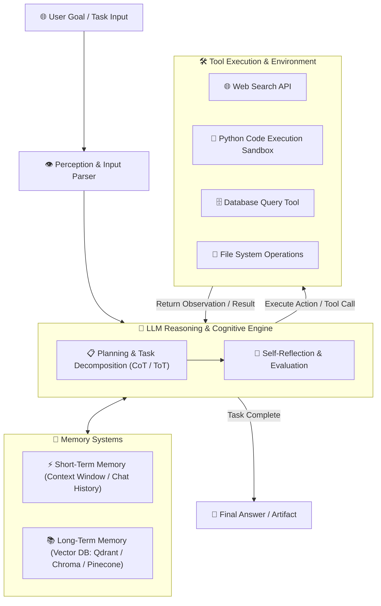
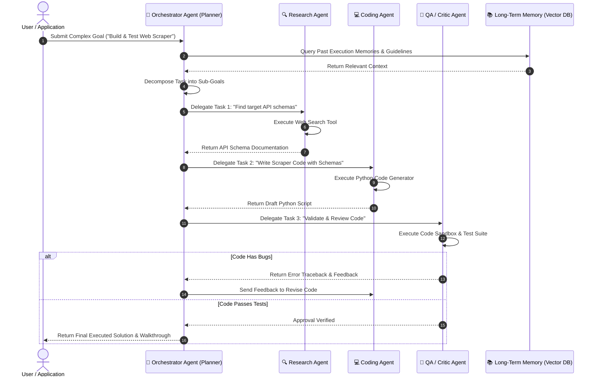

# 🤖 Agentic AI & Autonomous AI Agents Master Roadmap & Learning Progress Tracker

## 🏛️ Agentic AI Architecture & Cognitive Engine

### 🏗️ Agentic AI Cognitive Loop Architecture


### 🔄 Multi-Agent Collaboration Sequence Diagram (Orchestrator-Worker)


---

## 📑 Phase 1: Agentic AI Architecture & Core Concepts

### Module 1: Introduction to Agentic AI
- [x] **What is Agentic AI?**
  - Autonomous AI systems capable of perceiving environments, making independent decisions, planning sub-goals, executing tool calls, and reflecting on errors to achieve complex targets.
- [x] **Passive LLM vs Active Agentic Systems**
  - **Passive Prompting**: Single input $\rightarrow$ single output completion (stateless).
  - **Agentic Loop**: Autonomous iterative loops of Reasoning $\rightarrow$ Action $\rightarrow$ Observation $\rightarrow$ Reflection until completion.
- [x] **Degrees of Autonomy**
  - Level 1: Prompt-assisted $\rightarrow$ Level 2: Router/Selector $\rightarrow$ Level 3: Tool-using Agent $\rightarrow$ Level 4: Autonomous Multi-Agent Systems.

### Module 2: The ReAct Paradigm (Reasoning + Acting)
- [x] **ReAct Framework**
  - Interleaves **Thought** (reasoning step), **Action** (invoking an external tool), and **Observation** (reading tool output) iteratively.
  - Prevents hallucination by grounding reasoning in real-world tool execution feedback.

---

## ⚡ Phase 2: Planning, Memory & Vector Databases

### Module 3: Planning Strategies & Task Decomposition
- [x] **Chain-of-Thought (CoT)**: Step-by-step sequential reasoning prompts.
- [x] **Tree-of-Thoughts (ToT)**: Explores multiple reasoning paths simultaneously using tree search (BFS/DFS) and backtracks on dead ends.
- [x] **Graph-of-Thoughts (GoT)**: Networks thoughts as arbitrary directed graphs allowing combination of multiple independent sub-solutions.
- [x] **Self-Reflection & Critique (Reflexion)**: Agent evaluates its own tool execution results and revises failed plans automatically.

### Module 4: Memory Systems & Context Engineering
- [x] **Short-Term Memory**: In-context scratchpad and active conversation history within the LLM context window.
- [x] **Long-Term Memory (Vector DBs)**: Persistent storage of past experiences and documents using Vector Databases (Qdrant, Chroma, Pinecone, Milvus) via Dense Embeddings.
- [x] **RAG (Retrieval-Augmented Generation)**: Hybrid semantic search retrieving relevant domain context before generating reasoning steps.

---

## 🛠️ Phase 3: Tool Use, Function Calling & Frameworks

### Module 5: Tool Calling & Function Calling
- [x] **Function Calling JSON Schemas**
  - Defining structured JSON schemas describing available tools (name, description, parameter types).
- [x] **Tool Execution Sandboxing**
  - Safely running generated code/API calls inside restricted Docker or WebAssembly (WASM) sandboxes.

### Module 6: Agentic Frameworks
- [x] **LangGraph**: State graph framework modeling agents as persistent state machines with cyclic nodes and edges.
- [x] **CrewAI**: Role-based multi-agent framework where specialized agents (Researcher, Writer, Coder) collaborate.
- [x] **AutoGen (Microsoft)**: Conversational multi-agent framework enabling complex multi-agent chats.
- [x] **LlamaIndex**: Data-centric agent framework built for complex RAG pipelines and structured query synthesis.

---

## ⚙️ Phase 4: Multi-Agent Systems, Governance & Safety

### Module 7: Multi-Agent System (MAS) Architectures
- [x] **Orchestrator-Worker Architecture**: Central Manager agent delegates sub-tasks to specialized worker agents.
- [x] **Peer-to-Peer Debate**: Agents critique each other's outputs to reach high-confidence consensus and eliminate hallucinations.

### Module 8: Agent Safety, Guardrails & Cost Management
- [x] **Human-in-the-Loop (HITL)**: Requiring explicit human approval before executing sensitive high-risk tools (file deletes, payment APIs, database drops).
- [x] **Guardrails & Prompt Injection Defense**: Input/output filtering protecting agents against prompt injection and unauthorized tool escalation.
- [x] **Token & Cost Budgeting**: Setting max iteration limits, timeout bounds, and token budgets to prevent infinite agent execution loops.

---

## 🛠️ Phase 5: Practical Python ReAct Agent Loop Implementation

### Pure Python ReAct Agent Loop (Reasoning + Action + Observation)
```python
import json
import re

class ReActAgent:
    def __init__(self, llm_client, tools):
        self.llm = llm_client
        self.tools = {tool.name: tool for tool in tools}
        self.system_prompt = self._build_system_prompt()

    def _build_system_prompt(self):
        tool_desc = "\n".join([f"- {name}: {t.description}" for name, t in self.tools.items()])
        return f"""You operate in a ReAct loop (Thought, Action, Observation).
Available Tools:
{tool_desc}

Use the following strict format:
Thought: Reason about what to do next.
Action: tool_name({"key": "value"})
Observation: <result will be provided>

When finished, respond with:
Thought: I have the final answer.
Final Answer: <your response>"""

    def run(self, user_query, max_iterations=5):
        history = f"User Query: {user_query}\n"
        
        for iteration in range(max_iterations):
            prompt = f"{self.system_prompt}\n\n{history}\nThought:"
            response = self.llm.generate(prompt)
            print(f"\n--- Iteration {iteration + 1} ---")
            print(f"Thought: {response}")

            if "Final Answer:" in response:
                return response.split("Final Answer:")[1].strip()

            # Parse Action
            action_match = re.search(r"Action:\s*(\w+)\((.*)\)", response)
            if action_match:
                tool_name, tool_args_str = action_match.groups()
                if tool_name in self.tools:
                    try:
                        args = json.loads(tool_args_str)
                        observation = self.tools[tool_name].execute(**args)
                    except Exception as e:
                        observation = f"Tool Error: {str(e)}"
                else:
                    observation = f"Error: Tool '{tool_name}' not found."
                
                print(f"Observation: {observation}")
                history += f"\nThought: {response}\nObservation: {observation}"
            else:
                history += f"\nThought: {response}\nObservation: Invalid action format."

        return "Task exceeded maximum iterations."
```

---

## 🎯 Top Agentic AI Senior Interview Q&A Cheatsheet (Master List)

### Q1: What is the difference between Passive Prompting (RAG) and Agentic AI?
Passive RAG follows a single linear pipeline: Input $\rightarrow$ Embed $\rightarrow$ Retrieve $\rightarrow$ Single LLM Answer. Agentic AI operates in a dynamic, iterative cognitive loop: Input $\rightarrow$ Plan Sub-goals $\rightarrow$ Select Tool $\rightarrow$ Execute Action $\rightarrow$ Read Observation $\rightarrow$ Self-Reflect & Revise Plan $\rightarrow$ Repeat until complete.

### Q2: Explain the ReAct (Reasoning + Acting) pattern in AI Agents.
ReAct interleaves reasoning thoughts with action executions. The LLM writes a "Thought" explaining its plan, selects an "Action" (tool invocation), receives an "Observation" (tool output), and writes the next "Thought" based on that real-world feedback, grounding the agent and eliminating hallucinations.

### Q3: How do Vector Databases provide Long-Term Memory to AI Agents?
Vector DBs store high-dimensional dense embeddings of past agent experiences, execution traces, and domain documents. When an agent receives a task, it queries the Vector DB using semantic similarity search (Cosine/Dot Product) to retrieve relevant past memories into its short-term context window.

### Q4: Why is LangGraph preferred over traditional sequential chains for complex agents?
Traditional chains are linear and acyclic. LangGraph models agents as stateful graphs allowing cycles, branching, conditional edges, and persistent state checkpoints. This enables loops for self-correction, human-in-the-loop interruptions, and complex multi-agent coordination.

### Q5: How do you prevent infinite execution loops and excessive token costs in AI Agents?
Implement strict guardrails: (1) Hard caps on maximum iteration counts (`max_iterations=10`), (2) Wall-clock timeout limits, (3) Token budget thresholds, (4) Cycle detection tracking repeated identical tool calls, and (5) Human-in-the-Loop (HITL) triggers for critical operations.
