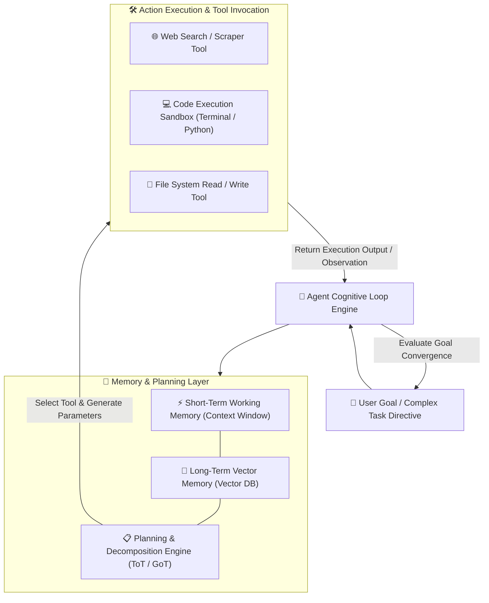
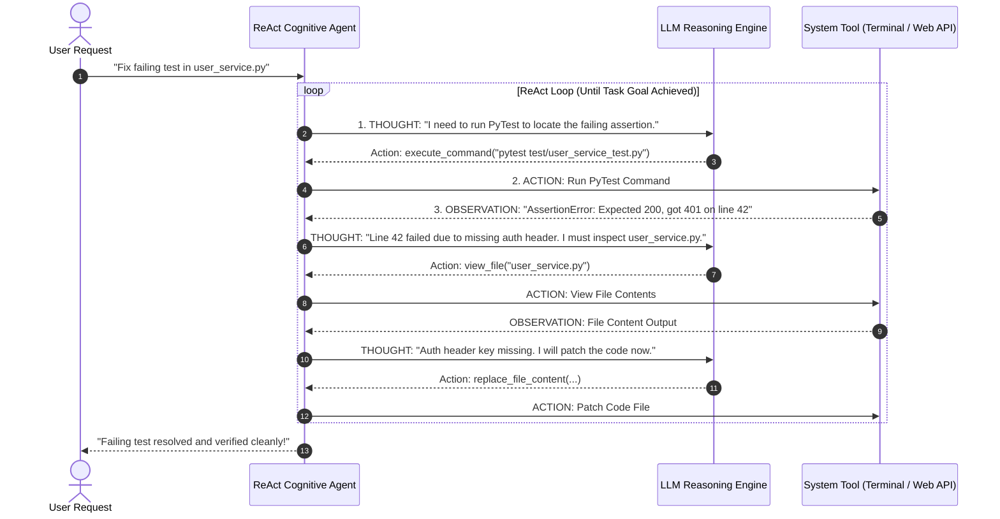

# 🤖 Agentic AI & Autonomous Agents Master Roadmap & Learning Progress Tracker

## 🏛️ Agentic AI Architecture & Cognitive Execution Engine

### 🏗️ Agentic AI Cognitive Loop Architecture


### 🔄 ReAct (Reasoning + Acting) Cycle Sequence Diagram


---

## 📑 Phase 1: Cognitive Architecture & Reasoning Loops

### Module 1: What is Agentic AI?
- [x] **Agentic AI Paradigm**
  - Shift from passive LLM chat prompts to **autonomous, goal-driven AI agents** that plan, perceive environments, invoke external tools, self-correct errors, and execute complex multi-step workflows.

### Module 2: ReAct Cognitive Loop (Reason + Act)
- [x] **Thought-Action-Observation Loop**
  - **Thought**: LLM evaluates goal state and reasons about next step.
  - **Action**: Agent selects and executes an external Tool.
  - **Observation**: Agent reads tool output and loops until goal is achieved.

### Module 3: Advanced Reasoning & Planning Frameworks
- [x] **Chain-of-Thought (CoT)**: Linear step-by-step reasoning.
- [x] **Tree-of-Thoughts (ToT)**: Explores multiple reasoning branches with backtracking.
- [x] **Graph-of-Thoughts (GoT)**: Combines and forks non-linear reasoning paths.
- [x] **Self-Correction & Reflection**: Agent reviews its own execution history to fix errors dynamically.

---

## ⚡ Phase 2: Memory Systems, Tools & Multi-Agent Teams

### Module 4: Agent Memory Architecture
- [x] **Short-Term Memory**: In-context working memory of current trajectory steps.
- [x] **Long-Term Memory**: Vector database indexing past conversation episodes and semantic knowledge (`Pinecone`, `Qdrant`).

### Module 5: Tool Calling & Function Execution
- [x] **OpenAI Function Calling & JSON Schema**
  - Formatting tool specifications into JSON Schema definitions allowing LLMs to produce structured tool invocation payloads.
- [x] **Sandboxed Code Execution**
  - Safely executing Python code or bash terminal commands inside isolated Docker containers or WebAssembly runtimes.

### Module 6: Multi-Agent Orchestration Architectures
- [x] **Supervisor-Worker Pattern**
  - Central Manager Agent delegates sub-tasks to specialized worker agents (e.g. Researcher, Coder, Tester) and aggregates results.
- [x] **Hierarchical & Peer-to-Peer Teams**
  - Autonomous agents communicating asynchronously via message channels to solve multi-domain problems.

### Module 7: Human-in-the-Loop (HITL) Safeguards
- [x] **Approval Breakpoints**
  - Pausing agent execution to request explicit human confirmation before executing high-risk actions (file edits, API writes, deployments).

---

## 🛠️ Phase 3: Frameworks, Vector DBs & Protocols

### Module 8: State Graph Orchestration (LangGraph)
- [x] **LangGraph Architecture**
  - Stateful multi-agent graph orchestration framework where Nodes represent agent actions and Edges represent dynamic decision transitions with full checkpointing.

### Module 9: Multi-Agent Frameworks (AutoGen & CrewAI)
- [x] **Microsoft AutoGen & CrewAI**
  - Frameworks enabling multi-agent role-playing, automated task delegation, and collaborative problem solving.

### Module 10: Model Context Protocol (MCP)
- [x] **Model Context Protocol (MCP)**
  - Open standard protocol connecting AI agents to local/remote data sources, developer tools, and API servers securely.

### Module 11: Agent Benchmarks & Evaluation
- [x] **SWE-bench & GAIA Benchmarks**
  - Industry benchmark suites evaluating autonomous agents on real-world software engineering tasks and multi-modal problem solving.

---

## 🚀 Phase 4: Production Agents & Advanced RAG

### Module 12: Production ReAct Agent Implementation
- [x] **LangGraph ReAct Agent**
  - Building production stateful agents with custom tools, error recovery, and persistence memory.

### Module 13: Enterprise Safety & Guardrails
- [x] **Token Budget & Iteration Caps**
  - Preventing infinite loops by enforcing maximum iteration limits (`max_iterations = 15`) and token spend budgets.

### Module 14: Autonomous Code Generation & Refactoring Agents
- [x] **Autonomous Software Engineering**
  - Agents inspecting repositories, identifying bugs, running tests, patching files, and submitting Pull Requests autonomously.

### Module 15: Agentic RAG (Self-RAG & Corrective RAG)
- [x] **Self-RAG & CRAG**
  - Agents dynamically evaluating retrieved document relevance, rewriting search queries on failure, and verifying response accuracy.

---

## 🛠️ Phase 5: Practical LangGraph ReAct Agent Code

### Complete Production LangGraph ReAct Agent (`agent.py`)
```python
from typing import Annotated, TypedDict
from langchain_openai import ChatOpenAI
from langchain_core.tools import tool
from langgraph.graph import StateGraph, END
from langgraph.graph.message import add_messages
from langgraph.prebuilt import ToolNode, tools_condition

# 1. Define Custom Tool
@tool
def calculate_salary_tax(salary: float) -> str:
  """Calculates tax deduction for a given annual salary."""
  tax = salary * 0.25
  return f"Annual tax deduction for ${salary} is ${tax}."

tools = [calculate_salary_tax]
tool_node = ToolNode(tools)

# 2. Define Agent State Schema
class AgentState(TypedDict):
  messages: Annotated[list, add_messages]

# 3. Define LLM with Bound Tools
llm = ChatOpenAI(model="gpt-4o", temperature=0.0).bind_tools(tools)

def call_model(state: AgentState):
  response = llm.invoke(state["messages"])
  return {"messages": [response]}

# 4. Build LangGraph Workflow
workflow = StateGraph(AgentState)
workflow.add_node("agent", call_model)
workflow.add_node("tools", tool_node)

workflow.set_entry_point("agent")
workflow.add_conditional_edges("agent", tools_condition)
workflow.add_edge("tools", "agent")

app = workflow.compile()

# 5. Run ReAct Agent Execution
inputs = {"messages": [("user", "What is the tax for a $120,000 salary?")]}
for chunk in app.stream(inputs, stream_mode="values"):
  chunk["messages"][-1].pretty_print()
```

---

## 🎯 Top Agentic AI Senior Interview Q&A Cheatsheet (Master List)

### Q1: What is the main difference between standard LLM text completion and Agentic AI?
Standard LLMs perform static, single-turn text completion based purely on input prompt context. Agentic AI uses a continuous cognitive loop (ReAct) where an autonomous agent plans steps, perceives environments, dynamically selects and invokes external tools (web search, terminal, databases), observes tool results, and iteratively self-corrects until a complex goal is achieved.

### Q2: How does the ReAct (Reason + Act) loop operate?
ReAct combines reasoning and acting in an iterative loop:
1. **Thought**: The LLM analyzes the current goal state and decides what action to take next.
2. **Action**: The agent executes a specific external tool call with parameters.
3. **Observation**: The agent reads the tool's output result and feeds it back into context to decide the next step.

### Q3: What is LangGraph and why is it preferred over linear chains for multi-agent systems?
LangGraph is a stateful orchestration framework that models agent workflows as **cyclic graphs**. Unlike linear chains (LangChain Sequential Chains), LangGraph supports loops, branching decisions, persistent state checkpointing, multi-agent communication, and Human-in-the-Loop (HITL) approval breakpoints natively.

### Q4: How do Human-in-the-Loop (HITL) safeguards work in autonomous AI agents?
HITL introduces approval interrupts into an agent's execution graph. Before executing high-risk tool actions (such as dropping a database table, modifying core code, or sending an email), the graph pauses and waits for an external human signal (Approve / Reject / Edit payload) before proceeding.

### Q5: What is the Model Context Protocol (MCP)?
MCP is an open standard protocol introduced by Anthropic that provides a unified, secure interface for connecting AI agents to external data sources, enterprise tools, and local/remote APIs without requiring custom ad-hoc integration code for every provider.
