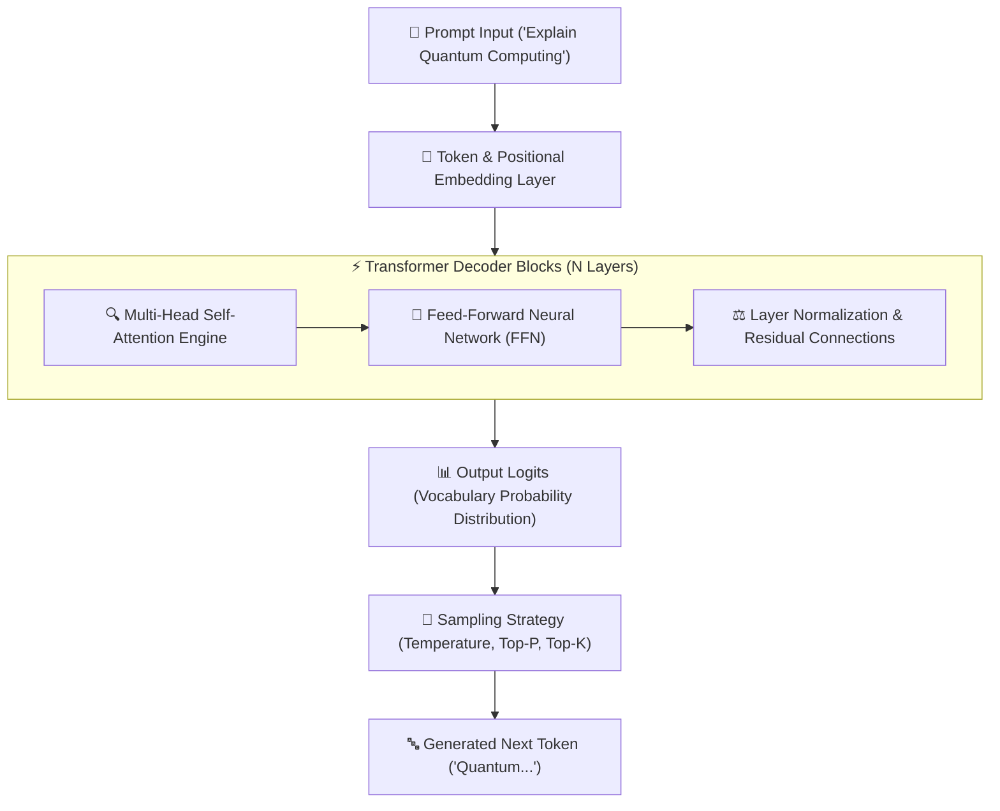
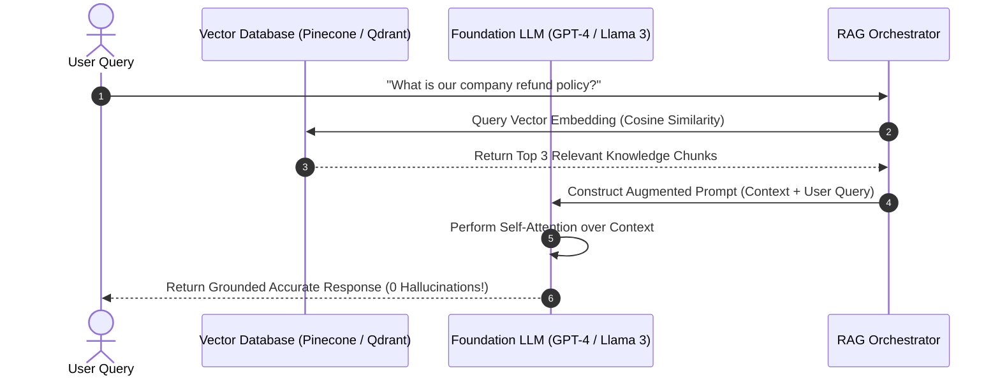

# 🧠 Generative AI & LLM Architecture Master Roadmap & Learning Progress Tracker

## 🏛️ Generative AI & Transformer Architecture

### 🏗️ Transformer Architecture & Text Generation Pipeline


### 🔄 Fine-Tuning (LoRA / PEFT) vs RAG Pipeline Sequence


---

## 📑 Phase 1: Core Generative AI & Transformer Fundamentals

### Module 1: Introduction to Generative AI & Foundation Models
- [x] **What is Generative AI?**
  - AI subfield focused on creating new text, code, image, audio, or video content from probabilistic foundation models.
- [x] **Discriminative vs Generative Models**
  - Discriminative: Classifies existing data ($P(Y|X)$). Generative: Predicts joint probability distribution ($P(X, Y)$) to generate new samples.

### Module 2: Self-Attention Mechanism Deep Dive
- [x] **Self-Attention Calculation ($Q, K, V$)**
  - $\text{Attention}(Q, K, V) = \text{softmax}\left(\frac{QK^T}{\sqrt{d_k}}\right)V$. Computes dynamic contextual relationships between all tokens simultaneously.
- [x] **Quadratic Complexity Bottleneck**
  - Standard self-attention requires $O(N^2)$ memory and compute relative to sequence length $N$.

### Module 3: Multi-Head Attention & Positional Encodings
- [x] **Multi-Head Attention Subspaces**
  - Runs parallel attention heads capturing diverse linguistic relationship subspaces (syntax, semantics, coreference).
- [x] **Positional Encodings (RoPE / ALiBi)**
  - Rotary Position Embeddings (RoPE) inject sequence order relative positioning information into parallelized token vectors.

### Module 4: Transformer Model Architectures
- [x] **Encoder-Only (BERT)**: Bi-directional contextual understanding (Classification, Embeddings).
- [x] **Decoder-Only (GPT-4, Llama 3, Claude)**: Auto-regressive next-token generation (Chat, Coding).
- [x] **Encoder-Decoder (T5, BART)**: Sequence-to-sequence translation and summarization.

---

## ⚡ Phase 2: Sampling, Prompt Engineering & Fine-Tuning

### Module 5: Tokenization & Vocabulary
- [x] **Tokenization Algorithms (BPE / WordPiece)**
  - Byte-Pair Encoding (BPE) breaks raw text into sub-word token chunks (approx $1\text{ token} \approx 0.75\text{ words}$).

### Module 6: Generation Parameters & Sampling Strategies
- [x] **Temperature ($0.0$ to $2.0$)**
  - Controls token probability distribution sharpness ($0=$ deterministic, $1+=$ creative).
- [x] **Top-P (Nucleus Sampling) & Top-K**
  - Limits candidate token pool to cumulative probability threshold $P$ or top $K$ highest probability tokens.

### Module 7: Advanced Prompt Engineering Frameworks
- [x] **Zero-Shot & Few-Shot Prompting**: Guiding models with zero or explicit exemplars of target inputs/outputs.
- [x] **Chain-of-Thought (CoT) & Tree-of-Thought (ToT)**: Prompting LLMs to break complex reasoning down into step-by-step intermediate thoughts.

### Module 8: Model Customization (PEFT / LoRA / QLoRA)
- [x] **Full Fine-Tuning vs PEFT**
  - Full Fine-Tuning updates all billions of model weights.
  - **LoRA (Low-Rank Adaptation)**: Freezes base model weights and injects small rank-decomposition matrices ($A \times B$), reducing VRAM by $80\%$.
- [x] **QLoRA (Quantized LoRA)**: Quantizes base model to 4-bit NormalFloat (NF4) while training LoRA adapters.

### Module 9: Alignment & Post-Training (RLHF / DPO)
- [x] **RLHF & DPO**
  - Reinforcement Learning from Human Feedback (RLHF) and Direct Preference Optimization (DPO) align LLMs with human values of helpfulness and harmlessness.

---

## 🛠️ Phase 3: RAG Systems, Vector DBs & Embeddings

### Module 10: Vector Embeddings & Similarity Search
- [x] **Vector Space & Distance Metrics**
  - Dense vector representations where semantic similarity is measured via Cosine Similarity, Dot Product, or Euclidean Distance.

### Module 11: Retrieval-Augmented Generation (RAG) Architecture
- [x] **RAG Pipeline Components**
  - Document Ingestion $\rightarrow$ Text Chunking $\rightarrow$ Embedding Generation $\rightarrow$ Vector Store Indexing $\rightarrow$ Similarity Search $\rightarrow$ Context-Augmented Generation.

### Module 12: Vector Databases & Indexing (Pinecone, Qdrant, FAISS)
- [x] **HNSW Indexing**
  - Hierarchical Navigable Small World (HNSW) graph indexing enabling sub-millisecond approximate nearest neighbor (ANN) vector search.

### Module 13: Advanced RAG Optimization
- [x] **Re-Ranking & Hybrid Search**
  - Combining sparse keyword search (BM25) with dense vector search, followed by Cross-Encoder Re-Ranking for maximum retrieval precision.

---

## ⚙️ Phase 4: Evaluation, Security & Frameworks

### Module 14: LLM Evaluation Frameworks
- [x] **Evaluation Metrics**
  - ROUGE, BLEU, Perplexity, and **LLM-as-a-Judge** (using GPT-4 to score accuracy, faithfulness, and answer relevance).

### Module 15: AI Safety & Hallucination Mitigation
- [x] **Prompt Injection & Guardrails**
  - Protecting applications against direct/indirect prompt injections using NeMo Guardrails, Llama-Guard, and strict system prompts.

### Module 16: Modern AI Frameworks & Local Inference Engines
- [x] **Ecosystem Tooling**
  - LangChain, LlamaIndex, Hugging Face Transformers, and local high-speed inference engines (**vLLM, Ollama**).

---

## 🛠️ Phase 5: Practical Generative AI & RAG Code (Python + LangChain)

### Production RAG Pipeline Implementation (`rag_pipeline.py`)
```python
from langchain_community.document_loaders import TextLoader
from langchain_text_splitters import RecursiveCharacterTextSplitter
from langchain_community.vectorstores import FAISS
from langchain_openai import OpenAIEmbeddings, ChatOpenAI
from langchain_core.prompts import ChatPromptTemplate
from langchain_core.runnables import RunnablePassthrough

# 1. Load and Chunk Documents
loader = TextLoader("company_policy.txt")
docs = loader.load()

text_splitter = RecursiveCharacterTextSplitter(chunk_size=500, chunk_overlap=50)
chunks = text_splitter.split_documents(docs)

# 2. Generate Embeddings & Store in Vector DB
embeddings = OpenAIEmbeddings(model="text-embedding-3-small")
vectorstore = FAISS.from_documents(chunks, embeddings)
retriever = vectorstore.as_retriever(search_kwargs={"k": 3})

# 3. Define RAG Prompt & LLM
prompt = ChatPromptTemplate.from_template("""
Answer the question based ONLY on the provided context:
Context: {context}
Question: {question}
""")

llm = ChatOpenAI(model="gpt-4o", temperature=0.0)

# 4. Construct RAG Chain
rag_chain = (
    {"context": retriever, "question": RunnablePassthrough()}
    | prompt
    | llm
)

# 5. Execute Grounded Query
response = rag_chain.invoke("What is the remote work policy?")
print("AI Response:", response.content)
```

---

## 🎯 Top Generative AI Senior Interview Q&A Cheatsheet (Master List)

### Q1: How does the Self-Attention mechanism work in Transformer models?
Self-attention transforms input tokens into Query ($Q$), Key ($K$), and Value ($V$) vectors. It calculates attention score weights using $\text{softmax}\left(\frac{QK^T}{\sqrt{d_k}}\right)$, determining how much weight every token in a sequence should place on every other token dynamically.

### Q2: What is LoRA (Low-Rank Adaptation) and why is it used for LLM fine-tuning?
LoRA is a Parameter-Efficient Fine-Tuning (PEFT) technique that freezes pre-trained model weights and injects pairs of small rank-decomposition matrices ($W + \Delta W = W + A \times B$) into attention layers. This reduces trainable parameters by $>99\%$ and VRAM requirements by $80\%$, enabling fine-tuning on consumer GPUs.

### Q3: What is RAG (Retrieval-Augmented Generation) and how does it prevent LLM hallucinations?
RAG connects an LLM to external authoritative knowledge sources. When a query is received, an embedding model retrieves relevant text chunks from a Vector DB. These grounded chunks are injected directly into the LLM prompt context, forcing the model to generate answers from verified facts rather than internal parametric memory.

### Q4: What is the difference between Temperature and Top-P (Nucleus Sampling)?
- **Temperature**: Scales the logits before applying softmax. Lower values ($0.2$) flatten unlikely tokens making output deterministic; higher values ($1.2$) increase entropy/creativity.
- **Top-P**: Dynamic truncation that selects candidate tokens from the smallest set whose cumulative probability exceeds threshold $P$ (e.g. $P=0.9$).

### Q5: What is the difference between Encoder-Only, Decoder-Only, and Encoder-Decoder Transformers?
- **Encoder-Only (BERT)**: Processes full input sequence bi-directionally; ideal for text classification and embedding generation.
- **Decoder-Only (GPT-4, Llama 3)**: Auto-regressively predicts next tokens using causal masking; ideal for chat and code generation.
- **Encoder-Decoder (T5)**: Encodes input bi-directionally and decodes output auto-regressively; ideal for translation and summarization.
