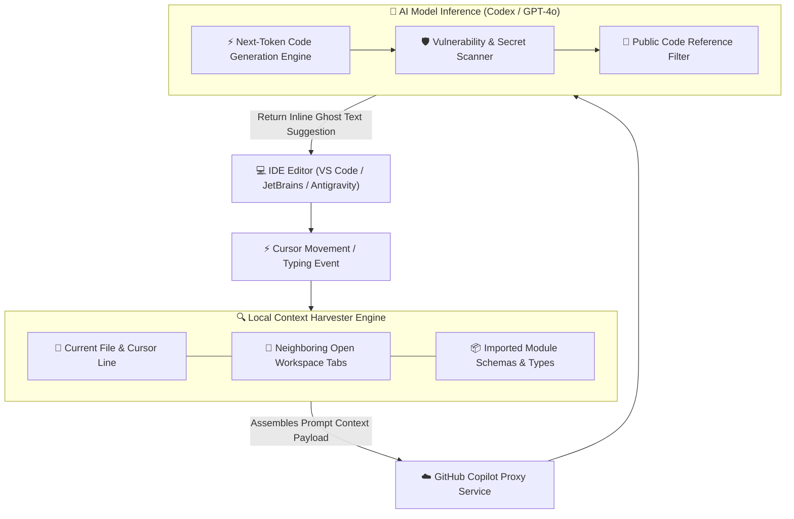

# 🤖 GitHub Copilot & AI Pair Programming Master Roadmap & Learning Progress Tracker

## 🏛️ GitHub Copilot Architecture & Context Engine

### 🏗️ GitHub Copilot Prompt Assembly & Completion Pipeline


---

## 📑 Phase 1: GitHub Copilot Core Architecture

### Module 1: Introduction to GitHub Copilot
- [x] **What is GitHub Copilot?**
  - AI-powered pair programmer assistant integrated into IDEs, powered by fine-tuned LLM Codex / GPT-4o models.
- [x] **Inline Completions vs Copilot Chat**
  - **Inline Completions**: Real-time ghost text completion suggestions triggered while typing code.
  - **Copilot Chat**: Conversational AI assistant panel handling refactoring, debugging, test generation, and architecture explanation.

### Module 2: IDE Plugin & Event Hooks
- [x] **IDE Extension Architecture**
  - VS Code / JetBrains extension capturing debounced typing events and communicating via Language Server Protocol (LSP).

### Module 3: Dynamic Context Harvesting Engine
- [x] **Jaccard Similarity Context Ranking**
  - Copilot scans **neighboring open workspace tabs**, recent edit histories, and imported files, ranking relevancy using Jaccard Similarity to construct dynamic LLM prompts!

---

## ⚡ Phase 2: Enterprise Security, Governance & Custom Models

### Module 4: Public Code Match Filter
- [x] **Public Code Referencing Filter**
  - Blocks inline code completions matching $\ge 150$ characters with public GitHub repositories to prevent license compliance issues.

### Module 5: Real-Time Vulnerability & Security Scanner
- [x] **AI Security Filtering**
  - Real-time SAST filter blocking insecure code patterns (hardcoded API keys/passwords, SQL injection, weak cryptographic hashes).

### Module 6: GitHub Copilot Enterprise & Custom Fine-Tuning
- [x] **Custom Fine-Tuned Models**
  - Enterprise feature training Copilot models directly on internal company private codebases for domain-specific API auto-completion.
- [x] **Copilot Extensions & Agents**
  - Integrating third-party tool APIs (Sentry, Azure, Datadog) directly into Copilot Chat interface (`@azure`, `@sentry`).

### Module 7: Privacy, Telemetry & Data Retention
- [x] **Zero Data Retention Policy**
  - Business and Enterprise tiers guarantee prompt and code snippet data are never retained or used to train public foundation models.

---

## 🛠️ Phase 3: Prompt Engineering Patterns for Developers

### Module 8: Top-Down Comment Prompting
- [x] **Structured Docstring Directives**
  - Writing clear docstrings and step-by-step comment lists before writing code to guide Copilot's completion logic.

### Module 9: Type-Driven Code Generation
- [x] **Schema Context Anchoring**
  - Defining explicit TypeScript interfaces or Java DTO schemas first, allowing Copilot to generate matching implementation code automatically.

### Module 10: Automated Unit Test Generation
- [x] **Test Suite Prompting (`/tests`)**
  - Prompting Copilot Chat to generate comprehensive unit tests using Jest, JUnit, or PyTest covering boundary edge-cases.

### Module 11: Code Refactoring & Documentation
- [x] **Refactoring & Explanation (`/explain`, `/fix`)**
  - Modernizing legacy codebases, adding JSDoc comments, and debugging complex runtime error tracebacks.

---

## 🚀 Phase 4: Ecosystem, Agentic Workspaces & Benchmarks

### Module 12: GitHub Copilot Workspace & AI Agents
- [x] **Copilot Workspace Environment**
  - Task-centric AI environment translating GitHub Issues directly into executable code specifications and Pull Requests.

### Module 13: Copilot Chat Custom Slash Commands
- [x] **Slash Commands & Agents**
  - Utilizing `/explain`, `/tests`, `/fix`, `/doc`, and `@workspace` semantic repository indexing.

### Module 14: Measuring AI Developer Productivity
- [x] **Productivity Frameworks (SPACE & DORA)**
  - Measuring Copilot impact using suggestion acceptance rate, Pull Request throughput velocity, and developer flow state.

### Module 15: Copilot vs Competitive AI Coding Assistants
- [x] **AI Assistant Comparisons**
  - GitHub Copilot vs Cursor AI vs Claude Code vs Amazon Q Developer.

---

## 🛠️ Phase 5: Practical Copilot Prompting Patterns

### 1. Top-Down Comment & Type-Driven Prompt Pattern (`userService.ts`)
```typescript
// 1. Define explicit TypeScript interface first (Context Anchor for Copilot)
export interface UserRegistrationDTO {
  email: string;
  passwordHash: string;
  role: 'ADMIN' | 'USER';
}

/**
 * User Registration Service
 * 1. Validate email format
 * 2. Check if user already exists in database
 * 3. Hash password using bcrypt with salt rounds 12
 * 4. Save new user record and return sanitized user profile
 */
export async function registerUser(dto: UserRegistrationDTO) {
  // Typing here triggers Copilot to generate exact 4-step implementation code!
}
```

---

## 🎯 Top GitHub Copilot Senior Interview Q&A Cheatsheet (Master List)

### Q1: How does GitHub Copilot gather context from an IDE to generate accurate code suggestions?
Copilot doesn't analyze only the active file; its local IDE plugin harvests context from neighboring open editor tabs, recent cursor edit history, file paths, and imported type definitions. It ranks relevant code snippets using Jaccard Similarity to construct a structured prompt context sent to the backend LLM.

### Q2: How does GitHub Copilot prevent IP infringement and public code copying?
GitHub Copilot includes a built-in **Public Code Match Filter**. When enabled, if a generated suggestion matches a sequence of $\ge 150$ characters found in public GitHub repositories, the suggestion is automatically suppressed or flagged with license attribution.

### Q3: What is the difference between GitHub Copilot Business and Enterprise fine-tuning?
Copilot Business provides standard inline completions, chat, and security filtering across team members. Copilot Enterprise enables **Custom Models** fine-tuned on an organization's private repositories, personalized docset indexing, and custom Copilot Extensions (`@azure`, `@datadog`).

### Q4: What is the best prompt engineering practice to get accurate multi-line code from Copilot?
1. Open relevant reference files in adjacent IDE tabs.
2. Define explicit TypeScript types or interface schemas first.
3. Write a clear docstring comment outlining step-by-step logic before typing function definitions.

### Q5: How does Copilot Chat's `@workspace` command index codebase context?
The `@workspace` command builds an in-memory vector index of your repository structure and code symbols. When queried, it performs semantic vector retrieval over your codebase to answer multi-file architectural questions.
