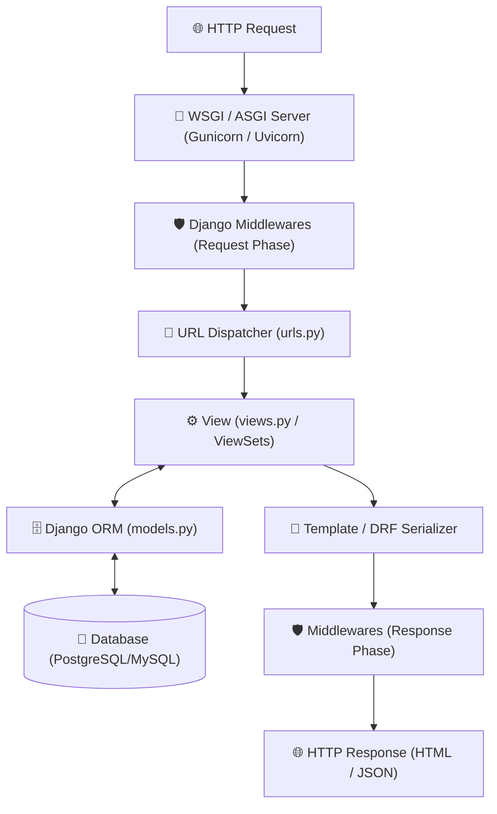

# 🎸 Django & Django REST Framework (DRF) Master Roadmap & Progress Tracker

## 🏛️ Django MVT Architecture & Request Pipeline

### 🏗️ Request-Response Pipeline


### 🔄 ORM Query Execution & N+1 Resolution Sequence
```mermaid
sequenceDiagram
    autonumber
    actor Client as Client / API Caller
    participant View as Django View / DRF Serializer
    participant ORM as Django ORM
    participant DB as SQL Database

    Client->>View: GET /api/books/
    alt BAD: N+1 Query Issue (Without select_related)
        View->>ORM: Book.objects.all()
        ORM->>DB: SELECT * FROM books; (1 Query)
        loop For each of N books
            View->>ORM: Access book.author.name
            ORM->>DB: SELECT * FROM authors WHERE id = author_id; (N Queries)
        end
    else GOOD: Optimized with select_related
        View->>ORM: Book.objects.select_related('author').all()
        ORM->>DB: SELECT * FROM books INNER JOIN authors ON ... (1 Single Query!)
    end
    DB-->>ORM: Result Dataset
    ORM-->>View: Python Model Objects
    View-->>Client: 200 OK (JSON Response)
```

---

## 📑 Phase 1: Python Prerequisites & Django Architecture

### Module 1: Introduction to Django & Web Development
- [x] **What is Django?**
  - High-level Python web framework encouraging rapid development and clean design.
  - Follows "Batteries-Included" philosophy providing built-in ORM, Admin, Auth, and Security.
- [x] **Why Django over other Frameworks?**
  - Includes robust out-of-the-box components avoiding fragmented third-party library assembly.
  - Provides enterprise security defaults against CSRF, SQL Injection, XSS, and Clickjacking.
- [x] **Batteries-Included Philosophy**
  - Ships with ready-to-use Admin interface, ORM, user authentication, sessions, and forms.
  - Minimizes boilerplate and speeds up enterprise backend project bootstrapping.
- [x] **Problems with Pure Python Web Code**
  - Writing low-level socket handling, HTTP parsing, and SQL string queries manually is error-prone.
  - High risk of security vulnerabilities and lack of standardized project structure.
- [x] **Django Architecture Overview**
  - Layered structure separating Models (Data), Views (Logic), and Templates/Serializers (Presentation).
  - Handles routing, middleware interception, ORM queries, and HTTP response formatting cleanly.
- [x] **Django vs Flask vs FastAPI**
  - Django: Full-stack "batteries-included" framework ideal for complex monoliths & REST APIs.
  - Flask: Lightweight micro-framework requiring manual third-party library selection.
  - FastAPI: Asynchronous micro-framework built for high-speed API endpoints using Pydantic.
- [x] **Django Versioning & LTS Releases**
  - Long Term Support (LTS) releases supported with security patches for 3+ years.
  - Ensures enterprise stability when deploying production backend systems.
- [x] **Creating a Virtual Environment (`venv`)**
  - Isolated Python environment preventing dependency version conflicts between projects.
  - Created via `python -m venv venv` and activated via `source venv/bin/activate`.
- [x] **Installing Django via `pip`**
  - Installing framework binaries and dependencies into virtual environment (`pip install django`).
  - Managing project dependency trees using `requirements.txt` or `Pipfile`.
- [x] **Creating a Django Project (`django-admin startproject`)**
  - Generates top-level project container holding global configurations (`settings.py`, `urls.py`).
  - Prepares the main executable entry points for WSGI and ASGI web servers.
- [x] **Creating a Django Application (`python manage.py startapp`)**
  - Generates a modular, self-contained domain application directory (`models.py`, `views.py`).
  - Encourages reusable application architecture across multiple Django projects.

### Module 2: Project Structure & Configuration
- [x] **`manage.py` Script**
  - Command-line utility script executing project-specific administrative tasks.
  - Runs dev server (`runserver`), database migrations, test suites, and custom management commands.
- [x] **`settings.py` Breakdown**
  - Centralized configuration file storing database settings, installed apps, middleware, and keys.
  - Controls security flags, static file paths, authentication backends, and caching.
- [x] **`INSTALLED_APPS` List**
  - Tuple of strings listing all active Django built-in, third-party, and local applications.
  - Registers model definitions, admin modules, template tags, and management commands.
- [x] **`MIDDLEWARE` Configuration**
  - Sequential list of interceptor classes processing HTTP requests and responses.
  - Order matters: executed top-to-bottom on request, bottom-to-top on response.
- [x] **`TEMPLATES` Configuration**
  - Engine configuration defining template loader directories, context processors, and options.
  - Configures Django Template Language (DTL) or Jinja2 engines.
- [x] **`DATABASES` Configuration**
  - Dictionary mapping database alias connections (PostgreSQL, MySQL, SQLite3).
  - Specifies engine drivers, host, port, credentials, and connection pool options.
- [x] **`STATIC_URL` & `STATIC_ROOT`**
  - `STATIC_URL`: Public URL prefix for serving CSS, JS, and image assets (`/static/`).
  - `STATIC_ROOT`: Absolute disk path where `collectstatic` gathers static files for production.
- [x] **`MEDIA_URL` & `MEDIA_ROOT`**
  - `MEDIA_URL`: Public URL prefix for serving user-uploaded files (`/media/`).
  - `MEDIA_ROOT`: Absolute disk directory storing user-uploaded files.
- [x] **Environment Variables (`django-environ`)**
  - Decoupling sensitive credentials (passwords, secret keys) into `.env` files.
  - Enforces 12-Factor App security principles across dev, staging, and production environments.
- [x] **WSGI (`wsgi.py`) vs ASGI (`asgi.py`)**
  - `wsgi.py`: Synchronous Web Server Gateway Interface entry point for Gunicorn/uWSGI.
  - `asgi.py`: Asynchronous Server Gateway Interface entry point supporting WebSockets (Django Channels).
- [x] **Secret Key Security (`SECRET_KEY`)**
  - Cryptographic key used for session signing, password reset tokens, and CSRF protection.
  - Must remain strictly private and excluded from public version control.

---

## ⚡ Phase 2: Database Layer & Django ORM

### Module 3: Django Models & Schema Definition
- [x] **What is an ORM?**
  - Object-Relational Mapper mapping Python classes to database relational tables.
  - Translates Python method calls into type-safe SQL queries automatically.
- [x] **Defining Models (`models.Model`)**
  - Creating database schema blueprints by subclassing `django.db.models.Model`.
  - Defines table columns as class attributes using specialized model fields.
- [x] **Field Types**
  - Text fields (`CharField`, `TextField`, `SlugField`, `EmailField`).
  - Numeric fields (`IntegerField`, `FloatField`, `DecimalField`).
  - Date & Time fields (`DateField`, `DateTimeField` with `auto_now_add` and `auto_now`).
  - Special fields (`BooleanField`, `UUIDField`, `JSONField`, `FileField`, `ImageField`).
- [x] **Field Options**
  - `null=True`: Allows storing database `NULL` values.
  - `blank=True`: Allows empty field input during form validation.
  - `default`: Specifies default fallback value when creating model instances.
  - `unique=True`: Enforces unique constraint across table rows.
  - `db_index=True`: Creates database index on column for fast filtering.
  - `choices`: Defines static dropdown choices for field validation.
- [x] **Model Meta Options (`class Meta`)**
  - Configures table-level metadata: `db_table`, `ordering`, `verbose_name_plural`.
  - Defines compound indexes (`indexes`) and database constraints (`constraints`).
- [x] **Model Methods (`__str__()`, `save()`)**
  - `__str__()`: Defines readable string representation of model instances in Admin/shell.
  - `save()`: Overriding default save method to execute pre-save business calculations.

### Module 4: Model Relationships
- [x] **Relationship Types Overview**
  - Defines associations between relational database tables using foreign key constraints.
- [x] **`ForeignKey` (Many-to-One)**
  - Relates multiple child records to a single parent record (e.g. Many Books $\rightarrow$ One Author).
- [x] **`OneToOneField` (One-to-One)**
  - Relates exactly one record to another record (e.g. User $\rightarrow$ UserProfile).
  - Creates a unique foreign key constraint on the table column.
- [x] **`ManyToManyField` (Many-to-Many)**
  - Relates multiple records on both sides (e.g. Many Authors $\leftrightarrow$ Many Books).
  - Automatically generates an intermediate junction join table.
- [x] **`on_delete` Behaviors**
  - `CASCADE`: Automatically deletes child records when parent is deleted.
  - `SET_NULL`: Sets foreign key column to `NULL` when parent is deleted (`null=True` required).
  - `PROTECT`: Raises `ProtectedError` preventing parent deletion if child records exist.
  - `RESTRICT`: Prevents parent deletion if referenced by child records.
- [x] **`related_name` & `related_query_name`**
  - `related_name`: Sets custom reverse manager attribute on target parent model (`author.books.all()`).
  - Eliminates default `_set` suffix naming collisions.
- [x] **Self-referencing Foreign Keys**
  - Linking a model to itself (`ForeignKey('self', ...)`).
  - Used for hierarchical data like employee managers or nested category trees.
- [x] **Intermediate / Through Models (`through`)**
  - Custom junction table model for Many-to-Many relationships holding extra relationship attributes.
  - Specified via `ManyToManyField(TargetModel, through='CustomJunctionModel')`.

### Module 5: Django QuerySets & Database Operations
- [x] **What is a QuerySet?**
  - Representational list of database SQL queries waiting to be executed.
  - Provides chainable API for filtering, ordering, and slicing table data.
- [x] **Lazy Evaluation Mechanics**
  - QuerySets do NOT hit the database when created; evaluation occurs only upon iteration, serialization, or `list()`.
- [x] **Retrieving Objects (`all()`, `get()`, `filter()`, `exclude()`)**
  - `all()`: Returns QuerySet matching all table records.
  - `filter()`: Returns QuerySet matching specified lookup parameters.
  - `exclude()`: Returns QuerySet excluding records matching parameters.
  - `get()`: Fetches exactly 1 matching model instance; throws `DoesNotExist` or `MultipleObjectsReturned`.
- [x] **Field Lookups**
  - Filter lookup modifiers (`exact`, `iexact`, `contains`, `icontains`, `in`, `gt`, `gte`, `lt`, `lte`, `range`, `isnull`).
- [x] **Chaining Filters & Ordering**
  - Combining multiple QuerySet methods (`Book.objects.filter(...).exclude(...).order_by('-created_at')`).
- [x] **Creating, Updating & Deleting Objects**
  - `create(**kwargs)`: Instantiates and saves model to database in one step.
  - `update(**kwargs)`: Executes single bulk SQL `UPDATE` statement across matching QuerySet rows.
  - `delete()`: Executes bulk SQL `DELETE` statement on matching QuerySet rows.
- [x] **Bulk Operations (`bulk_create()`, `bulk_update()`)**
  - Efficiently inserts or updates hundreds of model instances in a single SQL query pass.

### Module 6: Advanced Querying, Aggregation & ORM Optimization
- [x] **`F()` Expressions**
  - References model field values directly in database queries without pulling them into Python memory.
  - Prevents race conditions during atomic updates (`Book.objects.update(views=F('views') + 1)`).
- [x] **`Q()` Objects**
  - Enables complex boolean logic combinations (`AND`, `OR`, `NOT`) in `filter()` queries using `|` and `&`.
- [x] **Aggregation & Annotation**
  - `aggregate()`: Calculates summary metrics (`Count`, `Avg`, `Sum`) across entire QuerySet returning a dictionary.
  - `annotate()`: Computes summary metrics per individual row object in the QuerySet.
- [x] **Subqueries & `OuterRef`**
  - Writing SQL subqueries inside Django QuerySets referencing outer query fields.
- [x] **Fixing N+1 Query Problem**
  - N+1 occurs when looping over QuerySet items triggers separate SQL queries for related foreign keys.
  - Resolved via `select_related()` (Single SQL `JOIN` for Foreign Keys) and `prefetch_related()` (Separate SQL queries for M2M).
- [x] **Column Optimizations (`only()`, `defer()`)**
  - `only()`: Fetches only specified columns, reducing network payload size.
  - `defer()`: Delays loading heavy columns (e.g. BLOBs/large text) until explicitly accessed.
- [x] **`exists()` & `count()` Performance Rules**
  - `exists()`: Uses optimized `SELECT 1 LIMIT 1` SQL query to check row existence without loading data.
  - `count()`: Executes SQL `SELECT COUNT(*)` instead of pulling objects into Python list memory.

### Module 7: Database Migrations
- [x] **What are Migrations?**
  - Django's version control system for tracking schema changes in `models.py`.
- [x] **`makemigrations` Command**
  - Inspects model changes and generates versioned Python migration files in `migrations/`.
- [x] **`migrate` Command**
  - Applies pending migration files to database tables and updates `django_migrations` history table.
- [x] **`showmigrations` & `sqlmigrate`**
  - `showmigrations`: Displays applied and unapplied migration status per app.
  - `sqlmigrate`: Shows exact raw SQL statements that a specific migration file will execute.
- [x] **Data Migrations (`RunPython`)**
  - Custom migration operations populating or transforming database row values programmatically.

---

## 🛠️ Phase 3: Views, URL Dispatching & Forms

### Module 8: URL Routing & Request Handling
- [x] **URL Dispatcher (`urls.py`)**
  - Maps incoming HTTP request URL paths to view handler functions or classes.
- [x] **Path Converters**
  - Extracts dynamic URL path parameters (`<int:pk>`, `<str:slug>`, `<uuid:id>`).
- [x] **Including App URLs (`include()`)**
  - Delegates sub-path routing to application-level `urls.py` modules.
- [x] **Named URL Patterns & Namespaces**
  - Naming URL routes (`name='book-detail'`) and scoping them under app namespaces (`app_name='store'`).
- [x] **Reverse URL Resolution (`reverse()`)**
  - Dynamically generating URL strings from pattern names without hardcoding paths.

### Module 9: Function-Based Views (FBV)
- [x] **`HttpRequest` Object**
  - Contains HTTP request metadata (`request.GET`, `request.POST`, `request.headers`, `request.user`).
- [x] **`HttpResponse` Objects**
  - Base response classes (`HttpResponse`, `JsonResponse`, `HttpResponseRedirect`).
- [x] **Shortcut Functions (`render()`, `redirect()`, `get_object_or_404()`)**
  - `render()`: Combines template with context dictionary and returns `HttpResponse`.
  - `get_object_or_404()`: Fetches model instance or automatically raises HTTP 404 Exception.

### Module 10: Class-Based Views (CBV)
- [x] **Why Class-Based Views?**
  - Promotes code reuse, inheritance, and structured request method separation (`get()`, `post()`).
- [x] **Base & Generic Views**
  - `View`, `TemplateView`, `RedirectView`, `ListView`, `DetailView`, `CreateView`, `UpdateView`, `DeleteView`.
- [x] **CBV Mixins**
  - Modular class components (`LoginRequiredMixin`, `PermissionRequiredMixin`) extending view capabilities.
- [x] **Overriding CBV Methods**
  - Customizing business logic via `get_queryset()`, `get_context_data()`, `form_valid()`.

### Module 11: Django Forms & Validation
- [x] **`forms.Form` vs `forms.ModelForm`**
  - `Form`: Standard form representation decoupled from models.
  - `ModelForm`: Automatically generates form fields, widgets, and validation from a Django Model.
- [x] **Form Processing & `is_valid()`**
  - Validates POST payload and populates `cleaned_data` dictionary.
- [x] **Form Cleaning Methods**
  - Single-field validation (`clean_fieldname()`) and cross-field validation (`clean()`).

---

## 🌐 Phase 4: Django REST Framework (DRF)

### Module 12: DRF Fundamentals & Serializers
- [x] **What is DRF?**
  - Powerful toolkit for building flexible, Web-browsable RESTful APIs in Django.
- [x] **`Serializer` vs `ModelSerializer`**
  - Converts complex Django QuerySets/Models into JSON and validates incoming payloads.
  - `ModelSerializer` auto-generates serializer fields and CRUD `create()`/`update()` methods.
- [x] **Nested Serializers & `SerializerMethodField`**
  - `SerializerMethodField`: Computes custom dynamic read-only field values via `get_<field_name>()`.
  - Nested serializers handle relational child JSON payloads.

### Module 13: DRF Views & ViewSets
- [x] **`@api_view` Decorator**
  - Wraps Function-Based Views for DRF request parsing and response rendering.
- [x] **`APIView` Class**
  - Base class-based view in DRF for explicit method handlers (`get()`, `post()`, `put()`, `delete()`).
- [x] **`GenericAPIView` & Mixins**
  - Reusable CRUD mixins (`ListModelMixin`, `CreateModelMixin`, `RetrieveModelMixin`).
- [x] **`ModelViewSet` & DefaultRouter**
  - Combines full CRUD actions into a single class mapped automatically to URLs using `DefaultRouter`.

### Module 14: DRF Authentication, Permissions & Throttling
- [x] **DRF Authentication Classes**
  - `JWTAuthentication` (`djangorestframework-simplejwt`), `TokenAuthentication`, `SessionAuthentication`.
- [x] **Permission Classes (`BasePermission`)**
  - Built-in permissions (`IsAuthenticated`, `IsAdminUser`, `AllowAny`).
  - Custom permissions implementing `has_permission()` and `has_object_permission()`.
- [x] **Throttling (`UserRateThrottle`, `AnonRateThrottle`)**
  - Restricts API request rates per user/IP address to prevent API abuse.

### Module 15: DRF Filtering, Search & Pagination
- [x] **`django-filter` Integration**
  - Enables declarative field filtering on API endpoints (`filterset_fields`).
- [x] **`SearchFilter` & `OrderingFilter`**
  - Search filter enabling dynamic text search (`?search=python`) and sorting (`?ordering=-price`).
- [x] **Pagination Classes**
  - `PageNumberPagination`, `LimitOffsetPagination`, `CursorPagination` (deterministic scrolling).

---

## ⚙️ Phase 5: Advanced Django, Security & Production Operations

### Module 16: User Authentication & Custom User Model
- [x] **Extending `AbstractUser`**
  - Replacing default User model with custom user model (`AUTH_USER_MODEL = 'users.User'`) before initial migrations.
- [x] **Password Hashing Algorithms**
  - Securely hashing credentials using PBKDF2, Argon2, or BCrypt with salt protection.
- [x] **Django Admin Panel Customization**
  - Configuring `ModelAdmin` classes (`list_display`, `list_filter`, `search_fields`, `readonly_fields`).

### Module 17: Security Protections
- [x] **CSRF Protection (`CsrfViewMiddleware`)**
  - Prevents Cross-Site Request Forgery via anti-CSRF tokens embedded in forms and headers.
- [x] **XSS, Clickjacking & SQL Injection Security**
  - Templates auto-escape HTML; `X-Frame-Options` middleware prevents Clickjacking; ORM parameterizes queries against SQL Injection.

### Module 18: Django Middlewares & Signals
- [x] **Custom Middleware Architecture**
  - Request/Response interceptor implementing `__init__(get_response)` and `__call__(request)`.
- [x] **Django Signals (`post_save`, `pre_save`)**
  - Decoupled event notification pattern using `@receiver` decorators for asynchronous model hooks.

### Module 19: Caching & Database Transactions
- [x] **Caching Framework (Redis Backend)**
  - View caching (`@cache_page`), template fragment caching, and low-level cache API (`cache.get()`, `cache.set()`).
- [x] **Atomic Transactions (`@transaction.atomic`)**
  - Wraps database operations in single atomic transactions; `transaction.on_commit()` delays post-commit callbacks.

### Module 20: Celery, Background Tasks & Deployment
- [x] **Asynchronous Tasks with Celery & Redis**
  - Offloading heavy background tasks (email dispatch, PDF generation) to Celery workers backed by Redis broker.
- [x] **WSGI / ASGI Production Servers & Docker**
  - Deploying Django using Gunicorn/Uvicorn, Nginx reverse proxy, and multi-stage Docker containers.

---

## 🛠️ Phase 6: Practical Code Snippets & Patterns

### 1. ORM N+1 Query Resolution Example
```python
# BAD: Fires 1 query for books + N queries for authors
books = Book.objects.all()
for book in books:
    print(book.author.name)

# GOOD: select_related performs 1 single SQL INNER JOIN query
books = Book.objects.select_related('author').all()

# GOOD: prefetch_related performs 2 queries total for Many-to-Many tags
books = Book.objects.prefetch_related('tags').all()
```

### 2. DRF Custom Permission Class (`IsOwnerOrReadOnly`)
```python
from rest_framework import permissions

class IsOwnerOrReadOnly(permissions.BasePermission):
    def has_object_permission(self, request, view, obj):
        # Read permissions are allowed to any request (GET, HEAD, OPTIONS)
        if request.method in permissions.SAFE_METHODS:
            return True
        # Write permissions are only allowed to the owner of the object
        return obj.owner == request.user
```

### 3. Custom Django Middleware Structure
```python
class RequestTimingMiddleware:
    def __init__(self, get_response):
        self.get_response = get_response

    def __call__(self, request):
        import time
        start_time = time.time()
        
        response = self.get_response(request) # Process request
        
        duration = time.time() - start_time
        response['X-Request-Duration'] = str(duration)
        return response
```

---

## 🎯 Top Django Senior Interview Q&A Cheatsheet (Master List)

### Q1: What is the difference between `select_related` and `prefetch_related` in Django ORM?
`select_related` performs a single SQL `JOIN` query and is used for 1-to-1 and Foreign Key relationships (single-value). `prefetch_related` executes separate SQL queries and joins results in Python memory, used for Many-to-Many and Reverse Foreign Key relationships (multi-value).

### Q2: Why should you extend `AbstractUser` instead of using the default `User` model in Django?
Extending `AbstractUser` creates a custom User model replacing the default Django user model before initial database migrations. This allows adding custom fields (roles, phone numbers, avatars) seamlessly without breaking foreign key constraints across existing database tables in future.

### Q3: How does `@transaction.atomic` protect database consistency?
`@transaction.atomic` wraps a block or view of database operations inside a single database transaction. If any exception occurs inside the block, all database modifications executed up to that point are automatically rolled back, guaranteeing ACID compliance.

### Q4: How do Django Middlewares work and in what order are they executed?
Middlewares intercept requests before reaching the view and responses before sending to the client. During the request phase, middlewares execute top-to-bottom in `MIDDLEWARE` setting. During the response phase, they execute bottom-to-top.

### Q5: What are Django Signals and what is a potential drawback of overusing them?
Signals allow decoupled applications to get notified when actions occur elsewhere (e.g. `post_save` on User model to create UserProfile). Overusing signals makes code flow implicit, hard to trace, difficult to debug, and can cause unexpected side effects during bulk operations (bulk updates don't trigger signals).
