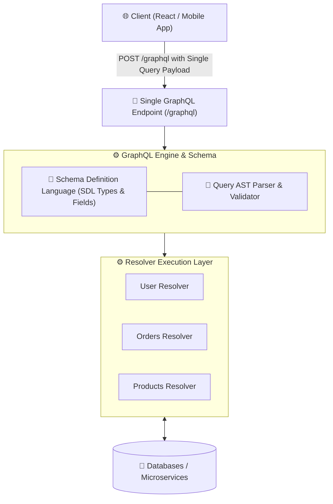

# 🕸️ GraphQL API Architecture Master Roadmap & Learning Progress Tracker

## 🏛️ GraphQL Architecture & Execution Pipeline

### 🏗️ GraphQL Client-Server Architecture


### 🔄 DataLoader Solving the N+1 Problem Sequence
```mermaid
sequenceDiagram
    autonumber
    actor Client as Client Query
    participant Resolver as Book Resolver
    participant DL as DataLoader Batch Queue
    participant DB as Database

    Client->>Resolver: Query 100 Books with Author Info
    loop For each of 100 books
        Resolver->>DL: dataLoader.load(book.authorId)
    end
    Note over DL: Wait for Current Event Loop Tick! Batch 100 authorIds into Set
    DL->>DB: SELECT * FROM authors WHERE id IN (1, 2, 3, ... 100); (1 Single Query!)
    DB-->>DL: Return Authors Dataset
    DL-->>Resolver: Resolve Individual Author Promises
    Resolver-->>Client: 200 OK JSON Response
```

---

## 📑 Phase 1: Core Concepts & Schema Definition

### Module 1: Introduction to GraphQL & REST Comparison
- [x] **What is GraphQL?**
  - Strongly-typed query language and server-side runtime created by Meta for APIs.
- [x] **GraphQL vs REST**
  - **Single Endpoint**: Exposes a single `/graphql` HTTP endpoint instead of dozens of REST URIs.
  - **Exact Fetching**: Clients request *only* the specific fields they need, eliminating **Over-fetching** and **Under-fetching**.

### Module 2: Schema Definition Language (SDL)
- [x] **GraphQL Types & Fields**
  - Scalar types (`Int`, `Float`, `String`, `Boolean`, `ID`), Object types, Enums, Interfaces, Unions, Input types.
- [x] **Operation Types**
  - `Query` (fetch data), `Mutation` (create/update/delete data), `Subscription` (real-time WebSockets push).

---

## ⚡ Phase 2: Resolvers, Performance & DataLoader

### Module 3: Resolvers & Execution Lifecycle
- [x] **Resolver Functions (`parent`, `args`, `context`, `info`)**
  - Function fetching data for a specific field in the schema graph.
- [x] **Execution Tree**
  - Resolvers execute top-to-bottom concurrently, forming a hierarchical resolution tree.

### Module 4: The N+1 Problem & DataLoader
- [x] **GraphQL N+1 Problem**
  - Occurs when fetching a list of $N$ items triggers 1 query for the list + $N$ individual database queries for nested relational fields.
- [x] **DataLoader (Batching & Caching)**
  - Coalesces individual data load requests during a single event loop tick into a single batched database query (`IN (...)`).

---

## 🛠️ Phase 3: Security, Caching & Federation

### Module 5: GraphQL Security & Protection
- [x] **Depth Limiting & Query Cost Analysis**
  - Preventing malicious recursive queries (`user { friends { friends { ... } } }`) using maximum depth thresholds.
- [x] **Rate Limiting & Authentication**
  - Injecting auth tokens via `context` and enforcing rate limits based on query cost complexity.

### Module 6: Schema Stitching vs Apollo Federation
- [x] **Apollo Federation (Micro-Frontends / Microservices)**
  - Architecture composing multiple sub-graph schemas into a unified enterprise supergraph API gateway.

---

## 🛠️ Phase 4: Practical GraphQL Schema & Resolver Code

### Complete Schema, Resolvers & DataLoader Setup (`server.ts`)
```typescript
import { ApolloServer } from '@apollo/server';
import { startStandaloneServer } from '@apollo/server/standalone';
import DataLoader from 'dataloader';

// 1. Schema Definition Language (SDL)
const typeDefs = `#graphql
  type Author {
    id: ID!
    name: String!
  }

  type Book {
    id: ID!
    title: String!
    author: Author!
  }

  type Query {
    books: [Book!]!
  }
`;

// 2. Batch Function for DataLoader (Solves N+1 Query Problem!)
const batchAuthors = async (authorIds: readonly string[]) => {
  console.log(`Fetching batch of authors: ${authorIds.join(', ')}`);
  const authors = await db.getAuthorsByIds(authorIds); // Executes single SQL IN () query
  return authorIds.map((id) => authors.find((a) => a.id === id));
};

// 3. Resolvers Definition
const resolvers = {
  Query: {
    books: async () => await db.getAllBooks(),
  },
  Book: {
    author: (parent, _, context) => {
      return context.authorLoader.load(parent.authorId); // Queues request to DataLoader
    },
  },
};

// 4. Server Initialization
const server = new ApolloServer({ typeDefs, resolvers });

startStandaloneServer(server, {
  context: async () => ({
    authorLoader: new DataLoader(batchAuthors), // Instantiated per request!
  }),
}).then(({ url }) => console.log(`🚀 GraphQL Server ready at ${url}`));
```

---

## 🎯 Top GraphQL Senior Interview Q&A Cheatsheet (Master List)

### Q1: How does GraphQL solve Over-fetching and Under-fetching compared to REST?
REST endpoints return fixed JSON data structures defined by the server (Over-fetching extra unused fields) and often require multiple round-trip API calls to retrieve relational data (Under-fetching). GraphQL lets clients send precise queries specifying the exact fields required, returning all data in a single round-trip response.

### Q2: What is the GraphQL N+1 Problem and how does DataLoader solve it?
The N+1 problem occurs when a query fetches $N$ parent objects (e.g. 100 books) and then executes 1 separate database query for each child object (100 author queries), totaling $101$ queries. DataLoader uses event loop batching: it collects all 100 author IDs during a single tick and executes 1 single batched SQL query (`SELECT * FROM authors WHERE id IN (...)`).

### Q3: How do you secure a GraphQL API against malicious recursive queries?
Implement **Query Depth Limiting** to reject queries exceeding a maximum nesting depth (e.g. max 5 levels) and **Query Cost Analysis** (assigning point costs to fields and blocking queries exceeding a total complexity budget).

### Q4: What is the difference between Schema Stitching and Apollo Federation?
Schema Stitching manually merges remote GraphQL schemas into a monolithic gateway. Apollo Federation uses a declarative model where individual microservices define sub-graphs (`@key`, `@external`) that an API Gateway automatically composes into a unified supergraph.
