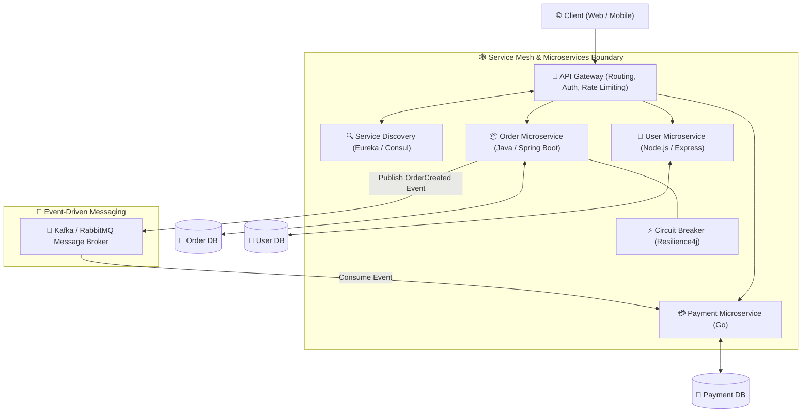
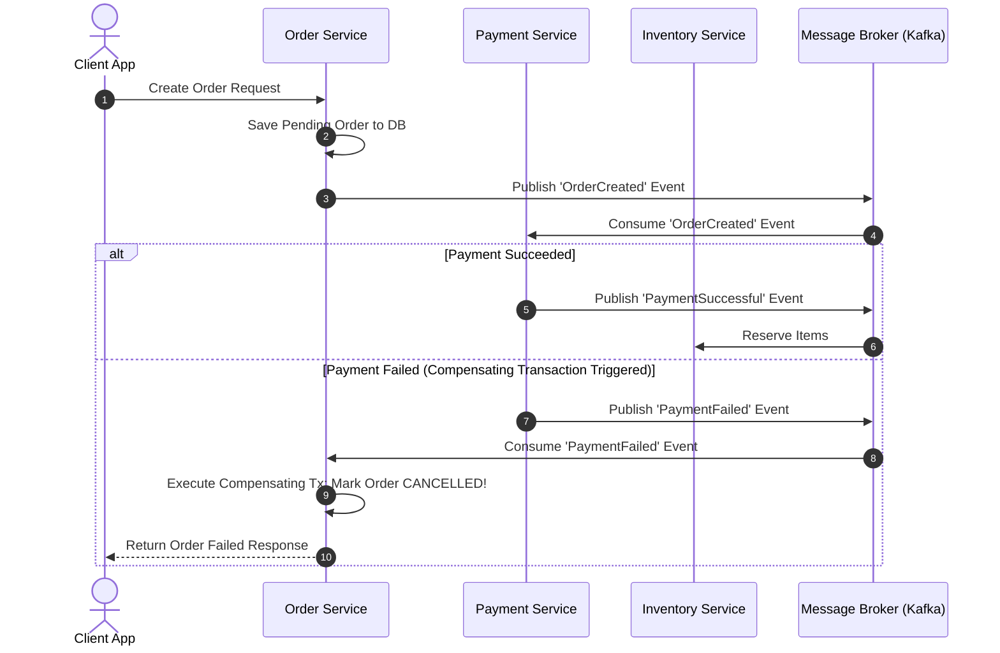

# 🏗️ Microservices Architecture Master Roadmap & Learning Progress Tracker

## 🏛️ Microservices Architecture & Ecosystem

### 🏗️ Enterprise Microservices Ecosystem Architecture


### 🔄 Distributed Saga Pattern (Choreography vs Orchestration)


---

## 📑 Phase 1: Microservices Core & Architectural Patterns

### Module 1: Monolith vs Microservices Architecture
- [x] **Monolithic vs Microservices**
  - **Monolith**: Single unified codebase and database deployment. Simple initially; suffers from tight coupling, deployment bottlenecks, and scaling limits.
  - **Microservices**: Decoupled, independently deployable services organized around business domains. Enables technology diversity and independent scaling.
- [x] **Database-per-Service Pattern**
  - Every microservice owns its private database. Prevents direct database sharing across service boundaries to enforce loose coupling.

---

## ⚡ Phase 2: Gateway, Discovery & Fault Tolerance

### Module 2: API Gateway & Service Discovery
- [x] **API Gateway Pattern (Kong, Spring Cloud Gateway)**
  - Single entry point handling routing, authentication, SSL termination, rate limiting, and request aggregation.
- [x] **Service Discovery (Netflix Eureka, Consul)**
  - Dynamic registry where instances register their dynamic IP/Port addresses upon startup (`client-side` vs `server-side` discovery).

### Module 3: Circuit Breaker & Resilience (Resilience4j)
- [x] **Circuit Breaker Pattern (Closed, Open, Half-Open)**
  - Prevents cascading service failures. Trips to `Open` state when failure threshold is reached, returning immediate fallback responses without overwhelming failing downstream services.

---

## 🛠️ Phase 3: Distributed Data, Messaging & Observability

### Module 4: Distributed Transactions (Saga Pattern)
- [x] **Saga Pattern for Distributed Transactions**
  - Replaces 2-Phase Commit (2PC) with a sequence of local transactions.
  - **Choreography**: Services publish and consume events autonomously.
  - **Orchestration**: Central Orchestrator directs local transactions and triggers **Compensating Transactions** on failure to undo partial changes.

### Module 5: Event Sourcing & CQRS
- [x] **Event Sourcing**: Storing application state changes as an immutable sequence of historical events.
- [x] **CQRS (Command Query Responsibility Segregation)**: Separates read operations (Query) from write operations (Command) for independent database optimization.

### Module 6: Distributed Tracing & Observability
- [x] **Distributed Tracing (OpenTelemetry, Zipkin, Jaeger)**
  - Propagating **Correlation IDs** / Trace IDs across HTTP headers to trace requests across microservices.

---

## 🛠️ Phase 4: Practical Circuit Breaker Code (Resilience4j)

### Spring Boot Circuit Breaker Implementation
```java
import io.github.resilience4j.circuitbreaker.annotation.CircuitBreaker;
import org.springframework.stereotype.Service;

@Service
public class OrderService {

    private final PaymentClient paymentClient;

    public OrderService(PaymentClient paymentClient) {
        this.paymentClient = paymentClient;
    }

    @CircuitBreaker(name = "paymentService", fallbackMethod = "paymentFallback")
    public String processPayment(String orderId, double amount) {
        return paymentClient.charge(orderId, amount); // External REST Call
    }

    // Fallback executed immediately when Circuit Breaker is OPEN or fails
    public String paymentFallback(String orderId, double amount, Throwable t) {
        System.err.println("Payment Service failed: " + t.getMessage());
        return "PAYMENT_PENDING_RETRY";
    }
}
```

---

## 🎯 Top Microservices Senior Interview Q&A Cheatsheet (Master List)

### Q1: What is the Database-per-Service pattern and why is direct cross-service DB access prohibited?
Database-per-Service ensures every microservice owns its private database tables. Direct cross-service database access is prohibited because it creates tight coupling, breaks service encapsulation, prevents independent database schema migrations, and risks database lock contention.

### Q2: How does the Circuit Breaker pattern prevent cascading failures?
A Circuit Breaker monitors downstream HTTP/gRPC call failures. When failure rate exceeds a threshold, it transitions from `Closed` to `Open` state, immediately returning a fast fallback response without making real network calls. This allows the failing downstream service time to recover.

### Q3: What is the Saga Pattern and how does it handle distributed transaction failures?
The Saga Pattern coordinates transactions across multiple microservices without 2-Phase Commit. If a step fails (e.g. Payment fails after Order created), the Saga executes a series of **Compensating Transactions** in reverse order to undo changes and restore system consistency.

### Q4: What is the difference between Saga Choreography and Saga Orchestration?
- **Choreography**: Microservices listen to events on a message broker (Kafka) and execute local transactions autonomously without a central controller.
- **Orchestration**: A dedicated Orchestrator service explicitly instructs each microservice which local transaction or compensating transaction to execute.

### Q5: How does Distributed Tracing work with Correlation IDs?
When an incoming request hits the API Gateway, a unique `Trace ID` (Correlation ID) is generated. This ID is injected into HTTP/gRPC headers (`X-Correlation-ID`) and passed along to every downstream microservice call, allowing OpenTelemetry/Zipkin to stitch together end-to-end performance timelines.
