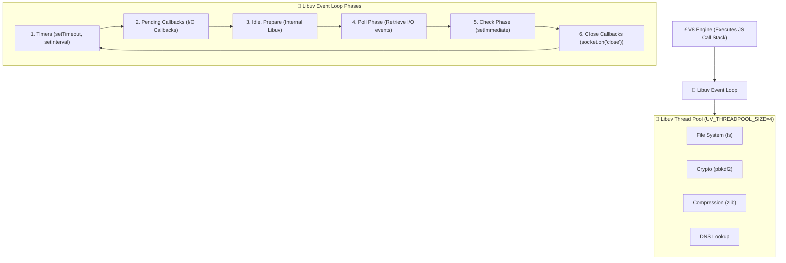

# 🟢 Node.js Master Backend Roadmap & Learning Progress Tracker

## 🏛️ Node.js Architecture & Event Loop Engine

### 🏗️ Libuv Event Loop Architecture


### 🔄 Asynchronous I/O & Microtask Execution Sequence
```mermaid
sequenceDiagram
    autonumber
    actor JS as V8 Call Stack
    participant NextTick as process.nextTick() Queue
    participant MicroQ as Promise Microtask Queue
    participant Loop as Libuv Event Loop
    participant Thread as Libuv Thread Pool

    JS->>NextTick: Queue process.nextTick(fn)
    JS->>MicroQ: Queue Promise.resolve().then(fn)
    JS->>Loop: Schedule setTimeout(fn, 0) (Timers Phase)
    JS->>Thread: Offload fs.readFile() Operation
    Note over JS: Call Stack Empties!
    NextTick->>JS: Execute ALL process.nextTick() Callbacks
    MicroQ->>JS: Execute ALL Promise Microtasks
    Loop->>JS: Move to Event Loop Phase & Execute Macrotasks
```

---

## 📑 Phase 1: Core Fundamentals & Runtime Architecture

### Module 1: Introduction to Node.js & Runtime Environment
- [x] **What is Node.js?**
  - Open-source, cross-platform JavaScript runtime built on Google V8 engine.
  - Executes JS code server-side outside the web browser.
- [x] **History & Evolution of Node.js**
  - Created by Ryan Dahl in 2009 to solve traditional thread-per-connection blocking server issues.
  - Revolutionized backend web development by enabling asynchronous event-driven I/O.
- [x] **Node.js vs Web Browsers**
  - Browser provides DOM/window APIs; Node.js provides OS, File System (`fs`), and Network (`http`) APIs.
- [x] **V8 JavaScript Engine**
  - Google's open-source C++ engine compiling JS code directly to native machine code.
  - Manages memory heap allocation and garbage collection.
- [x] **REPL (Read-Eval-Print Loop)**
  - Interactive shell environment for executing JavaScript code snippets live in terminal.
- [x] **Global Objects**
  - Built-in global variables (`globalThis`, `process`, `console`, `Buffer`).
  - Available across all modules without explicit require statements.
- [x] **`__dirname` vs `process.cwd()`**
  - `__dirname`: Absolute path of directory containing the currently executing script file.
  - `process.cwd()`: Current working directory from which Node process was launched.
- [x] **Environment Variables (`process.env`)**
  - Accessing environment configurations loaded into runtime environment.
- [x] **Command Line Arguments (`process.argv`)**
  - Array containing command line arguments passed when launching Node process.

### Module 2: Node.js Architecture & Event Loop
- [x] **Single-Threaded Model**
  - Executes application code on a single main thread using an event-driven model.
  - Handles high concurrent connections without thread creation overhead.
- [x] **Non-Blocking I/O Architecture**
  - Offloads I/O operations (network, file, database) to OS kernel or Libuv thread pool.
- [x] **Libuv C Library Overview**
  - High-performance C library powering Node's event loop and asynchronous I/O abstractions.
- [x] **The 6 Libuv Event Loop Phases**
  - Timers, Pending Callbacks, Idle/Prepare, Poll, Check (`setImmediate`), Close Callbacks.
- [x] **Timers Phase**
  - Executes callbacks scheduled by `setTimeout()` and `setInterval()`.
- [x] **Pending Callbacks Phase**
  - Executes I/O callbacks deferred to the next loop iteration.
- [x] **Idle, Prepare Phase**
  - Used internally by Libuv for system preparation.
- [x] **Poll Phase**
  - Retrieves new I/O events (network sockets, disk) and executes node I/O callbacks.
- [x] **Check Phase (`setImmediate`)**
  - Executes callbacks registered via `setImmediate()`.
- [x] **Close Callbacks Phase**
  - Executes handle cleanup callbacks (`socket.on('close')`).
- [x] **`process.nextTick()` Queue & Priority**
  - Executes **immediately** after current JS operation finishes, before any other microtask or Event Loop phase!
- [x] **Promise Microtask Queue**
  - Executes right after `process.nextTick()` queue drains, before moving to next Event Loop phase.
- [x] **`setImmediate()` vs `setTimeout(fn, 0)`**
  - `setImmediate()` runs in Check phase; `setTimeout(fn, 0)` runs in Timers phase.
  - *Inside I/O callbacks:* `setImmediate()` **always runs before `setTimeout(fn, 0)`**.
- [x] **Libuv Thread Pool (`UV_THREADPOOL_SIZE`)**
  - Default pool of 4 native OS threads handling blocking `fs`, `crypto`, `zlib`, and `dns.lookup()`.

### Module 3: Module Systems (CommonJS & ES Modules)
- [x] **What is a Module System?**
  - Architecture for organizing code into separate, reusable files with explicit inputs/outputs.
- [x] **CommonJS Syntax (`require()` & `module.exports`)**
  - Synchronous module system loading modules dynamically at runtime.
- [x] **ES Modules Syntax (`import` & `export`)**
  - Asynchronous static module system enabling tree-shaking optimization.
- [x] **Configuring ESM (`"type": "module"`)**
  - Setting `"type": "module"` in `package.json` or using `.mjs` file extensions.
- [x] **Top-Level `await` in ESM**
  - Allows using `await` keyword outside `async` functions at module top level.
- [x] **Module Resolution Algorithm**
  - How Node locates modules (Core modules $\rightarrow$ Relative paths $\rightarrow$ `node_modules`).
- [x] **Module Caching (`require.cache`)**
  - Modules are cached after initial load; subsequent requires return cached exports.
- [x] **Circular Module Dependencies**
  - Handled safely by returning unfinished copy of module exports to prevent infinite loops.

### Module 4: Asynchronous Programming Patterns
- [x] **Asynchronous vs Synchronous Execution**
  - Synchronous blocks execution thread; Asynchronous delegates work and continues main thread.
- [x] **Error-First Callbacks `(err, data)`**
  - Standard Node callback convention placing `err` as first parameter.
- [x] **Callback Hell & Pyramid of Doom**
  - Deeply nested callbacks leading to unmaintainable code structures.
- [x] **JavaScript Promises**
  - Representing eventual completion (`fulfilled`) or failure (`rejected`) of async tasks.
- [x] **Promise Combinators**
  - `Promise.all` (fail-fast), `Promise.allSettled` (wait all), `Promise.race` (first settled).
- [x] **`async` / `await` Syntax**
  - Syntactic sugar over Promises providing clean, synchronous-looking async flow.
- [x] **`util.promisify`**
  - Converts legacy error-first callback functions into Promise-returning functions.

---

## ⚡ Phase 2: Core Modules & Data Handling

### Module 5: Core Modules (File System & Path)
- [x] **Path Module (`path.join()`, `path.resolve()`, `path.extname()`)**
  - Utilities handling cross-platform file path formatting between Windows and POSIX.
- [x] **Synchronous vs Asynchronous File Operations**
  - Synchronous methods (`fs.readFileSync`) block main event loop; Async methods (`fs.readFile`) do not.
- [x] **File System API (`fs` & `fs/promises`)**
  - Reading, writing, appending, and deleting files using callbacks or Promises.
- [x] **File Metadata & Stats (`fs.stat`)**
  - Inspecting file size, creation timestamps, and permissions (`isFileData`, `isDirectory`).
- [x] **Watching Files (`fs.watch`)**
  - Monitoring file or directory changes in real-time.

### Module 6: Events & EventEmitter
- [x] **Event-Driven Architecture Overview**
  - Decoupling software components using event notifications instead of direct function calls.
- [x] **`EventEmitter` Class (`events` module)**
  - Core class facilitating custom publish-subscribe event management.
- [x] **Registering & Emitting Events (`on`, `emit`, `once`)**
  - `on()` registers persistent listener; `once()` registers single-execution listener; `emit()` triggers event.
- [x] **Removing Event Listeners (`removeListener`)**
  - Deregistering listeners to prevent memory leaks when components unmount.
- [x] **Memory Leak Prevention (`setMaxListeners`)**
  - Prevents memory leak warnings when attaching $> 10$ listeners to an event emitter instance.

### Module 7: Buffers & Binary Data
- [x] **What is a Buffer?**
  - Fixed-length sequence of raw binary bytes allocated outside V8 heap in native RAM.
- [x] **Creating Buffers (`Buffer.from()`, `Buffer.concat()`)**
  - Creating buffers from strings, arrays, or concatenating multiple buffer chunks.
- [x] **`Buffer.alloc()` vs `Buffer.allocUnsafe()`**
  - `alloc(size)` zero-fills memory (safe). `allocUnsafe(size)` allocates uninitialized memory faster.
- [x] **Character Encodings**
  - Converting binary data to/from `utf-8`, `hex`, `base64`, and `ascii`.

### Module 8: Streams & Pipelines
- [x] **4 Stream Types**
  - `Readable`, `Writable`, `Duplex` (Sockets), `Transform` (Compression/Cipher).
- [x] **Stream Events**
  - `data` (chunk emitted), `end` (no more data), `error`, `finish` (write complete), `drain` (buffer empty).
- [x] **Stream Backpressure Mechanics**
  - Occurs when Readable stream emits data faster than Writable stream can write to disk/network.
- [x] **`pipeline()` from `stream/promises`**
  - Safely pipes streams handling backpressure, errors, and resource destruction automatically.

---

## 🌐 Phase 3: Web Server & Express.js Framework

### Module 9: Native HTTP Web Server
- [x] **`http` & `https` Core Modules**
  - Low-level modules creating web servers without third-party frameworks.
- [x] **`http.createServer()`**
  - Factory function instantiating HTTP server receiving request and response streams.
- [x] **`IncomingMessage` (`req`) & `ServerResponse` (`res`)**
  - `req` reads request headers and body; `res` writes response headers, status codes, and body payload.

### Module 10: Express.js Framework Fundamentals
- [x] **What is Express.js?**
  - Minimalist, un-opinionated Web framework providing routing and middleware infrastructure.
- [x] **Express App Instance (`const app = express()`)**
  - Main application object configuring settings, routes, and middleware pipeline.
- [x] **Express Request & Response Methods**
  - `req.body`, `req.params`, `req.query`, `req.headers`, `res.status()`, `res.json()`, `res.send()`.

### Module 11: Express Routing & Request Handling
- [x] **Route Handlers (`app.get()`, `app.post()`, `app.put()`, `app.delete()`)**
  - Mapping HTTP methods and URI paths to handler functions.
- [x] **Dynamic Route Parameters (`req.params`)**
  - Extracting path variables (`/users/:id` $\rightarrow$ `req.params.id`).
- [x] **Query Parameters (`req.query`)**
  - Extracting URL query strings (`/search?q=node` $\rightarrow$ `req.query.q`).
- [x] **Body Parsing (`express.json()`)**
  - Middleware parsing incoming JSON payload into `req.body`.
- [x] **Express Router (`express.Router()`)**
  - Modular, pluggable route handlers isolating endpoints into separate app files.

### Module 12: Express Middleware Pipeline & Error Handling
- [x] **Middleware Signature `(req, res, next)`**
  - Functions executing sequentially during request-response cycle.
- [x] **Middleware Types**
  - Application-level, Router-level, Built-in, Third-party (`cors`, `morgan`, `helmet`).
- [x] **Global Error Handling Middleware**
  - Special 4-argument error handler `(err, req, res, next)` placed at end of middleware stack.
- [x] **Async Error Handling Wrappers**
  - Wrapping async route handlers to pass rejected Promises automatically to `next(err)`.

---

## 🛡️ Phase 4: Database Integration, Security & Auth

### Module 13: Database Integration (MongoDB & SQL)
- [x] **Mongoose ORM Setup**
  - Schema-based data modeling solution for MongoDB in Node.js.
- [x] **Mongoose Schemas, Models & Validation**
  - Defining document structure, field constraints, and custom validators.
- [x] **Mongoose Queries & Population (`.populate()`)**
  - Performing CRUD operations and populating referenced document ObjectIds.
- [x] **Relational Database ORMs (Prisma / TypeORM)**
  - Next-generation type-safe ORMs for PostgreSQL and MySQL.

### Module 14: Authentication & Authorization
- [x] **Password Hashing (`bcrypt` / `argon2`)**
  - Securely hashing user passwords with salt protection to prevent rainbow table attacks.
- [x] **JSON Web Tokens (JWT) Architecture**
  - Stateless authentication tokens signed cryptographically sent via `Authorization: Bearer <token>`.
- [x] **Authentication Middleware**
  - Verifying JWTs and attaching user payload to `req.user`.
- [x] **Role-Based Access Control (RBAC)**
  - Middleware restricting endpoints based on user roles (`checkRole('admin')`).

### Module 15: Node.js Security Best Practices
- [x] **Security Headers via `helmet()`**
  - Sets secure HTTP response headers (`X-Frame-Options`, `Strict-Transport-Security`, `X-Content-Type-Options`).
- [x] **Rate Limiting (`express-rate-limit`)**
  - Prevents DDoS and brute-force attacks by limiting repetitive requests per IP address.
- [x] **Sanitization & CORS**
  - Preventing SQL/NoSQL injection and configuring Cross-Origin Resource Sharing (`cors`).
- [x] **Managing Secrets (`dotenv`)**
  - Loading sensitive API keys and database passwords from `.env` files.

---

## 🚀 Phase 5: Concurrency, Testing, Monitoring & Deployment

### Module 16: Multi-Core Concurrency & Scaling
- [x] **Child Processes (`child_process.fork`, `spawn`, `exec`)**
  - Spawns isolated Node.js processes communicating via IPC (`process.send()`).
- [x] **Cluster Module**
  - Forking web server worker processes on a shared port across multi-core CPUs.
- [x] **Worker Threads (`worker_threads`)**
  - Spawns threads sharing memory (`SharedArrayBuffer`) for CPU-bound computations.

### Module 17: Testing in Node.js
- [x] **Native Test Runner (`node:test`) & Jest**
  - Built-in test runner (`node --test`) and Jest testing framework (`describe`, `it`, `expect`).
- [x] **Supertest**
  - Testing Express API endpoints without running live servers.

### Module 18: Logging, Debugging & Monitoring
- [x] **Winston & Pino Loggers**
  - High-performance structured JSON loggers supporting log rotation and transport levels.
- [x] **Node Inspector (`node --inspect`)**
  - Connecting Chrome DevTools to debug Node execution and profile memory heaps.
- [x] **Process Managers (PM2)**
  - Production process manager keeping Node applications alive forever with auto-restart and cluster modes.

### Module 19: Deployment & Containerization
- [x] **Multi-stage `Dockerfile`**
  - Packaging Node applications into lightweight production Docker images.
- [x] **Graceful Shutdown (`SIGTERM`, `SIGINT`)**
  - Listening for OS signals to close database pools and HTTP servers cleanly without dropping active requests.
- [x] **WebSockets (`Socket.io`)**
  - Full-duplex real-time communication protocol for live chat and notifications.
- [x] **NestJS Framework Overview**
  - Enterprise Node framework built on Express with TypeScript providing modular architecture.

### Module 20: Event-Driven Microservices
- [x] **Message Queues (RabbitMQ / Kafka)**
  - Offloading heavy background tasks asynchronously using publish-subscribe queues.

---

## 🛠️ Phase 6: Practical Node.js Code Snippets & Pipelines

### 1. Safe File Compression Stream Pipeline (`stream/promises`)
```javascript
import { pipeline } from 'node:stream/promises';
import fs from 'node:fs';
import zlib from 'node:zlib';

async function compressFile(sourcePath, destinationPath) {
  try {
    await pipeline(
      fs.createReadStream(sourcePath),
      zlib.createGzip(),
      fs.createWriteStream(destinationPath)
    );
    console.log('File compressed successfully');
  } catch (err) {
    console.error('Pipeline failed:', err);
  }
}

compressFile('large_log.txt', 'large_log.txt.gz');
```

### 2. Express Global Error Handler & Async Handler Wrapper
```javascript
import express from 'express';

const app = express();

// Async Wrapper to avoid repetitive try-catch blocks in routes
const asyncHandler = (fn) => (req, res, next) => {
  Promise.resolve(fn(req, res, next)).catch(next);
};

app.get('/api/users/:id', asyncHandler(async (req, res) => {
  const user = await db.findUser(req.params.id);
  if (!user) {
    const error = new Error('User Not Found');
    error.statusCode = 404;
    throw error;
  }
  res.json(user);
}));

// Express 4-argument Global Error Middleware
app.use((err, req, res, next) => {
  const statusCode = err.statusCode || 500;
  res.status(statusCode).json({
    status: 'error',
    message: err.message || 'Internal Server Error'
  });
});
```

---

## 🎯 Top Node.js Senior Interview Q&A Cheatsheet (Master List)

### Q1: What is the execution order of `process.nextTick()`, `Promise.then()`, `setTimeout()`, and `setImmediate()`?
`process.nextTick()` runs first (highest priority microtask). `Promise.then()` runs second (microtask). `setTimeout(fn, 0)` runs in the Timers phase. `setImmediate()` runs in the Check phase. Inside an I/O callback, `setImmediate()` always runs before `setTimeout()`.

### Q2: What is Backpressure in Node.js Streams and how do you resolve it?
Backpressure happens when a Writable stream cannot consume incoming data as fast as a Readable stream emits it, causing memory usage to spike. It is resolved using `.pipe()` or `pipeline` from `stream/promises`, which automatically pauses the Readable stream until the Writable stream drains.

### Q3: What is the difference between `cluster` module and `worker_threads` in Node.js?
- `cluster`: Spawns separate OS processes with isolated memory heaps sharing the same server port. Used for scaling HTTP servers across CPU cores.
- `worker_threads`: Spawns threads inside the *same* process sharing memory (`SharedArrayBuffer`). Used for CPU-bound computations (image processing, crypto).

### Q4: How should uncaught exceptions be handled in production Node.js applications?
Catch `uncaughtException` and `unhandledRejection` events for logging, then invoke `process.exit(1)`. Relying on a running Node process after an uncaught exception is dangerous due to unpredictable memory corruption; process managers (PM2 / Kubernetes) should automatically restart clean instances.

### Q5: How do you implement Graceful Shutdown in a Node.js web application?
Listen for OS signals (`process.on('SIGTERM')` and `process.on('SIGINT')`), stop accepting new HTTP connections via `server.close()`, close all database connection pools (Mongoose, PostgreSQL pool), finish processing existing active requests, and exit with `process.exit(0)`.
