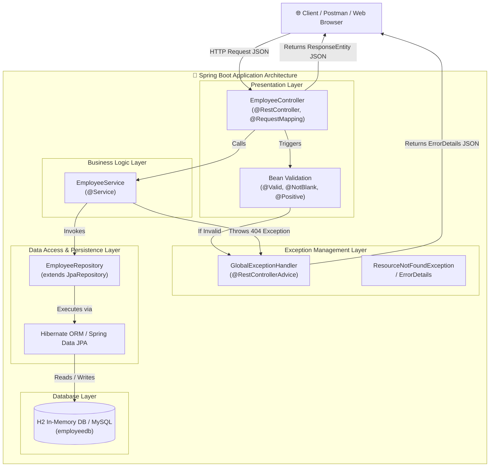
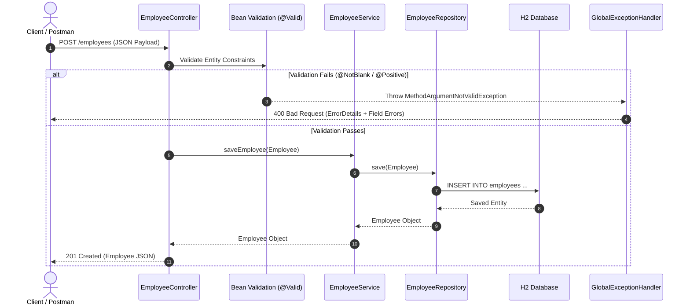

# 🚀 Spring Boot Learning Roadmap & Progress Tracker

## 🏛️ Application Architecture & Request Lifecycle

### 🏗️ Layered Architecture Diagram

### 🔄 HTTP Request & Exception Lifecycle

---

## 📑 Phase 1: Java Prerequisites
- [x] **OOP Concepts**
  - Encapsulation, Inheritance, Polymorphism, and Abstraction in Java.
  - Core foundation for building object-oriented and modular Spring components.
- [x] **Collections Framework**
  - Interfaces and classes (`List`, `Set`, `Map`) for grouping and manipulating objects.
  - Essential for handling data lists, sets, and key-value maps in application memory.
- [x] **Exception Handling**
  - Mechanism (`try-catch-finally`, `throw`, `throws`) to manage runtime errors gracefully.
  - Ensures application resilience and supports custom error propagation.
- [x] **Multithreading Basics**
  - Concurrent execution of code using `Thread`, `Runnable`, and thread pools.
  - Crucial for understanding how web application servers handle concurrent HTTP requests.
- [x] **Generics**
  - Type parameters (`<T>`) enabling compile-time type safety and reusable code.
  - Heavily utilized in Spring Repositories, Collections, and generic API wrappers.
- [x] **Streams API**
  - Functional data processing pipeline introduced in Java 8 (`map`, `filter`, `reduce`).
  - Enables concise, declarative operations on collections without explicit loops.
- [x] **Functional Interfaces**
  - Single Abstract Method (SAM) interfaces (`Function`, `Consumer`, `Supplier`, `Predicate`).
  - Serves as the target types for Java lambda expressions and method references.
- [x] **Lambda Expressions**
  - Anonymous functions `(args) -> body` allowing clean, concise functional coding.
  - Simplifies stream pipelines, event handlers, and callback functions.
- [x] **Optional**
  - Container object (`Optional<T>`) to represent the presence or absence of a value.
  - Prevents `NullPointerException` and simplifies defensive null-checking.
- [x] **Java I/O**
  - File reading, writing, and byte/character streams (`Path`, `Files`, `BufferedReader`).
  - Used for processing resources, file uploads, and reading application configurations.
- [x] **Reflection Basics**
  - API inspects and modifies classes, fields, methods, and constructors at runtime.
  - Powering Spring's IoC container, dependency injection, and dynamic proxying.
- [x] **Annotations**
  - Metadata markers (`@Override`, `@Deprecated`, custom annotations) on code elements.
  - Used extensively by Spring Boot to configure beans, routing, and JPA mappings.

---

## 🍃 Phase 2: Spring Core & Spring Boot *(Current Phase)*

### Module 1: Introduction
- [x] **What is Spring?**
  - Comprehensive Java enterprise framework providing IoC, AOP, and ecosystem integration.
  - Simplifies enterprise development by promoting loose coupling and testability.
- [x] **Problems with Traditional Java EE**
  - Heavyweight configuration (verbose XML), complex deployment, and tight coupling.
  - High boilerplate code requiring full application server installations (JBoss, WebLogic).
- [x] **What is Dependency Injection?**
  - Design pattern where objects receive their dependencies from an external container.
  - Removes hardcoded object creation (`new`), making code modular and easily testable.
- [x] **Inversion of Control (IoC)**
  - Architectural principle delegating object creation and lifecycle management to the framework.
  - Flips control flow so Spring manages component instantiation instead of application code.
- [x] **Spring Architecture**
  - Modular ecosystem consisting of Core Container, Data Access, Web, AOP, and Testing.
  - Allows developers to pick only necessary modules without overhead.
- [x] **Spring Boot Overview**
  - Extension of Spring Framework designed to simplify bootstrap and application creation.
  - Provides opinionated defaults, auto-configuration, and standalone executable JARs.
- [x] **Spring Boot vs Spring Framework**
  - Spring Framework requires manual setup and XML/Java config; Spring Boot automates setup.
  - Spring Boot eliminates boilerplate setup via starter dependencies and auto-config.
- [x] **Spring Boot Starter Projects**
  - Pre-packaged dependency descriptors (e.g., `spring-boot-starter-web`, `data-jpa`).
  - Aggregates compatible libraries into single, easy-to-manage Maven/Gradle imports.
- [x] **Auto Configuration**
  - Spring Boot feature that automatically configures beans based on classpath dependencies.
  - Example: Automatically sets up H2 DB and Hibernate if H2 jar is present.
- [x] **Embedded Servers**
  - Built-in web servers (Tomcat, Jetty, Undertow) packaged inside the executable JAR.
  - Eliminates the need to install and deploy WAR files to external web servers.
- [x] **Spring Initializr**
  - Web tool (`start.spring.io`) to generate Spring Boot project skeletons.
  - Lets developers choose build tool, Java version, and starters in seconds.

### Module 2: Spring IoC Container
- [x] **Bean**
  - An object managed, instantiated, and wired by the Spring IoC container.
  - Forms the core building block of Spring application components.
- [x] **BeanFactory**
  - The fundamental IoC container interface providing basic dependency injection.
  - Lazy-initializes beans on request; lightweight for resource-constrained setups.
- [x] **ApplicationContext**
  - Advanced IoC container extending `BeanFactory` with enterprise features.
  - Adds event publication, i18n, AOP integration, and eager bean pre-instantiation.
- [x] **Bean Lifecycle**
  - Sequence of phases from instantiation, dependency injection, callbacks, to destruction.
  - Customizable using `@PostConstruct`, `@PreDestroy`, and `InitializingBean`.
- [x] **Bean Scopes**
  - Defines bean instance creation lifecycle: `singleton` (default), `prototype`, `request`, `session`.
  - Controls whether one or multiple instances exist per container or HTTP request.
- [x] **Lazy Initialization**
  - Postpones bean creation until it is explicitly requested rather than at startup (`@Lazy`).
  - Improves application startup time but delays bean instantiation errors to runtime.
- [x] **Bean Naming**
  - Default naming convention (camelCase of class name) or explicit custom names (`@Bean("customName")`).
  - Ensures distinct identification when retrieving or injecting specific beans.
- [x] **Dependency Injection Types**
  - Methods to supply dependencies: Constructor, Setter, and Field injection.
  - Constructor injection is recommended for immutability and testability.
- [x] **Constructor Injection**
  - Pass dependencies through class constructors; enforced at initialization time.
  - Guarantees non-null required dependencies and facilitates unit testing with mocks.
- [x] **Setter Injection**
  - Supplies dependencies via public setter methods after bean creation.
  - Useful for optional dependencies or reconfigurability at runtime.
- [x] **Field Injection**
  - Direct injection into private fields using `@Autowired`.
  - Concise but discouraged due to hidden dependencies and difficulty in unit testing.
- [x] **`@Primary`**
  - Annotation marking a bean as default choice when multiple beans of same type exist.
  - Resolves ambiguity during auto-wiring without specifying bean names.
- [x] **`@Qualifier`**
  - Used alongside `@Autowired` to specify the exact name of bean to inject.
  - Provides fine-grained selection when multiple candidate beans exist.

### Module 3: Configuration
- [x] **`@Configuration`**
  - Marks a class as a source of Spring Bean definitions created via `@Bean` methods.
  - Enables CGLIB proxying to ensure singleton bean scoping across method calls.
- [x] **`@Bean`**
  - Method-level annotation signaling that the returned object should be registered as a Spring bean.
  - Typically used when integrating 3rd-party classes or custom instantiation logic.
- [x] **`@Component`**
  - Generic stereotype annotation marking a Java class for automatic detection and bean creation.
  - Base annotation for specialized stereotypes like `@Service`, `@Repository`, and `@Controller`.
- [x] **`@Service`**
  - Stereotype specialization of `@Component` indicating business logic layer components.
  - Clarifies architectural intent and enables service-layer AOP aspects.
- [x] **`@Repository`**
  - Stereotype for Data Access Layer components interacting with databases.
  - Automatically translates low-level SQL exceptions into Spring's DataAccessException hierarchy.
- [x] **`@Controller`**
  - Stereotype for Web Layer classes handling HTTP requests and returning views/responses.
  - Used for MVC controllers returning templates or REST endpoints when paired with `@ResponseBody`.
- [x] **Component Scanning**
  - Process where Spring scans packages (`@ComponentScan`) to discover annotated classes.
  - Automatically registers detected components as Spring beans in ApplicationContext.
- [x] **`@SpringBootApplication`**
  - Composite annotation combining `@Configuration`, `@EnableAutoConfiguration`, and `@ComponentScan`.
  - Placed on entry-point main class to bootstrap the Spring Boot application.
- [x] **Profiles**
  - Feature (`@Profile`) to segregate environment-specific configurations (e.g., `dev`, `test`, `prod`).
  - Activates specific beans and property files depending on current active profile.
- [x] **`application.properties`**
  - Key-value configuration file for application settings (database URLs, ports, logging).
  - Standard default location for configuring Spring Boot application properties.
- [x] **`application.yml`**
  - YAML alternative to `application.properties` providing hierarchical structure and cleaner syntax.
  - Excellent for complex nested configurations and profile-specific documents.
- [x] **External Configuration**
  - Loading configurations from external sources (env variables, command-line arguments, Config Server).
  - Overrides internal defaults without modifying application code or re-building jars.

### Module 4: Spring Boot Internals
- [x] **Auto Configuration**
  - Mechanics behind `@EnableAutoConfiguration` inspecting classpath and conditional annotations.
  - Automatically registers beans like DataSource or WebMvc based on library presence.
- [x] **Conditional Beans**
  - Annotations like `@ConditionalOnProperty`, `@ConditionalOnClass`, `@ConditionalOnMissingBean`.
  - Controls bean creation dynamically based on runtime environment conditions.
- [x] **Starter Dependencies**
  - Transitive Maven/Gradle dependency bundles simplifying library version management.
  - Ensures compatible library versions without manual version lock conflicts.
- [x] **Spring Boot Lifecycle**
  - Execution sequence from main execution, environment creation, context refresh, to runner execution.
  - Provides hooks for custom startup logic and graceful shutdown handling.
- [x] **`SpringApplication`**
  - Core class used to bootstrap and launch Spring applications from a Java main method.
  - Sets up context, loads listeners, applies initializers, and starts embedded server.
- [x] **`CommandLineRunner`**
  - Functional interface executing a `run(String... args)` block after context loads.
  - Ideal for executing startup scripts, seed data initialization, or command-line tasks.
- [x] **`ApplicationRunner`**
  - Similar to `CommandLineRunner`, but receives structured `ApplicationArguments`.
  - Provides parsed access to option and non-option command-line arguments.
- [x] **Banner**
  - Custom ASCII art or text displayed in terminal logs during application startup.
  - Configurable via `banner.txt` file or `SpringApplication.setBanner(...)`.
- [x] **DevTools**
  - Developer productivity module (`spring-boot-devtools`) providing automatic restart and live-reload.
  - Accelerates development feedback loop by restarting context upon code compilation.

### Module 5: REST API
- [x] **REST Principles**
  - Architectural style utilizing stateless communication, HTTP methods, and uniform resource identifiers.
  - Focuses on resource-oriented endpoints returning standard representations (JSON/XML).
- [x] **HTTP Methods**
  - Standard verbs (`GET`, `POST`, `PUT`, `PATCH`, `DELETE`) mapping to CRUD operations.
  - Defines specific semantics for reading, creating, updating, and deleting resources.
- [x] **Status Codes**
  - Standard HTTP response status numbers (200 OK, 201 Created, 400 Bad Request, 404 Not Found, 500 Error).
  - Communicates precise outcome of client HTTP requests to API consumers.
- [x] **Request Mapping**
  - Mapping HTTP requests to handler methods via `@RequestMapping` or shortcuts like `@GetMapping`.
  - Routes requests based on URL path, HTTP method, headers, and media types.
- [x] **Path Variables**
  - Extracting dynamic values from URI path segments using `@PathVariable` (e.g., `/employees/{id}`).
  - Used for resource identification in RESTful URL paths.
- [x] **Request Parameters**
  - Extracting query parameters from URL string using `@RequestParam` (e.g., `/search?name=John`).
  - Commonly used for filtering, pagination, sorting, and optional request criteria.
- [x] **Request Body**
  - Binding HTTP request payload JSON into Java objects using `@RequestBody`.
  - Deserializes incoming JSON data into Java DTOs or Entity instances automatically.
- [x] **`ResponseEntity`**
  - Wrapper representing full HTTP response including status code, headers, and body.
  - Provides complete control over HTTP response customization in controllers.
- [x] **JSON Serialization**
  - Process of converting Java objects into JSON strings (and vice versa) for HTTP transfer.
  - Managed automatically by Spring MVC using Jackson ObjectMapper converter.
- [x] **Jackson**
  - High-performance JSON processing library integrated default in Spring Boot.
  - Customizes JSON formatting using annotations like `@JsonProperty` and `@JsonIgnore`.

### Module 6: Validation
- [x] **Bean Validation**
  - Standard specification (Jakarta Validation / Hibernate Validator) for constraint validation.
  - Enforces rules on model properties declarative via annotations.
- [x] **`@Valid`**
  - Annotation triggering automatic validation of request payload parameters in controllers.
  - Throws `MethodArgumentNotValidException` if validation constraints are violated.
- [x] **Validation Annotations**
  - Field constraints like `@NotNull`, `@NotBlank`, `@Size`, `@Min`, `@Max`, `@Email`.
  - Defines validation rules directly on Java DTO/Entity attributes.
- [x] **Custom Validation**
  - Creating domain-specific validation constraints using custom annotations and `ConstraintValidator`.
  - Handles complex validation logic not covered by standard built-in constraints.
- [x] **Global Exception Handling**
  - Centralized handler trapping validation exceptions across all controllers.
  - Converts `MethodArgumentNotValidException` into structured 400 Bad Request responses.

### Module 7: Spring Data JPA
- [x] **ORM**
  - Object-Relational Mapping technique mapping Java classes to database relational tables.
  - Eliminates manual JDBC SQL query writing for standard data access.
- [x] **Hibernate**
  - Popular ORM framework acting as default JPA provider implementation in Spring Boot.
  - Manages SQL query generation, entity caching, dirty checking, and transaction tracking.
- [x] **Entity**
  - Java class mapped to a database table using `@Entity` and `@Table` annotations.
  - Represents persistence domain model with primary key (`@Id`) and columns.
- [x] **Repository**
  - Data access abstraction layer isolating domain model from underlying storage details.
  - Provides type-safe persistence operations without boilerplate implementation code.
- [x] **`CrudRepository`**
  - Base Spring Data interface providing standard CRUD operations (`save`, `findById`, `delete`).
  - Generic interface parametrized by Entity type and Primary Key type.
- [x] **`JpaRepository`**
  - Extension of `CrudRepository` adding JPA-specific features like batch operations and sorting.
  - Provides flush capabilities and pagination methods out of the box.
- [x] **Relationships**
  - Domain entity associations mapped via `@OneToOne`, `@OneToMany`, `@ManyToOne`, `@ManyToMany`.
  - Configures foreign key constraints and cascade persistence operations.
- [x] **Lazy Loading**
  - Fetch strategy (`FetchType.LAZY`) loading associated entities only when explicitly accessed.
  - Optimizes query performance by avoiding unnecessary database joins.
- [x] **Eager Loading**
  - Fetch strategy (`FetchType.EAGER`) loading associated child entities immediately with parent.
  - Useful when child data is always required alongside parent entity.
- [x] **Transactions**
  - Logical unit of database operations managed atomically via `@Transactional`.
  - Guarantees ACID compliance and automatic commit/rollback on unchecked exceptions.

### Module 8: Database
- [x] **MySQL**
  - Popular open-source relational database management system for production applications.
  - Configured in Spring Boot using `mysql-connector-j` driver and connection properties.
- [x] **PostgreSQL**
  - Advanced open-source object-relational database known for strict standards compliance.
  - Integrated via `postgresql` driver for enterprise data workloads.
- [x] **H2 Database**
  - Fast, lightweight in-memory SQL database ideal for rapid testing and development.
  - Includes embedded web console (`/h2-console`) for immediate data inspection.
- [x] **Connection Pool**
  - Pool of pre-created, reusable database connections managed for high performance.
  - Prevents overhead of opening/closing physical connections per database request.
- [x] **HikariCP**
  - High-performance JDBC connection pool used as default pool in Spring Boot.
  - Delivers ultra-fast connection checkout times and minimal CPU memory overhead.

### Module 9: Query Methods
- [x] **Derived Queries**
  - Generating SQL queries automatically from repository method names (`findByDepartment`).
  - Parses method name keywords (`And`, `Or`, `GreaterThan`, `Like`) into SQL conditions.
- [x] **JPQL**
  - Java Persistence Query Language querying entity objects rather than database tables.
  - Written using `@Query("SELECT e FROM Employee e WHERE e.salary > :min")`.
- [x] **Native SQL**
  - Executing database-specific raw SQL queries using `@Query(nativeQuery = true)`.
  - Used when leveraging database-specific features or complex performance queries.
- [x] **Pagination**
  - Splitting large query result sets into smaller pages using `Pageable` and `Page`.
  - Prevents memory exhaustion when retrieving thousands of database records.
- [x] **Sorting**
  - Ordering query results dynamically using Spring Data `Sort` parameter objects.
  - Supports multi-field ascending/descending sorting without modifying query logic.
- [x] **Specifications**
  - Reusable, composable query predicates based on Domain-Driven Design criteria patterns.
  - Enables building dynamic database queries with complex optional filters.
- [x] **Criteria API**
  - Programmatic, type-safe API provided by JPA to build queries dynamically in Java.
  - Prevents string concatenation SQL errors when constructing dynamic search criteria.

### Module 10: Exception Handling
- [x] **`try`/`catch`**
  - Traditional block-level Java exception handling construct.
  - Used locally within method bodies to trap and handle specific exceptions.
- [x] **`@ExceptionHandler`**
  - Annotation marking controller methods to handle specific thrown exception types.
  - Catches matching exceptions and constructs customized HTTP error responses.
- [x] **`@ControllerAdvice`**
  - Specialized `@Component` intercepting exceptions globally across all application controllers.
  - Centralizes error handling logic into a single cohesive, maintainable component.
- [x] **Custom Exceptions**
  - Application-specific exception classes extending `RuntimeException` (e.g., `ResourceNotFoundException`).
  - Expresses domain business errors cleanly without exposing infrastructure details.
- [x] **Error Response Design**
  - Standardized DTO payload (timestamp, status code, error message, field errors).
  - Provides consistent, clean REST API error responses for client consumers.

### Module 11: Logging
- [ ] **SLF4J**
  - Simple Logging Facade for Java serving as abstraction layer over logging frameworks.
  - Allows decoupling application code from specific underlying logging implementations.
- [ ] **Logback**
  - Default high-performance logging framework implementation packaged with Spring Boot.
  - Configurable via `logback-spring.xml` for custom appenders, formats, and file rolling.
- [ ] **Logging Levels**
  - Severity levels (`TRACE`, `DEBUG`, `INFO`, `WARN`, `ERROR`) controlling output verbosity.
  - Configured in `application.properties` per package/class level.
- [ ] **Custom Logging**
  - Injecting logger instances via `@Slf4J` (Lombok) or `LoggerFactory.getLogger(...)`.
  - Logs application execution milestones, diagnostics, and error stack traces.

### Module 12: Spring Security
- [ ] **Authentication**
  - Process of verifying user identity credentials (username/password, tokens).
  - Answers "Who are you?" before granting access to application resources.
- [ ] **Authorization**
  - Process of checking user permissions and roles against requested actions or endpoints.
  - Answers "What are you allowed to do?" (e.g., `@PreAuthorize("hasRole('ADMIN')")`).
- [ ] **BCrypt**
  - Strong password hashing algorithm (`BCryptPasswordEncoder`) with salt protection.
  - Secures stored user passwords safely against rainbow table attacks.
- [ ] **`UserDetailsService`**
  - Core Spring Security interface to load user-specific security data from DB/storage.
  - Returns `UserDetails` object containing credentials, authorities, and account status.
- [ ] **JWT**
  - JSON Web Token format for stateless, compact authentication tokens in REST APIs.
  - Signed cryptographically, containing claims sent in `Authorization: Bearer <token>` header.
- [ ] **Filters**
  - Spring Security Filter Chain intercepting incoming HTTP requests before reaching controllers.
  - Evaluates security headers, token validation, CSRF, and session creation.
- [ ] **Roles & Permissions**
  - Granular access control assigning roles (`ROLE_USER`, `ROLE_ADMIN`) and specific permissions.
  - Enforces endpoint authorization policies cleanly across controller routes.

### Module 13: Spring Boot Advanced
- [ ] **Interceptors**
  - Spring MVC components (`HandlerInterceptor`) intercepting request pre-handle and post-handle.
  - Used for request logging, header checks, and performance timing across controller calls.
- [ ] **Filters**
  - Servlet specification filters intercepting low-level HTTP requests and responses.
  - Handles cross-cutting concerns like CORS headers, request wrapping, and rate limiting.
- [ ] **AOP**
  - Aspect-Oriented Programming isolating cross-cutting concerns (logging, security, auditing).
  - Applied via `@Aspect`, `@Before`, `@Around`, and `@After` advice on target methods.
- [ ] **Events**
  - Application event publishing system (`ApplicationEventPublisher` & `@EventListener`).
  - Decouples component interaction via asynchronous or synchronous in-memory events.
- [ ] **Scheduling**
  - Executing periodic background tasks automatically using `@Scheduled` and cron expressions.
  - Used for automated cleanup, email dispatches, and periodic data sync tasks.
- [ ] **Async**
  - Asynchronous method execution (`@Async`) offloading long tasks to separate thread pools.
  - Prevents blocking HTTP request threads during slow operations (e.g., sending emails).
- [ ] **Caching**
  - In-memory caching abstraction (`@Cacheable`, `@CacheEvict`, `@CachePut`) via Redis/Caffeine.
  - Speeds up read-heavy operations by serving frequent database query results from cache.

### Module 14: Microservices
- [ ] **API Gateway**
  - Single entry point (Spring Cloud Gateway) routing external client requests to microservices.
  - Handles cross-cutting concerns like routing, rate limiting, authentication, and SSL termination.
- [ ] **Service Discovery**
  - Service registry (Eureka Server) tracking network locations of microservice instances.
  - Enables microservices to dynamically locate and communicate with each other by service name.
- [ ] **Config Server**
  - Centralized configuration management (Spring Cloud Config) serving properties from Git/storage.
  - Enables dynamic property updates across microservice fleets without re-deployments.
- [ ] **OpenFeign**
  - Declarative HTTP client (`@FeignClient`) simplifying inter-microservice REST calls.
  - Defines REST endpoints as Java interfaces without writing verbose RestTemplate code.
- [ ] **Circuit Breaker**
  - Resilience pattern (Resilience4j) preventing cascading failures when a downstream service fails.
  - Fallbacks to alternative responses when service calls fail or exceed timeouts.
- [ ] **Load Balancer**
  - Client-side load balancing (Spring Cloud LoadBalancer) distributing requests across service instances.
  - Optimizes traffic distribution across healthy instance pools automatically.

### Module 15: Testing
- [ ] **JUnit 5**
  - Modern Java unit testing framework (`@Test`, `@BeforeEach`, `@DisplayName`, assertions).
  - Foundation for writing clean, structured, and repeatable automated tests.
- [ ] **Mockito**
  - Mocking framework (`@Mock`, `@InjectMocks`, `when().thenReturn()`) for unit tests.
  - Isolates class-under-test by simulating external dependencies and behavior.
- [ ] **Integration Testing**
  - Testing application components together (`@SpringBootTest`) with full or slice context.
  - Verifies end-to-end integration across Controller, Service, and Repository layers.
- [ ] **`MockMvc`**
  - Spring MVC test utility simulating HTTP controller requests without running a live server.
  - Asserts response HTTP status codes, headers, and JSON content using JsonPath.
- [ ] **TestContainers**
  - Docker containerization library starting real database/Kafka instances for integration tests.
  - Eliminates lightweight mock DB inconsistencies by testing against production-grade DBs.

### Module 16: Documentation
- [ ] **Swagger / OpenAPI**
  - Interactive API documentation generator (Springdoc OpenAPI) producing UI at `/swagger-ui.html`.
  - Allows developers to inspect, test, and interact with REST API endpoints live.
- [ ] **Spring REST Docs**
  - Documentation tool generating accurate, test-driven REST API docs from unit test snippets.
  - Guarantees API documentation is always up-to-date and verified by passing test suites.

### Module 17: Deployment
- [ ] **Maven**
  - Build automation and dependency management tool using `pom.xml` build configurations.
  - Manages compilation, dependency resolution, testing, and packaging phases.
- [ ] **Gradle**
  - High-performance build tool using Groovy/Kotlin DSL build scripts (`build.gradle`).
  - Delivers faster incremental builds and flexible task customization.
- [ ] **Fat JAR**
  - Self-contained executable JAR file containing application code and all bundled dependencies.
  - Run directly on any server via simple `java -jar application.jar` command.
- [ ] **Docker**
  - Containerization platform packaging application and dependencies into isolated container images.
  - Ensures consistent execution environments across development, testing, and production.
- [ ] **Docker Compose**
  - Tool (`docker-compose.yml`) defining and running multi-container applications (App + MySQL + Redis).
  - Simplifies local multi-service environment setup with single `docker-compose up`.
- [ ] **Kubernetes Basics**
  - Container orchestration system managing deployment, scaling, and operation of containerized apps.
  - Controls container pods, services, ingress routing, and auto-scaling.
- [ ] **AWS Deployment**
  - Deploying Spring Boot applications to cloud infrastructure (Elastic Beanstalk, EC2, ECS, EKS).
  - Handles production cloud hosting, load balancing, and cloud database integration.

### Module 18: Messaging
- [ ] **Kafka**
  - Distributed event streaming platform built for high-throughput, real-time data pipelines.
  - Decouples microservices using durable, partitioned publish-subscribe event topics.
- [ ] **RabbitMQ**
  - AMQP message broker handling complex message routing, queues, and exchanges.
  - Provides reliable message queuing, dead-letter queues, and acknowledge delivery.
- [ ] **Event-Driven Architecture**
  - Design paradigm where services communicate asynchronously by publishing and consuming events.
  - Promotes loose coupling, high scalability, and event-sourcing capabilities.

### Module 19: Monitoring
- [ ] **Spring Boot Actuator**
  - Production-ready monitoring endpoints (`/actuator/health`, `/actuator/metrics`, `/actuator/info`).
  - Exposes application health, thread dumps, memory usage, and environment state.
- [ ] **Micrometer**
  - Dimensional metrics collection facade acting as SLF4J for application metrics.
  - Collects timer, counter, and gauge metrics and formats them for monitoring systems.
- [ ] **Prometheus**
  - Open-source time-series monitoring system scraping metrics from Actuator endpoints.
  - Stores and queries performance metrics for alerting and operational analysis.
- [ ] **Grafana**
  - Visualization platform building rich, real-time monitoring dashboards from Prometheus metrics.
  - Visualizes JVM memory, request latency, CPU load, and database connection stats.

### Module 20: Production Best Practices
- [ ] **Configuration Management**
  - Externalizing environment settings cleanly and avoiding hardcoded secrets or parameters.
  - Enforces strict separation of code and environment-specific configuration assets.
- [ ] **Secrets**
  - Securing API keys, passwords, and DB credentials using Vault or Environment Variables.
  - Prevents security leaks by keeping sensitive credentials out of version control.
- [ ] **Profiles**
  - Managing `dev`, `staging`, `prod` profiles cleanly to isolate test data and configurations.
  - Ensures production settings are strictly isolated from development environments.
- [ ] **Performance**
  - Tuning connection pools, caching strategies, JVM memory settings, and DB query indexes.
  - Optimizes application throughput and minimizes API response latency.
- [ ] **Security Best Practices**
  - Enforcing HTTPS, CORS policies, rate limiting, dependency vulnerability scans, and OWASP rules.
  - Shields production services against common web application security vulnerabilities.
- [ ] **Logging Strategy**
  - Implementing structured JSON logging, correlation IDs, and centralized log aggregation (ELK).
  - Enables fast debugging and distributed transaction tracing in production.
- [ ] **Monitoring**
  - Setting up automated alerts for high CPU, memory leaks, high HTTP 5xx error rates, and DB downtime.
  - Ensures proactive incident detection before service availability is impacted.
- [ ] **Clean Architecture**
  - Separating concerns into distinct Domain, Application, Infrastructure, and Presentation layers.
  - Guarantees testable, maintainable, and loosely-coupled application architecture.