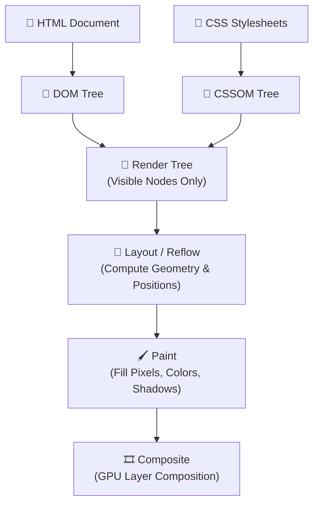

# 🎨 CSS3 & Modern Styling Interview Preparation & Master Roadmap

## 🏛️ CSS Rendering Pipeline & Box Model Architecture

### 🏗️ Critical Rendering Path (CRP)


---

## 📑 Phase 1: CSS Box Model & Formatting Contexts

### Module 1: Box Model & Block Formatting Context (BFC)
- [x] **Standard vs Border-Box Model**
  - **Standard (`box-sizing: content-box`)**: `Total Width = width + padding + border`.
  - **Alternative (`box-sizing: border-box`)**: `Total Width = specified width` (padding and border are absorbed inside width). Standard modern reset.
- [x] **Margin Collapse**
  - Top and bottom margins of adjacent block boxes combine into a single margin equal to the largest of the two.
  - *Fixes:* Add padding/border to parent, or use Flexbox/Grid layouts, or establish a Block Formatting Context (BFC).
- [x] **Block Formatting Context (BFC)**
  - A self-contained layout region where block boxes are laid out independently.
  - **Triggers for BFC**: `display: flow-root` (modern clean trigger), `overflow: hidden` / `auto`, `position: absolute` / `fixed`, `display: flex` / `grid`, `float: left` / `right`.
  - **Benefits**: Clears floats automatically, prevents margin collapsing with parent/siblings.

### Module 1.1: Positioning & Stacking Context (`z-index`)
- [x] **CSS Positioning Types**
  - `static`: Default document flow positioning. `z-index` has no effect.
  - `relative`: Positioned relative to its normal position. Takes up space in document flow.
  - `absolute`: Removed from flow. Positioned relative to nearest positioned ancestor (`non-static`).
  - `fixed`: Removed from flow. Positioned relative to the browser viewport.
  - `sticky`: Toggles between `relative` and `fixed` depending on scroll position.
- [x] **Stacking Context & `z-index`**
  - A 3D conceptual layering of elements along the Z-axis.
  - Created by root element (`<html>`), `position` with `z-index != auto`, `opacity < 1`, `transform != none`, `flex`/`grid` item with `z-index`, or `isolation: isolate`.
  - *Pitfall:* A high `z-index` inside a lower parent stacking context will NOT appear above elements in a higher parent stacking context.

---

## ⚡ Phase 2: Flexbox vs CSS Grid (Deep Dive)

### Module 2: Flexbox (1D Layouts)
- [x] **Axis Rules**: Main Axis (`flex-direction: row` | `column`) vs Cross Axis.
- [x] **Container Properties**: `justify-content` (main axis alignment), `align-items` (cross axis alignment), `flex-wrap`.
- [x] **Child Properties**:
  - `flex-grow`: Ability for flex item to grow if extra space exists.
  - `flex-shrink`: Ability for flex item to shrink if space is insufficient.
  - `flex-basis`: Default size before remaining space is distributed (`flex: 1 1 auto`).

### Module 3: CSS Grid (2D Layouts)
- [x] **Grid Responsive Layouts without Media Queries**
  - `grid-template-columns: repeat(auto-fit, minmax(250px, 1fr));`
  - **`auto-fit` vs `auto-fill`**:
    - `auto-fill`: Fills row with as many tracks as can fit, leaving empty tracks unfilled.
    - `auto-fit`: Fits existing tracks into row, stretching filled tracks to consume 100% space.
- [x] **CSS Subgrid**: `grid-template-columns: subgrid;` allows nested grid items to align directly with the parent grid lines.

---

## 🎯 Phase 3: Specificity, Performance & Modern CSS Features

### Module 4: Specificity Hierarchy
- [x] **Calculation Weight (a, b, c, d)**:
  1. `a`: Inline Styles (`style=""`) $\rightarrow$ Weight: **1000**
  2. `b`: ID Selectors (`#header`) $\rightarrow$ Weight: **100**
  3. `c`: Classes, Attributes, Pseudo-classes (`.btn`, `[type="text"]`, `:hover`) $\rightarrow$ Weight: **10**
  4. `d`: Elements & Pseudo-elements (`div`, `p`, `::before`) $\rightarrow$ Weight: **1**
  *Rule:* `!important` overrides all specificity calculations.

### Module 4.1: Modern CSS (Container Queries, `:has`, `@layer`)
- [x] **Container Queries (`@container`)**: Styles elements based on the **size of a container element** rather than the full viewport.
  ```css
  .card-container { container-type: inline-size; }
  @container (min-width: 400px) {
    .card { display: flex; }
  }
  ```
- [x] **Parent Selector (`:has()`)**: Selects a parent based on its children!
  - Example: `card:has(img)` styles card only if it contains an ``.
- [x] **Cascade Layers (`@layer`)**: Explicitly controls CSS specificity priority regardless of selector weight.
  - Example: `@layer reset, base, components, utilities;`

### Module 5: Performance & Reflow vs Repaint
- [x] **Reflow (Layout)**: Recalculates position and dimensions of elements. Expensive. Triggered by changing `width`, `height`, `font-size`, `margin`, DOM manipulations.
- [x] **Repaint**: Redraws pixels on screen without changing geometry. Triggered by changing `color`, `background-color`, `visibility`.
- [x] **Composite (GPU Accelerated)**: Fastest. Handles `transform` (`translate3d`, `scale`) and `opacity` directly on GPU layers without triggering Reflow or Repaint.
- [x] **Layout Thrashing**: Occurs when JS rapidly reads and writes DOM geometric properties (`offsetHeight`, `clientWidth`) in a tight loop, forcing synchronous repeated Reflows.

---

## 🎯 Top CSS Interview Q&A Cheatsheet (Expanded)

### Q1: How do you center a `div` horizontally and vertically?
**Modern Flexbox Method:**
```css
.parent {
  display: flex;
  justify-content: center;
  align-items: center;
}
```
**Modern Grid Method:**
```css
.parent {
  display: grid;
  place-items: center;
}
```

### Q2: What is the difference between `display: none` and `visibility: hidden`?
- `display: none`: Removes element entirely from document layout flow. Takes up 0 space and triggers **Reflow**.
- `visibility: hidden`: Hides element visually, but element **still occupies space** in document layout flow. Triggers **Repaint** only.

### Q3: What is BEM methodology?
BEM stands for **Block Element Modifier**. It is a CSS naming convention that prevents class name collisions:
- `Block`: `.card`
- `Element`: `.card__title`
- `Modifier`: `.card__title--large`

### Q4: What is a Block Formatting Context (BFC) and how do you create one?
A BFC is an isolated layout boundary inside which elements are rendered independently. Creating a BFC (e.g. via `display: flow-root` or `overflow: hidden`) prevents margin collapsing with child elements and automatically encloses floating elements.

### Q5: What is the difference between `auto-fit` and `auto-fill` in CSS Grid?
When grid items don't fill a whole row, `auto-fill` keeps empty grid tracks in place, whereas `auto-fit` collapses empty tracks to zero width and stretches visible grid items to occupy the full container width.

### Q6: How does the CSS `:has()` pseudo-class work?
`:has()` acts as a parent/previous-sibling selector. It tests whether a target element contains or is followed by elements matching a selector. Example: `form:has(:invalid) button[type="submit"] { opacity: 0.5; }`.

### Q7: What are Cascade Layers (`@layer`) in CSS?
`@layer` allows developers to define explicit cascade ordering for groups of styles. Styles in higher-priority layers (e.g., `@layer components`) will always override styles in lower-priority layers (e.g., `@layer base`), regardless of CSS selector specificity.

### Q8: What is Layout Thrashing and how do you avoid it?
Layout Thrashing happens when JavaScript reads geometric properties (e.g., `element.offsetHeight`) right after mutating style properties, forcing the browser to perform a synchronous Reflow. Avoid it by batching DOM reads first, then batching DOM writes, or using `requestAnimationFrame`.
