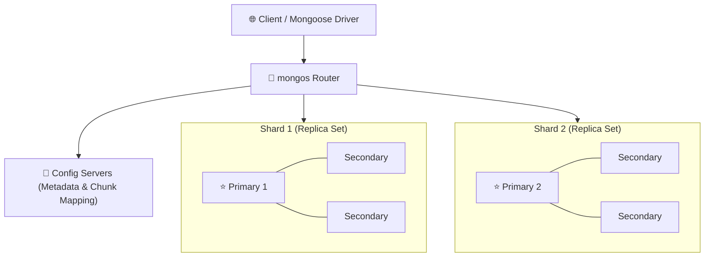
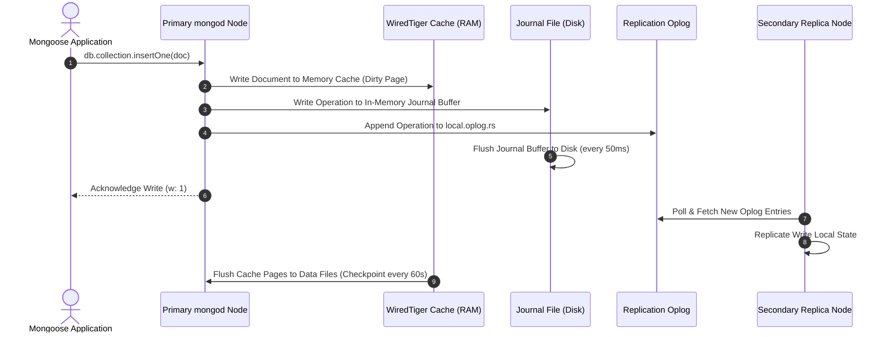

# 🍃 MongoDB & NoSQL Master Roadmap & Learning Progress Tracker

## 🏛️ MongoDB Architecture & Execution Engine

### 🏗️ MongoDB Replica Set & Sharded Cluster Architecture


### 🔄 Write Operations & WiredTiger Journaling Sequence


---

## 📑 Phase 1: NoSQL Core & Schema Architecture

### Module 1: Introduction to NoSQL & MongoDB
- [x] **NoSQL Database Overview**
  - Distributed, non-relational databases built for dynamic schemas and horizontal scaling.
- [x] **RDBMS vs NoSQL**
  - RDBMS uses rigid tabular schemas and SQL JOINs; NoSQL uses flexible document models.
- [x] **CAP Theorem (Consistency, Availability, Partition Tolerance)**
  - Distributed system trade-offs; MongoDB operates as a CP system by default (Consistency & Partition tolerance).
- [x] **Document Store Model**
  - Storing semi-structured data as self-contained JSON/BSON document objects.
- [x] **MongoDB Shell (`mongosh`)**
  - Interactive admin shell for running database queries, administrative commands, and scripts.

### Module 2: BSON & Document Structure
- [x] **JSON vs BSON**
  - BSON (Binary JSON) adds data types (`Date`, `ObjectId`, `Decimal128`, `BinData`) and byte-length prefixes for fast scanning.
- [x] **`ObjectId` 12-Byte Hex Anatomy**
  - 4-byte timestamp (creation time), 5-byte random value (machine/process ID), 3-byte incrementing counter.
- [x] **The 16MB Document Limit**
  - Hard limit on single BSON document size to prevent RAM buffer pool exhaustion.

### Module 3: Schema Design & Data Modeling Patterns
- [x] **Embedding (Denormalization)**
  - Storing nested sub-documents inside a single document for 1-to-1 or 1-to-Few relationships.
  - Delivers fast read performance by retrieving all related data in a single disk seek.
- [x] **Referencing (Normalization)**
  - Storing `ObjectId` references pointing to documents in separate collections.
  - Preferred for 1-to-Many (unbounded arrays) and Many-to-Many relationships.
- [x] **Schema Design Patterns**
  - Bucket Pattern (grouping time-series metrics), Subset Pattern (caching frequent data), Outlier Pattern.
- [x] **Schema Validation (`$jsonSchema`)**
  - Enforcing document structure rules, required fields, and data types at database collection level.

### Module 4: Drivers & Connection Management
- [x] **Connection URI & Options**
  - Connecting via `mongodb://` connection string with pool size (`maxPoolSize`) options.
- [x] **Connection Pool Management**
  - Reusing pre-created database connections across application server requests.

---

## ⚡ Phase 2: CRUD Operations & Query Operators

### Module 5: CRUD Operations - Insert & Read
- [x] **Insert Operations (`insertOne()`, `insertMany()`)**
  - Inserting single or multiple documents into a target collection.
- [x] **Read Operations (`find()`, `findOne()`)**
  - Querying documents using field equality and filter criteria.
- [x] **Projection (`find({}, { field: 1 })`)**
  - Including or excluding specific fields from returned result sets.
- [x] **Pagination & Sorting (`skip()`, `limit()`, `sort()`)**
  - Sorting and paginating query results.
  - *Best Practice:* Use range-based pagination (`_id > lastId`) over large `skip()` offsets.

### Module 6: CRUD Operations - Update & Delete
- [x] **Update Operators (`$set`, `$unset`, `$inc`, `$rename`)**
  - Modifying field values, removing attributes, incrementing numbers atomically.
- [x] **Array Update Operators (`$push`, `$pull`, `$addToSet`, `$pop`)**
  - Appending items, removing elements, or enforcing unique array values.
- [x] **Delete Operations (`deleteOne()`, `deleteMany()`)**
  - Removing matching documents from a collection.

### Module 7: Advanced Query Operators
- [x] **Comparison & Logical Operators**
  - `$gt`, `$gte`, `$lt`, `$lte`, `$in`, `$nin`, `$and`, `$or`, `$nor`, `$not`.
- [x] **Array Query Operators (`$elemMatch`, `$all`, `$size`)**
  - `$elemMatch` matches documents where an array element satisfies *all* specified criteria.
- [x] **Full-Text Search (`$text`, `$search`)**
  - Performing text searches across fields indexed with Text Indexes.

---

## 🛠️ Phase 3: Aggregation Pipeline & Analytics

### Module 8: Aggregation Pipeline Fundamentals
- [x] **Aggregation Pipeline Concept**
  - Data processing framework where documents pass through a sequence of transformation stages.
- [x] **`$match` Stage**
  - Filters input documents using standard query criteria (must be placed first for index usage!).
- [x] **`$group` Stage & Accumulators**
  - Grouping documents by `_id` key and calculating `$sum`, `$avg`, `$min`, `$max`, `$push`.
- [x] **`$project` Stage**
  - Reshaping documents, adding computed fields, or renaming attributes.

### Module 9: Advanced Aggregation Pipeline Stages
- [x] **`$unwind` Stage**
  - Deconstructing an array field to output a document for *each* array element.
- [x] **`$lookup` Stage**
  - Performing a left outer join to an unsharded collection in the same database.
- [x] **`$facet` Stage**
  - Running multiple aggregation pipelines concurrently over the same input document set.
- [x] **`$graphLookup` Stage**
  - Performing recursive graph search traversals on collections.

---

## ⚙️ Phase 4: Indexing & Storage Engine Internals

### Module 10: Indexing Architecture & B-Trees
- [x] **B-Tree Index Structure**
  - Self-balancing tree data structure facilitating fast $O(\log N)$ document lookups.
- [x] **Single Field & Compound Indexes**
  - Indexing single fields or multi-field combinations.
- [x] **The ESR Rule for Compound Indexes**
  - Order fields by **E**quality first, **S**ort second, and **R**ange last to maximize index utilization.

### Module 11: Specialized Index Types
- [x] **Multikey Indexes**
  - Indexing array fields by creating index keys for every single element in the array.
- [x] **TTL (Time-To-Live) Indexes**
  - Automatically deleting documents after specified seconds (ideal for session cleanup).
- [x] **Partial & Sparse Indexes**
  - Partial indexes index only documents matching a filter expression; Sparse indexes skip missing fields.
- [x] **Geospatial Indexes (`2dsphere`)**
  - Indexing GeoJSON points and shapes for proximity queries (`$near`, `$geoWithin`).

### Module 12: Index Performance & Query Optimization
- [x] **Execution Diagnostics (`explain('executionStats')`)**
  - Inspecting query execution plans: `IXSCAN` (Index Scan) vs `COLLSCAN` (Collection Scan).
- [x] **Covered Queries**
  - Queries where all requested fields are satisfied directly from the index without reading documents.

### Module 13: WiredTiger Storage Engine
- [x] **Document-Level Concurrency**
  - Optimistic concurrency control allowing multiple write operations on different documents concurrently.
- [x] **In-Memory Cache & Checkpointing**
  - Flushes dirty cache pages to disk data files during checkpoints (every 60s).
- [x] **Journaling**
  - Flushes write operations to an in-memory journal buffer written to disk every 50ms for crash recovery.

---

## 🚀 Phase 5: High Availability, Transactions, Scaling & Mongoose

### Module 14: Replica Sets & High Availability
- [x] **Replica Set Architecture**
  - High availability group comprising 1 Primary node and multiple Secondary nodes.
- [x] **Replication Oplog (`local.oplog.rs`)**
  - Capped collection recording all Primary write operations for Secondary replication.
- [x] **Primary Election Algorithm**
  - Heartbeat-based voting mechanism electing a new Primary automatically upon failure.

### Module 15: Write Concern & Read Preference
- [x] **Write Concern (`w`)**
  - `w: 1` (Primary acknowledged), `w: "majority"` (acknowledged after written to majority of nodes).
- [x] **Read Preference**
  - Routing read queries (`primary`, `primaryPreferred`, `secondary`, `nearest`).

### Module 16: Multi-Document ACID Transactions
- [x] **ACID Transactions (v4.0+)**
  - Executing atomic operations across multiple documents/collections using sessions (`session.startTransaction()`).

### Module 17: Database Sharding & Horizontal Scaling
- [x] **Sharding Architecture**
  - `mongos` query router, Config Servers (chunk metadata), and Shard Replica Sets.
- [x] **Shard Key Selection**
  - Selecting high-cardinality shard keys to distribute reads/writes evenly without hot-spotting.

### Module 18: Security & Access Control
- [x] **Authentication & RBAC**
  - SCRAM authentication and Role-Based Access Control restricting database object permissions.

### Module 19: Administration & Backups
- [x] **`mongodump` & `mongorestore`**
  - Binary database backup and restoration tools.

### Module 20: Mongoose ORM Deep Dive
- [x] **Mongoose Schemas, Hooks & Virtuals**
  - Defining schemas, `pre('save')` hooks (password hashing), virtual properties, and `.populate()`.

---

## 🛠️ Phase 6: Practical MongoDB Code Snippets & Queries

### 1. Complex Aggregation Pipeline (`$lookup` Join + `$unwind` + `$group`)
```javascript
db.orders.aggregate([
  { $match: { status: "completed" } },
  { $unwind: "$items" },
  { $lookup: {
      from: "products",
      localField: "items.productId",
      foreignField: "_id",
      as: "productDetails"
    }
  },
  { $group: {
      _id: "$items.category",
      totalRevenue: { $sum: { $multiply: ["$items.price", "$items.quantity"] } },
      itemCount: { $sum: 1 }
    }
  },
  { $sort: { totalRevenue: -1 } }
]);
```

### 2. Multi-Document ACID Transaction in Mongoose
```javascript
const session = await mongoose.startSession();
session.startTransaction();

try {
  await Account.updateOne({ _id: fromAccountId }, { $inc: { balance: -100 } }, { session });
  await Account.updateOne({ _id: toAccountId }, { $inc: { balance: 100 } }, { session });
  
  await session.commitTransaction();
  console.log("Transaction committed successfully");
} catch (error) {
  await session.abortTransaction();
  console.error("Transaction aborted due to error:", error);
} finally {
  session.endSession();
}
```

---

## 🎯 Top MongoDB Senior Interview Q&A Cheatsheet (Master List)

### Q1: When should you Embed documents versus Reference documents in MongoDB?
Embed when data is accessed together, 1-to-1, or 1-to-Few (bounded arrays < 16MB document limit). Reference when data is accessed independently, 1-to-Many (unbounded), or Many-to-Many to avoid duplicate data and document size overflow.

### Q2: How does `$unwind` work in the Aggregation Pipeline?
`$unwind` takes an array field from an input document and outputs a separate document for *every single item* in that array, duplicating the parent fields. Required before performing aggregate math (`$group`, `$sum`) on individual array elements.

### Q3: What is the ESR Rule for Compound Indexes?
ESR stands for **Equality, Sort, Range**. Place fields checked for exact equality (`status: "active"`) first, fields used for sorting (`createdAt: -1`) second, and fields used for range queries (`age: { $gte: 18 }`) last to maximize index efficiency.

### Q4: How does WiredTiger handle concurrency in MongoDB?
WiredTiger uses optimistic document-level concurrency control. Instead of locking whole collections or databases, multiple threads can modify different documents in the same collection simultaneously without blocking reads.

### Q5: What is Write Concern (`w: "majority"`) in Replica Sets?
Write Concern defines the guarantee level before MongoDB acknowledges a write. `w: "majority"` means the Primary node waits until the write operation has been written to the Oplog of a majority of replica set nodes, preventing data loss if the Primary crashes.
