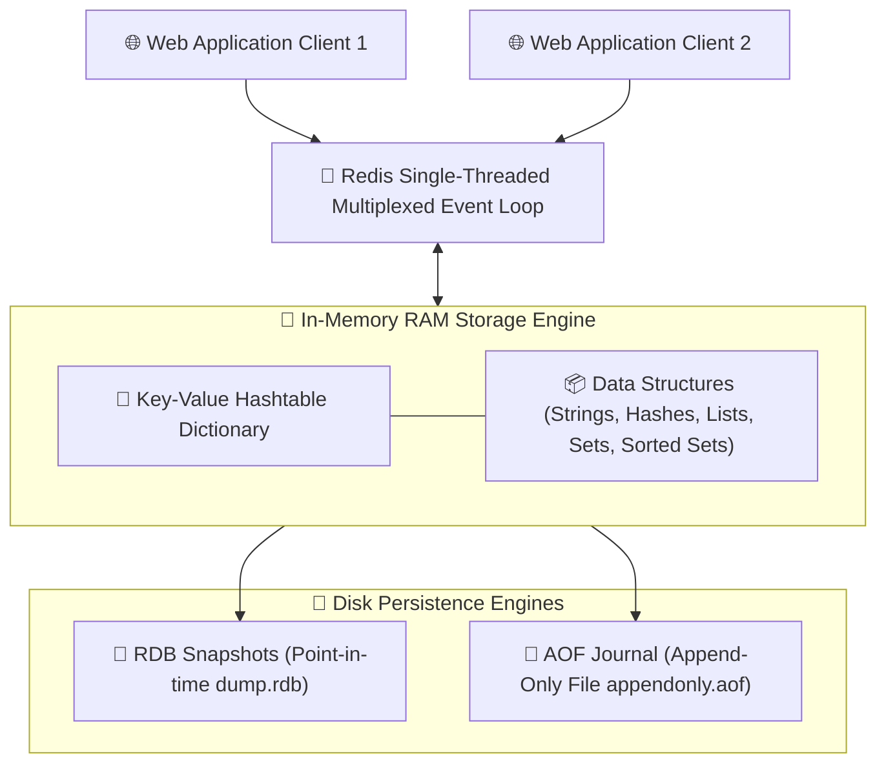
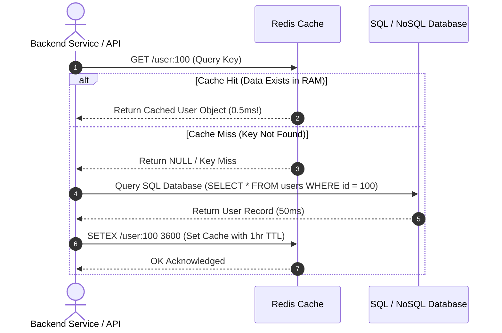

# 🔴 Redis In-Memory Datastore Master Roadmap & Learning Progress Tracker

## 🏛️ Redis Architecture & Memory Engine

### 🏗️ Redis In-Memory Single-Threaded Architecture


### 🔄 Cache-Aside Pattern Sequence Diagram


---

## 📑 Phase 1: Redis Architecture & Data Structures

### Module 1: Introduction & Single-Threaded Engine
- [x] **What is Redis?**
  - Open-source, in-memory data structure store used as a database, cache, streaming engine, and message broker.
- [x] **Single-Threaded Multiplexed Event Loop**
  - Executes operations on a single main thread using I/O multiplexing (epoll/kqueue).
  - Eliminates thread context-switching overhead and race conditions while achieving $> 100,000$ ops/sec.

### Module 2: The 5 Core Data Structures
- [x] **Strings**: Standard binary-safe key-value pairs (max 512MB). Used for caching, counters (`INCR`), and bitfields.
- [x] **Hashes**: Field-value maps representing objects (`HSET user:100 name "Siva" age 30`).
- [x] **Lists**: Linked lists of strings (`LPUSH`, `RPOP`). Used for queues and activity feeds.
- [x] **Sets**: Unordered collections of unique strings (`SADD`, `SINTER`). Used for tags and mutual friends.
- [x] **Sorted Sets (ZSets)**: Unique strings ordered by floating-point **scores** (`ZADD`, `ZRANGE`). Used for leaderboards and rate limiters!

---

## ⚡ Phase 2: Persistence, Eviction & Cache Strategies

### Module 3: Redis Persistence (RDB vs AOF)
- [x] **RDB (Redis Database Snapshots)**
  - Point-in-time binary snapshots saved to disk (`dump.rdb`) at specified intervals. Extremely fast restarts, slight data loss risk on crash.
- [x] **AOF (Append-Only File)**
  - Logs every write operation to disk (`appendonly.aof`). High durability (`fsync everysec`), larger file size.

### Module 4: Maxmemory & Key Eviction Policies
- [x] **Eviction Policies (`maxmemory-policy`)**
  - **`volatile-lru` / `allkeys-lru`**: Least Recently Used (removes keys not accessed recently).
  - **`volatile-lfu` / `allkeys-lfu`**: Least Frequently Used (removes keys accessed least often).
  - **`noeviction`**: Returns out-of-memory error on write operations when memory limit is reached.

### Module 5: Caching Strategies & Pitfalls
- [x] **Cache-Aside Pattern**: App checks cache first; on miss, reads DB and populates cache.
- [x] **Cache Stampede (Thundering Herd)**: Multiple clients simultaneously query DB on key expiration. Resolved via Mutex Locks or Probabilistic Early Expiration.
- [x] **Cache Penetration**: Querying non-existent keys continuously to hit DB. Resolved via **Bloom Filters** or caching empty `NULL` values with short TTL.

---

## 🛠️ Phase 3: High Availability, Pub/Sub & Cluster

### Module 6: Redis Sentinel & Replication
- [x] **Primary-Replica Replication**: Asynchronous replication from Master to Replicas.
- [x] **Redis Sentinel**: High-availability monitoring system detecting Master failures and promoting Replicas automatically.

### Module 7: Redis Cluster & Sharding
- [x] **Redis Cluster (16,384 Hash Slots)**
  - Distributed cluster partitioning keys automatically across nodes using `CRC16(key) % 16384`.

### Module 8: Pub/Sub & Streams
- [x] **Pub/Sub Messaging**: Fire-and-forget message publishing (`PUBLISH`, `SUBSCRIBE`).
- [x] **Redis Streams (`XADD`, `XREADGROUP`)**: Persistent, consumer-grouped message log stream engine (Kafka-lite).

---

## 🛠️ Phase 4: Practical Redis Code Snippets

### 1. Redis Rate Limiter using Sorted Sets (Sliding Window Algorithm)
```javascript
import Redis from 'ioredis';
const redis = new Redis();

async function isRateLimited(userId, limit = 5, windowInSeconds = 60) {
  const key = `ratelimit:${userId}`;
  const now = Date.now();
  const clearBefore = now - windowInSeconds * 1000;

  const multi = redis.multi();
  multi.zremrangebyscore(key, 0, clearBefore); // Remove old entries outside window
  multi.zadd(key, now, now.toString());       // Add current timestamp
  multi.zcard(key);                           // Count requests in window
  multi.expire(key, windowInSeconds);

  const results = await multi.exec();
  const requestCount = results[2][1];

  return requestCount > limit;
}
```

---

## 🎯 Top Redis Senior Interview Q&A Cheatsheet (Master List)

### Q1: Why is Redis single-threaded yet capable of executing 100,000+ operations per second?
Redis operates entirely in-memory (RAM), avoiding disk I/O bottlenecks. Its single-threaded main engine uses non-blocking I/O multiplexing (`epoll`), eliminating CPU context-switching, thread synchronization locks, and race condition overhead.

### Q2: What is the difference between RDB and AOF persistence in Redis?
RDB creates compact point-in-time binary snapshots (`dump.rdb`) at configured intervals (fast loading, risk of losing last few minutes of data). AOF logs every write command to a journal (`appendonly.aof`) with high durability (`fsync` every second), but results in larger files and slower recovery times.

### Q3: How does the Cache-Aside pattern work and how do you prevent Cache Stampede?
In Cache-Aside, the app checks Redis first; on cache miss, it reads from the SQL DB and writes the data to Redis with a TTL. Cache Stampede (many clients hitting the DB simultaneously when a popular key expires) is prevented by acquiring a distributed lock (Redlock) or setting random TTL jitter.

### Q4: How does Redis Cluster partition data across nodes?
Redis Cluster uses **16,384 Hash Slots**. Every key is mapped to a slot via `CRC16(key) % 16384`. Slots are distributed among cluster nodes, allowing horizontal scaling and automatic failover without requiring a centralized proxy.
