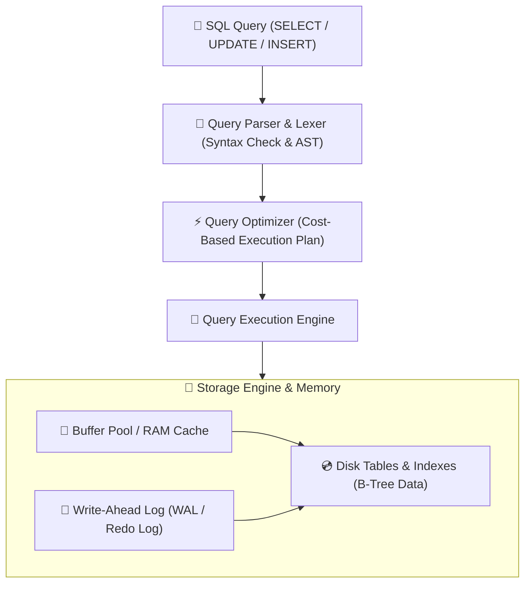
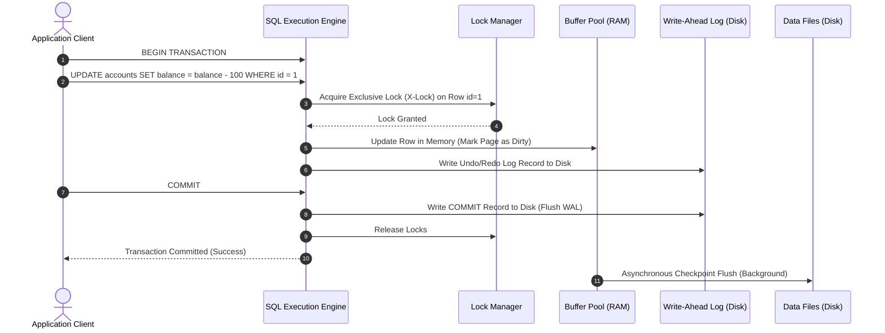

# 🗄️ SQL & Database Architecture Learning Roadmap & Progress Tracker

## 🏛️ Database Engine & Query Execution Architecture

### 🏗️ SQL Query Execution Architecture


### 🔄 Transaction Lifecycle & Lock Management


---

## 📑 Phase 1: Database Fundamentals & Sub-Languages

### Module 1: Database Concepts & Sub-Languages
- [x] **DDL (Data Definition Language)**
  - Statements (`CREATE`, `ALTER`, `DROP`, `TRUNCATE`) that define and modify database schemas.
  - Manages table structures, indexes, views, and column data type definitions.
- [x] **DML (Data Manipulation Language)**
  - Statements (`SELECT`, `INSERT`, `UPDATE`, `DELETE`) used to retrieve and modify row data.
  - Forms the core day-to-day operations performed by application logic.
- [x] **DCL (Data Control Language)**
  - Statements (`GRANT`, `REVOKE`) managing user permissions and database access rights.
  - Controls security access to database objects for users and application roles.
- [x] **TCL (Transaction Control Language)**
  - Statements (`COMMIT`, `ROLLBACK`, `SAVEPOINT`) managing transactional boundaries.
  - Ensures data modifications are committed permanently or undone safely.
- [x] **Relational Model & Keys**
  - Primary Key (uniquely identifies rows), Foreign Key (enforces referential integrity), Unique Key.
  - Establishes relationships and data constraints across relational database tables.

### Module 2: Database Normalization
- [x] **1NF (First Normal Form)**
  - Enforces atomic values in every column and eliminates repeating groups/arrays.
  - Guarantees each cell contains a single scalar value.
- [x] **2NF (Second Normal Form)**
  - Requires 1NF compliance and eliminates partial functional dependencies.
  - Ensures every non-key column depends on the entire composite primary key.
- [x] **3NF (Third Normal Form)**
  - Requires 2NF compliance and eliminates transitive dependencies.
  - Ensures non-key columns depend *only* on the primary key, not on other non-key columns.
- [x] **BCNF (Boyce-Codd Normal Form)**
  - Strict variant of 3NF ensuring every determinant $X$ in a dependency $X \rightarrow Y$ is a super key.
  - Handles complex overlapping candidate keys.
- [x] **Denormalization**
  - Intentionally introducing redundancy into normalized schemas to reduce expensive `JOIN` operations.
  - Improves read query throughput at the expense of storage and write complexity.

---

## ⚡ Phase 2: Querying, Joins & Aggregations

### Module 3: Basic & Advanced Joins
- [x] **INNER JOIN**
  - Returns only matching records existing in both left and right joined tables.
  - Filters out unmatched rows from both participating tables.
- [x] **LEFT (OUTER) JOIN**
  - Returns all records from the left table and matching records from the right table.
  - Fills right-side columns with `NULL` when no matching record exists.
- [x] **RIGHT (OUTER) JOIN**
  - Returns all records from the right table and matching records from the left table.
  - Fills left-side columns with `NULL` when no match is found.
- [x] **FULL OUTER JOIN**
  - Returns all records when there is a match in either left or right table.
  - Retains unmatched rows from both sides, populating missing values with `NULL`.
- [x] **CROSS JOIN**
  - Produces the Cartesian product of two tables ($M \times N$ total rows).
  - Joins every row of the left table with every row of the right table.
- [x] **SELF JOIN**
  - Joins a table with itself using table aliases to query hierarchical data.
  - Commonly used for employee-manager or organizational hierarchy trees.

### Module 4: Filtering, Grouping & Aggregations
- [x] **`WHERE` Clause**
  - Filters individual rows **before** any grouping or aggregation takes place.
  - Evaluates row-level boolean conditions to reduce processed dataset size.
- [x] **`GROUP BY` Clause**
  - Collapses rows sharing identical values across specified columns into summary rows.
  - Required when evaluating aggregate calculations over subsets of data.
- [x] **`HAVING` Clause**
  - Filters aggregated groups **after** the `GROUP BY` clause has been computed.
  - Evaluates conditions on aggregate function values (`HAVING COUNT(*) > 5`).
- [x] **Aggregate Functions**
  - Built-in functions (`COUNT`, `SUM`, `AVG`, `MIN`, `MAX`) computing a single result over a row set.
  - Ignores `NULL` values during calculations (except `COUNT(*)`).

---

## 🛠️ Phase 3: Advanced SQL & Performance Optimization

### Module 5: Subqueries & Set Operators
- [x] **Subqueries vs Correlated Subqueries**
  - Non-correlated subqueries execute once independently of the outer query.
  - Correlated subqueries execute repeatedly for each row evaluated by the outer query.
- [x] **`EXISTS` vs `IN`**
  - `EXISTS` checks row presence in subquery and short-circuits on first match (fast for large sets).
  - `IN` loads the entire subquery result set into memory before evaluating matches.
- [x] **`UNION` vs `UNION ALL`**
  - `UNION` combines result sets and performs duplicate elimination via sorting/hashing.
  - `UNION ALL` combines result sets directly preserving duplicates (significantly faster).

### Module 6: Window Functions & CTEs
- [x] **Common Table Expressions (CTEs)**
  - Named temporary result set defined using `WITH` clause to improve query readability.
  - Can be referenced multiple times within the main `SELECT`, `INSERT`, or `UPDATE` statement.
- [x] **Recursive CTEs**
  - Self-referencing CTE executing iteratively to process hierarchical or graph data trees.
  - Useful for querying organizational structures, bill-of-materials, or category trees.
- [x] **`ROW_NUMBER()`**
  - Assigns a unique sequential integer to each row starting at 1 within a window partition.
  - Always generates unique numbers even when ordered values tie.
- [x] **`RANK()` vs `DENSE_RANK()`**
  - `RANK()` assigns tied ranks and skips subsequent rank numbers (e.g., 1, 2, 2, 4).
  - `DENSE_RANK()` assigns tied ranks without skipping numbers (e.g., 1, 2, 2, 3).
- [x] **Value Window Functions**
  - `LEAD()` accesses data from a subsequent row; `LAG()` accesses data from a prior row.
  - Enables period-over-period comparisons without performing expensive self-joins.

### Module 7: Built-in Functions & NULL Handling
- [x] **`COALESCE`**
  - Evaluates arguments in order and returns the first non-`NULL` value.
  - Essential for providing fallback values for missing data.
- [x] **`NULLIF`**
  - Accepts two expressions and returns `NULL` if they are equal, otherwise returns the first expression.
  - Used to prevent division-by-zero errors (`COALESCE(val / NULLIF(total, 0), 0)`).
- [x] **`CASE WHEN` Expressions**
  - Conditional logic statement evaluating conditions and returning specified values.
  - Enables inline row-level decision logic inside queries.

---

## ⚙️ Phase 4: Indexing, Transactions & Storage Engines

### Module 8: Indexing Architecture
- [x] **B-Tree Index**
  - Balanced tree data structure facilitating $O(\log N)$ search, insert, and delete operations.
  - Keeps data sorted to accelerate point lookups and range scans.
- [x] **Clustered Index**
  - Dictates the physical storage order of data rows on disk (only 1 per table).
  - Primary key creates the clustered index by default in engines like MySQL InnoDB.
- [x] **Non-Clustered Index**
  - Separate index structure storing indexed key values along with pointers (row IDs) to disk rows.
  - Multiple non-clustered indexes can exist per table.
- [x] **Covering Index**
  - Index containing all columns requested in a query's `SELECT`, `WHERE`, and `JOIN` clauses.
  - Enables index-only scans, bypassing disk table lookups entirely.
- [x] **SARGable Queries & Index Seek vs Scan**
  - **SARGable** (Search Argument Able): Queries allowing index usage (avoids wrapping columns in functions).
  - **Index Seek**: B-Tree traversal jumping directly to target rows ($O(\log N)$).
  - **Index Scan**: Reading all leaf pages of an index sequentially ($O(N)$).

### Module 9: Transactions & ACID Properties
- [x] **Atomicity**
  - Guarantees all statements within a transaction succeed together or all roll back completely.
  - Prevents partial updates from corrupting database state.
- [x] **Consistency**
  - Ensures transaction transitions database from one valid state to another valid state.
  - Enforces all schema constraints, foreign keys, and unique rules.
- [x] **Isolation**
  - Controls visibility of uncommitted changes between concurrent executing transactions.
  - Prevents concurrent transactions from interfering with each other's execution state.
- [x] **Durability**
  - Guarantees committed transaction changes persist permanently even during system crashes.
  - Implemented using Write-Ahead Logging (WAL) flushed to non-volatile disk storage.

### Module 10: Isolation Levels & Locking
- [x] **Read Phenomena**
  - **Dirty Read**: Reading uncommitted data modified by another concurrent transaction.
  - **Non-Repeatable Read**: Re-reading same row within transaction yields modified values.
  - **Phantom Read**: Re-running search query within transaction yields newly inserted rows.
- [x] **Isolation Levels**
  - `Read Uncommitted`: Lowest isolation; allows dirty reads.
  - `Read Committed`: Prevents dirty reads; allows non-repeatable reads.
  - `Repeatable Read`: Prevents dirty and non-repeatable reads; default in MySQL InnoDB.
  - `Serializable`: Highest isolation; locks queried ranges to prevent phantom reads.
- [x] **Locking & Deadlocks**
  - **Shared Lock (S-Lock)**: Read lock allowing concurrent readers.
  - **Exclusive Lock (X-Lock)**: Write lock preventing concurrent reads and writes.
  - **Pessimistic Locking**: `SELECT ... FOR UPDATE` locking target rows until transaction commit.
  - **Optimistic Locking**: Uses `version` integer column to verify no concurrent edit occurred before write.

---

## 🚀 Phase 5: Enterprise Database Architecture & Tuning

### Module 11: Query Performance Tuning
- [x] **`EXPLAIN ANALYZE`**
  - Diagnostic command outputting actual execution tree, node costs, row counts, and timings.
  - Used to identify slow table scans, temporary file spills, and un-indexed joins.
- [x] **Refactoring Cursors to Set-Based Queries**
  - Replacing imperative iterative row loops with declarative set-based SQL statements.
  - Drastically improves query throughput by leveraging vector database engines.

### Module 12: Partitioning & Sharding
- [x] **Vertical Partitioning**
  - Splitting table columns across separate tables to reduce row size and buffer pool overhead.
- [x] **Horizontal Partitioning**
  - Dividing table rows across sub-tables on the same database node based on range, hash, or list keys.
- [x] **Database Sharding**
  - Distributing horizontal table partitions across independent physical database server nodes.
  - Enables horizontal write scaling for web-scale applications.

### Module 13: Database Security & Access Control
- [x] **SQL Injection (SQLi) Prevention**
  - Vulnerability allowing malicious input to manipulate raw SQL statements.
  - Mitigated via Prepared Statements (Parameterized Queries) and ORMs.
- [x] **Role-Based Access Control (RBAC)**
  - Assigning granular permissions (`GRANT SELECT, INSERT ON employees TO app_user`).
  - Restricts application database accounts from executing dangerous DDL operations (`DROP`, `TRUNCATE`).

### Module 14: Schema Versioning & Migrations
- [x] **Flyway & Liquibase**
  - Database schema migration tools tracking database changes via versioned SQL scripts.
  - Guarantees automated, repeatable schema updates across development, staging, and production environments.

### Module 15: Modern Hybrid Features (JSONB & Full-Text)
- [x] **PostgreSQL `JSONB` Indexing**
  - Binary JSON format in relational databases enabling semi-structured document storage.
  - Indexed via GIN (Generalized Inverted Index) for high-performance sub-document querying.

---

## 🛠️ Phase 6: Practical SQL Code Query Snippets

### 1. N-th Highest Salary Query (Dense Rank & Window Functions)
```sql
WITH RankedSalaries AS (
    SELECT 
        employee_id,
        first_name,
        department_id,
        salary,
        DENSE_RANK() OVER (PARTITION BY department_id ORDER BY salary DESC) as salary_rank
    FROM employees
)
SELECT employee_id, first_name, department_id, salary
FROM RankedSalaries
WHERE salary_rank = 2; -- 2nd Highest Salary per Department
```

### 2. Period-over-Period Growth (LEAD / LAG)
```sql
SELECT 
    sales_date,
    total_amount,
    LAG(total_amount, 1) OVER (ORDER BY sales_date) as prev_day_amount,
    (total_amount - LAG(total_amount, 1) OVER (ORDER BY sales_date)) as daily_growth
FROM daily_sales;
```

---

## 🎯 Top SQL Interview Q&A Cheatsheet (Master List)

### Q1: What is the difference between `WHERE` and `HAVING`?
`WHERE` filters individual rows **before** aggregation (`GROUP BY`). `HAVING` filters aggregated groups **after** aggregation (`GROUP BY`).

### Q2: What is the difference between `DELETE` and `TRUNCATE`?
- `DELETE`: DML command, deletes rows one by one, logs each row deletion (can be rolled back), supports `WHERE` clause, preserves identity counter.
- `TRUNCATE`: DDL command, drops and recreates table pages instantly, minimal log overhead, faster, resets identity counter, does not support `WHERE`.

### Q3: What is the difference between `RANK()`, `DENSE_RANK()`, and `ROW_NUMBER()`?
For tied values: `ROW_NUMBER()` assigns sequential numbers (1, 2, 3, 4). `RANK()` assigns tied ranks and skips next numbers (1, 2, 2, 4). `DENSE_RANK()` assigns tied ranks without skipping (1, 2, 2, 3).

### Q4: What are SARGable queries and why are functions in `WHERE` clauses dangerous?
SARGable (Search Argument Able) queries allow the database to use an index lookup. Wrapping an indexed column inside a function (e.g. `WHERE LOWER(email) = 'test'`) prevents index usage and forces a slow full table scan.

### Q5: What is the difference between Optimistic and Pessimistic Locking?
Pessimistic locking uses database locks (`SELECT FOR UPDATE`) to prevent other transactions from accessing data until completed. Optimistic locking does not lock rows during read; instead, it checks a `version` column during write to ensure no concurrent modification occurred.

### Q6: What is the difference between `EXISTS` and `IN`?
`EXISTS` checks for row existence in a subquery and short-circuits as soon as a match is found (efficient for large subqueries). `IN` executes the subquery fully and returns a distinct list of values into memory before comparing.

### Q7: Why is `UNION ALL` faster than `UNION`?
`UNION ALL` concatenates two result sets directly without checking for duplicates. `UNION` performs an explicit sort/hash operation across all returned rows to eliminate duplicate rows, making it significantly slower.

### Q8: What is the difference between Index Seek and Index Scan?
Index Seek uses the B-Tree structure to jump directly to target keys ($O(\log N)$). Index Scan reads all leaf pages of an index sequentially ($O(N)$), typically occurring when queries lack selective predicates or index column alignment.

