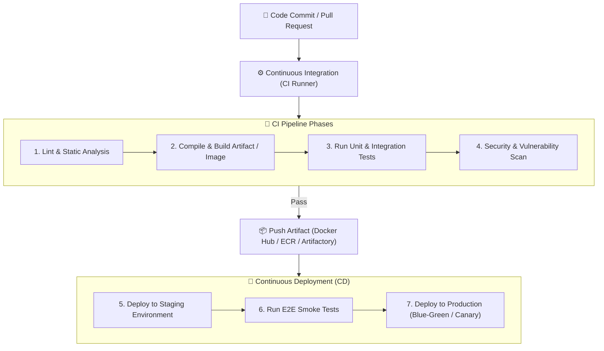
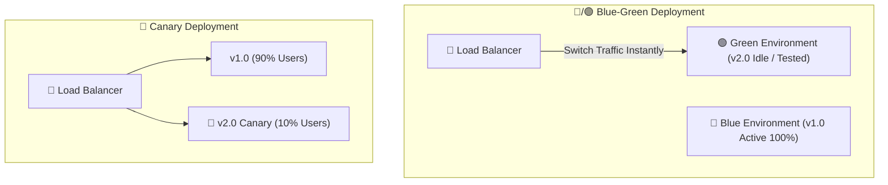

# 🚀 CI/CD & DevOps Automation Master Roadmap & Learning Progress Tracker

## 🏛️ CI/CD Pipeline Architecture & Deployment Strategies

### 🏗️ Continuous Integration & Delivery Pipeline


### 🔄 Deployment Strategies (Blue-Green vs Canary)


---

## 📑 Phase 1: CI/CD Fundamentals & Pipeline Automation

### Module 1: CI vs CD vs CD
- [x] **Continuous Integration (CI)**
  - Practice of frequently merging code changes into a central repository, triggering automated builds and test suites.
  - Detects integration bugs early and ensures main branch is always healthy.
- [x] **Continuous Delivery (CD)**
  - Automates release process up to staging; production deployment is triggered via manual approval.
- [x] **Continuous Deployment (CD)**
  - Fully automated pipeline where passing code is deployed directly to production without human intervention.

---

## ⚡ Phase 2: Pipeline Platforms & Automation Tools

### Module 2: GitHub Actions & Pipeline Runners
- [x] **GitHub Actions Workflow Syntax (`.github/workflows/ci.yml`)**
  - Triggers (`on: [push, pull_request]`), Jobs, Steps, Runners (`runs-on: ubuntu-latest`), Actions (`uses: actions/checkout@v3`).
- [x] **Matrix Builds & Environment Secrets**
  - Running parallel tests across Node/Python/Java versions using `strategy: matrix`.
  - Injecting encrypted secrets (`${{ secrets.AWS_ACCESS_KEY_ID }}`).

### Module 3: GitLab CI / Jenkins
- [x] **GitLab CI (`.gitlab-ci.yml`)**: Stages, Jobs, Artifacts, GitLab Runners.
- [x] **Jenkins**: Jenkinsfile (Declarative vs Scripted pipelines), Plugins, Agent nodes.

---

## 🛡️ Phase 3: Deployment Strategies & Infrastructure

### Module 4: Production Deployment Strategies
- [x] **Rolling Updates**: Gradually replaces old instances with new ones step-by-step (zero downtime, moderate risk).
- [x] **Blue-Green Deployment**: Maintains 2 identical environments; switches Load Balancer traffic instantly from Blue to Green.
- [x] **Canary Deployment**: Routes 5-10% of user traffic to new version to monitor metrics before full rollout.
- [x] **Feature Flags**: Decouples code deployment from feature release; toggles features dynamically via config.

---

## 🛠️ Phase 4: Practical Configuration Snippets

### 1. GitHub Actions CI/CD Pipeline (`.github/workflows/deploy.yml`)
```yaml
name: CI/CD Production Pipeline

on:
  push:
    branches: [ main ]

jobs:
  build-and-test:
    runs-on: ubuntu-latest

    steps:
      - name: Checkout Repository
        uses: actions/checkout@v4

      - name: Setup Node.js Environment
        uses: actions/setup-node@v4
        with:
          node-version: '20'
          cache: 'npm'

      - name: Install Dependencies
        run: npm ci

      - name: Run Linter & Tests
        run: |
          npm run lint
          npm run test -- --coverage

      - name: Log in to Docker Hub
        uses: docker/login-action@v3
        with:
          username: ${{ secrets.DOCKER_USERNAME }}
          password: ${{ secrets.DOCKER_PASSWORD }}

      - name: Build and Push Docker Image
        uses: docker/build-push-action@v5
        with:
          context: .
          push: true
          tags: ${{ secrets.DOCKER_USERNAME }}/myapp:latest
```

---

## 🎯 Top CI/CD Interview Q&A Cheatsheet (Master List)

### Q1: What is the difference between Continuous Integration, Continuous Delivery, and Continuous Deployment?
Continuous Integration (CI) automatically builds and tests every code commit. Continuous Delivery (CD) automates release artifact creation so code is ready for deployment at any time with a manual trigger. Continuous Deployment automatically deploys passing artifacts directly to production without human intervention.

### Q2: What is Blue-Green Deployment vs Canary Deployment?
Blue-Green maintains two identical physical environments (Blue active, Green idle). New code is deployed to Green, tested, and traffic is switched 100% instantly via Load Balancer. Canary deployment gradually routes a small percentage (e.g. 5%) of live user traffic to the new version to monitor metrics before rolling out to 100%.

### Q3: Why is `npm ci` preferred over `npm install` inside a CI pipeline?
`npm ci` enforces deterministic builds by installing dependencies strictly from `package-lock.json` without updating it. If `package-lock.json` is missing or out of sync with `package.json`, `npm ci` fails immediately, preventing un-vetted dependency updates in production builds.

### Q4: How do Feature Flags improve deployment safety?
Feature Flags separate code deployment from feature exposure. Developers can deploy new code safely to production in a disabled state, then enable the feature dynamically via configuration for specific users or regions without re-deploying code.

### Q5: How do you handle rollback in a CI/CD pipeline if a production deployment fails?
With Blue-Green deployments, switch Load Balancer traffic back to Blue immediately. With Kubernetes / GitOps (ArgoCD), run `kubectl rollout undo` or revert the Git commit to trigger the CI/CD pipeline to rebuild and deploy the previous known good state.
