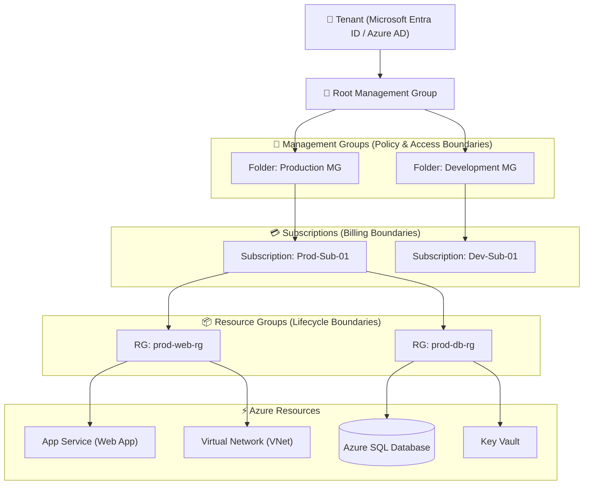
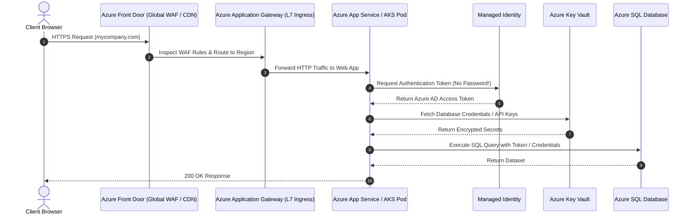

# ☁️ Microsoft Azure Cloud Master Roadmap & Learning Progress Tracker

## 🏛️ Azure Cloud Architecture & Infrastructure Hierarchy

### 🏗️ Azure Resource Hierarchy & Governance


### 🔄 Enterprise Web Architecture & Network Routing Sequence


---

## 📑 Phase 1: Azure Global Infrastructure & Governance

### Module 1: Azure Fundamentals & Global Infrastructure
- [x] **Cloud Service Models**
  - **IaaS (Infrastructure as a Service)**: Azure VMs, VNets (maximum OS control).
  - **PaaS (Platform as a Service)**: Azure App Service, Azure Functions, Azure SQL (managed framework & runtime).
  - **SaaS (Software as a Service)**: Microsoft 365, Dynamics 365.
- [x] **Azure Global Infrastructure**
  - **Regions**: Geographical areas containing multiple datacenters connected via low-latency network.
  - **Availability Zones (AZs)**: Physically separate datacenters within an Azure region with independent power, cooling, and network.
  - **Region Pairs**: Primary and secondary regions paired > 300 miles apart for disaster recovery (DR).

### Module 2: Resource Hierarchy, RBAC & Policy Governance
- [x] **Resource Hierarchy**
  - Tenant $\rightarrow$ Management Groups $\rightarrow$ Subscriptions $\rightarrow$ Resource Groups $\rightarrow$ Resources.
- [x] **Resource Groups (RGs)**
  - Logical containers holding related Azure resources that share the same deployment and management lifecycle.
- [x] **Role-Based Access Control (RBAC)**
  - Assigns fine-grained permissions using Security Principals (Users, Groups, Service Principals, Managed Identities) and Roles (Owner, Contributor, Reader).
- [x] **Azure Policy & Blueprints**
  - Enforces organizational standards and compliance rules (e.g. restricting allowed VM sizes or requiring tags).

---

## ⚡ Phase 2: Compute & Container Services

### Module 3: Azure Virtual Machines (VMs) & Scale Sets
- [x] **Azure Virtual Machines**
  - On-demand IaaS compute instances. Managed Disks (Standard HDD/SSD, Premium SSD, Ultra Disk).
- [x] **Virtual Machine Scale Sets (VMSS)**
  - Automatically scales identical load-balanced VMs up or down based on CPU metrics or schedules.

### Module 4: Azure App Service (PaaS Web Hosting)
- [x] **App Service Plans & Deployment Slots**
  - App Service Plan defines CPU/RAM compute resources.
  - **Deployment Slots (Staging/Production)**: Enables zero-downtime Blue-Green deployments with instant slot swapping.

### Module 5: Azure Serverless Compute (Azure Functions)
- [x] **Azure Functions**
  - Event-driven serverless compute executing code triggered by HTTP requests, Blob uploads, Event Grid, or Service Bus.
- [x] **Durable Functions**
  - Extension allowing stateful workflow orchestration (Chaining, Fan-out/Fan-in, Async HTTP polling) in serverless.

### Module 6: Container Services (ACI, ACA, AKS)
- [x] **Azure Container Instances (ACI)**: Serverless fast container execution without managing orchestrators.
- [x] **Azure Container Apps (ACA)**: Serverless microservices platform powered by Kubernetes and KEDA auto-scaling.
- [x] **Azure Kubernetes Service (AKS)**: Managed production Kubernetes cluster service.

---

## 🛠️ Phase 3: Networking & Traffic Routing

### Module 7: Azure Virtual Network (VNet) Fundamentals
- [x] **VNets & Subnets**
  - Isolated private network space (CIDR block `10.0.0.0/16`). Subnets divide VNets into logical segments.
- [x] **Network Security Groups (NSGs)**
  - Stateful packet filtering firewall rules governing inbound and outbound traffic to Subnets or Network Interfaces (NICs).

### Module 8: VNet Peering & Hybrid Connectivity
- [x] **VNet Peering**
  - Connects two VNets seamlessly over Microsoft's backbone network with low latency (Local vs Global Peering).
- [x] **VPN Gateway & ExpressRoute**
  - **VPN Gateway**: Encrypted Site-to-Site / Point-to-Site tunnel over public internet.
  - **ExpressRoute**: Dedicated private fiber connection bypassing public internet for high-speed hybrid enterprise connectivity.

### Module 9: Load Balancing & Traffic Routing Services
- [x] **Azure Load Balancer (L4)**: High-performance Layer 4 (TCP/UDP) traffic distribution.
- [x] **Azure Application Gateway (L7)**: Layer 7 HTTP/HTTPS load balancer with Web Application Firewall (WAF) and SSL termination.
- [x] **Azure Front Door**: Global entry point combining global CDN, Layer 7 load balancing, and WAF protection.

---

## ⚙️ Phase 4: Storage, Databases & Identity Security

### Module 10: Azure Storage Accounts & Tiers
- [x] **Blob Storage Tiers**
  - **Hot**: Frequent access, high storage cost, lowest access cost.
  - **Cool**: Infrequent access (min 30 days retention).
  - **Cold / Archive**: Long-term backup (min 180 days retention, hours retrieval time).

### Module 11: Relational & NoSQL Database Services
- [x] **Azure SQL Database**: Fully managed relational database (DTU vs vCore purchasing models).
- [x] **Azure Cosmos DB**: Globally distributed, multi-model NoSQL database offering single-digit millisecond latency SLA.

### Module 12: Identity, Access & Key Vault Security
- [x] **Microsoft Entra ID (Formerly Azure AD)**: Cloud identity and access management service.
- [x] **Managed Identities (System-Assigned vs User-Assigned)**
  - Eliminates embedded credentials in code by giving Azure resources an automatically managed identity in Entra ID.
- [x] **Azure Key Vault**: Safeguards cryptographic keys, secrets (DB passwords, API keys), and TLS/SSL certificates.

---

## 🚀 Phase 5: Messaging, Monitoring & IaC

### Module 13: Messaging Services (Service Bus vs Event Grid vs Event Hubs)
- [x] **Azure Service Bus**: Enterprise messaging queue/topics with FIFO, transactions, and pub-sub.
- [x] **Azure Event Grid**: Event-driven pub-sub routing discrete system events.
- [x] **Azure Event Hubs**: High-throughput real-time data streaming platform (millions of events/sec).

### Module 14: Monitoring & Diagnostics
- [x] **Azure Monitor & Application Insights**: Application Performance Monitoring (APM) tracking telemetry, live metrics, and exceptions.

---

## 🛠️ Phase 6: Practical Infrastructure as Code (IaC Terraform)

### Terraform Script Creating VNet, Subnet, NSG & Key Vault
```hcl
provider "azurerm" {
  features {}
}

resource "azurerm_resource_group" "rg" {
  name     = "prod-web-rg"
  location = "East US"
}

resource "azurerm_virtual_network" "vnet" {
  name                = "prod-vnet"
  address_space       = ["10.0.0.0/16"]
  location            = azurerm_resource_group.rg.location
  resource_group_name = azurerm_resource_group.rg.name
}

resource "azurerm_subnet" "subnet" {
  name                 = "web-subnet"
  resource_group_name  = azurerm_resource_group.rg.name
  virtual_network_name = azurerm_virtual_network.vnet.name
  address_prefixes     = ["10.0.1.0/24"]
}

resource "azurerm_network_security_group" "nsg" {
  name                = "web-nsg"
  location            = azurerm_resource_group.rg.location
  resource_group_name = azurerm_resource_group.rg.name

  security_rule {
    name                       = "AllowHTTPS"
    priority                   = 100
    direction                  = "Inbound"
    access                     = "Allow"
    protocol                   = "Tcp"
    source_port_range          = "*"
    destination_port_range     = "443"
    source_address_prefix      = "*"
    destination_address_prefix = "*"
  }
}
```

---

## 🎯 Top Azure Senior Interview Q&A Cheatsheet (Master List)

### Q1: What is the difference between Managed Identities and Service Principals in Azure?
A Service Principal is an application registration in Entra ID that requires managing client IDs and secret keys (which expire and must be rotated). A Managed Identity is an automatically managed identity in Entra ID bound to an Azure resource (e.g. App Service/VM), eliminating the need for developers to handle or store credentials in code or Key Vault.

### Q2: What is the difference between Azure Load Balancer, Application Gateway, and Azure Front Door?
- **Azure Load Balancer**: Layer 4 (TCP/UDP) non-HTTP load balancer operating within a single region.
- **Application Gateway**: Layer 7 (HTTP/HTTPS) regional load balancer with WAF, SSL offloading, and URL-based routing.
- **Azure Front Door**: Global Layer 7 entry point providing global CDN, WAF, and multi-region failover across Microsoft's backbone network.

### Q3: How do Deployment Slots work in Azure App Service and why are they used?
Deployment Slots are live apps with their own hostnames. Developers deploy new code to a `staging` slot, run integration tests, and then perform a **Slot Swap**. The slot swap instantly exchanges the Virtual Network and IP routing settings between `staging` and `production`, delivering zero-downtime deployments with instant rollback capability.

### Q4: What is the difference between Service Bus, Event Grid, and Event Hubs?
- **Azure Service Bus**: Enterprise messaging with FIFO queues, pub-sub topics, and transaction support for business workflows.
- **Azure Event Grid**: Reactive event routing platform for discrete system notifications (e.g. Blob created).
- **Azure Event Hubs**: High-throughput telemetry streaming platform handling millions of events/sec (big data logging/IoT).

### Q5: What is the difference between Fault Domains and Update Domains in Availability Sets?
- **Fault Domains**: Share a single physical power source and network switch. Prevents single point of physical hardware failure.
- **Update Domains**: Group of physical nodes rebooted together during planned Azure maintenance. Ensures at least one domain remains running.
