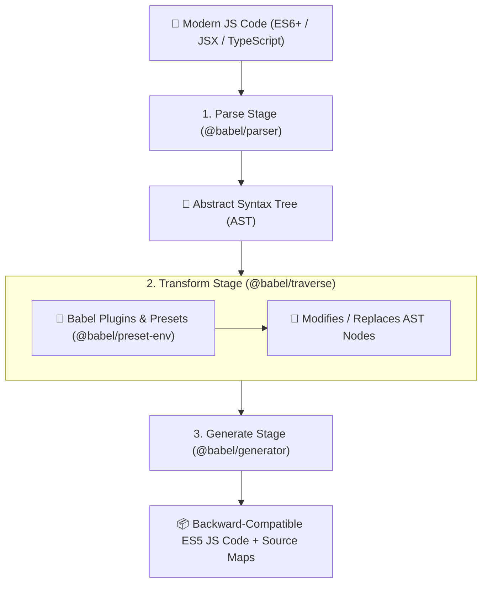

# 🟨 Babel Compiler Master Roadmap & Learning Progress Tracker

## 🏛️ Babel Compiler Pipeline & AST Architecture

### 🏗️ Babel 3-Stage Transpilation Pipeline


### 🔄 Polyfilling vs Syntax Transpilation Sequence
```mermaid
sequenceDiagram
    autonumber
    actor Dev as Developer Code
    participant Parser as Babel Parser
    participant Transpiler as Syntax Transpiler
    participant CoreJS as Polyfill Engine (core-js)
    participant Output as Final ES5 Bundle

    Dev->>Parser: const add = (a, b) => a + b; Promise.resolve();
    Parser->>Transpiler: Parse Arrow Function Syntax & Promise Object
    Transpiler->>Output: 1. Transpile Arrow Function -> var add = function(a, b) { return a + b; }
    Note over Transpiler: Promises are objects, NOT syntax! Cannot transpile syntax!
    Transpiler->>CoreJS: Request Polyfill for 'Promise'
    CoreJS-->>Output: 2. Inject Polyfill Code (import "core-js/modules/es.promise.js")
    Output-->>Dev: Fully Compatible Cross-Browser Executable JS!
```

---

## 📑 Phase 1: Babel Architecture & Compiler Pipeline

### Module 1: Introduction to Babel Compiler
- [x] **What is Babel?**
  - Toolchain used mainly to convert ECMAScript 2015+ (ES6+) modern JavaScript code into backward-compatible ES5 JavaScript for older browsers.
- [x] **Source-to-Source Compilation (Transpilation)**
  - Compiles high-level modern JS syntax into equivalent legacy JS syntax without executing code.

### Module 2: Stage 1 - Parse Stage (`@babel/parser`)
- [x] **Lexical & Syntactic Analysis**
  - Converts raw JavaScript string input into tokens, then builds a structured **Abstract Syntax Tree (AST)** following the ESTree specification.

### Module 3: Stage 2 - Transform Stage (`@babel/traverse`)
- [x] **AST Traversal & Visitor Pattern**
  - Traverses the AST nodes using visitor pattern functions (`enter`, `exit`), modifying or replacing syntax nodes based on active Babel plugins.

### Module 4: Stage 3 - Generate Stage (`@babel/generator`)
- [x] **AST to Code Generation**
  - Converts the modified AST back into a plain JavaScript code string alongside Source Maps for browser debugging.

---

## ⚡ Phase 2: Package Ecosystem, Presets & Plugins

### Module 5: Core Package Ecosystem
- [x] **`@babel/core`**: Central compiler engine orchestrating Parse-Transform-Generate.
- [x] **`@babel/cli` & `babel-loader`**: Terminal command-line executable tool and Webpack build loader bridge.

### Module 6: Babel Plugins
- [x] **Syntax vs Transform Plugins**
  - Syntax plugins (`@babel/plugin-syntax-jsx`) enable parser to read new syntax. Transform plugins (`@babel/plugin-transform-arrow-functions`) rewrite syntax.
- [x] **Writing Custom Babel Visitor Plugins**
  - Creating custom AST transformation rules using `visitor: { Identifier(path) { ... } }`.

### Module 7: Babel Presets
- [x] **What is a Preset?**
  - Curated bundle of plugins configured together.
- [x] **Core Presets**
  - `@babel/preset-env` (smart browser targeting), `@babel/preset-react` (JSX transform), `@babel/preset-typescript` (strips TS types).

### Module 8: Environment Targeting (`browserslist`)
- [x] **Targeting Matrix (`.browserslistrc`)**
  - Directing `@babel/preset-env` to compile *only* the syntax features unsupported by target browsers (e.g. `> 0.25%, not dead`).

---

## 🛠️ Phase 3: Polyfilling, Runtimes & Advanced Transformation

### Module 9: Syntax Transpilation vs Polyfilling
- [x] **Syntax Transpilation vs Polyfilling**
  - **Syntax Transpilation**: Converts keywords (`const`, `() => {}`, `class`) into legacy equivalent code.
  - **Polyfilling**: Supplies missing runtime objects (`Promise`, `Symbol`, `Map`, `Object.assign`) via `core-js`.

### Module 10: `@babel/preset-env` Polyfill Strategies
- [x] **`useBuiltIns: false`**: Manual polyfill import (legacy).
- [x] **`useBuiltIns: "entry"`**: Imports all polyfills for target browsers at file top.
- [x] **`useBuiltIns: "usage"`**: Scans code and automatically imports **only used polyfills** from `core-js@3`, shrinking bundle size!

### Module 11: `@babel/plugin-transform-runtime`
- [x] **Injected Helper Reuse**
  - Reuses Babel's internal helper functions (`_classCallCheck`) across modules to shrink bundle size.
- [x] **Preventing Global Namespace Pollution**
  - Aliases polyfills locally, preventing collisions when building distributed npm libraries.

### Module 12: React JSX Transformation
- [x] **Classic vs Automatic JSX Transform**
  - Classic: Compiles `<div />` to `React.createElement('div')` (requires `import React`).
  - Automatic (React 17+): Compiles to `_jsx('div')` importing runtime functions automatically.

---

## ⚙️ Phase 4: Configuration, AST Inspection & Next-Gen Tools

### Module 13: Babel Configuration Files
- [x] **`babel.config.json` vs `.babelrc`**
  - `babel.config.json`: Monorepo-wide root configuration.
  - `.babelrc`: Package-specific granular configuration.

### Module 14: AST Explorer & Node Inspection
- [x] **AST Node Inspection**
  - Understanding AST node structures (`VariableDeclaration`, `Identifier`, `BinaryExpression`, `CallExpression`).

### Module 15: Babel vs Next-Gen Compilers (SWC, Esbuild)
- [x] **Compiler Benchmarks**
  - Babel: JS-based extensible compiler ($1\times$ baseline speed).
  - SWC (Rust) & Esbuild (Go): Native compiled binary transpilers ($20\times - 70\times$ faster than Babel).

---

## 🛠️ Phase 5: Practical Babel Configuration (`babel.config.json`)

### Production Babel Configuration (`babel.config.json`)
```json
{
  "presets": [
    [
      "@babel/preset-env",
      {
        "targets": "> 0.25%, not dead",
        "useBuiltIns": "usage",
        "corejs": "3.36"
      }
    ],
    [
      "@babel/preset-react",
      {
        "runtime": "automatic"
      }
    ],
    "@babel/preset-typescript"
  ],
  "plugins": [
    [
      "@babel/plugin-transform-runtime",
      {
        "corejs": false,
        "helpers": true,
        "regenerator": true
      }
    ]
  ]
}
```

---

## 🎯 Top Babel Senior Interview Q&A Cheatsheet (Master List)

### Q1: What are the 3 core stages of Babel's compilation pipeline?
1. **Parse**: `@babel/parser` takes raw JS source code and converts it into an Abstract Syntax Tree (AST).
2. **Transform**: `@babel/traverse` traverses the AST and applies plugins/presets to modify or replace AST nodes.
3. **Generate**: `@babel/generator` takes the transformed AST and outputs backward-compatible target JS code and source maps.

### Q2: What is the difference between Babel Plugins and Presets?
A Babel Plugin is a single micro-transformer targeting one specific JS syntax feature (e.g. arrow functions). A Babel Preset is a curated bundle of plugins configured together (e.g. `@babel/preset-env` includes all plugins necessary to support target browsers defined in `browserslist`).

### Q3: What is the difference between Syntax Transpilation and Polyfilling in Babel?
Syntax Transpilation converts new language syntax keywords (e.g. `const`, `() => {}`, `class`) into legacy equivalent syntax. Polyfilling provides actual missing runtime objects and methods (e.g. `Promise`, `Array.prototype.includes`, `Symbol`) by injecting implementations from `core-js`.

### Q4: What does `"useBuiltIns": "usage"` do in `@babel/preset-env`?
`"useBuiltIns": "usage"` automatically scans your source code for used modern APIs (like `Promise` or `Map`) and imports **only the exact specific polyfills required** from `core-js` for those APIs, minimizing final production bundle size compared to importing the entire `core-js` library.

### Q5: Why is `@babel/plugin-transform-runtime` important for library developers?
Standard polyfills pollute the global namespace (`window.Promise = ...`). `@babel/plugin-transform-runtime` aliases polyfills and reuses helper functions locally without modifying global prototypes, preventing library polyfill collisions when consumed by host applications.
