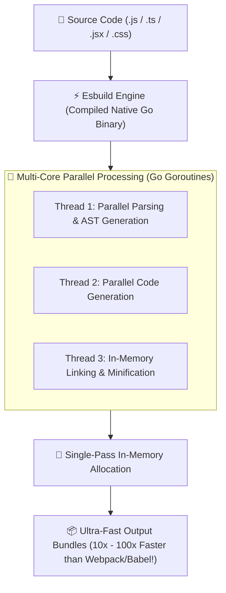
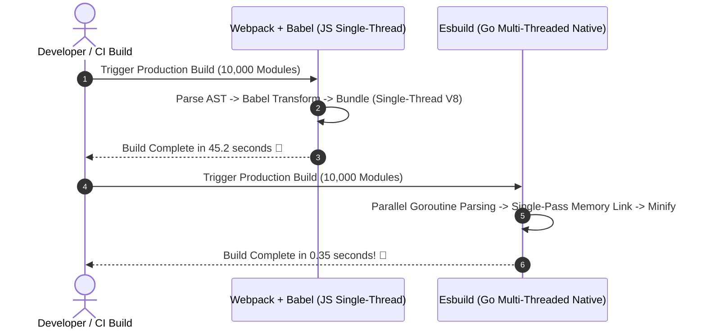

# ⚡ Esbuild Master Roadmap & Learning Progress Tracker

## 🏛️ Esbuild Architecture & Execution Engine

### 🏗️ Esbuild Go-Based Parallel Compilation Pipeline


### 🔄 Esbuild vs Webpack Speed Benchmark Sequence


---

## 📑 Phase 1: Esbuild Core Architecture & Speed Mechanics

### Module 1: Introduction & Speed Architecture
- [x] **What is Esbuild?**
  - Extremely fast JavaScript, TypeScript, JSX, and CSS bundler and minifier written in **Go**.
- [x] **Why Esbuild is 10x–100x Faster than Webpack/Babel**
  - Written in compiled native Go (bypasses V8 JIT interpreter overhead).
  - Maximizes multi-core CPU parallelism via Go Goroutines.
  - Performs parsing, printing, and source mapping in a single unified memory pass.

### Module 2: Esbuild Core APIs (`build`, `transform`)
- [x] **`build()` API**: Bundles multiple entry point files into output distribution bundles.
- [x] **`transform()` API**: Transpiles a single string of JS/TS/JSX code in memory without hitting disk I/O.

---

## ⚡ Phase 2: Features, Plugins & Vite Integration

### Module 3: Features & Capabilities
- [x] **TypeScript & JSX Support**: Transpiles TypeScript syntax (`.ts`/`.tsx`) and JSX natively at blazing speed without needing `@babel/preset-typescript`.
- [x] **Minification & Tree Shaking**: High-speed dead code elimination and code minification (`minify: true`).

### Module 4: Esbuild Plugins API
- [x] **Plugin Architecture (`onResolve`, `onLoad`)**
  - Intercepts module resolution (`onResolve`) and custom content loading (`onLoad`) via Go/JS plugin hooks.

### Module 5: Role in Modern Ecosystem (Vite & Limitations)
- [x] **Esbuild as Vite's Development Engine**
  - Vite uses Esbuild during development for instant dependency pre-bundling.
- [x] **Esbuild Known Limitations**
  - Does NOT perform TypeScript type-checking (requires `tsc --noEmit`).
  - Does NOT transpile to legacy ES5 (targets ES2015+ / ESNext).
  - Does NOT support Hot Module Replacement (HMR) out of the box.

---

## 🛠️ Phase 3: Practical Esbuild Build Script (`build.js`)

### Production Esbuild Build Script (`build.js`)
```javascript
const esbuild = require('esbuild');

async function runBuild() {
  try {
    const result = await esbuild.build({
      entryPoints: ['src/index.tsx'],
      bundle: true,
      minify: true,
      sourcemap: true,
      target: ['chrome58', 'firefox57', 'safari11', 'edge16'],
      outfile: 'dist/bundle.js',
      loader: {
        '.png': 'dataurl',
        '.svg': 'text',
      },
      define: {
        'process.env.NODE_ENV': '"production"',
      },
      metafile: true, // Generates build analysis JSON
    });

    console.log('Build succeeded! Output size analysis:');
    let text = await esbuild.analyzeMetafile(result.metafile);
    console.log(text);
  } catch (error) {
    console.error('Build failed:', error);
    process.exit(1);
  }
}

runBuild();
```

---

## 🎯 Top Esbuild Senior Interview Q&A Cheatsheet (Master List)

### Q1: Why is Esbuild significantly faster than traditional bundlers like Webpack or Rollup?
Esbuild is written in native compiled **Go** (bypassing V8 JS engine interpret/JIT overhead), utilizes full multi-core CPU parallelism via Go Goroutines, and processes AST parsing, code printing, and source map generation in a single unified memory pass without intermediate data serialization.

### Q2: What are the main limitations of Esbuild?
Esbuild does not perform TypeScript type-checking (it only strips TS annotations), cannot compile code down to legacy ES5 syntax (targets ES2015+), and lacks built-in Hot Module Replacement (HMR) capabilities.

### Q3: How is Esbuild utilized within the Vite build framework?
Vite uses Esbuild during development for instant dependency pre-bundling (converting CommonJS/UMD modules into clean ES Modules). During production builds, Vite uses Rollup for advanced bundle optimization and code splitting.

### Q4: Does Esbuild perform TypeScript type checking?
No. Esbuild rapidly strips TypeScript type annotations (`.ts`/`.tsx`) without validating type safety. Developers run `tsc --noEmit` separately in CI pipelines to perform type checking.
