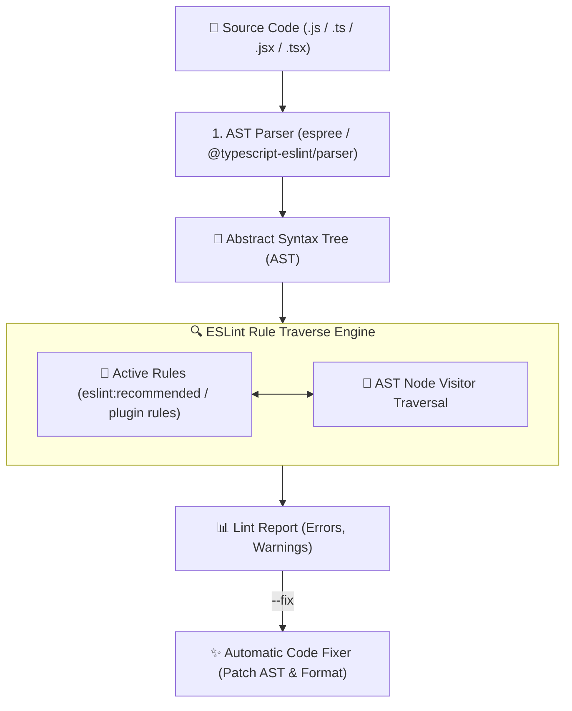
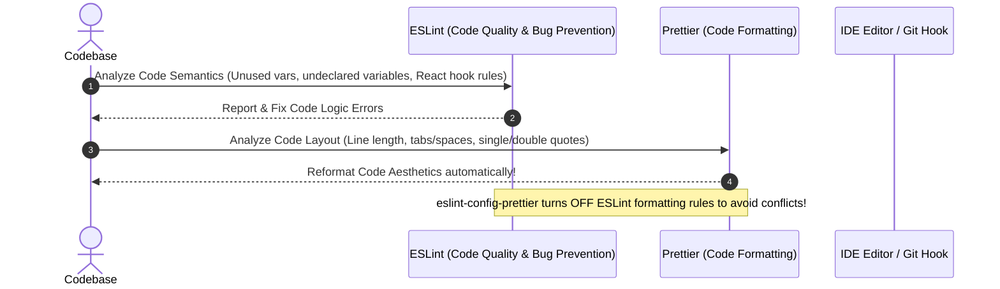

# 📏 ESLint & Code Linting Master Roadmap & Learning Progress Tracker

## 🏛️ ESLint Architecture & AST Engine

### 🏗️ ESLint Static Analysis & AST Linting Pipeline


### 🔄 ESLint vs Prettier Integration Flow


---

## 📑 Phase 1: ESLint Core Concepts & AST Engine

### Module 1: Introduction to Static Code Analysis & ESLint
- [x] **What is ESLint?**
  - Pluggable static code analysis utility for JavaScript and TypeScript that identifies problematic patterns or code that does not adhere to style guidelines.
- [x] **AST-Based Rule Evaluation**
  - Converts source code into an Abstract Syntax Tree (AST) using Espree or `@typescript-eslint/parser` and visits AST nodes to enforce rules.

### Module 2: Flat Config (`eslint.config.js`) vs Legacy Config (`.eslintrc`)
- [x] **Legacy Configuration (`.eslintrc.js` / `.eslintrc.json`)**
  - Historical configuration file using `extends`, `plugins`, `rules`, `env`, and `parserOptions`.
- [x] **ESLint v9+ Flat Configuration (`eslint.config.js`)**
  - Modern ESM-first configuration array replacing complex cascading inheritance with explicit JavaScript object imports.

---

## ⚡ Phase 2: Rules, Plugins & Prettier Integration

### Module 3: Rule Severities & Configuration
- [x] **Rule Severities**
  - `"off"` or `0`: Rule is disabled.
  - `"warn"` or `1`: Rule emits a yellow warning (does not fail build).
  - `"error"` or `2`: Rule emits a red error (fails CI/CD build).

### Module 4: Plugins, Extends & TypeScript Support
- [x] **Plugins vs Extends**
  - **Plugins (`plugins`)**: Exports custom rules and parsers (e.g. `eslint-plugin-react`).
  - **Extends (`extends`)**: Enables pre-packaged sets of rule configurations (e.g. `eslint:recommended`).
- [x] **TypeScript Linting (`@typescript-eslint`)**
  - Enables type-aware linting rules requiring project TypeScript config (`parserOptions.project`).

### Module 5: ESLint + Prettier Integration
- [x] **Avoiding Conflicts (`eslint-config-prettier`)**
  - Turns off all ESLint formatting rules that might conflict with Prettier, letting Prettier handle formatting and ESLint handle code quality.

---

## 🛠️ Phase 3: Husky, Lint-Staged & CI/CD Enforcement

### Module 6: Git Pre-Commit Hooks (Husky & lint-staged)
- [x] **Husky & lint-staged**
  - Runs ESLint automatically on **staged files only** before every Git commit, preventing bad code from entering the repository.

---

## 📚 Exhaustive ESLint Rules Reference Matrix

| Category | ESLint Rule Name | Recommended / Default Severity | Description & Best Practice |
| :--- | :--- | :--- | :--- |
| **Logic & Bugs** | `no-unused-vars` | `"error"` | Disallows declared variables that are never used in code |
| **Logic & Bugs** | `no-undef` | `"error"` | Disallows reference to undeclared variables (catches typos & missing imports) |
| **Logic & Bugs** | `no-unreachable` | `"error"` | Disallows unreachable code after `return`, `throw`, `break`, or `continue` |
| **Logic & Bugs** | `no-constant-condition` | `"error"` | Disallows constant expressions in conditions (e.g. `if (true)`) |
| **Logic & Bugs** | `no-dupe-keys` | `"error"` | Disallows duplicate keys in object literals |
| **Logic & Bugs** | `no-dupe-args` | `"error"` | Disallows duplicate parameter names in function declarations |
| **Logic & Bugs** | `no-duplicate-case` | `"error"` | Disallows duplicate case labels in `switch` statements |
| **Logic & Bugs** | `no-empty` | `"error"` | Disallows empty block statements (`catch (e) {}`) |
| **Logic & Bugs** | `no-extra-boolean-cast` | `"error"` | Disallows unnecessary boolean casts (`if (!!foo)`) |
| **Logic & Bugs** | `no-func-assign` | `"error"` | Disallows reassigning `function` declarations |
| **Logic & Bugs** | `no-sparse-arrays` | `"error"` | Disallows sparse array literals with missing slots (`[1,, 3]`) |
| **Logic & Bugs** | `no-unexpected-multiline`| `"error"` | Disallows confusing multiline expressions resulting in ASI issues |
| **Logic & Bugs** | `use-isnan` | `"error"` | Enforces using `Number.isNaN()` when checking for `NaN` |
| **Logic & Bugs** | `valid-typeof` | `"error"` | Enforces comparing `typeof` expressions to valid string literals |
| **Best Practices** | `eqeqeq` | `"error"` | Enforces strict equality operators `===` and `!==` instead of `==` / `!=` |
| **Best Practices** | `no-console` | `"warn"` | Disallows calls to `console.log` in production code (allows `warn`/`error`) |
| **Best Practices** | `no-eval` | `"error"` | Disallows use of dangerous `eval()` function |
| **Best Practices** | `no-implied-eval` | `"error"` | Disallows `eval()`-like methods (`setTimeout("code")`) |
| **Best Practices** | `no-alert` | `"error"` | Disallows browser modal popups (`alert`, `confirm`, `prompt`) |
| **Best Practices** | `no-param-reassign` | `"error"` | Disallows reassignment of function parameters |
| **Best Practices** | `no-return-assign` | `"error"` | Disallows assignment operators in `return` statements |
| **Best Practices** | `no-self-compare` | `"error"` | Disallows comparisons where both sides are identical (`x === x`) |
| **Best Practices** | `no-throw-literal` | `"error"` | Disallows throwing literals; requires throwing Error objects (`throw new Error()`) |
| **Best Practices** | `no-unused-expressions` | `"error"` | Disallows unused expressions that have no effect on state |
| **Best Practices** | `no-fallthrough` | `"error"` | Disallows fallthrough of `switch` cases without explicit comment |
| **Best Practices** | `curly` | `"error"` | Enforces curly braces for all control statements (`if`, `else`, `for`) |
| **ES6+ / Modern** | `no-var` | `"error"` | Requires `let` or `const` instead of legacy function-scoped `var` |
| **ES6+ / Modern** | `prefer-const` | `"error"` | Requires `const` for variables that are never reassigned after initialization |
| **ES6+ / Modern** | `prefer-arrow-callback` | `"warn"` | Requires using arrow functions as callbacks |
| **ES6+ / Modern** | `prefer-template` | `"warn"` | Suggests template literals instead of string concatenation (`${a} ${b}`) |
| **ES6+ / Modern** | `prefer-destructuring` | `"warn"` | Suggests object and array destructuring assignment |
| **ES6+ / Modern** | `prefer-rest-params` | `"error"` | Requires rest parameters (`...args`) instead of `arguments` object |
| **ES6+ / Modern** | `prefer-spread` | `"error"` | Requires spread syntax (`...`) instead of `.apply()` |
| **ES6+ / Modern** | `no-useless-rename` | `"error"` | Disallows renaming import/export specifiers to the same name |
| **TypeScript** | `@typescript-eslint/no-explicit-any` | `"error"` / `"warn"` | Disallows usage of the `any` type (enforces type safety) |
| **TypeScript** | `@typescript-eslint/no-unused-vars` | `"error"` | Replaces core `no-unused-vars` to respect TypeScript interfaces |
| **TypeScript** | `@typescript-eslint/explicit-function-return-type` | `"off"` / `"warn"` | Enforces explicit return types on functions |
| **TypeScript** | `@typescript-eslint/no-floating-promises` | `"error"` | Requires Promises to be awaited or handled with `.then()` / `.catch()` |
| **TypeScript** | `@typescript-eslint/no-misused-promises` | `"error"` | Prevents passing Promises to places expecting void functions |
| **TypeScript** | `@typescript-eslint/strict-boolean-expressions` | `"warn"` | Restricts types allowed in boolean expressions (`if`) |
| **React & Hooks** | `react/jsx-key` | `"error"` | Requires `key` props when rendering elements in array loops |
| **React & Hooks** | `react/no-direct-mutation-state` | `"error"` | Disallows direct state mutation (`this.state.foo = bar`) |
| **React & Hooks** | `react/react-in-jsx-scope` | `"off"` (React 17+) | Disallows missing `import React` (off in modern React JSX transform) |
| **React & Hooks** | `react-hooks/rules-of-hooks` | `"error"` | Enforces calling Hooks ONLY at top level of React function components |
| **React & Hooks** | `react-hooks/exhaustive-deps` | `"warn"` / `"error"` | Enforces specifying ALL dependencies in `useEffect` / `useCallback` arrays |
| **Import / Export**| `import/order` | `"warn"` | Enforces a consistent ordering for `import` statements |
| **Import / Export**| `import/no-unresolved` | `"error"` | Ensures imported modules can be resolved to a file on disk |
| **Import / Export**| `import/no-duplicates` | `"error"` | Disallows duplicate imports of the same module in one file |

---

## 🛠️ Phase 4: Practical Configuration Snippets

### 1. Modern ESLint Flat Config (`eslint.config.mjs`)
```javascript
import js from '@eslint/js';
import tseslint from 'typescript-eslint';
import reactPlugin from 'eslint-plugin-react';
import eslintConfigPrettier from 'eslint-config-prettier';

export default tseslint.config(
  js.configs.recommended,
  ...tseslint.configs.recommended,
  {
    files: ['**/*.{js,mjs,cjs,ts,jsx,tsx}'],
    plugins: {
      react: reactPlugin,
    },
    languageOptions: {
      parserOptions: {
        ecmaFeatures: { jsx: true },
      },
    },
    rules: {
      'no-unused-vars': 'off', // Turned off in favor of TS rule
      '@typescript-eslint/no-unused-vars': ['error', { argsIgnorePattern: '^_' }],
      '@typescript-eslint/explicit-function-return-type': 'off',
      'react/react-in-jsx-scope': 'off', // React 17+ JSX transform
      'no-console': ['warn', { allow: ['warn', 'error'] }],
    },
  },
  eslintConfigPrettier // Disables formatting rules conflicting with Prettier!
);
```

### 2. `.lintstagedrc.json` Pre-Commit Hook Config
```json
{
  "*.{js,jsx,ts,tsx}": [
    "eslint --fix",
    "prettier --write"
  ],
  "*.{json,md,yml,css}": [
    "prettier --write"
  ]
}
```

---

## 🎯 Top ESLint Senior Interview Q&A Cheatsheet (Master List)

### Q1: What is the main difference between ESLint and Prettier?
ESLint is a static code quality linter that analyzes code semantics to catch bugs, unused variables, and logical errors. Prettier is an opinionated code formatter that enforces consistent code aesthetics (indentation, line length, quotes, trailing commas).

### Q2: How do you prevent conflicts between ESLint and Prettier?
Use `eslint-config-prettier`. It disables all ESLint rules related to code formatting that might conflict with Prettier, allowing ESLint to focus purely on code quality while Prettier handles code formatting.

### Q3: What is the difference between ESLint's legacy `.eslintrc` and modern Flat Config (`eslint.config.js`)?
Legacy `.eslintrc` relied on implicit string-based cascading configurations and nested plugin resolution. ESLint v9+ Flat Config (`eslint.config.js`) uses explicit JavaScript module imports in a flat array, making configurations deterministic, faster, and standard ESM compatible.

### Q4: How does ESLint perform type-aware linting for TypeScript?
By using `@typescript-eslint/parser` configured with `parserOptions.project = './tsconfig.json'`. This allows ESLint rules to access full TypeScript compiler type information (e.g. enforcing promises to be awaited via `@typescript-eslint/no-floating-promises`).
