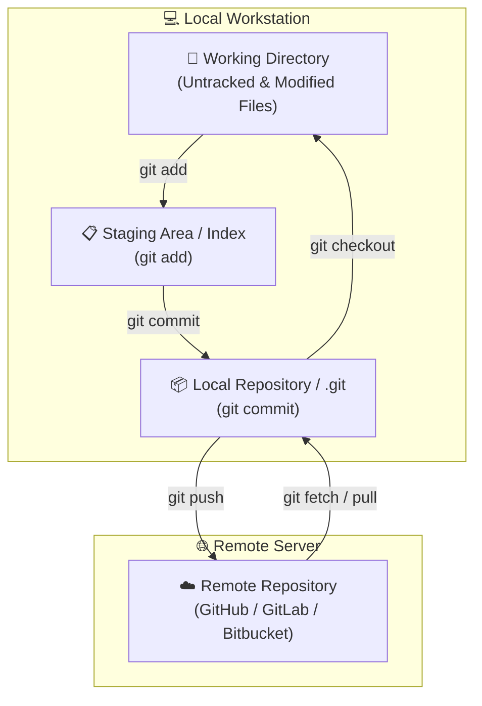
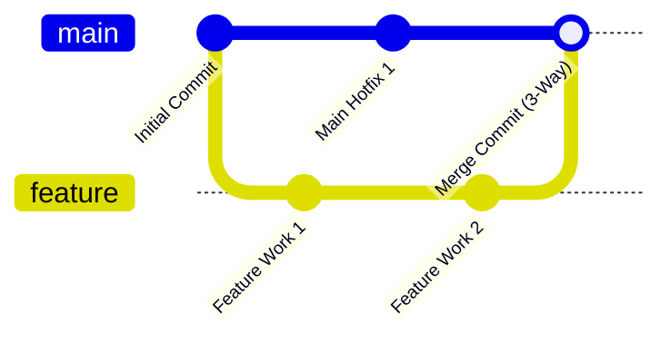

# 🐙 Git & Version Control Master Roadmap & Learning Progress Tracker

## 🏛️ Git Architecture & Data Model

### 🏗️ Git 4-Stage Architecture


### 🔄 Git Merging vs Rebasing Sequence


---

## 📑 Phase 1: Git Core Architecture & Data Model

### Module 1: Internal Objects & Data Store
- [x] **Git Object Types (.git/objects)**
  - **Blob**: Stores raw file content without filename or permissions.
  - **Tree**: Represents directory structure linking filenames to Blobs and sub-Trees.
  - **Commit**: Pointer to a Tree object + commit metadata (author, message, parent commit SHA).
  - **Annotated Tag**: Persistent pointer to a specific commit.
- [x] **SHA-1 / SHA-256 Hashing**
  - Cryptographic hash uniquely identifying every Git object based on its content.

### Module 2: The 4 Git States
- [x] **Working Directory, Staging Area, Local Repo, Remote Repo**
  - Untracked/Modified $\rightarrow$ Staged (`git add`) $\rightarrow$ Committed (`git commit`) $\rightarrow$ Pushed (`git push`).

---

## ⚡ Phase 2: Branching Strategies, Merging & Rebasing

### Module 3: Merging vs Rebasing
- [x] **3-Way Merge (`git merge`)**
  - Creates a new "Merge Commit" preserving complete linear historical context.
- [x] **Git Rebase (`git rebase main`)**
  - Re-applies feature branch commits on top of target branch, creating a clean linear commit history.
  - *Golden Rule of Rebasing:* **NEVER rebase public shared branches!**

### Module 4: Branching Workflows
- [x] **GitFlow vs Trunk-Based Development**
  - **GitFlow**: Structured workflow with `main`, `develop`, `feature/*`, `release/*`, `hotfix/*` branches.
  - **Trunk-Based**: Developers push short-lived feature branches directly into `main` trunk continuously paired with feature flags.

---

## 🛠️ Phase 3: Advanced Operations & Recovery Commands

### Module 5: Git Reset, Revert & Checkout
- [x] **`git reset` (`--soft`, `--mixed`, `--hard`)**
  - `--soft`: Moves HEAD pointer; preserves staging area and working directory.
  - `--mixed` (Default): Moves HEAD pointer and resets staging area; preserves working directory.
  - `--hard`: Moves HEAD pointer and **wipes all uncommitted changes** in staging area and working directory!
- [x] **`git revert`**
  - Creates a new commit that undoes changes from a previous commit safely without altering commit history.

### Module 6: Git Stash, Cherry-Pick & Reflog
- [x] **`git stash` & `git stash pop`**
  - Temporarily shelves uncommitted changes to work on a hotfix on another branch.
- [x] **`git cherry-pick <commit-hash>`**
  - Applies a specific commit from one branch onto the current HEAD branch.
- [x] **`git reflog` (Safety Net)**
  - Logs every single HEAD movement (commits, resets, rebases). Used to recover lost commits or deleted branches!

---

## 🛠️ Phase 4: Practical Configuration & Recovery Snippets

### 1. Undo Last Commit (Keeping Changes Staged)
```bash
git reset --soft HEAD~1
```

### 2. Recover Deleted Branch using Reflog
```bash
# 1. Find lost commit hash before deletion
git reflog

# 2. Re-create branch from that commit hash
git checkout -b recovered-branch-name <commit-hash>
```

### 3. Interactive Rebase (Squashing 3 Commits into 1)
```bash
# Interactively rebase last 3 commits
git rebase -i HEAD~3

# In interactive editor: change 'pick' to 'squash' (or 's') for 2nd and 3rd commits
```

---

## 🎯 Top Git Interview Q&A Cheatsheet (Master List)

### Q1: What is the difference between `git merge` and `git rebase`?
`git merge` combines two branches by creating a new 3-way merge commit, preserving historical timeline. `git rebase` rewrites history by moving feature branch commits to the tip of the target branch, creating a clean linear history. Never rebase public shared branches!

### Q2: What is the difference between `git reset --hard` and `git revert`?
`git reset --hard` alters commit history by moving HEAD back and permanently discarding all working directory changes. `git revert` creates a new commit that safely reverses changes of a target commit without altering historical logs, making it safe for remote shared branches.

### Q3: How does `git reflog` save lost commits or deleted branches?
`git reflog` records every change to HEAD (commits, resets, checkouts, branch deletions) locally in `.git/logs/HEAD`. Even if a branch is deleted or a hard reset occurs, `reflog` reveals the commit SHA hash, allowing recovery via `git checkout -b branch-name <commit-hash>`.

### Q4: What is the difference between `git fetch` and `git pull`?
`git fetch` downloads remote commits, tags, and refs into the local repository without altering working directory files. `git pull` performs a `git fetch` followed immediately by a `git merge` to integrate remote changes into the current branch.

### Q5: How do `git stash` and `git stash pop` work?
`git stash` takes uncommitted changes (staged and unstaged) and saves them in a local stack, resetting working directory to match HEAD. `git stash pop` re-applies the most recent stashed changes back to working directory and removes them from the stash stack.
