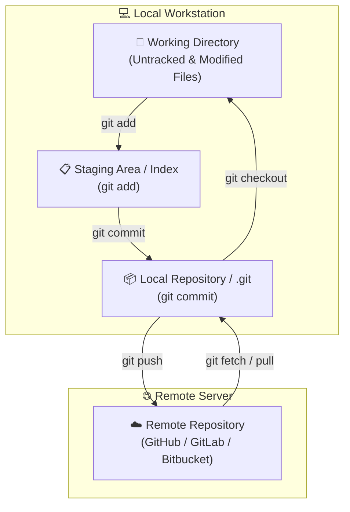
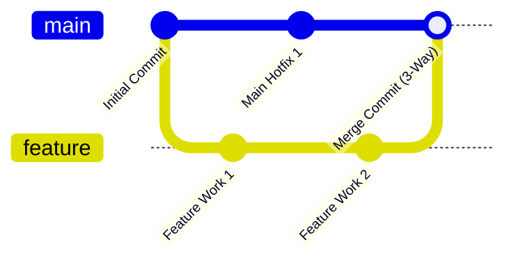

# 🐙 Git & Version Control Master Roadmap & Learning Progress Tracker

## 🏛️ Git Architecture & Data Model

### 🏗️ Git 4-Stage Architecture


### 🔄 Git Merging vs Rebasing Sequence


---

## 📚 Exhaustive Git Command Reference Matrix

| Category | Command | Description & Typical Usage |
| :--- | :--- | :--- |
| **Config** | `git config --global user.name "Name"` | Sets global commit author username |
| **Config** | `git config --global user.email "email"` | Sets global commit author email |
| **Config** | `git config --global core.editor "code --wait"` | Sets default commit text editor |
| **Config** | `git config --list --show-origin` | Displays all active Git configurations & file origins |
| **Initialization** | `git init` | Initializes a new local Git repository in current folder |
| **Initialization** | `git clone <url>` | Clones remote repository to local machine |
| **Initialization** | `git clone --depth 1 <url>` | Shallow clone (downloads only latest commit to save bandwidth) |
| **Status & Diff** | `git status` | Displays working directory and staging area status |
| **Status & Diff** | `git status -s` | Compact short-format status output |
| **Status & Diff** | `git diff` | Shows unstaged changes in working directory vs staging |
| **Status & Diff** | `git diff --staged` / `git diff --cached` | Shows staged changes ready to be committed vs HEAD |
| **Status & Diff** | `git diff main..feature` | Compares changes between two branches |
| **Staging & Commit** | `git add <file>` | Stages specific file for next commit |
| **Staging & Commit** | `git add .` / `git add -A` | Stages all modified and new untracked files |
| **Staging & Commit** | `git add -p` | Patch mode: interactively stage specific code chunks |
| **Staging & Commit** | `git commit -m "message"` | Commits staged snapshot with descriptive message |
| **Staging & Commit** | `git commit -am "message"` | Stages all tracked modified files AND commits in one step |
| **Staging & Commit** | `git commit --amend -m "msg"` | Modifies the last commit message or adds new staged changes |
| **File Removal** | `git rm <file>` | Removes file from working directory and stages removal |
| **File Removal** | `git rm --cached <file>` | Untracks file from Git while keeping physical file on disk |
| **File Renaming** | `git mv <old-name> <new-name>` | Renames/moves file and automatically stages change |
| **Branching** | `git branch` | Lists all local branches (* highlights current active branch) |
| **Branching** | `git branch -a` | Lists all local AND remote tracking branches |
| **Branching** | `git branch <branch-name>` | Creates a new branch at current HEAD (does not switch) |
| **Branching** | `git checkout -b <branch-name>` | Creates a new branch AND switches to it immediately |
| **Branching** | `git switch <branch-name>` | Modern syntax to switch to an existing branch |
| **Branching** | `git switch -c <branch-name>` | Modern syntax to create and switch to new branch |
| **Branching** | `git branch -d <branch-name>` | Deletes merged local branch safely |
| **Branching** | `git branch -D <branch-name>` | Force deletes local branch even if unmerged |
| **Branching** | `git branch -m <old> <new>` | Renames local branch |
| **Merging** | `git merge <branch>` | Merges specified branch into current active branch (3-way) |
| **Merging** | `git merge --no-ff <branch>` | Forces creation of a merge commit even if fast-forward possible |
| **Merging** | `git merge --abort` | Aborts active merge process during merge conflict |
| **Rebasing** | `git rebase <branch>` | Re-applies current branch commits on top of target branch |
| **Rebasing** | `git rebase -i HEAD~N` | Interactive rebase for squashing, editing, or dropping commits |
| **Rebasing** | `git rebase --continue` | Resumes rebase after resolving merge conflicts |
| **Rebasing** | `git rebase --abort` | Cancels active rebase and restores original pre-rebase state |
| **Cherry-Pick** | `git cherry-pick <commit-sha>` | Applies specific commit from another branch onto current branch |
| **Remote Repo** | `git remote -v` | Displays remote repository URLs (fetch & push) |
| **Remote Repo** | `git remote add origin <url>` | Links local repository to remote URL |
| **Remote Repo** | `git remote set-url origin <url>` | Updates remote repository URL |
| **Remote Fetch/Pull** | `git fetch origin` | Downloads remote commits/tags without modifying local files |
| **Remote Fetch/Pull** | `git pull origin <branch>` | Downloads remote commits AND merges them into current branch |
| **Remote Fetch/Pull** | `git pull --rebase origin <branch>` | Downloads remote commits AND rebases local commits on top |
| **Remote Push** | `git push origin <branch>` | Pushes local branch commits to remote repository |
| **Remote Push** | `git push -u origin <branch>` | Pushes and sets upstream tracking branch for future `git push` |
| **Remote Push** | `git push origin --delete <branch>` | Deletes branch on remote repository |
| **Remote Push** | `git push --force-with-lease` | Safe force push: rejects push if someone else pushed commits |
| **Undo & Reset** | `git restore <file>` | Discards unstaged changes in working directory |
| **Undo & Reset** | `git restore --staged <file>` | Unstages file while preserving working directory changes |
| **Undo & Reset** | `git reset --soft HEAD~1` | Undoes last commit; preserves staging area & working directory |
| **Undo & Reset** | `git reset --mixed HEAD~1` | Default reset: undoes commit & unstages files; keeps working dir |
| **Undo & Reset** | `git reset --hard HEAD~1` | Permanent reset: undoes commit, unstages, and discards all changes |
| **Undo & Revert** | `git revert <commit-sha>` | Creates a NEW commit that safely reverses a target commit |
| **Stash** | `git stash` / `git stash push -m "msg"` | Shelves uncommitted working directory changes |
| **Stash** | `git stash list` | Lists all saved stashes in local stash stack |
| **Stash** | `git stash pop` | Re-applies most recent stash AND removes it from stack |
| **Stash** | `git stash apply` | Re-applies most recent stash while keeping it in stack |
| **Stash** | `git stash drop stash@{0}` | Deletes specific stash from stack |
| **Stash** | `git stash clear` | Empties all stashes in stack |
| **History & Log** | `git log` | Displays commit history logs |
| **History & Log** | `git log --oneline --graph --all` | Compact ASCII tree view of all branch commit history |
| **History & Log** | `git log -n 5` | Limits output to last 5 commits |
| **History & Log** | `git log -p <file>` | Shows full diff history for a specific file |
| **History & Log** | `git show <commit-sha>` | Inspects details and diff of a specific commit |
| **History & Log** | `git blame <file>` | Shows author and commit info for each line of a file |
| **Recovery** | `git reflog` | Logs every HEAD movement (safety net to recover lost commits) |
| **Cleaning** | `git clean -n` | Dry run: shows untracked files that would be deleted |
| **Cleaning** | `git clean -fd` | Force deletes all untracked files and directories |
| **Tagging** | `git tag` | Lists all tags |
| **Tagging** | `git tag -a v1.0.0 -m "Release"` | Creates annotated release tag |
| **Tagging** | `git push origin v1.0.0` | Pushes specific tag to remote |
| **Tagging** | `git push origin --tags` | Pushes all local tags to remote |
| **Submodules** | `git submodule add <url>` | Adds external repository as submodule |
| **Submodules** | `git submodule update --init --recursive` | Initializes and clones nested submodules |

---

## 📑 Phase 1: Git Core Architecture & Data Model

### Module 1: Internal Objects & Data Store (`.git/objects`)
- [x] **Git Object Storage Model**
  - **Blob**: Stores raw file content without filename, permissions, or directory paths.
  - **Tree**: Represents directory structures, linking filenames to Blobs and child Trees.
  - **Commit**: Pointer to a root Tree object + commit metadata (author, message, timestamp, parent commit SHA).
  - **Annotated Tag**: Persistent pointer to a specific commit containing tagger metadata.
- [x] **SHA-1 / SHA-256 Content-Addressable Storage**
  - Cryptographic hash uniquely identifying every Git object based on its exact content.

### Module 2: The 4 Git States
- [x] **Working Directory, Staging Area, Local Repo, Remote Repo**
  - Untracked/Modified $\rightarrow$ Staged (`git add`) $\rightarrow$ Committed (`git commit`) $\rightarrow$ Pushed (`git push`).

---

## ⚡ Phase 2: Branching Strategies, Merging & Rebasing

### Module 3: Merging vs Rebasing
- [x] **3-Way Merge (`git merge`)**
  - Combines two branches by creating a new 3-way merge commit, preserving complete linear historical context.
- [x] **Git Rebase (`git rebase main`)**
  - Re-applies feature branch commits on top of target branch, creating a clean linear commit history.
  - *Golden Rule of Rebasing:* **NEVER rebase public shared branches!**

### Module 4: Branching Workflows
- [x] **GitFlow vs Trunk-Based Development**
  - **GitFlow**: Structured workflow with `main`, `develop`, `feature/*`, `release/*`, `hotfix/*` branches.
  - **Trunk-Based**: Short-lived feature branches pushed continuously into `main` trunk paired with feature flags.

---

## 🛠️ Phase 3: Advanced Operations & Recovery Commands

### Module 5: Git Reset, Revert & Restore
- [x] **`git reset` (`--soft`, `--mixed`, `--hard`)**
  - `--soft`: Moves HEAD pointer; preserves staging area and working directory.
  - `--mixed` (Default): Moves HEAD pointer and resets staging area; preserves working directory.
  - `--hard`: Moves HEAD pointer and **wipes all uncommitted changes** in staging area and working directory!
- [x] **`git revert`**
  - Creates a new commit that undoes changes from a previous commit safely without altering commit history.

### Module 6: Git Stash, Cherry-Pick & Reflog
- [x] **`git stash` & `git stash pop`**
  - Temporarily shelves uncommitted changes to work on a hotfix on another branch.
- [x] **`git cherry-pick <commit-hash>`**
  - Applies a specific commit from one branch onto the current HEAD branch.
- [x] **`git reflog` (Safety Net)**
  - Logs every single HEAD movement (commits, resets, rebases). Used to recover lost commits or deleted branches!

---

## 🛠️ Phase 4: Practical Configuration & Recovery Snippets

### 1. Undo Last Commit (Keeping Changes Staged)
```bash
git reset --soft HEAD~1
```

### 2. Recover Deleted Branch using Reflog
```bash
# 1. Find lost commit hash before deletion
git reflog

# 2. Re-create branch from that commit hash
git checkout -b recovered-branch-name <commit-hash>
```

### 3. Interactive Rebase (Squashing 3 Commits into 1)
```bash
# Interactively rebase last 3 commits
git rebase -i HEAD~3

# In interactive editor: change 'pick' to 'squash' (or 's') for 2nd and 3rd commits
```

---

## 🎯 Top Git Senior Interview Q&A Cheatsheet (Master List)

### Q1: What is the difference between `git merge` and `git rebase`?
`git merge` combines two branches by creating a new 3-way merge commit, preserving historical timeline. `git rebase` rewrites history by moving feature branch commits to the tip of the target branch, creating a clean linear history. Never rebase public shared branches!

### Q2: What is the difference between `git reset --hard` and `git revert`?
`git reset --hard` alters commit history by moving HEAD back and permanently discarding all working directory changes. `git revert` creates a new commit that safely reverses changes of a target commit without altering historical logs, making it safe for remote shared branches.

### Q3: How does `git reflog` save lost commits or deleted branches?
`git reflog` records every change to HEAD (commits, resets, checkouts, branch deletions) locally in `.git/logs/HEAD`. Even if a branch is deleted or a hard reset occurs, `reflog` reveals the commit SHA hash, allowing recovery via `git checkout -b branch-name <commit-hash>`.

### Q4: What is the difference between `git fetch` and `git pull`?
`git fetch` downloads remote commits, tags, and refs into the local repository without altering working directory files. `git pull` performs a `git fetch` followed immediately by a `git merge` to integrate remote changes into the current branch.

### Q5: How do `git stash` and `git stash pop` work?
`git stash` takes uncommitted changes (staged and unstaged) and saves them in a local stack, resetting working directory to match HEAD. `git stash pop` re-applies the most recent stashed changes back to working directory and removes them from the stash stack.
