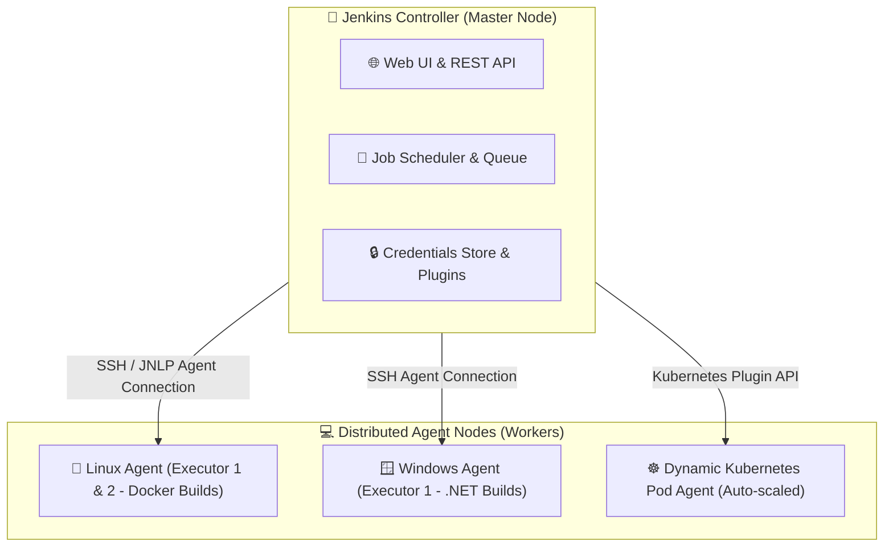
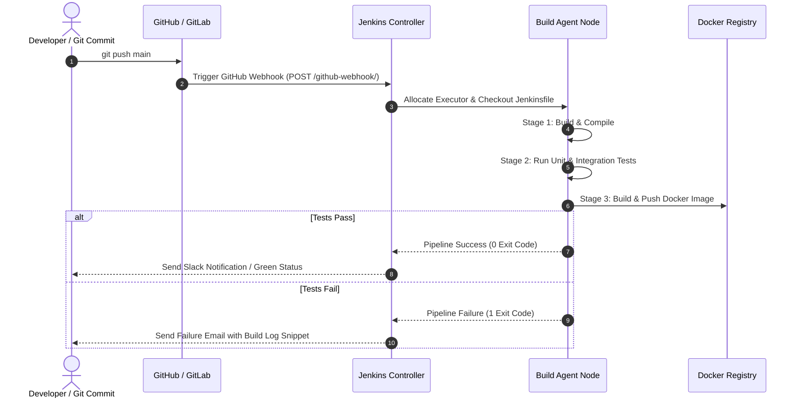

# ⚙️ Jenkins Master Roadmap & Learning Progress Tracker

## 🏛️ Jenkins Controller-Agent Architecture & Pipeline Execution

### 🏗️ Distributed Controller-Agent Architecture


### 🔄 Jenkins Pipeline Execution Sequence


---

## 📑 Phase 1: Jenkins Architecture & Core Fundamentals

### Module 1: Introduction to Jenkins
- [x] **What is Jenkins?**
  - Leading open-source Java-based automation server enabling continuous integration and delivery (CI/CD).
- [x] **Freestyle Jobs vs Pipeline Jobs**
  - **Freestyle**: Web UI-driven job configuration (legacy, hard to version control).
  - **Pipeline Jobs**: Code-driven pipeline defined in a `Jenkinsfile` committed alongside source code.

### Module 2: Controller-Agent Architecture
- [x] **Jenkins Controller (Master)**
  - Central node handling UI, scheduling builds, managing plugins, storing credentials, and dispatching tasks to agents.
- [x] **Agent Nodes & Executors**
  - Worker machines executing actual build steps. Communicates with Controller via SSH or JNLP (Java Network Launch Protocol).
  - **Executors**: Number of concurrent build slots available on an agent.

---

## ⚡ Phase 2: Jenkins Pipelines & Jenkinsfile

### Module 3: Declarative vs Scripted Pipelines
- [x] **Declarative Pipeline (Recommended Standard)**
  - Structured syntax (`pipeline { agent any ... }`) with strict validation and built-in error handling.
- [x] **Scripted Pipeline**
  - Groovy code execution (`node { ... }`) providing maximum imperative flexibility for complex custom logic.

### Module 4: Pipeline Syntax & Sections
- [x] **`agent` Section**: Defines where the pipeline executes (`agent any`, `agent none`, or `agent { label 'docker' }`).
- [x] **`stages` & `stage`**: Groups pipeline execution steps into distinct visual blocks (e.g. `Build`, `Test`, `Deploy`).
- [x] **`post` Condition Blocks**: Executes cleanup or notifications based on build outcome (`always`, `success`, `failure`, `changed`).

### Module 5: Environment Variables & Credentials
- [x] **Environment Block (`environment`)**: Setting global or stage-level env variables.
- [x] **Credentials Store (`credentials()`)**: Safely injecting secrets (SSH keys, Docker passwords) without exposing them in logs (`withCredentials`).

---

## 🛡️ Phase 3: Triggers, Integrations & Security

### Module 6: Pipeline Triggers
- [x] **GitHub Webhooks vs Poll SCM**
  - **Webhooks (Recommended)**: GitHub sends instant HTTP POST request on commit, triggering immediate build.
  - **Poll SCM**: Jenkins periodically polls Git repository for changes (`H/15 * * * *`).

### Module 7: Docker & Kubernetes Integration
- [x] **Docker Agents (`agent { docker { image 'maven:3.8' } }`)**
  - Executes build steps inside isolated Docker containers on the agent node.
- [x] **Dynamic Kubernetes Pod Agents**
  - Uses Kubernetes plugin to spin up temporary Pods for build execution, auto-scaling agents up and down.

---

## 🛠️ Phase 4: Practical Declarative Jenkinsfile Snippets

### Declarative Jenkinsfile for Dockerized App (`Jenkinsfile`)
```groovy
pipeline {
    agent {
        docker {
            image 'node:20-alpine'
            args '-p 3000:3000'
        }
    }

    environment {
        REGISTRY_CREDS = credentials('docker-hub-credentials')
        APP_NAME = 'my-node-app'
    }

    stages {
        stage('Checkout') {
            steps {
                checkout scm
            }
        }

        stage('Install & Test') {
            steps {
                sh 'npm ci'
                sh 'npm test'
            }
        }

        stage('Build & Push Docker Image') {
            steps {
                script {
                    docker.withRegistry('', 'docker-hub-credentials') {
                        def customImage = docker.build("${APP_NAME}:${env.BUILD_ID}")
                        customImage.push('latest')
                        customImage.push("${env.BUILD_ID}")
                    }
                }
            }
        }
    }

    post {
        success {
            echo "Pipeline succeeded for Build #${env.BUILD_ID}"
        }
        failure {
            echo "Pipeline failed! Check console output logs."
        }
    }
}
```

---

## 🎯 Top Jenkins Interview Q&A Cheatsheet (Master List)

### Q1: What is the difference between Declarative and Scripted Pipelines in Jenkins?
Declarative Pipelines use a strict, structured syntax (`pipeline { agent ... stages ... }`) that is easier to write, read, and maintain with built-in validation. Scripted Pipelines use free-form Groovy code (`node { ... }`), offering maximum imperative flexibility for complex custom build logic.

### Q2: How does the Controller-Agent architecture work in Jenkins?
The Controller (Master) handles UI, configuration, credentials, job scheduling, and plugins. It offloads actual build compilation and test execution to Agent (Slave) worker nodes via SSH or JNLP, enabling horizontal build scaling across multiple OS environments.

### Q3: What is the difference between Webhooks and Poll SCM triggers?
Webhooks send an instant HTTP POST request from GitHub/GitLab to Jenkins immediately when code is pushed, triggering builds in real-time. Poll SCM requires Jenkins to poll the remote repository periodically on a schedule, creating unnecessary server load and build delays.

### Q4: How do you handle sensitive credentials safely in a Jenkinsfile?
Use the Jenkins Credentials Store and retrieve secrets inside the pipeline using `credentials('credential-id')` or the `withCredentials([usernamePassword(...)])` wrapper. Jenkins automatically masks credential values with `****` in console logs.

### Q5: How do dynamic Kubernetes agents work in Jenkins?
Using the Kubernetes Plugin, Jenkins communicates with a Kubernetes cluster API. When a job starts, Jenkins dynamically provisions a temporary Kubernetes Pod to run the build steps inside containers, and automatically deletes the Pod when the build completes.
