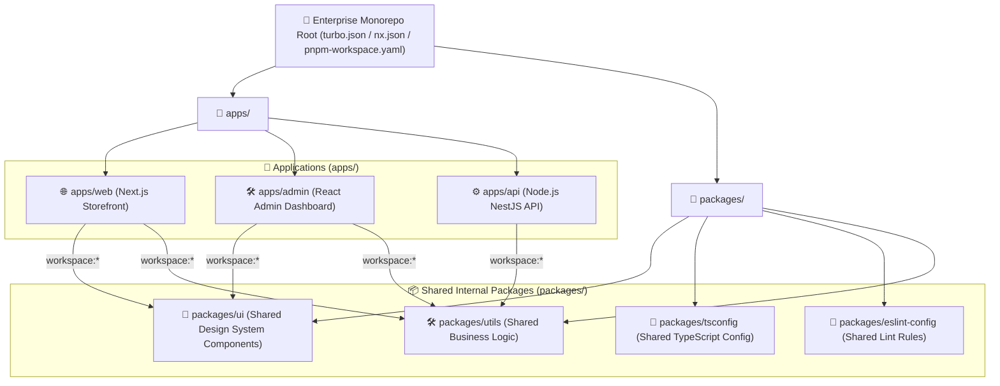
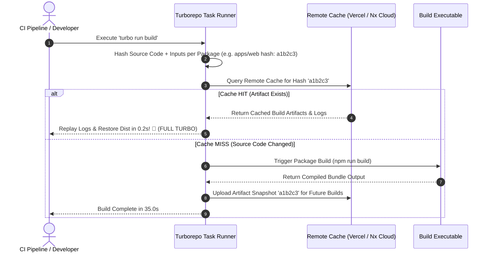

# 🏢 Monorepo Architecture Master Roadmap & Learning Progress Tracker

## 🏛️ Monorepo Architecture & Build Pipeline

### 🏗️ Monorepo Directory & Dependency Graph Architecture


### 🔄 Turborepo Remote Caching & Incremental Build Pipeline


---

## 📑 Phase 1: Monorepo Core & Workspace Managers

### Module 1: Monorepo vs Polyrepo Architecture
- [x] **Monorepo Definition**
  - Architectural strategy where multiple distinct applications and shared libraries are stored within a single unified Git repository.
- [x] **Monorepo vs Polyrepo (Multi-repo)**
  - **Polyrepo**: Separate Git repos per project. Causes dependency version drift, difficult cross-project refactoring, and complex npm publishing.
  - **Monorepo**: Single Git repo. Enables atomic cross-application commits, instant code sharing without npm publishing, and unified linting/testing.

### Module 2: Package Workspaces (pnpm, Yarn, npm)
- [x] **Package Workspaces (`pnpm-workspace.yaml` / `npm workspaces`)**
  - Configures workspace package links (`workspace:*`) enabling local symlinking of internal packages (`packages/ui`) into applications (`apps/web`).

---

## ⚡ Phase 2: Build Tools, Remote Caching & Affected Tasks

### Module 3: Modern Monorepo Build Tools (Turborepo vs Nx vs Lerna)
- [x] **Turborepo**: High-speed, Rust-powered build system with zero-config pipeline pipelines (`turbo.json`) and parallel execution graphs.
- [x] **Nx**: Enterprise monorepo build framework with code generation schematics, dependency graph visualization (`nx graph`), and module boundary enforcement.
- [x] **Lerna**: Classic monorepo manager focused on multi-package publishing to npm registries.

### Module 4: Remote Caching & Incremental Builds
- [x] **Computation Caching**
  - Hashes package source files, dependencies, and environment variables. Skips re-running tasks if outputs are already cached.
- [x] **Remote Caching (Vercel Cache / Nx Cloud)**
  - Shares build cache artifacts across all CI/CD build runners and team developer machines, reducing CI build times from 20 minutes to 30 seconds!

### Module 5: Affected Task Execution in CI/CD
- [x] **Affected Execution (`turbo run build --filter=...[HEAD~1]`)**
  - Runs tests/builds **only for applications and packages affected by the current Git commit diff**, ignoring unchanged projects.

---

## 🛠️ Phase 3: Practical Monorepo Configuration (`turbo.json` & Workspace Setup)

### 1. `pnpm-workspace.yaml` Configuration
```yaml
packages:
  - 'apps/*'
  - 'packages/*'
```

### 2. `turbo.json` Pipeline Configuration
```json
{
  "$schema": "https://turbo.build/schema.json",
  "globalDependencies": [".env"],
  "pipeline": {
    "build": {
      "dependsOn": ["^build"],
      "outputs": ["dist/**", ".next/**", "! .next/cache/**"]
    },
    "lint": {
      "outputs": []
    },
    "test": {
      "dependsOn": ["build"],
      "outputs": ["coverage/**"]
    },
    "dev": {
      "cache": false,
      "persistent": true
    }
  }
}
```

### 3. Application `package.json` referencing Internal Shared UI Package
```json
{
  "name": "web",
  "version": "1.0.0",
  "dependencies": {
    "@repo/ui": "workspace:*",
    "@repo/utils": "workspace:*",
    "next": "^14.0.0",
    "react": "^18.2.0"
  }
}
```

---

## 🎯 Top Monorepo Senior Interview Q&A Cheatsheet (Master List)

### Q1: What are the main benefits of a Monorepo compared to a Polyrepo architecture?
A Monorepo allows storing multiple applications (`apps/*`) and shared internal libraries (`packages/*`) in a single Git repository. Benefits include atomic cross-project commits, instant code sharing without publishing private packages to npm registries, unified linting/formatting rules, and single-pass CI/CD pipeline automation.

### Q2: How does Remote Caching work in Turborepo or Nx?
Turborepo/Nx computes a unique cryptographic hash for every task based on source file contents, dependencies, environment variables, and build flags. Before executing a task (e.g. `build`), it checks the Remote Cache server. On a cache hit, it downloads the pre-built artifacts and replays terminal logs instantly in seconds, skipping execution.

### Q3: What does `"dependsOn": ["^build"]` mean in a Turborepo pipeline configuration?
The `^` symbol specifies a topological dependency rule: before building the current package (e.g. `apps/web`), Turborepo must first build all of its internal dependency packages (e.g. `packages/ui`, `packages/utils`).

### Q4: How do package workspace managers (pnpm / Yarn) link internal packages?
Workspace managers scan `pnpm-workspace.yaml` or `package.json` `workspaces` arrays. When an application lists `"@repo/ui": "workspace:*"`, the workspace manager creates a local symlink in `node_modules` pointing directly to `packages/ui`, avoiding external npm downloads.
