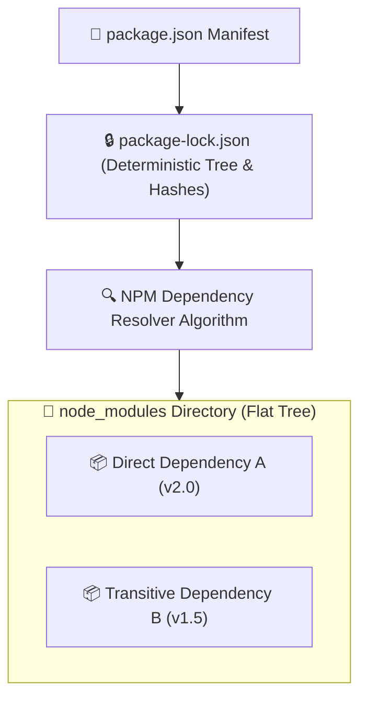
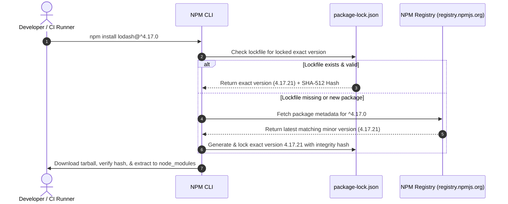

# 📦 NPM & Package Management Master Roadmap & Learning Progress Tracker

## 🏛️ Package Manager Architecture & Dependency Resolution

### 🏗️ NPM Dependency Resolution Architecture


### 🔄 Semantic Versioning (SemVer) Resolution Sequence


---

## 📑 Phase 1: NPM Core & Package Architecture

### Module 1: Introduction to NPM & Node Package Ecosystem
- [x] **What is NPM?**
  - Default package manager for Node.js comprising a CLI tool and the central NPM Registry (`registry.npmjs.org`).
- [x] **The Node Package Ecosystem**
  - World's largest software registry distributing reusable open-source JavaScript libraries and CLI tools.

### Module 2: `package.json` Anatomy & Fields
- [x] **`dependencies` vs `devDependencies`**
  - `dependencies`: Libraries required for production runtime (e.g. `express`, `mongoose`).
  - `devDependencies`: Tools required only during development/testing (e.g. `jest`, `typescript`, `nodemon`).
- [x] **`peerDependencies` & `optionalDependencies`**
  - `peerDependencies`: Expresses compatibility requirements for plugins without bundling them (e.g. React component requiring host `react`).
  - `optionalDependencies`: Non-critical packages where installation failure does not break the build.
- [x] **Metadata & Entry Points (`main`, `module`, `bin`, `scripts`)**
  - `main`: Entry point for CommonJS (`dist/index.js`); `module`: Entry point for ES Modules; `bin`: Executable CLI scripts; `scripts`: Command shortcuts.

### Module 3: Semantic Versioning (SemVer)
- [x] **SemVer Format (`MAJOR.MINOR.PATCH`)**
  - `MAJOR`: Breaking breaking changes.
  - `MINOR`: New backward-compatible functionality.
  - `PATCH`: Backward-compatible bug fixes.
- [x] **Version Range Operators (`^`, `~`, exact, wildcard)**
  - Caret (`^1.2.3`): Allows updates to higher `MINOR` and `PATCH` versions ($< 2.0.0$).
  - Tilde (`~1.2.3`): Allows updates only to higher `PATCH` versions ($< 1.3.0$).
  - Exact (`1.2.3`): Locks strictly to version `1.2.3`.

### Module 4: `package-lock.json` vs `package.json`
- [x] **`package-lock.json` Purpose**
  - Automatically generated lockfile guaranteeing identical, deterministic `node_modules` trees across all machines.
- [x] **`npm ci` vs `npm install`**
  - `npm install`: Evaluates `package.json`, updates `package-lock.json`, and installs dependencies.
  - `npm ci` (Clean Install): Deletes `node_modules`, installs strictly from `package-lock.json`, fails if out of sync with `package.json`. Ideal for CI/CD pipelines!

---

## ⚡ Phase 2: CLI Commands, Scripts & Workspaces

### Module 5: Essential NPM CLI Commands
- [x] **Core Management Commands**
  - `npm init` (initializes manifest), `npm install` (`npm i`), `npm update`, `npm uninstall`, `npm prune` (removes extraneous packages), `npm dedupe`.
- [x] **NPM Link (`npm link`)**
  - Creates a global symlink between local package development folders to test unpublished packages locally.

### Module 6: NPM Scripts & Lifecycle Hooks
- [x] **Script Execution & Lifecycle Hooks**
  - Running scripts via `npm run <script-name>`.
  - Automatic pre/post hooks: `preinstall`, `postinstall` (runs post-download build scripts), `pretest`, `test`, `posttest`.
- [x] **`npx` (Package Runner)**
  - Executes binaries from local or temporary remote packages without globally installing them (`npx create-react-app`).

### Module 7: NPM Workspaces & Monorepos
- [x] **NPM Workspaces (`workspaces` field)**
  - Native feature managing multiple sub-packages within a single root monorepository.
  - Symlinks sub-packages together and hoists shared dependencies to root `node_modules`.

---

## 🛠️ Phase 3: Package Managers & Publishing

### Module 8: Package Manager Comparisons (NPM vs Yarn vs pnpm)
- [x] **NPM vs Yarn vs pnpm**
  - **NPM**: Default built-in tool using flat `node_modules` layout.
  - **Yarn**: Fast parallel downloading with offline caching.
  - **pnpm**: Uses a global content-addressable store and **hard links/symlinks**, saving up to 70% disk space over NPM.

### Module 9: Publishing Packages to NPM Registry
- [x] **Publishing Workflow**
  - `npm login`, `npm publish`, using `.npmignore` to exclude test files, publishing scoped packages (`@myorg/my-pkg`).

### Module 10: Security Auditing & Supply Chain Protection
- [x] **`npm audit` & Supply Chain Attacks**
  - `npm audit fix` scans dependencies against known CVE databases.
  - Mitigating typosquatting, malicious `postinstall` hooks, and lockfile poisoning.

---

## 🛠️ Phase 4: Practical Configuration Snippets

### 1. `package.json` Monorepo Workspaces & Scripts Configuration
```json
{
  "name": "my-monorepo",
  "version": "1.0.0",
  "private": true,
  "workspaces": [
    "packages/*"
  ],
  "scripts": {
    "build": "npm run build --workspaces",
    "test": "npm run test --workspaces",
    "preinstall": "npx only-allow pnpm"
  },
  "devDependencies": {
    "typescript": "^5.0.0"
  }
}
```

### 2. Custom `.npmrc` Security & Auth Configuration
```ini
# Force exact version saving on npm install
save-exact=true

# Custom registry scoping
@mycompany:registry=https://npm.pkg.github.com

# Strict SSL check and timeout
strict-ssl=true
fetch-timeout=60000
```

---

## 🎯 Top NPM Interview Q&A Cheatsheet (Master List)

### Q1: What is the difference between `package.json` and `package-lock.json`?
`package.json` specifies broad version ranges using SemVer operators (`^`, `~`). `package-lock.json` locks the exact resolved version, exact dependency tree hierarchy, and cryptographic SHA-512 integrity hashes for every package, ensuring deterministic builds across machines.

### Q2: When should you use `npm ci` instead of `npm install`?
Use `npm ci` in automated CI/CD build environments. `npm ci` deletes existing `node_modules`, installs strictly from `package-lock.json` without modifying it, and throws an error if `package-lock.json` is out of sync with `package.json`, guaranteeing faster and reproducible builds.

### Q3: What is the difference between Caret (`^`) and Tilde (`~`) in SemVer?
- Caret (`^1.2.3`): Allows backward-compatible updates to higher MINOR and PATCH versions ($< 2.0.0$).
- Tilde (`~1.2.3`): Allows backward-compatible updates only to higher PATCH versions ($< 1.3.0$).

### Q4: How does pnpm differ from NPM and Yarn?
pnpm uses a global content-addressable storage on disk. Instead of duplicating package files in every project's `node_modules`, pnpm creates hard links and symlinks pointing to single stored files, saving gigabytes of disk space and preventing phantom dependency access.

### Q5: What are `peerDependencies` and when should you use them?
`peerDependencies` express a requirement that the host application must install a specific version of a dependency (e.g. a plugin requiring `react@^18.0.0`). The plugin itself does not bundle the dependency, avoiding duplicate instances at runtime.
