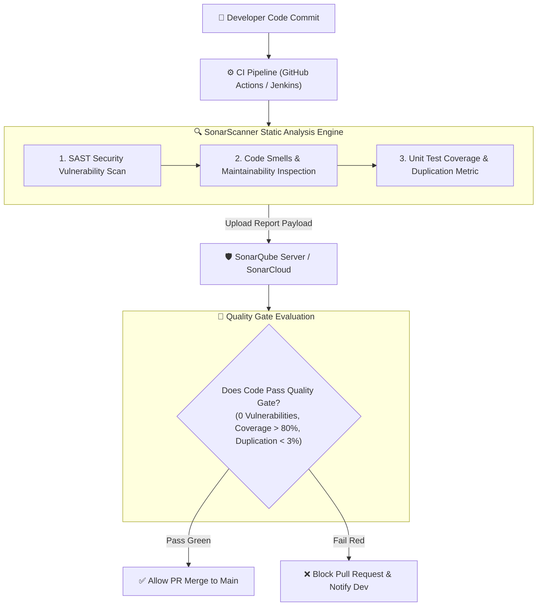

# 🛡️ SonarQube & Code Quality Master Roadmap & Learning Progress Tracker

## 🏛️ SonarQube Architecture & Quality Gate Pipeline

### 🏗️ SonarQube Static Analysis Pipeline


---

## 📑 Phase 1: Code Quality Fundamentals & Clean Code

### Module 1: Clean Code Philosophy & Sonar Way
- [x] **Clean Code Standards**
  - Ensuring software is readable, maintainable, secure, and covered by automated tests.
- [x] **SonarQube Issues Taxonomy**
  - **Bugs**: Coding errors that will cause runtime crashes or incorrect results.
  - **Vulnerabilities**: Open security flaws exploitable by attackers (SQLi, XSS, Hardcoded Credentials).
  - **Code Smells**: Maintainability issues making code difficult to read, refactor, or test.
  - **Security Hotspots**: Security-sensitive code requiring manual developer review.

### Module 2: Cyclomatic vs Cognitive Complexity
- [x] **Cyclomatic Complexity**
  - Measures the number of linearly independent paths through source code based on control flow decisions (`if`, `while`, `case`).
- [x] **Cognitive Complexity**
  - Measures **how difficult code is to understand and comprehend for a human developer**, penalizing nested control flow breaks.

---

## ⚡ Phase 2: Quality Gates, Profiles & CI/CD Integration

### Module 3: Quality Gates & Quality Profiles
- [x] **Quality Profiles**
  - Collections of active coding rules enforced per language (Java, JS, Python, C#).
- [x] **Quality Gates**
  - Mandatory pass/fail policy criteria (e.g. Coverage $> 80\%$, New Security Rating $= \text{A}$, Duplicated Lines $< 3\%$) gating production releases.

### Module 4: SonarScanner CI/CD Integration
- [x] **SonarScanner CLI**
  - Scanner binary integrated into GitHub Actions, Jenkins, Maven (`mvn sonar:sonar`), or Gradle to analyze code during builds.

---

## 🛠️ Phase 3: Practical Sonar Configuration & GitHub Actions Integration

### 1. `sonar-project.properties` Configuration
```properties
# Unique project key and name
sonar.projectKey=my_enterprise_app
sonar.projectName=My Enterprise App
sonar.projectVersion=1.0.0

# Source and Test directories
sonar.sources=src
sonar.tests=test
sonar.exclusions=**/node_modules/**,**/dist/**,**/*.spec.ts

# Language & Encoding
sonar.sourceEncoding=UTF-8

# Test Coverage report paths (LCOV for JS/TS, JaCoCo for Java)
sonar.javascript.lcov.reportPaths=coverage/lcov.info
```

### 2. GitHub Actions SonarCloud Scan Workflow (`.github/workflows/sonar.yml`)
```yaml
name: SonarQube Code Quality Analysis

on:
  push:
    branches: [ main ]
  pull_request:
    types: [ opened, synchronize, reopened ]

jobs:
  sonar-analysis:
    runs-on: ubuntu-latest

    steps:
      - name: Checkout Source Code
        uses: actions/checkout@v4
        with:
          fetch-depth: 0 # Full history required for blame info

      - name: Setup Node.js & Run Tests with Coverage
        uses: actions/setup-node@v4
        with:
          node-version: '20'
      - run: npm ci
      - run: npm test -- --coverage

      - name: SonarCloud Scan Action
        uses: SonarSource/sonarcloud-github-action@v2
        env:
          GITHUB_TOKEN: ${{ secrets.GITHUB_TOKEN }}
          SONAR_TOKEN: ${{ secrets.SONAR_TOKEN }}
```

---

## 🎯 Top SonarQube Senior Interview Q&A Cheatsheet (Master List)

### Q1: What is the difference between a Code Smell, a Bug, and a Vulnerability in SonarQube?
- **Bug**: A coding error that breaks functionality or causes runtime crashes.
- **Vulnerability**: A security flaw that exposes the system to attack (e.g. SQL Injection, hardcoded secrets).
- **Code Smell**: A maintainability flaw that doesn't break code execution but makes it harder to read, refactor, or maintain.

### Q2: What is a Quality Gate in SonarQube and why is it critical in CI/CD?
A Quality Gate is a set of boolean pass/fail conditions (e.g. 0 New Bugs, $>80\%$ Test Coverage, 0 Security Hotspots) applied to new code. In CI/CD pipelines, if code fails the Quality Gate, the build fails and PR merge is automatically blocked.

### Q3: What is the difference between Cyclomatic Complexity and Cognitive Complexity?
Cyclomatic Complexity measures the number of decision paths through a method mathematically. Cognitive Complexity measures how mentally difficult code is for a human developer to understand, incrementing score for nested loops/conditions and code flow breaks.

### Q4: How does SonarQube track Code Coverage and Duplication?
SonarQube does not execute unit tests itself; it parses test coverage report artifacts generated by test frameworks (JaCoCo for Java, LCOV/Istanbul for JS, Coverage.py for Python). Duplication is calculated by SonarScanner scanning for identical code token blocks.
