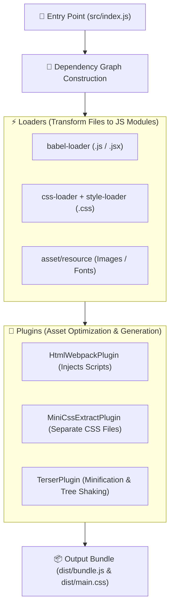
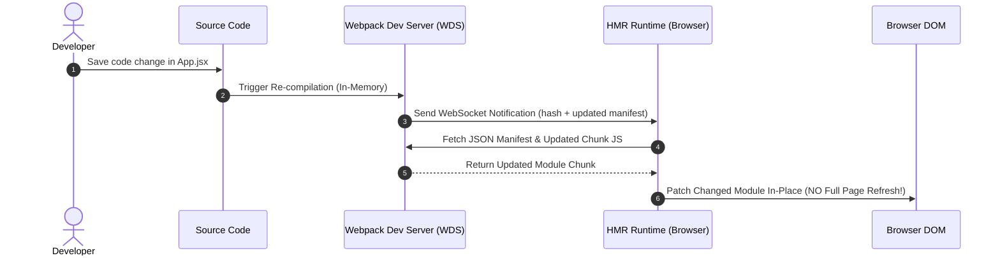

# 📦 Webpack 5 Master Roadmap & Learning Progress Tracker

## 🏛️ Webpack 5 Architecture & Build Pipeline

### 🏗️ Webpack Bundling & Dependency Graph Pipeline


### 🔄 Hot Module Replacement (HMR) Sequence


---

## 📑 Phase 1: Webpack Core Concepts & Architecture

### Module 1: Introduction to Webpack
- [x] **What is Webpack?**
  - Static module bundler for modern JavaScript applications.
  - Takes application source modules and recursively builds a dependency graph outputting optimized static bundles.
- [x] **Monolithic Bundles vs Modular Source**
  - Allows organizing code into hundreds of modular files while serving single or split optimized bundles to browsers.

### Module 2: 1. Entry Point (`entry`)
- [x] **Single Entry Point**
  - Specifies starting point (`src/index.js`) from which Webpack recursively maps dependencies.
- [x] **Multi-Page & Dynamic Entry Points**
  - Configuring multiple entry objects (`entry: { pageA: './src/a.js', pageB: './src/b.js' }`) for multi-page applications.

### Module 3: 2. Output (`output`)
- [x] **Output Configuration (`path`, `filename`, `clean`)**
  - Configures target compilation directory (`dist/`) and output filename naming conventions.
- [x] **Cache Busting Hashes**
  - `[contenthash]`: Hash changes **only when file content changes** (ideal for long-term browser caching).
  - `[chunkhash]`: Hash changes when the specific entry chunk changes.
  - `[hash]`: Hash changes if any asset in the entire compilation changes.

### Module 4: 3. Loaders (`module.rules`)
- [x] **What are Loaders?**
  - Preprocessors transforming non-JavaScript files (CSS, SASS, TypeScript, Images) into valid JS modules.
- [x] **Loader Execution Order**
  - Loaders execute **Right-to-Left** (or Bottom-to-Top) in specified array rules (`use: ['style-loader', 'css-loader', 'sass-loader']`).

### Module 5: 4. Plugins (`plugins`)
- [x] **What are Plugins?**
  - Custom build step hooks tapping into Webpack's compiler lifecycle via Tapable engine for asset optimization and HTML generation.
- [x] **Plugins vs Loaders**
  - Loaders transform individual files; Plugins operate across the entire bundle compilation graph.

### Module 6: 5. Mode (`mode`)
- [x] **Development vs Production Mode**
  - `development`: Optimizes for fast compilation, readable code, and detailed dev debugging.
  - `production`: Enables minification (Terser), scope hoisting, tree shaking, and dead-code elimination.

---

## ⚡ Phase 2: Loaders Deep Dive & Asset Management

### Module 7: JavaScript & Transpilation Loaders
- [x] **`babel-loader` & `ts-loader`**
  - `babel-loader`: Transpiles ES6+/JSX code using Babel configuration.
  - `ts-loader`: Compiles TypeScript files (`.ts`/`.tsx`) to JavaScript.

### Module 8: CSS, SASS & Styling Loaders
- [x] **CSS Processing Pipeline**
  - `sass-loader` (compiles SCSS to CSS) $\rightarrow$ `postcss-loader` (Tailwind/Autoprefixer) $\rightarrow$ `css-loader` (resolves `@import`/`url()`) $\rightarrow$ `style-loader` or `MiniCssExtractPlugin`.
- [x] **CSS Modules (`[name]__[local]--[hash]`)**
  - Scoping CSS class names locally to prevent global CSS collisions.

### Module 9: Webpack 5 Asset Modules
- [x] **Asset Modules (`asset/resource`, `asset/inline`)**
  - Native Webpack 5 replacement for legacy `file-loader` (emits separate assets) and `url-loader` (inlines base64 Data URIs).

---

## 🛠️ Phase 3: Essential Plugins, Code Splitting & Tree Shaking

### Module 10: Essential Production Plugins
- [x] **`HtmlWebpackPlugin`**: Injects Webpack bundles automatically into HTML template files.
- [x] **`MiniCssExtractPlugin`**: Extracts CSS into separate `.css` files per JS module for parallel loading.
- [x] **`CleanWebpackPlugin`**: Deletes old `dist/` build files before compiling.

### Module 11: Code Splitting & Dynamic Imports
- [x] **Vendor Code Splitting (`optimization.splitChunks`)**
  - Extracts third-party `node_modules` dependencies into a shared `vendors.js` chunk.
- [x] **Dynamic Imports (`import()`) & Magic Comments**
  - Lazy-loads code chunks on-demand (`import(/* webpackChunkName: "admin" */ './admin')`).

### Module 12: Tree Shaking & Dead Code Elimination
- [x] **Tree Shaking Requirements**
  - Statically analyzes ES6 `import`/`export` statements to prune unused exports. Requires `mode: 'production'` and `"sideEffects": false` in `package.json`.

---

## 🚀 Phase 4: DevServer, Micro-Frontends & Next-Gen Build Tools

### Module 13: Webpack Dev Server & HMR
- [x] **Hot Module Replacement (HMR)**
  - Patches changed modules in browser memory live via WebSockets without triggering full page reloads.
- [x] **`historyApiFallback`**
  - Routes single-page application (SPA) paths to `index.html` to prevent 404 page refreshes.

### Module 14: Source Maps & Debugging
- [x] **Source Map Options (`devtool`)**
  - `eval-source-map` for high-speed dev rebuilding vs `source-map` for accurate production error stack traces.

### Module 15: Webpack 5 Module Federation
- [x] **Micro-Frontends with Module Federation**
  - Allows multiple independent Webpack builds to share runtime modules and micro-frontend components seamlessly.

### Module 16: Webpack vs Next-Gen Build Tools (Vite, SWC, Turbopack)
- [x] **Build Tool Comparisons**
  - Webpack: Bundles full dependency graph in memory upfront ($O(N)$ startup time).
  - Vite: Serves native browser ES Modules (ESM) instantly ($O(1)$ startup time) and builds via Rollup.

---

## 🛠️ Phase 5: Practical Production Webpack 5 Configuration

### Production Webpack 5 Config (`webpack.config.js`)
```javascript
const path = require('path');
const HtmlWebpackPlugin = require('html-webpack-plugin');
const MiniCssExtractPlugin = require('mini-css-extract-plugin');
const { CleanWebpackPlugin } = require('clean-webpack-plugin');

module.exports = (env, argv) => {
  const isProduction = argv.mode === 'production';

  return {
    entry: './src/index.js',
    output: {
      path: path.resolve(__dirname, 'dist'),
      filename: isProduction ? 'js/[name].[contenthash:8].js' : 'js/[name].js',
      assetModuleFilename: 'assets/[hash][ext][query]',
      clean: true,
    },
    devServer: {
      static: './dist',
      port: 3000,
      hot: true,
      historyApiFallback: true,
    },
    module: {
      rules: [
        {
          test: /\.(js|jsx)$/,
          exclude: /node_modules/,
          use: 'babel-loader',
        },
        {
          test: /\.css$/,
          use: [
            isProduction ? MiniCssExtractPlugin.loader : 'style-loader',
            'css-loader',
            'postcss-loader',
          ],
        },
        {
          test: /\.(png|svg|jpg|jpeg|gif)$/i,
          type: 'asset/resource',
        },
      ],
    },
    resolve: {
      extensions: ['.js', '.jsx', '.json'],
      alias: {
        '@': path.resolve(__dirname, 'src'),
      },
    },
    plugins: [
      new CleanWebpackPlugin(),
      new HtmlWebpackPlugin({
        template: './public/index.html',
      }),
      ...(isProduction
        ? [new MiniCssExtractPlugin({ filename: 'css/[name].[contenthash:8].css' })]
        : []),
    ],
    optimization: {
      splitChunks: {
        chunks: 'all',
        name: 'vendors',
      },
    },
  };
};
```

---

## 🎯 Top Webpack Senior Interview Q&A Cheatsheet (Master List)

### Q1: What is the difference between Webpack Loaders and Plugins?
Loaders operate at the individual file level to transform non-JavaScript files (CSS, SASS, Images, TS) into valid JavaScript modules before bundling. Plugins operate across the entire build lifecycle and bundle graph to perform asset optimization, CSS extraction (`MiniCssExtractPlugin`), minification, and HTML injection (`HtmlWebpackPlugin`).

### Q2: How does Tree Shaking work in Webpack and what are its requirements?
Tree shaking is dead-code elimination that statically analyzes ES6 `import`/`export` statements to remove unused code exports during production builds. Requirements: Must use ES6 module syntax (not CommonJS `require`), mode must be `production`, and `package.json` should specify `"sideEffects": false`.

### Q3: What is the difference between `style-loader` and `MiniCssExtractPlugin.loader`?
`style-loader` injects compiled CSS directly into the DOM inside inline `<style>` tags at runtime (fast for development & HMR). `MiniCssExtractPlugin.loader` extracts CSS into separate physical `.css` files for production, enabling parallel CSS downloading and browser caching.

### Q4: How does Webpack vs Vite compare in modern web development?
Webpack bundles all source modules into memory upfront before starting the dev server ($O(N)$ startup time). Vite leverages native ES Modules (ESM) in modern browsers, serving unbundled source files instantly ($O(1)$ startup time) and using Esbuild/Rollup for high-speed builds.

### Q5: How do `contenthash`, `chunkhash`, and `hash` differ in Webpack output filenames?
- `hash`: Single build-level hash; changes if *any* asset in the entire compilation changes.
- `chunkhash`: Hash based on the specific entry chunk.
- `contenthash`: Hash generated strictly from the **exact content of that specific file**, maximizing browser long-term caching (CSS file hash changes only if CSS content changes).
