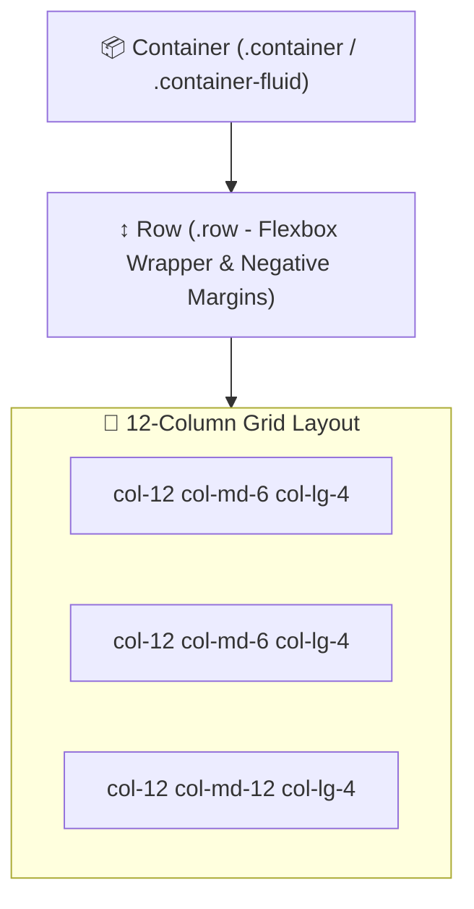

# 🅱️ Bootstrap 5 Master Roadmap & Learning Progress Tracker

## 🏛️ Bootstrap 5 Architecture & Layout Engine

### 🏗️ Bootstrap 12-Column Responsive Grid Architecture


---

## 📑 Phase 1: Bootstrap 5 Core & Grid Engine

### Module 1: Introduction & Bootstrap 5 vs Bootstrap 4
- [x] **Bootstrap 5 Overhaul**
  - Completely dropped jQuery dependency in favor of native vanilla JavaScript (`bootstrap.Native`).
  - Native CSS Custom Properties (CSS Variables), RTL (Right-to-Left) support, utility API expansion.

### Module 2: Responsive Grid System & Breakpoints
- [x] **12-Column Flexbox Grid**
  - Layout built on Containers (`.container`, `.container-fluid`), Rows (`.row`), and Columns (`.col-*`).
- [x] **Breakpoints**
  - `xs` ($<576\text{px}$), `sm` ($\ge 576\text{px}$), `md` ($\ge 768\text{px}$), `lg` ($\ge 992\text{px}$), `xl` ($\ge 1200\text{px}$), `xxl` ($\ge 1400\text{px}$).

---

## ⚡ Phase 2: Components, Utilities & Customization

### Module 3: Components & Native JS API
- [x] **Interactive Components**
  - Navbar, Modals (`bootstrap.Modal`), Offcanvas sidebars, Toast notifications, Accordion, Carousel, Cards, Form Controls.

### Module 4: SASS/SCSS Customization & Utility API
- [x] **SASS Customization**
  - Overriding theme color maps (`$theme-colors`), font stacks, and spacing multipliers before `@import "bootstrap"`.
- [x] **Bootstrap Utility API**
  - Generates custom utility classes (`.text-primary`, `.bg-dark`, `.p-3`, `.d-flex`, `.justify-content-between`).

---

## 🛠️ Phase 3: Practical Bootstrap 5 Code Component

### Responsive Card Layout with Modal (`index.html`)
```html
<div class="container my-5">
  <div class="row g-4">
    <div class="col-12 col-md-6 col-lg-4">
      <div class="card h-100 shadow-sm border-0">
        
        <div class="card-body d-flex flex-column">
          <h5 class="card-title text-primary fw-bold">Enterprise Product</h5>
          <p class="card-text text-muted flex-grow-1">Responsive Bootstrap 5 card component utilizing flexbox utilities.</p>
          <button type="button" class="btn btn-outline-primary mt-3 w-100" data-bs-toggle="modal" data-bs-target="#infoModal">
            View Details
          </button>
        </div>
      </div>
    </div>
  </div>
</div>

<!-- Modal Component -->
<div class="modal fade" id="infoModal" tabindex="-1" aria-labelledby="infoModalLabel" aria-hidden="true">
  <div class="modal-dialog modal-dialog-centered">
    <div class="modal-content">
      <div class="modal-header">
        <h5 class="modal-title" id="infoModalLabel">Product Details</h5>
        <button type="button" class="btn-close" data-bs-dismiss="modal" aria-label="Close"></button>
      </div>
      <div class="modal-body">
        Modal content loaded without jQuery dependency.
      </div>
    </div>
  </div>
</div>
```

---

## 🎯 Top Bootstrap Interview Q&A Cheatsheet (Master List)

### Q1: What are the major architectural changes introduced in Bootstrap 5 compared to Bootstrap 4?
Bootstrap 5 completely dropped jQuery dependency in favor of vanilla JavaScript for interactive components (Modals, Offcanvas, Toasts), dropped IE11 support, introduced an expanded Utility API powered by SASS maps, added native CSS Custom Properties, and added extra large (`xxl`) grid breakpoints.

### Q2: How does Bootstrap's 12-Column Grid System work?
The grid requires `.container` (centers content with max-width) $\rightarrow$ `.row` (flexbox wrapper with negative side margins) $\rightarrow$ `.col-*` (child columns with side padding gutters). Columns specify how many of the 12 total grid slots to occupy across responsive breakpoints (`col-12 col-md-6 col-lg-4`).

### Q3: How do you customize Bootstrap theme colors and styling using SASS?
Define custom SASS variables (e.g. `$primary: #6f42c1;`) or override the `$theme-colors` map *before* importing Bootstrap SASS files (`@import "bootstrap/scss/bootstrap";`), allowing SASS compilation to generate custom CSS utility classes automatically.
