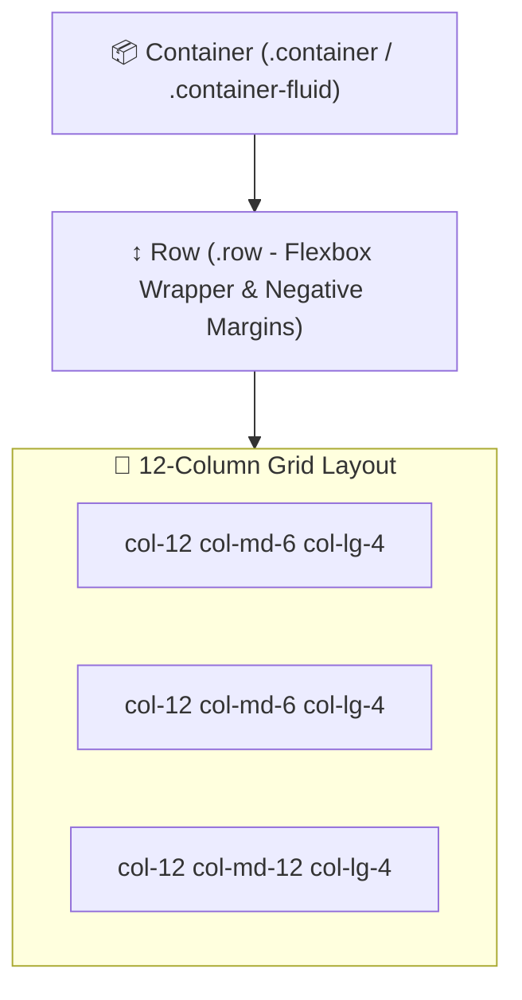

# 🅱️ Bootstrap 5 Master Roadmap & Learning Progress Tracker

## 🏛️ Bootstrap 5 Architecture & Layout Engine

### 🏗️ Bootstrap 12-Column Responsive Grid Architecture


---

## 📑 Phase 1: Bootstrap 5 Core & Grid Engine

### Module 1: Introduction & Bootstrap 5 vs Bootstrap 4
- [x] **Bootstrap 5 Overhaul**
  - Completely dropped jQuery dependency in favor of native vanilla JavaScript (`bootstrap.Modal`, `bootstrap.Offcanvas`).
  - Dropped IE11 support, added native CSS Custom Properties (Variables), expanded Utility API, and added RTL support.

### Module 2: 12-Column Responsive Grid System
- [x] **Grid System Hierarchy**
  - Requires Container $\rightarrow$ Row $\rightarrow$ Column hierarchy. `.container` centers content; `.container-fluid` expands 100% width.
- [x] **Row & Column Mechanics**
  - `.row` uses Flexbox with negative side margins to counteract column padding gutters (`.g-*`).

### Module 3: Responsive Grid Breakpoints
- [x] **Breakpoint Thresholds**
  - `xs` ($<576\text{px}$), `sm` ($\ge 576\text{px}$), `md` ($\ge 768\text{px}$), `lg` ($\ge 992\text{px}$), `xl` ($\ge 1200\text{px}$), `xxl` ($\ge 1400\text{px}$).
- [x] **Column Sizing & Offsets**
  - Specifying column widths (`col-12 col-md-6 col-lg-4`), auto-fit columns (`col`), ordering (`order-1`), and offsets (`offset-md-2`).

---

## ⚡ Phase 2: Content, Typography & Form Controls

### Module 4: Typography, Tables & Images
- [x] **Reboot CSS & Typography**
  - Normalizes elements via Reboot CSS. Display headings (`.display-1`), lead paragraphs (`.lead`), responsive images (`.img-fluid`).
- [x] **Styled Tables**
  - `.table-striped`, `.table-hover`, `.table-bordered`, `.table-responsive` wrapping.

### Module 5: Form Controls & Validation
- [x] **Form Components & Floating Labels**
  - `.form-control`, `.form-select`, `.form-check`, `.form-range`, and `.form-floating` for floating placeholder labels.
- [x] **Client-Side Form Validation**
  - Custom HTML5 validation states (`.is-valid`, `.is-invalid`, `.valid-feedback`, `.invalid-feedback`).

---

## 🛠️ Phase 3: Interactive Components & JavaScript API

### Module 6: Navigation Components
- [x] **Navbar & Navs**
  - `.navbar-expand-lg`, responsive toggle button (`.navbar-toggler`), Navs & Tabs (`.nav-tabs`, `.nav-pills`), Pagination.

### Module 7: Interactive Overlay Components
- [x] **Modals, Offcanvas & Toasts**
  - Modals (`bootstrap.Modal`), Offcanvas sidebars (`.offcanvas-start`), Toast notifications, Tooltips (`bootstrap.Tooltip`).

### Module 8: Display & Feedback Components
- [x] **Cards, Accordions & Carousels**
  - Card component (`.card`), Accordion (`.accordion-flush`), Carousel (`.carousel-fade`), Alerts (`.alert-dismissible`), Badges.

---

## ⚙️ Phase 4: Utilities, Flexbox & SASS Customization

### Module 9: Flexbox Utilities
- [x] **Flexbox Helpers**
  - `.d-flex`, `.flex-row`, `.flex-column`, `.justify-content-between`, `.align-items-center`, `.flex-grow-1`.

### Module 10: Spacing, Positioning & Color Utilities
- [x] **Spacing Scale ($0$ to $5$)**
  - Margin & Padding (`.m-3`, `.py-4`, `.px-auto`), Position (`.position-relative`, `.sticky-top`), Colors (`.text-primary`, `.bg-dark`).

### Module 11: SASS/SCSS Customization
- [x] **Variable Overrides**
  - Overriding `$primary`, `$font-family-base`, and `$theme-colors` SASS maps before `@import "bootstrap/scss/bootstrap"`.

### Module 12: Utility API Architecture
- [x] **SASS Utility API**
  - Customizing the `$utilities` SASS map to generate new custom utility classes at compile time.

---

## 🚀 Phase 5: Accessibility & Production Optimization

### Module 13: Accessibility (a11y) & ARIA
- [x] **Accessibility Standards**
  - Required ARIA attributes (`aria-expanded`, `aria-controls`, `aria-hidden`), focus management, `.visually-hidden`.

### Module 14: Bootstrap Icons & Custom Bundling
- [x] **Icons & SASS Purging**
  - Integrating Bootstrap Icons (`bi bi-heart`); purging unused CSS classes via PurgeCSS.

### Module 15: Bootstrap vs Tailwind Architecture
- [x] **Framework Comparisons**
  - Bootstrap: Pre-designed opinionated UI components for rapid prototyping.
  - Tailwind: Low-level atomic utility classes for custom design systems.

---

---

## 📚 Exhaustive Bootstrap 5 Class Names Reference Matrix

| Category | Bootstrap 5 Utility Class Names | Description / CSS Equivalent |
| :--- | :--- | :--- |
| **Containers & Grid** | `.container`, `.container-fluid`, `.container-sm/md/lg/xl/xxl` | Fixed max-width, 100% fluid width, or responsive breakpoint container |
| **Row & Gutters** | `.row`, `.g-0` to `.g-5`, `.gx-3`, `.gy-4` | Flexbox row wrapper; sets X/Y padding gutters between columns |
| **Columns & Sizing** | `.col`, `.col-auto`, `.col-1` to `.col-12`, `.col-sm-6`, `.col-md-4`, `.col-lg-3` | Auto-width column, content-width column, or 12-column grid spans |
| **Column Alignment** | `.align-items-start/center/end`, `.justify-content-start/center/end/between/around/evenly` | Align items on cross-axis; justify content on main axis |
| **Column Ordering** | `.order-first`, `.order-last`, `.order-0` to `.order-5` | Changes visual flexbox column rendering order |
| **Column Offsets** | `.offset-1` to `.offset-11`, `.offset-md-3` | Adds left margin offset to shift column right |
| **Display Utilities** | `.d-none`, `.d-block`, `.d-flex`, `.d-inline-flex`, `.d-grid`, `.d-inline-block`, `.d-md-flex` | Sets CSS `display` property responsively |
| **Flex Direction** | `.flex-row`, `.flex-column`, `.flex-row-reverse`, `.flex-column-reverse` | Sets flex container axis orientation |
| **Flex Wrap & Grow** | `.flex-wrap`, `.flex-nowrap`, `.flex-grow-0/1`, `.flex-shrink-0/1` | Controls flex line wrapping, growing, and shrinking |
| **Spacing (Margin)** | `.m-0` to `.m-5`, `.mt-*`, `.mb-*`, `.ms-*` (start/left), `.me-*` (end/right), `.mx-*`, `.my-*`, `.m-auto` | Margin utilities ($0=0$, $1=0.25\text{rem}$, $2=0.5\text{rem}$, $3=1\text{rem}$, $4=1.5\text{rem}$, $5=3\text{rem}$) |
| **Spacing (Padding)** | `.p-0` to `.p-5`, `.pt-*`, `.pb-*`, `.ps-*`, `.pe-*`, `.px-*`, `.py-*` | Padding utilities ($0=0$ to $5=3\text{rem}$) |
| **Sizing (Width/Height)** | `.w-25`, `.w-50`, `.w-75`, `.w-100`, `.w-auto`, `.mw-100`, `.h-25`, `.h-50`, `.h-75`, `.h-100`, `.vh-100` | Element width & height percentages, max-width, or viewport height |
| **Typography (Size)** | `.h1` to `.h6`, `.display-1` to `.display-6`, `.fs-1` to `.fs-6`, `.lead`, `.small` | Font sizing classes (fs-1=$2.5\text{rem}$, fs-6=$1\text{rem}$) |
| **Typography (Style)** | `.fw-bold`, `.fw-normal`, `.fw-light`, `.fst-italic`, `.text-decoration-underline/none`, `.text-lowercase/uppercase/capitalize` | Font weight, italic, text decoration, text transform |
| **Text Alignment** | `.text-start` (left), `.text-center`, `.text-end` (right), `.text-justify`, `.text-md-center` | Responsive text alignment |
| **Text Truncation** | `.text-truncate`, `.text-wrap`, `.text-nowrap`, `.text-break` | Single-line ellipsis overflow truncation or word breaking |
| **Colors (Text)** | `.text-primary`, `.text-secondary`, `.text-success`, `.text-danger`, `.text-warning`, `.text-info`, `.text-dark`, `.text-light`, `.text-white`, `.text-muted`, `.text-body` | Theme text color utilities |
| **Colors (Background)**| `.bg-primary`, `.bg-secondary`, `.bg-success`, `.bg-danger`, `.bg-warning`, `.bg-info`, `.bg-dark`, `.bg-light`, `.bg-white`, `.bg-transparent`, `.bg-gradient` | Theme background color & gradient utilities |
| **Text-Background Combined** | `.text-bg-primary`, `.text-bg-dark`, `.text-bg-light` | Sets background color with contrasting accessible text color automatically |
| **Borders** | `.border`, `.border-0`, `.border-top/bottom/start/end`, `.border-primary/danger/secondary`, `.border-1` to `.border-5` | Border addition, removal, color, and thickness ($1\text{px}$ to $5\text{px}$) |
| **Border Radius** | `.rounded`, `.rounded-0` to `.rounded-5`, `.rounded-circle`, `.rounded-pill`, `.rounded-top/end/bottom/start` | Border radius rounding ($0=0$, $1=0.2\text{rem}$, $2=0.25\text{rem}$, $3=0.3\text{rem}$, $4=0.375\text{rem}$, $5=1\text{rem}$) |
| **Shadows** | `.shadow-none`, `.shadow-sm`, `.shadow`, `.shadow-lg` | Box shadow elevation depth |
| **Positioning** | `.position-static`, `.position-relative`, `.position-absolute`, `.position-fixed`, `.position-sticky`, `.sticky-top`, `.fixed-top/bottom` | CSS position and sticky/fixed headers |
| **Position Edge Helpers** | `.top-0`, `.bottom-0`, `.start-0`, `.end-0`, `.translate-middle`, `.translate-middle-x/y` | Edge offsets ($0$, $50\%$, $100\%$) and centering transform helpers |
| **Z-Index** | `.z-n1`, `.z-0`, `.z-1`, `.z-2`, `.z-3` | Z-index stack layering |
| **Visibility & Opacity** | `.visible`, `.invisible`, `.opacity-0`, `.opacity-25`, `.opacity-50`, `.opacity-75`, `.opacity-100` | Visibility and opacity transparency percentages |
| **Object Fit & Overflow**| `.object-fit-contain/cover/fill`, `.overflow-auto/hidden/visible/scroll` | Image/video object-fit behavior and overflow scrolling |
| **Interactivity** | `.user-select-all/auto/none`, `.pointer-events-none/auto` | Text selection and cursor pointer click interactions |
| **Screen Readers** | `.visually-hidden`, `.visually-hidden-focusable` | Hides element visually while preserving accessibility for screen readers |
| **Navbar Components** | `.navbar`, `.navbar-expand-sm/md/lg/xl`, `.navbar-light/dark`, `.navbar-brand`, `.navbar-nav`, `.nav-item`, `.nav-link`, `.navbar-toggler` | Responsive navigation bar structure |
| **Card Components** | `.card`, `.card-body`, `.card-header`, `.card-footer`, `.card-title`, `.card-subtitle`, `.card-text`, `.card-img-top/bottom` | Card container and sub-element structural classes |
| **Modal Components** | `.modal`, `.modal-dialog`, `.modal-dialog-centered/scrollable`, `.modal-content`, `.modal-header`, `.modal-body`, `.modal-footer`, `.btn-close` | Modal dialog overlay structure |
| **Offcanvas Components**| `.offcanvas`, `.offcanvas-start/end/top/bottom`, `.offcanvas-header`, `.offcanvas-title`, `.offcanvas-body` | Sliding sidebar drawer container |
| **Form Controls** | `.form-control`, `.form-control-sm/lg`, `.form-select`, `.form-check`, `.form-check-input`, `.form-check-label`, `.form-floating`, `.form-range` | Form inputs, dropdowns, checkboxes, and floating labels |
| **Buttons** | `.btn`, `.btn-primary/secondary/success/danger/warning/info/dark/light`, `.btn-outline-primary`, `.btn-sm/lg`, `.btn-group` | Button styling, outline variants, sizing, and button groups |
| **Badges & Alerts** | `.badge`, `.bg-primary`, `.rounded-pill`, `.alert`, `.alert-primary/success/danger`, `.alert-dismissible` | Small contextual badges and dismissible feedback alerts |
| **Spinners & Progress** | `.spinner-border`, `.spinner-grow`, `.spinner-border-sm`, `.progress`, `.progress-bar`, `.progress-bar-striped`, `.progress-bar-animated` | Loading spinners and animated progress bars |

---

## 🛠️ Phase 6: Practical Bootstrap 5 Code Components

### 1. Responsive Navbar with Offcanvas & Dark Mode (`navbar.html`)
```html
<nav class="navbar navbar-expand-lg navbar-dark bg-dark sticky-top shadow">
  <div class="container-fluid">
    <a class="navbar-brand fw-bold text-primary" href="#">Bootstrap 5 App</a>
    
    <!-- Toggler Button for Offcanvas -->
    <button class="navbar-toggler" type="button" data-bs-toggle="offcanvas" data-bs-target="#offcanvasNavbar">
      <span class="navbar-toggler-icon"></span>
    </button>
    
    <!-- Offcanvas Container -->
    <div class="offcanvas offcanvas-end text-bg-dark" id="offcanvasNavbar">
      <div class="offcanvas-header border-bottom border-secondary">
        <h5 class="offcanvas-title text-primary">Navigation Menu</h5>
        <button type="button" class="btn-close btn-close-white" data-bs-dismiss="offcanvas"></button>
      </div>
      <div class="offcanvas-body">
        <ul class="navbar-nav justify-content-end flex-grow-1 pe-3">
          <li class="nav-item"><a class="nav-link active" href="#">Home</a></li>
          <li class="nav-item"><a class="nav-link" href="#">Features</a></li>
          <li class="nav-item dropdown">
            <a class="nav-link dropdown-toggle" href="#" data-bs-toggle="dropdown">Products</a>
            <ul class="dropdown-menu dropdown-menu-dark">
              <li><a class="dropdown-item" href="#">Web Apps</a></li>
              <li><a class="dropdown-item" href="#">Mobile Apps</a></li>
            </ul>
          </li>
        </ul>
      </div>
    </div>
  </div>
</nav>
```

### 2. Custom SASS Variable Overrides (`custom.scss`)
```scss
// 1. Override default theme color variables BEFORE importing Bootstrap
$primary: #6f42c1; // Custom Purple Primary
$danger: #dc3545;
$enable-shadows: true;
$enable-rounded: true;

// 2. Add custom color to $theme-colors map
$custom-colors: (
  "brand": #17a2b8
);

@import "bootstrap/scss/functions";
@import "bootstrap/scss/variables";

$theme-colors: map-merge($theme-colors, $custom-colors);

// 3. Import full Bootstrap library
@import "bootstrap/scss/bootstrap";
```

---

## 🎯 Top Bootstrap Senior Interview Q&A Cheatsheet (Master List)

### Q1: What are the major architectural changes introduced in Bootstrap 5 compared to Bootstrap 4?
Bootstrap 5 completely dropped jQuery dependency in favor of vanilla JavaScript for interactive components (Modals, Offcanvas, Toasts), dropped IE11 support, introduced an expanded Utility API powered by SASS maps, added native CSS Custom Properties, and added extra large (`xxl`) grid breakpoints.

### Q2: How does Bootstrap's 12-Column Grid System work?
The grid requires `.container` (centers content with max-width) $\rightarrow$ `.row` (flexbox wrapper with negative side margins) $\rightarrow$ `.col-*` (child columns with side padding gutters). Columns specify how many of the 12 total grid slots to occupy across responsive breakpoints (`col-12 col-md-6 col-lg-4`).

### Q3: How do you customize Bootstrap theme colors and styling using SASS?
Define custom SASS variables (e.g. `$primary: #6f42c1;`) or override the `$theme-colors` map *before* importing Bootstrap SASS files (`@import "bootstrap/scss/bootstrap";`), allowing SASS compilation to generate custom CSS utility classes automatically.

### Q4: What is the purpose of the `.row` class in Bootstrap's grid system?
The `.row` class acts as a flexbox wrapper for columns. Crucially, it applies **negative left and right margins** (e.g. `-1.5rem`) to counteract the padding gutters on the immediate child `.col-*` elements, ensuring content aligns flush with the container borders.

### Q5: How do Bootstrap 5 Offcanvas components differ from standard Modals?
Modals appear centered or top-aligned over a translucent backdrop for dialog alerts. Offcanvas components slide in from the screen edges (left, right, top, bottom) like native mobile navigation drawers or sidebars (`.offcanvas-start`, `.offcanvas-end`).
