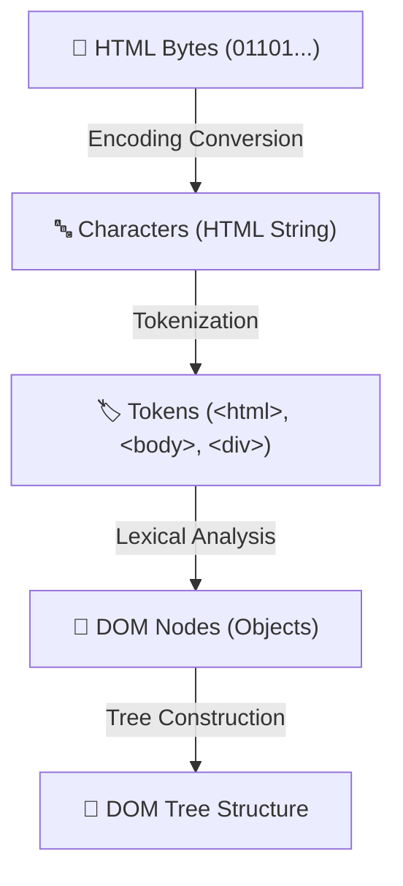

# 🌐 HTML5 Interview Preparation & Master Roadmap

## 🏛️ HTML DOM Parsing & Rendering Pipeline

### 🏗️ DOM Construction Pipeline

---

## 📑 Phase 1: Core HTML5 & Semantic Web

### Module 1: Document Anatomy & Semantics
- [x] **`<!DOCTYPE html>`**
  - Case-insensitive document type declaration informing browser to render document in **Standards Mode** (prevents Quirks Mode).
- [x] **Semantic HTML5 Elements**
  - Elements that convey meaning to developers, browsers, search engines, and screen readers.
  - Core tags: `<header>`, `<nav>`, `<main>`, `<section>`, `<article>`, `<aside>`, `<footer>`, `<figure>`, `<figcaption>`.
  - **SEO & Accessibility Benefit**: Improved indexing by Googlebot and landmark navigation for screen readers.
- [x] **`<article>` vs `<section>` vs `
`**
  - `<article>`: Self-contained, independently distributable content (blog post, news story, comment).
  - `<section>`: Thematic grouping of content, typically with a heading.
  - `
`: Generic non-semantic container used purely for styling or layout grouping.
- [x] **Block vs Inline vs Inline-Block Elements**
  - **Block**: Starts on a new line, takes 100% parent width (`
`, `
`, `<h1>`-`<h6>`, `<section>`). Margins and padding apply on all 4 sides.
  - **Inline**: Flows within text, takes only required width (``, `<a>`, `<strong>`, `<em>`). Height/width cannot be set; top/bottom margins are ignored.
  - **Inline-Block**: Flows inline like ``, but respects width, height, and all margins/padding (``, `<input>`, `<button>`).

### Module 1.1: HTML5 Forms & Custom Validation
- [x] **ValidityState API**
  - Access input validation status via JS: `input.validity`.
  - Properties: `validity.valueMissing` (`required`), `validity.typeMismatch` (e.g. invalid email), `validity.patternMismatch` (`pattern`), `validity.customError`.
  - Customize error tooltip using `input.setCustomValidity('Custom message')`.

---

## ⚡ Phase 2: Web Performance & Asset Loading

### Module 2: Script Loading Attributes (`async` vs `defer`)

```mermaid
gantt
    title Script Loading & Parsing Timeline
    dateFormat  X
    axisFormat %s

    section Regular Script
    HTML Parsing         :a1, 0, 30
    Fetch & Execute JS   :crit, a2, 30, 60
    Resume HTML Parsing  :a3, 60, 100

    section Async Script
    HTML Parsing         :b1, 0, 50
    Fetch JS (Parallel)  :active, b2, 10, 40
    Pause & Execute JS   :crit, b3, 50, 70
    Resume HTML Parsing  :b4, 70, 100

    section Defer Script
    HTML Parsing         :c1, 0, 80
    Fetch JS (Parallel)  :active, c2, 10, 50
    Execute JS           :crit, c3, 80, 100
```

- [x] **Regular `<script>`**: Parsing stops, fetches script over network, executes immediately, then resumes HTML parsing (Blocks DOM building).
- [x] **`<script async>`**: Fetches script asynchronously in background; pauses HTML parser to **execute as soon as script finishes downloading**. Execution order is NOT guaranteed. Best for independent 3rd-party scripts (analytics).
- [x] **`<script defer>`**: Fetches script asynchronously in background; **waits until HTML parsing is 100% complete** before executing in DOM order. Best for application logic dependent on DOM nodes.

### Module 3: Resource Hints & Media Optimization
- [x] **`<link rel="preload">`**: High-priority fetch of critical resources needed for current page (fonts, critical CSS).
- [x] **`<link rel="prefetch">`**: Low-priority fetch of resources likely needed for *next navigation page*.
- [x] **`<link rel="preconnect">` & `dns-prefetch`**: Establishes early connection (DNS lookup, TCP handshake, TLS negotiation) to 3rd-party domains.
- [x] **Responsive Images (`<picture>` & `srcset`)**
  - `<picture>` tag with `<source media="(min-width: 800px)" srcset="large.jpg">`: Serves different image assets based on screen resolution and webp/avif support.
  - `loading="lazy"` attribute on `` & `<iframe>`: Defers offscreen image loading until user scrolls near viewport.

---

## 💾 Phase 3: Web Storage, Media & APIs

### Module 4: Client-Side Storage Comparison
| Feature | `localStorage` | `sessionStorage` | `Cookies` | `IndexedDB` |
| :--- | :--- | :--- | :--- | :--- |
| **Capacity** | ~5MB - 10MB | ~5MB | ~4KB | Uncapped (~GBs) |
| **Expiration** | Permanent (until manual clear) | Tab closing | Set via `Expires`/`Max-Age` | Permanent |
| **Server Transfer** | Never sent to server | Never sent to server | Sent with every HTTP header | Never sent |
| **Access API** | Synchronous Key-Value | Synchronous Key-Value | Document string / Headers | Asynchronous Transactional DB |

### Module 4.1: Native HTML5 Elements & Web APIs
- [x] **`<dialog>` Element**: Native modal dialog element with built-in accessibility and backdrop. Opened via `dialogRef.showModal()`, closed via `dialogRef.close()`. Automatic focus trapping and ESC key handling.
- [x] **SVG vs Canvas**
  - **SVG**: Scalable Vector Graphics. XML-based DOM nodes. Retains sharp resolution at any scale. Best for icons, logos, simple interactive charts.
  - **Canvas**: Pixel-based raster drawing surface manipulated via JS 2D/3D Context API. High performance for rendering 100,000+ objects or video games.
- [x] **Service Workers & PWAs**: Event-driven background worker running separate from web page. Intercepts network requests to implement offline caching strategies (Cache First, Network First, Stale While Revalidate).

---

## ♿ Phase 4: Accessibility (a11y), SEO & Security

### Module 5: ARIA Roles, SEO & Security
- [x] **ARIA (Accessible Rich Internet Applications)**
  - Attributes (`aria-label`, `aria-expanded`, `aria-hidden="true"`, `role="button"`) enhancing screen reader navigation.
  - *Golden Rule:* Don't use ARIA if a native HTML element exists (e.g., use `<button>` instead of `
`).
- [x] **Tabnabbing Security Risk (`rel="noopener noreferrer"`)**
  - When using `<a href="..." target="_blank">`, the newly opened tab receives access to the parent window object via `window.opener`.
  - Adding `rel="noopener noreferrer"` prevents the opened page from redirecting the parent tab to a phishing site.
- [x] **Core Web Vitals & HTML Optimization**
  - **LCP (Largest Contentful Paint)**: Optimize hero images with `<link rel="preload">` and `fetchpriority="high"`.
  - **CLS (Cumulative Layout Shift)**: Always set explicit `width` and `height` attributes on `` tags to reserve space before layout calculation.

---

## 🎯 Top HTML5 Interview Q&A Cheatsheet (Expanded)

### Q1: What is the difference between `async` and `defer` in script tags?
`async` downloads script in parallel and executes it immediately when downloaded (blocking parser execution order). `defer` downloads script in parallel but executes it only after HTML parser completes.

### Q2: What are web workers?
Web Workers run JavaScript scripts in a background thread separate from the main execution thread, allowing expensive background calculations without freezing the user interface (main thread).

### Q3: What is the `<dialog>` element and why is it preferred over custom `
` modals?
The native `<dialog>` element provides built-in accessibility (screen reader announcements), native backdrop positioning via `::backdrop`, automatic keyboard focus trapping, and ESC key dismissal out of the box using `.showModal()`.

### Q4: How does `rel="noopener noreferrer"` secure `target="_blank"` links?
Without `rel="noopener"`, the new tab has access to `window.opener` and can execute `window.opener.location = 'phishing-site.html'`. `rel="noopener"` breaks this reference, securing the user session.

### Q5: What is the difference between SVG and Canvas?
- **SVG**: Vector-based XML markup added directly to DOM. Supports CSS styling and JS event listeners per element. High resolution at all zoom levels, but slow if rendering thousands of dynamic nodes.
- **Canvas**: Raster-based pixel surface drawn via JavaScript execution context. Fast for high-frequency games or rendering millions of pixels, but lacks individual DOM node event handling.

### Q6: What are Core Web Vitals and how does HTML affect CLS?
Core Web Vitals measure web UX. Cumulative Layout Shift (CLS) occurs when elements shift unexpectedly as images/fonts load. Setting explicit `width` and `height` on HTML `` tags allows the browser to calculate aspect ratio and reserve layout space upfront, eliminating CLS.
