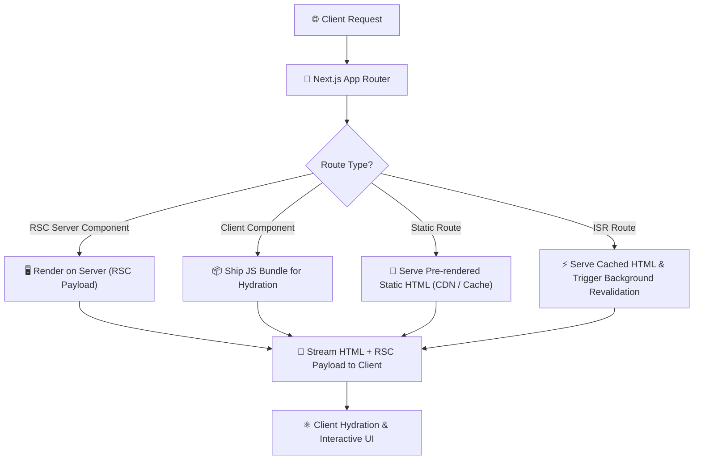

# ▲ Next.js Interview Preparation & Master Roadmap

## 🏛️ Next.js Architecture & Rendering Lifecycle

### 🏗️ Request & Rendering Pipeline (App Router)


---

## 📑 Phase 1: Next.js App Router Architecture

### Module 1: Routing & Conventions
- [x] **App Router vs Pages Router**
  - **App Router (`app/` directory)**: Built on React Server Components (RSC). Supports nested layouts, streaming (`<Suspense>`), Server Actions, and granular route segment configs.
  - **Pages Router (`pages/`)**: Legacy routing model using `getServerSideProps` (SSR), `getStaticProps` (SSG), `getStaticPaths`.
- [x] **File Conventions in App Router**
  - `page.tsx`: Unique UI of a route.
  - `layout.tsx`: Shared UI across multiple pages (persists state, avoids re-rendering children).
  - `loading.tsx`: Instant loading UI powered by React `<Suspense>`.
  - `error.tsx`: Error boundary wrapping route segment (must be `"use client"`).
  - `not-found.tsx`: Custom 404 UI triggered by `notFound()`.
  - `route.ts`: API Route Handler (`GET`, `POST`, `PUT`, `DELETE`).
- [x] **Dynamic & Catch-All Routes**
  - Dynamic Segment: `app/blog/[id]/page.tsx` $\rightarrow$ `params.id`.
  - Catch-All Segment: `app/shop/[...slug]/page.tsx` $\rightarrow$ matches `/shop/clothes/tops`.
  - Optional Catch-All: `app/shop/[[...slug]]/page.tsx` $\rightarrow$ matches `/shop` as well as `/shop/clothes`.
- [x] **Parallel Routes & Intercepting Routes**
  - Parallel Routes (`@slot`): Render multiple pages simultaneously in the same layout (dashboards).
  - Intercepting Routes (`(.)folder`): Load a route within the current layout (e.g. opening a photo modal while preserving background URL context).

---

## ⚡ Phase 2: Data Fetching, Caching & Rendering Strategies

### Module 2: Rendering Strategies (SSR, SSG, ISR, CSR)
- [x] **Server-Side Rendering (SSR)**: Generates HTML on the server per request. `export const dynamic = 'force-dynamic'`.
- [x] **Static Site Generation (SSG)**: Generates HTML at build time. High performance via CDN edge caching. `generateStaticParams()`.
- [x] **Incremental Static Regeneration (ISR)**: Revalidates static pages in background without full rebuilds. `export const revalidate = 60;` (revalidate every 60 seconds).
- [x] **Client-Side Rendering (CSR)**: Standard React client hydration using `"use client"`.

### Module 3: Next.js Caching Architecture
- [x] **4 Caching Layers**:
  1. **Request Memoization**: Deduplicates identical `fetch` requests during a single render pass.
  2. **Data Cache**: Persists `fetch` data across server requests (`fetch(url, { next: { tags: ['posts'] } })`).
  3. **Full Route Cache**: Stores rendered HTML and RSC payload on server at build time.
  4. **Router Cache**: In-memory client-side cache storing route segments during session navigation.
- [x] **Cache Revalidation**:
  - Time-based: `fetch(url, { next: { revalidate: 3600 } })`.
  - On-Demand: `revalidateTag('posts')` or `revalidatePath('/blog')`.

---

## 🚀 Phase 3: Server Actions & Authentication Patterns

### Module 4: Server Actions (`"use server"`)
- [x] **Definition**: Asynchronous server functions executed directly from forms or components without manually writing REST API endpoints.
- [x] **Server Action Pattern with Validation**:
  ```typescript
  "use server";
  import { revalidatePath } from 'next/cache';
  import { z } from 'zod';

  const Schema = z.object({ email: z.string().email() });

  export async function updateEmail(formData: FormData) {
    const validated = Schema.safeParse({ email: formData.get('email') });
    if (!validated.success) return { error: 'Invalid Email' };

    await db.user.update({ where: { id: 1 }, data: { email: validated.data.email } });
    revalidatePath('/profile');
    return { success: true };
  }
  ```

### Module 5: Authentication & Middleware (`middleware.ts`)
- [x] **Middleware Protection**: Runs on Edge runtime before a request is completed.
  - Used for session verification, OAuth token validation, redirecting unauthenticated users, and bot blocking.
- [x] **Dynamic SEO & Metadata API**
  - `generateMetadata({ params })`: Generates dynamic title, description, and Open Graph cards server-side per request.

---

## 🎯 Top Next.js Interview Q&A Cheatsheet (Master List)

### Q1: What is the difference between Server Components (RSC) and Client Components in Next.js?
Server Components execute only on the server, adding 0KB to the client JS bundle. They can directly query databases and read server files. Client Components (`"use client"`) are sent to the browser and hydrated to enable state (`useState`), effects (`useEffect`), and DOM event listeners.

### Q2: How does Incremental Static Regeneration (ISR) work?
ISR allows static pages to be updated in the background without re-building the entire site. When a user requests an expired page (`revalidate = 60`), Next.js serves the cached HTML immediately, triggers a background re-generation, and updates the cache for future requests.

### Q3: How do Server Actions (`"use server"`) simplify form submissions?
Server Actions allow defining server-side logic inside async functions called directly from client forms (`<form action={myAction}>`). Next.js automatically handles POST request creation, CSRF protection, and cache revalidation (`revalidatePath`).

### Q4: Explain the 4 caching layers in Next.js App Router.
1. **Request Memoization**: Deduplicates identical `fetch` calls during a single render pass.
2. **Data Cache**: Stores fetched HTTP data across requests.
3. **Full Route Cache**: Caches rendered HTML and RSC payload on the server.
4. **Router Cache**: In-memory browser cache storing route segments during client navigation.

### Q5: What are Parallel Routes (`@slot`) and Intercepting Routes (`(.)folder`)?
Parallel Routes allow rendering multiple sub-pages simultaneously in the same layout. Intercepting Routes allow loading a route inside the current layout (e.g., rendering a photo modal while maintaining the background page URL).

### Q6: How do you optimize images in Next.js using `<Image />`?
The `<Image />` component automatically resizes, optimizes, and serves images in modern formats (AVIF/WebP). It prevents Cumulative Layout Shift (CLS) by requiring width/height or `fill`, and automatically lazy loads offscreen images.
