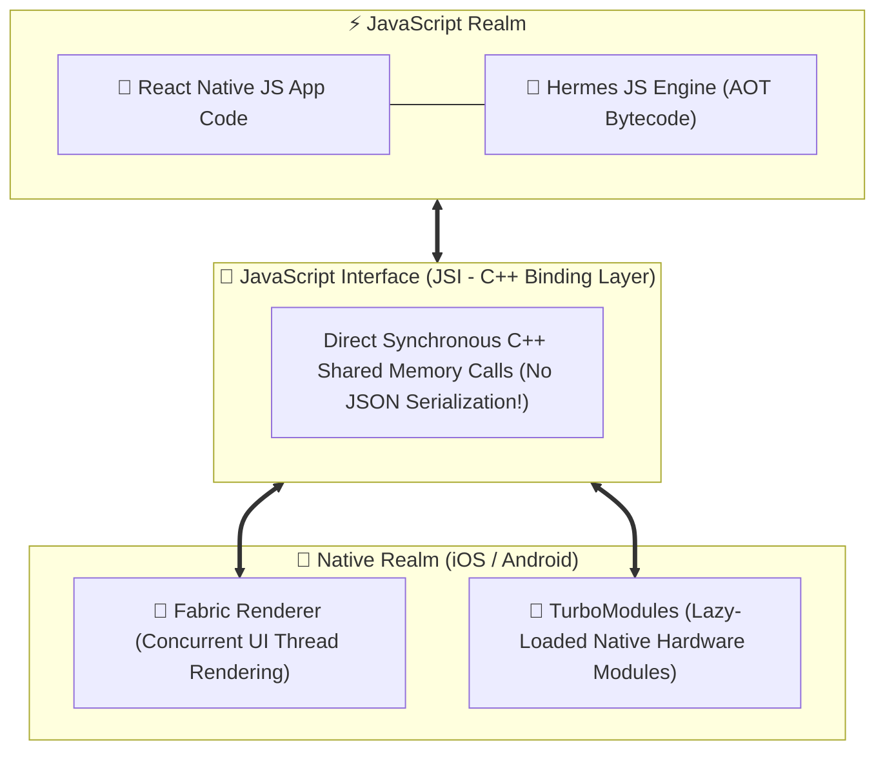
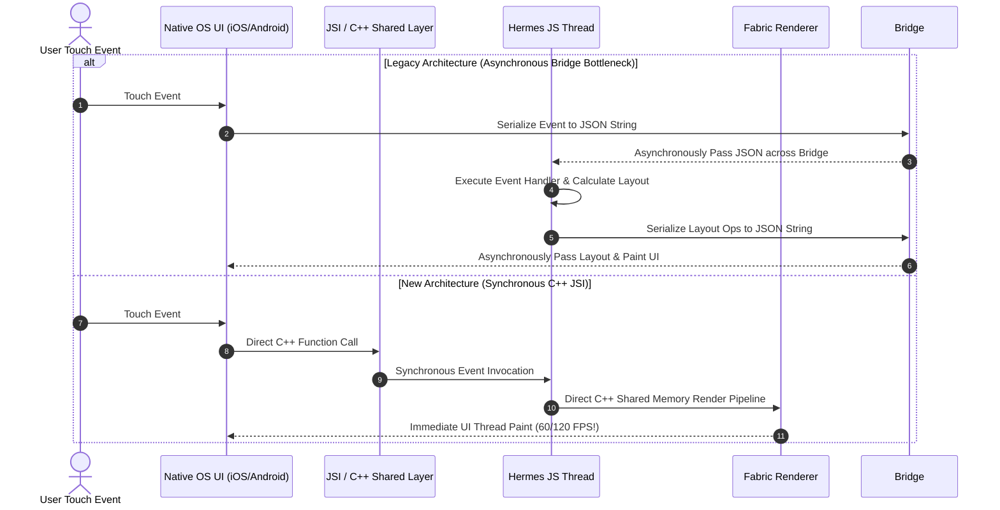

# 📱 React Native Master Roadmap & Learning Progress Tracker

## 🏛️ React Native Architecture & Execution Engine

### 🏗️ New Architecture (JSI, Fabric & TurboModules)


### 🔄 Legacy Bridge vs New JSI Architecture Sequence


---

## 📑 Phase 1: Architecture & Compilation Engine

### Module 1: Introduction to React Native
- [x] **What is React Native?**
  - Open-source cross-platform mobile framework rendering **real native iOS (UIKit) and Android (Views)** UI components using React and JavaScript.
- [x] **React Native vs Flutter vs Native**
  - React Native renders actual OS native views via JavaScript interface; Flutter paints pixels on a Skia/Impeller canvas; Native (Swift/Kotlin) executes compiled platform binary directly.

### Module 2: Legacy Architecture vs New Architecture
- [x] **Legacy Bridge Bottleneck**
  - Old architecture communicated between JS thread and Native thread via an asynchronous JSON serialized bridge, causing UI stutters during fast scrolling/animations.
- [x] **JavaScript Interface (JSI)**
  - Replaces JSON bridge with a unified C++ layer exposing Native C++ references directly to JavaScript, enabling **synchronous bi-directional calls**.
- [x] **Fabric Renderer & TurboModules**
  - **Fabric**: New concurrent C++ rendering engine rendering UI directly on the native main thread.
  - **TurboModules**: Lazy-loads native hardware modules (Camera, Bluetooth) on-demand instead of instantiating all at launch.

### Module 3: Hermes Engine & Metro Bundler
- [x] **Hermes Engine**
  - Lightweight JavaScript engine optimized for React Native featuring **Ahead-Of-Time (AOT)** bytecode compilation, reducing TTI (Time to Interactive) and APK/IPA bundle size.
- [x] **Metro Bundler**
  - High-speed JavaScript bundler for React Native compiling code and assets for mobile runtime.

---

## ⚡ Phase 2: Core Components & Layout Systems

### Module 4: Core Components
- [x] **Primitive Mobile Components**
  - `View` (renders native `UIView`/`android.view`), `Text`, `Image`, `ScrollView`, `Pressable` (replaces legacy `TouchableOpacity`), `TextInput`, `SafeAreaView`.

### Module 5: High-Performance Lists
- [x] **`FlatList` vs `ScrollView`**
  - `ScrollView` renders all child items at once (causes memory crash for large lists).
  - `FlatList` virtualizes memory by rendering only visible items.
- [x] **`FlatList` Optimization Props**
  - `keyExtractor`, `getItemLayout` (bypasses dynamic height measurement), `initialNumToRender`, `removeClippedSubviews`, `windowSize`.
  - **Shopify FlashList**: Next-gen list component recycling views for 60 FPS performance.

### Module 6: Styling & Flexbox
- [x] **React Native Flexbox Defaults**
  - Default `flexDirection: 'column'` (unlike Web's `row`). Dimensions set via density-independent pixels (dp).
- [x] **`StyleSheet.create()` & Platform Logic**
  - Optimizes styles by sending numeric IDs across the native boundary; `Platform.OS === 'ios'` or `Platform.select()`.

---

## 🛠️ Phase 3: Navigation, State & Native Modules

### Module 7: Mobile Navigation (React Navigation v6+)
- [x] **Navigators**
  - Native Stack (`@react-navigation/native-stack` using native OS transitions), Bottom Tabs, Drawer.
- [x] **Deep Linking**
  - Configuring URI schemes (`myapp://profile/123`) and Universal Links for seamless app entry.

### Module 8: Mobile State & High-Speed Storage
- [x] **Redux Toolkit / Zustand**: Global state management tailored for mobile components.
- [x] **MMKV Storage (`react-native-mmkv`)**
  - High-performance key-value storage **30x faster than legacy `AsyncStorage`**, powered by C++ JSI direct memory access.

### Module 9: Animations & Gesture Handling
- [x] **React Native Reanimated v3**
  - Executes complex 60/120 FPS animations directly on the **Native UI Thread** using Worklets, bypassing the JS thread.
- [x] **`react-native-gesture-handler`**
  - Direct native touch/gesture tracking for pan, pinch, and swipe interactions.

---

## 🚀 Phase 4: Build, Testing & Deployment

### Module 10: Expo vs Bare Workflow
- [x] **Expo Managed Workflow vs Bare RN**
  - **Expo**: Managed ecosystem with pre-built native modules, Expo Prebuild (`npx expo prebuild`), and Config Plugins.
  - **Bare Workflow**: Direct access to `ios/` Xcode and `android/` Android Studio project folders.

### Module 11: Push Notifications & Device Hardware
- [x] **Push Notifications (FCM / APNs)**: Firebase Cloud Messaging and Apple Push Notification Service integration.
- [x] **Device Hardware APIs**: Camera, Geolocation, Biometrics (`expo-local-authentication`).

### Module 12: Mobile CI/CD & Deployment (Fastlane & EAS)
- [x] **Fastlane & EAS Build/Submit**
  - Automating code signing (iOS Certificates/Provisioning Profiles & Android Keystores), building `.ipa`/`.aab` bundles, and submitting directly to Apple TestFlight and Google Play Console.

---

## 🛠️ Phase 5: Practical React Native Code Patterns

### 1. High-Performance `FlatList` with `Pressable` & Memoization
```tsx
import React, { useCallback } from 'react';
import { FlatList, Text, Pressable, StyleSheet, View } from 'react-native';

interface ItemData {
  id: string;
  title: string;
}

const Item = React.memo(({ item, onPress }: { item: ItemData; onPress: (id: string) => void }) => (
  <Pressable
    style={({ pressed }) => [styles.card, pressed && styles.pressed]}
    onPress={() => onPress(item.id)}
  >
    <Text style={styles.title}>{item.title}</Text>
  </Pressable>
));

export function OptimizedList({ data }: { data: ItemData[] }) {
  const handlePress = useCallback((id: string) => {
    console.log('Item pressed:', id);
  }, []);

  const renderItem = useCallback(({ item }: { item: ItemData }) => (
    <Item item={item} onPress={handlePress} />
  ), [handlePress]);

  const getItemLayout = useCallback((_: any, index: number) => ({
    length: 60,
    offset: 60 * index,
    index,
  }), []);

  return (
    <FlatList
      data={data}
      renderItem={renderItem}
      keyExtractor={(item) => item.id}
      getItemLayout={getItemLayout}
      initialNumToRender={10}
      maxToRenderPerBatch={10}
      windowSize={5}
      removeClippedSubviews={true}
    />
  );
}

const styles = StyleSheet.create({
  card: { height: 50, padding: 15, backgroundColor: '#fff', marginBottom: 10 },
  pressed: { opacity: 0.7 },
  title: { fontSize: 16, fontWeight: '600' }
});
```

---

## 🎯 Top React Native Senior Interview Q&A Cheatsheet (Master List)

### Q1: What is the main difference between React Native's Legacy Architecture and New Architecture?
The Legacy Architecture relies on an asynchronous JSON-serialized Bridge to pass messages between JavaScript and Native threads, creating bottlenecks during heavy animations or fast scrolling. The New Architecture replaces the Bridge with **JSI (JavaScript Interface)**, which exposes Native C++ objects directly to JS for **synchronous direct memory access**, paired with **Fabric Renderer** and **TurboModules**.

### Q2: Why is Hermes Engine preferred for React Native over standard V8 or JavaScriptCore?
Hermes uses **Ahead-Of-Time (AOT)** compilation to compile JS code into ARM bytecode during build time rather than at runtime. This drastically reduces initial app startup time (TTI), lowers memory footprint, and shrinks overall APK/IPA bundle size.

### Q3: How does `react-native-reanimated` achieve 60/120 FPS animations compared to standard `Animated` API?
Reanimated uses "Worklets"—small JS functions compiled to run directly on the **Native UI Thread** rather than the JS Thread. This prevents animation drops and frame stutters even if the JS thread is heavily blocked by business logic.

### Q4: Why is `react-native-mmkv` preferred over `AsyncStorage` for local storage?
`AsyncStorage` is asynchronous and passes serialized data over the legacy bridge. `react-native-mmkv` is powered by C++ JSI, allowing **synchronous direct memory access** to encrypted key-value pairs, making it over **30x faster** than `AsyncStorage`.

### Q5: How do `FlatList` props like `getItemLayout` and `removeClippedSubviews` improve performance?
`getItemLayout` allows `FlatList` to skip dynamic layout height measurements for fixed-size items, drastically reducing calculation overhead. `removeClippedSubviews` detaches views positioned outside the visible screen viewport from the native rendering tree, saving RAM.
