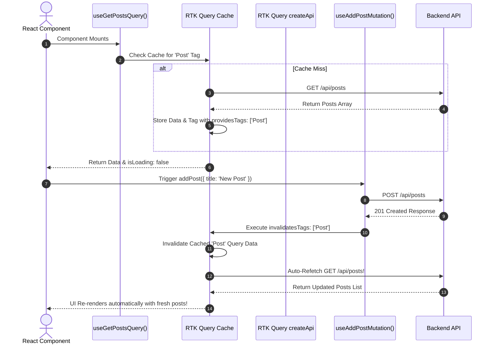

# ⚛️ Redux Toolkit (RTK) & RTK Query Master Roadmap & Progress Tracker

## 🏛️ Redux Toolkit Unidirectional Data Flow Architecture

### 🏗️ RTK Unidirectional Data Flow & State Mutation Pipeline
```mermaid
graph TD
    View["📱 React Component (UI)"] -->|1. dispatch(action)| Dispatcher["⚡ Store Dispatcher"]

    subgraph ReduxStore ["📦 Redux Toolkit Store (configureStore)"]
        Dispatcher -->|2. Route Action| Reducer["⚙️ Slice Reducers (createSlice)"]
        Immer["🛡️ Immer.js Engine (Mutate Draft State Safely)"]
        Reducer <--> Immer
        Reducer -->|3. Update Immutable State| State["💾 Global State Tree"]
    end

    State -->|4. useSelector(selector)| View
    
    subgraph AsyncFlow ["🌐 Async Data Fetching"]
        Thunk["🚀 createAsyncThunk / RTK Query"]
        Thunk -->|pending / fulfilled / rejected| Dispatcher
    end

    View -->|Trigger API Call| Thunk
```

### 🔄 RTK Query Cache Invalidation Sequence Diagram


---

## 📑 Phase 1: Redux Architecture & Core Principles

### Module 1: Redux Core Principles & History
- [x] **Single Source of Truth**
  - The entire global application state is stored as a single object tree within a single central Redux Store.
- [x] **State is Read-Only**
  - The only way to modify state is by dispatching an Action (an object describing what happened).
- [x] **Changes Made with Pure Functions (Reducers)**
  - Reducers are pure functions taking `(previousState, action)` and returning a new state object without side effects.
- [x] **Redux vs React Context API**
  - Context API is designed for low-frequency state prop drilling (themes, auth user); Redux Toolkit is engineered for high-frequency global state updates, complex async caching, and middleware logging.

### Module 2: Unidirectional Data Flow
- [x] **Data Flow Mechanics**
  - Action Dispatched $\rightarrow$ Middleware Intercepted $\rightarrow$ Reducer Evaluated $\rightarrow$ Store Updated $\rightarrow$ Selectors Triggered $\rightarrow$ React UI Re-rendered.

### Module 3: Why Redux Toolkit (RTK)?
- [x] **Eliminating Legacy Redux Boilerplate**
  - Eliminates separate `actionTypes.js`, `actions.js`, and `reducers.js` file structures by unifying them into `createSlice()`.
- [x] **Built-in Batteries**
  - Includes `configureStore()`, `createSlice()`, `createAsyncThunk()`, Immer.js, and RTK Query out of the box.

---

## ⚡ Phase 2: RTK Core APIs & Immutable State Mutation

### Module 4: `configureStore()` Deep Dive
- [x] **Store Setup**
  - Automatically combines slice reducers, adds Redux Thunk middleware, and enables Redux DevTools extension.
- [x] **Middleware Customization (`getDefaultMiddleware()`)**
  - Extending default middleware array (e.g. appending custom logger or RTK Query middleware).

### Module 5: `createSlice()` & Action Creators
- [x] **Slice Architecture**
  - Accepts `name`, `initialState`, and `reducers` object. Automatically generates matching action creator functions and action type strings!

### Module 6: Immer.js Engine & Draft Mutation
- [x] **Proxy Draft Mutation**
  - RTK wraps state inside Immer `produce()` proxies inside `createSlice` reducers.
  - Allows writing direct mutating code (`state.items.push(item)`, `state.user.name = 'Siva'`) which Immer converts to immutable updates.
- [x] **Mutation Rules**
  - You can either mutate the `state` draft OR return a new state object—**never do both in the same reducer!**

### Module 7: Reducers vs `extraReducers`
- [x] **`reducers` Field**
  - Handlers for action creators auto-generated by the current slice.
- [x] **`extraReducers` Field (`builder.addCase()`)**
  - Listens and responds to actions generated outside the slice (e.g. `createAsyncThunk` states or actions from other slices).

---

## 🛠️ Phase 3: Asynchronous Logic & Middleware

### Module 8: Asynchronous Actions (`createAsyncThunk`)
- [x] **Async Thunk Lifecycle**
  - `createAsyncThunk(typePrefix, payloadCreator)` automatically generates 3 action types: `.pending`, `.fulfilled`, and `.rejected`.
- [x] **`thunkAPI` Capabilities**
  - Provides access to `dispatch`, `getState()`, `rejectWithValue()`, and `signal` (AbortController cancellation).

### Module 9: Redux Middleware Mechanics
- [x] **Middleware Signature (`store => next => action`)**
  - Intercepts actions before reaching reducers for logging, auth token injection, or analytics tracking.

### Module 10: State Persistence & Hydration
- [x] **`redux-persist` Integration**
  - Persisting Redux state to `localStorage` or `AsyncStorage` with whitelist/blacklist slice filters.

---

## 🌐 Phase 4: RTK Query Data Fetching & Caching Engine

### Module 11: Introduction to RTK Query (`createApi`)
- [x] **RTK Query Overview**
  - Powerful data fetching and caching tool built into RTK. Replaces manual loading/error boilerplate with auto-generated hooks (`useGetUsersQuery`).
- [x] **`fetchBaseQuery` Wrapper**
  - Lightweight `fetch` wrapper supporting base URL, custom headers, and token authentication interceptors.

### Module 12: Query vs Mutation Endpoints
- [x] **Query Endpoints**: Designed for fetching/reading data (`builder.query()`).
- [x] **Mutation Endpoints**: Designed for creating/updating/deleting data (`builder.mutation()`).

### Module 13: Caching, Invalidation & Tag System
- [x] **Tag System (`providesTags` & `invalidatesTags`)**
  - Queries tag cached data (`providesTags: ['Post']`). Mutations invalidate matching tags (`invalidatesTags: ['Post']`), triggering **automatic background re-fetching**!

### Module 14: Optimistic & Pessimistic UI Updates
- [x] **Optimistic Updates (`onQueryStarted`)**
  - Updating the local RTK Query cache immediately before the server responds, rolling back automatically if the API request fails.

---

## ⚙️ Phase 5: Performance Optimization & Selectors

### Module 15: Memoized Selectors (`createSelector` / Reselect)
- [x] **`createSelector()`**
  - Creates memoized selectors computing derived state only when input references change, preventing unnecessary React component re-renders.

### Module 16: Normalized State Architecture (`createEntityAdapter`)
- [x] **`createEntityAdapter()`**
  - Normalizes relational data arrays into a flat `{ ids: [], entities: {} }` structure for fast $O(1)$ lookups and updates (`addOne`, `setAll`, `updateOne`, `removeOne`).

---

## 🛠️ Phase 6: Practical Redux Toolkit & RTK Query Code

### Complete Production Store Setup with RTK Query & Entity Adapter (`store.ts`)
```typescript
import { configureStore, createSlice, createAsyncThunk, createEntityAdapter, PayloadAction } from '@reduxjs/toolkit';
import { createApi, fetchBaseQuery } from '@reduxjs/toolkit/query/react';

// 1. Entity Adapter for Normalized Post State
interface Post {
  id: string;
  title: string;
}

const postsAdapter = createEntityAdapter<Post>({
  selectId: (post) => post.id,
});

// 2. RTK Query API with Tag Invalidation & Auth Headers
export const apiSlice = createApi({
  reducerPath: 'api',
  baseQuery: fetchBaseQuery({
    baseUrl: '/api/',
    prepareHeaders: (headers) => {
      const token = localStorage.getItem('token');
      if (token) headers.set('Authorization', `Bearer ${token}`);
      return headers;
    },
  }),
  tagTypes: ['Posts'],
  endpoints: (builder) => ({
    getPosts: builder.query<Post[], void>({
      query: () => 'posts',
      providesTags: (result) =>
        result
          ? [...result.map(({ id }) => ({ type: 'Posts' as const, id })), { type: 'Posts', id: 'LIST' }]
          : [{ type: 'Posts', id: 'LIST' }],
    }),
    addPost: builder.mutation<Post, Partial<Post>>({
      query: (body) => ({
        url: 'posts',
        method: 'POST',
        body,
      }),
      invalidatesTags: [{ type: 'Posts', id: 'LIST' }],
    }),
  }),
});

export const { useGetPostsQuery, useAddPostMutation } = apiSlice;

// 3. UI Slice with Immer Mutation
const uiSlice = createSlice({
  name: 'ui',
  initialState: { darkMode: false },
  reducers: {
    toggleDarkMode: (state) => {
      state.darkMode = !state.darkMode; // Safe mutation via Immer!
    },
  },
});

export const { toggleDarkMode } = uiSlice.actions;

// 4. Configure Store
export const store = configureStore({
  reducer: {
    ui: uiSlice.reducer,
    [apiSlice.reducerPath]: apiSlice.reducer,
  },
  middleware: (getDefaultMiddleware) =>
    getDefaultMiddleware().concat(apiSlice.middleware),
});

export type RootState = ReturnType<typeof store.getState>;
export type AppDispatch = typeof store.dispatch;
```

---

## 🎯 Top Redux Toolkit Senior Interview Q&A Cheatsheet (Master List)

### Q1: How does Redux Toolkit eliminate legacy Redux boilerplate?
RTK combines action types, action creators, and reducers into a single `createSlice()` function. It includes `configureStore()` which automatically sets up Redux Thunk middleware and Redux DevTools, and incorporates Immer.js so developers don't have to manually write nested object spread operations (`...state`).

### Q2: How does Immer.js work inside Redux Toolkit's `createSlice`?
Immer wraps current state in a proxy "Draft" object. Developers can write direct state mutations (e.g. `state.items.push(newItem)`). Immer tracks all draft mutations and produces a brand-new immutable state object under the hood.

### Q3: What is RTK Query and how does tag invalidation work?
RTK Query is an advanced data fetching and caching tool built into RTK. When a query endpoint fetches data, it tags the cache with `providesTags: ['Post']`. When a mutation occurs (e.g. adding a post), it specifies `invalidatesTags: ['Post']`, causing RTK Query to automatically re-fetch matching cached queries in the background.

### Q4: What is the difference between `reducers` and `extraReducers` in `createSlice`?
`reducers` defines action creators and reducer logic generated internally by that specific slice. `extraReducers` allows the slice to listen and respond to external action types defined outside the slice (such as `createAsyncThunk` states `.pending`/`.fulfilled`/`.rejected` or actions from other slices).

### Q5: Why is `createEntityAdapter` used in Redux Toolkit?
`createEntityAdapter` provides a standardized, normalized data structure `{ ids: [], entities: {} }` for managing collection items. It delivers fast $O(1)$ lookups and updates via built-in CRUD reducer methods (`addOne`, `setAll`, `updateOne`, `removeOne`) and auto-generates memoized selectors.
