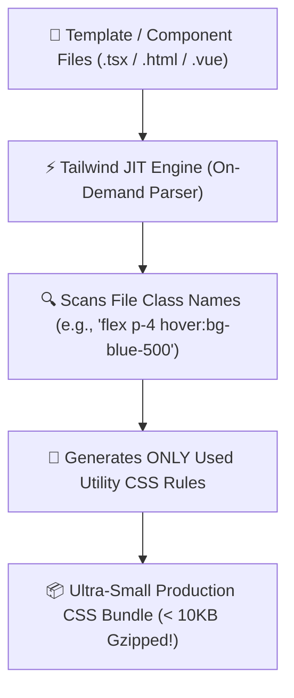

# 🎨 Tailwind CSS Master Roadmap & Learning Progress Tracker

## 🏛️ Tailwind CSS Engine & Build Architecture

### 🏗️ Just-In-Time (JIT) Engine Build Pipeline


---

## 📑 Phase 1: Core Fundamentals & JIT Architecture

### Module 1: Utility-First CSS Philosophy
- [x] **Utility-First Paradigm**
  - Composing custom designs directly in HTML/JSX using low-level utility classes (`flex`, `pt-4`, `text-center`, `rounded-xl`).
  - Eliminates context switching between CSS files and class naming fatigue (BEM methodology).
- [x] **Utility vs Component-Based CSS**
  - Avoids bloated custom stylesheets, specificity conflicts, and unused CSS rules in production bundles.

### Module 2: Just-In-Time (JIT) Compiler Engine
- [x] **JIT Engine Mechanics**
  - Generates CSS rules on-demand at compile time by scanning template files. Enables arbitrary values (`top-[117px]`, `bg-[#1da1f2]`).
- [x] **Purge / Content Scanning**
  - Scans `content` paths in `tailwind.config.js` to eliminate 99% of unused utility CSS rules from production builds.

### Module 3: Preflight Reset & Base Styles
- [x] **Tailwind Preflight**
  - Built-in CSS reset normalizing browser default margins, paddings, and heading font sizes.
- [x] **Custom Base Layers (`@layer base`)**
  - Extending base HTML tags (e.g. `h1`, `a`, `body`) using `@layer base` directives.

---

## ⚡ Phase 2: Layout, Typography & Color Systems

### Module 4: Flexbox & Grid Utilities
- [x] **Flexbox Utilities**
  - `flex`, `flex-row`, `flex-col`, `items-center`, `justify-between`, `gap-4`, `flex-grow`.
- [x] **CSS Grid Utilities**
  - `grid`, `grid-cols-12`, `gap-6`, `col-span-6`, `row-span-2`.

### Module 5: Typography & Spacing Scale
- [x] **Typography Scale**
  - Text sizing (`text-xs` to `text-9xl`), font weight (`font-normal` to `font-black`), tracking (`tracking-tight`), line height (`leading-relaxed`).
- [x] **Spacing Scale ($1\text{ unit} = 0.25\text{rem} = 4\text{px}$)**
  - Margin (`m-4`), Padding (`p-6`), Space between (`space-y-4`).

### Module 6: Color Palette & Opacity Modifiers
- [x] **Color System & Opacity**
  - Default curated palettes (Slate, Gray, Zinc, Sky, Indigo). Color opacity modifiers (`bg-black/50`, `text-blue-500/80`).
- [x] **Gradients**
  - Creating linear gradients (`bg-gradient-to-r from-blue-500 via-indigo-500 to-purple-500`).

---

## 🛠️ Phase 3: Responsive Design, States & Pseudo-Classes

### Module 7: Mobile-First Responsive Breakpoints
- [x] **Mobile-First Breakpoint System**
  - Unprefixed classes target mobile; prefixes apply at specified breakpoint and up (`sm:` $640\text{px}$, `md:` $768\text{px}$, `lg:` $1024\text{px}$, `xl:` $1280\text{px}$, `2xl:` $1536\text{px}$).

### Module 8: State Modifiers & Pseudo-Classes
- [x] **Interactive States**
  - `hover:`, `focus:`, `active:`, `disabled:`, `visited:`, `first:`, `last:`, `odd:`, `even:`.

### Module 9: Complex Parent/Sibling States (`group` & `peer`)
- [x] **Group Modifiers (`group-hover:`)**
  - Styling child elements based on parent hover/focus state (`group-hover:text-blue-500`).
- [x] **Peer Modifiers (`peer-checked:`)**
  - Styling sibling elements based on preceding sibling input state (`peer-checked:bg-green-500`).

### Module 10: Dark Mode System
- [x] **Dark Mode (`dark:`)**
  - Toggling dark mode using `class` strategy on root `<html>` element (`dark:bg-slate-900 dark:text-white`).

---

## ⚙️ Phase 4: Animations, Filters & Configuration

### Module 11: Transforms, Transitions & Animations
- [x] **Transitions & Transforms**
  - `transition-all`, `duration-300`, `ease-in-out`, `hover:-translate-y-1`, `hover:scale-105`.
- [x] **Keyframe Animations**
  - `animate-spin`, `animate-ping`, `animate-pulse`, `animate-bounce`.

### Module 12: Filters & Glassmorphism
- [x] **Backdrop Filters**
  - `backdrop-blur-md`, `backdrop-brightness-75`, `shadow-2xl`.

### Module 13: Configuration & Custom Extensions
- [x] **`tailwind.config.js` / `@theme`**
  - Extending theme design tokens under `theme.extend`. Using `@apply` directive to extract reusable classes.

---

## 🚀 Phase 5: Tailwind v4 & Class Merging

### Module 14: Tailwind CSS v4 Architecture
- [x] **Tailwind v4 Upgrades**
  - CSS-first configuration using `@theme` directive, powered by ultra-fast Lightning CSS engine.

### Module 15: Utility Merging (`tailwind-merge` & `clsx`)
- [x] **Conditional Class Merging (`cn()` pattern)**
  - Combining `clsx` and `tailwind-merge` to resolve conflicting Tailwind utility props in reusable React components.

---

---

## 📚 Exhaustive Tailwind CSS Utility Class Names Reference Matrix

| Category | Tailwind CSS Utility Class Names | Description / CSS Equivalent |
| :--- | :--- | :--- |
| **Display** | `block`, `inline-block`, `inline`, `flex`, `inline-flex`, `grid`, `inline-grid`, `hidden`, `contents` | Sets CSS `display` property |
| **Flex Direction** | `flex-row`, `flex-row-reverse`, `flex-col`, `flex-col-reverse` | Sets `flex-direction` axis |
| **Flex Wrap & Grow**| `flex-wrap`, `flex-nowrap`, `flex-1`, `flex-auto`, `flex-initial`, `flex-none`, `grow`, `grow-0`, `shrink`, `shrink-0` | Flex line wrapping, item sizing, flex grow and shrink rules |
| **Justify Content** | `justify-start`, `justify-end`, `justify-center`, `justify-between`, `justify-around`, `justify-evenly` | Align items along main axis |
| **Align Items** | `items-start`, `items-end`, `items-center`, `items-baseline`, `items-stretch` | Align items along cross axis |
| **Grid Template** | `grid-cols-1` to `grid-cols-12`, `grid-rows-1` to `grid-rows-6`, `grid-cols-none` | Sets `grid-template-columns` and rows |
| **Grid Column/Row Span**| `col-span-1` to `col-span-12`, `col-span-full`, `col-start-1` to `col-start-13`, `col-end-1` to `col-end-13` | Controls column item spanning and explicit start/end grid lines |
| **Gap** | `gap-0` to `gap-96` ($1=0.25\text{rem}$), `gap-x-*`, `gap-y-*`, `gap-[18px]` | Grid and Flexbox gap spacing between items |
| **Spacing (Padding)**| `p-0` to `p-96`, `pt-*`, `pr-*`, `pb-*`, `pl-*`, `px-*` (horizontal), `py-*` (vertical) | Padding utilities ($1=0.25\text{rem}=4\text{px}$) |
| **Spacing (Margin)** | `m-0` to `m-96`, `mt-*`, `mr-*`, `mb-*`, `ml-*`, `mx-*`, `my-*`, `-m-4` (negative), `m-auto` | Margin utilities; supports negative values via `-` prefix |
| **Sizing (Width)** | `w-0` to `w-96`, `w-auto`, `w-full`, `w-screen`, `w-1/2`, `w-1/3`, `w-2/3`, `w-1/4`, `w-3/4`, `min-w-0`, `max-w-xs/sm/md/lg/xl/2xl/full` | Width percentages, fixed rems, viewport width, min/max width |
| **Sizing (Height)** | `h-0` to `h-96`, `h-auto`, `h-full`, `h-screen`, `min-h-screen`, `max-h-screen` | Height values, full viewport height (`100vh`), min/max height |
| **Typography (Size)**| `text-xs` ($0.75\text{rem}$), `text-sm`, `text-base` ($1\text{rem}$), `text-lg`, `text-xl`, `text-2xl` to `text-9xl` | Font size and automatic proportional line height |
| **Typography (Weight)**| `font-thin` ($100$), `font-light`, `font-normal` ($400$), `font-medium`, `font-semibold`, `font-bold` ($700$), `font-black` ($900$) | Font weight values |
| **Typography (Align)**| `text-left`, `text-center`, `text-right`, `text-justify`, `text-start`, `text-end` | Text alignment |
| **Typography (Style)**| `italic`, `not-italic`, `underline`, `overline`, `line-through`, `no-underline`, `uppercase`, `lowercase`, `capitalize` | Text style, decoration, and case transformation |
| **Text Overflow** | `truncate`, `text-ellipsis`, `text-clip`, `whitespace-nowrap`, `break-words` | Single-line text truncation with ellipsis |
| **Colors (Text)** | `text-slate-500`, `text-red-600`, `text-blue-500`, `text-emerald-400`, `text-white`, `text-black`, `text-transparent` | Text color palette utilities |
| **Colors (Background)**| `bg-slate-100`, `bg-slate-900`, `bg-blue-600`, `bg-indigo-500`, `bg-white`, `bg-transparent` | Background color palette utilities |
| **Color Opacity** | `text-blue-500/80`, `bg-black/50`, `border-white/20` | Color opacity modifiers using `/percent` slash syntax |
| **Gradients** | `bg-gradient-to-r`, `bg-gradient-to-t`, `from-blue-600`, `via-indigo-500`, `to-purple-600` | Background linear gradients with start, middle, and stop colors |
| **Borders (Width)** | `border`, `border-0`, `border-2`, `border-4`, `border-8`, `border-t-2`, `border-r-4`, `border-b-2`, `border-l-4` | Border width addition and directional borders |
| **Borders (Color)** | `border-slate-200`, `border-blue-500`, `border-transparent` | Border color utilities |
| **Border Radius** | `rounded-none`, `rounded-sm`, `rounded`, `rounded-md`, `rounded-lg`, `rounded-xl`, `rounded-2xl`, `rounded-3xl`, `rounded-full` | Border radius rounding ($0$ to full pill/circle) |
| **Shadows** | `shadow-none`, `shadow-sm`, `shadow`, `shadow-md`, `shadow-lg`, `shadow-xl`, `shadow-2xl`, `shadow-inner` | Box shadow elevation utilities |
| **Positioning** | `static`, `relative`, `absolute`, `fixed`, `sticky` | CSS position modes |
| **Position Edges** | `top-0`, `right-4`, `bottom-0`, `left-0`, `inset-0` (all 4 edges), `top-1/2`, `left-1/2` | Top/Right/Bottom/Left offsets |
| **Z-Index** | `z-0`, `z-10`, `z-20`, `z-30`, `z-40`, `z-50`, `z-auto` | Z-index stack depth |
| **Transforms** | `scale-95`, `scale-105`, `rotate-45`, `-rotate-90`, `translate-x-4`, `-translate-y-2`, `skew-x-3` | CSS 2D scale, rotation, translation, and skewing |
| **Transitions** | `transition-none`, `transition-all`, `transition-colors`, `transition-opacity`, `transition-transform` | Specifies properties to animate |
| **Transition Duration**| `duration-75`, `duration-100`, `duration-150`, `duration-200`, `duration-300`, `duration-500`, `duration-1000` | Animation speed in milliseconds |
| **Transition Easing** | `ease-linear`, `ease-in`, `ease-out`, `ease-in-out` | Timing easing curves |
| **Animations** | `animate-none`, `animate-spin`, `animate-ping`, `animate-pulse`, `animate-bounce` | Built-in continuous keyframe animations |
| **Filters** | `blur-sm`, `blur-md`, `blur-lg`, `brightness-90`, `contrast-125`, `drop-shadow-lg`, `grayscale` | Image and element filter effects |
| **Backdrop Filters** | `backdrop-blur-sm`, `backdrop-blur-md`, `backdrop-blur-lg`, `backdrop-brightness-75`, `backdrop-bg-white/30` | Glassmorphism background blur effects |
| **Responsive Prefixes**| `sm:`, `md:`, `lg:`, `xl:`, `2xl:` | Mobile-first breakpoint modifiers ($640\text{px}$, $768\text{px}$, $1024\text{px}$, $1280\text{px}$, $1536\text{px}$) |
| **State Modifiers** | `hover:`, `focus:`, `active:`, `disabled:`, `visited:`, `first:`, `last:`, `odd:`, `even:` | Interactive pseudo-class modifiers |
| **Group Modifiers** | `group`, `group-hover:text-blue-500`, `group-focus:opacity-100`, `group/card` | Styles child element based on parent state |
| **Peer Modifiers** | `peer`, `peer-checked:bg-blue-600`, `peer-focus:ring-2`, `peer-disabled:opacity-50` | Styles sibling element based on preceding element state |
| **Dark Mode Modifier** | `dark:bg-slate-900`, `dark:text-white`, `dark:border-slate-700` | Dark theme mode style overrides |
| **Arbitrary Values** | `w-[350px]`, `bg-[#1da1f2]`, `top-[117px]`, `grid-cols-[200px_1fr]` | Square-bracket syntax for custom exact CSS values |
| **Interactivity** | `cursor-pointer`, `cursor-not-allowed`, `select-none`, `select-all`, `pointer-events-none` | Cursor styles, text selection, and click events |

---

## 🛠️ Phase 6: Practical Tailwind Component Code

### 1. Responsive Dark Mode Glassmorphism Card Component (`Card.tsx`)
```tsx
export function GlassCard() {
  return (
    <div className="flex min-h-screen items-center justify-center bg-slate-100 p-6 dark:bg-slate-900">
      <div className="group relative w-full max-w-sm overflow-hidden rounded-2xl border border-white/20 bg-white/70 p-6 shadow-xl backdrop-blur-md transition-all duration-300 hover:-translate-y-2 hover:shadow-2xl dark:border-slate-700/50 dark:bg-slate-800/70">
        <span className="inline-block rounded-full bg-blue-100 px-3 py-1 text-xs font-semibold text-blue-600 dark:bg-blue-900/40 dark:text-blue-400">
          Pro Feature
        </span>
        <h3 className="mt-4 text-xl font-bold text-slate-800 transition-colors group-hover:text-blue-600 dark:text-white dark:group-hover:text-blue-400">
          Tailwind Utility Card
        </h3>
        <p className="mt-2 text-sm leading-relaxed text-slate-600 dark:text-slate-300">
          Composed using utility-first classes, responsive breakpoints, dark mode, and hover transition states.
        </p>
        <button className="mt-6 w-full rounded-xl bg-gradient-to-r from-blue-600 to-indigo-600 px-4 py-2.5 text-sm font-semibold text-white shadow-md transition-all hover:from-blue-700 hover:to-indigo-700 focus:outline-none focus:ring-2 focus:ring-blue-500/50 active:scale-[0.98]">
          Explore Component
        </button>
      </div>
    </div>
  );
}
```

### 2. The Reusable Classnames Helper (`cn()`)
```typescript
import { clsx, type ClassValue } from 'clsx';
import { twMerge } from 'tailwind-merge';

export function cn(...inputs: ClassValue[]) {
  return twMerge(clsx(inputs));
}
```

---

## 🎯 Top Tailwind CSS Senior Interview Q&A Cheatsheet (Master List)

### Q1: What is the main advantage of Tailwind CSS's Utility-First approach compared to component frameworks like Bootstrap?
Tailwind provides low-level atomic utility classes without enforcing pre-designed component opinions. This eliminates custom CSS file maintenance, class naming fatigue (BEM), and style overrides, while producing ultra-small production CSS bundles via JIT purge engine.

### Q2: How does the Tailwind JIT (Just-In-Time) Engine work?
The JIT engine scans template files (HTML, JSX, Vue) for utility class names at build time and generates *only* the specific CSS rules actually used in the project, supporting arbitrary values (`h-[320px]`) and eliminating large unused CSS payloads.

### Q3: How does Mobile-First responsive design work in Tailwind?
Tailwind uses a mobile-first breakpoint system (`sm:`, `md:`, `lg:`, `xl:`, `2xl:`). Unprefixed classes (e.g. `w-full`) apply to mobile devices by default, while prefixed classes (e.g. `md:w-1/2`) take effect at that breakpoint and larger screen sizes.

### Q4: What is the difference between `group` and `peer` in Tailwind?
`group` allows you to style a child element based on a parent element's state (e.g. `group-hover:text-blue-500`). `peer` allows you to style a sibling element based on a preceding sibling's state (e.g. `peer-checked:bg-green-500`).

### Q5: Why is `tailwind-merge` required when building reusable UI components in React?
Standard string concatenation or `clsx` will retain conflicting utility classes (e.g. `p-4 p-2`), leaving CSS specificity order to determine the winner unpredictably. `tailwind-merge` parses Tailwind class semantics and correctly overwrites earlier conflicting utility classes with later ones.
