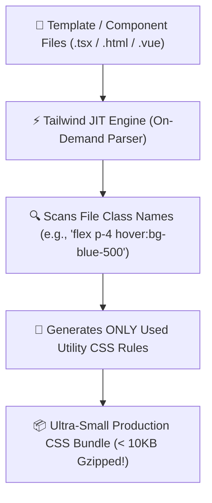

# 🎨 Tailwind CSS Master Roadmap & Learning Progress Tracker

## 🏛️ Tailwind CSS Engine & Build Architecture

### 🏗️ Just-In-Time (JIT) Engine Build Pipeline


---

## 📑 Phase 1: Tailwind Core & Utility-First Philosophy

### Module 1: Utility-First CSS Philosophy
- [x] **Utility-First Paradigm**
  - Composing custom designs directly in HTML/JSX using low-level utility classes (`flex`, `pt-4`, `text-center`, `rounded-xl`).
  - Eliminates context switching between CSS files and class naming fatigue (BEM methodology).

### Module 2: Just-In-Time (JIT) Compiler Engine
- [x] **JIT Engine Mechanics**
  - Generates CSS rules on-demand at compile time by scanning source files. Enables arbitrary values (`top-[117px]`, `bg-[#1da1f2]`).

---

## ⚡ Phase 2: Responsive Design, States & Themes

### Module 3: Responsive Breakpoints & Pseudo-Classes
- [x] **Mobile-First Responsive Design**
  - Unprefixed classes target all screen sizes; prefixes apply at breakpoint and up (`sm:`, `md:`, `lg:`, `xl:`, `2xl:`).
- [x] **State Modifiers & Dark Mode**
  - Hover, focus, active, group hover (`group-hover:`), peer states (`peer-checked:`), and dark mode (`dark:`).

### Module 4: Configuration & Customization (`tailwind.config.js` / `@theme`)
- [x] **Extending Theme Config**
  - Customizing colors, font families, keyframe animations, and breakpoints under `theme.extend`.
- [x] **`@apply` Directive vs Raw Utilities**
  - Using `@apply` in CSS to extract repeating utility patterns into custom component classes.

---

## 🛠️ Phase 3: Practical Tailwind Component Code

### Responsive Dark Mode Glassmorphism Card Component (`Card.tsx`)
```tsx
export function GlassCard() {
  return (
    <div className="flex min-h-screen items-center justify-center bg-slate-100 p-6 dark:bg-slate-900">
      <div className="group relative w-full max-w-sm overflow-hidden rounded-2xl border border-white/20 bg-white/70 p-6 shadow-xl backdrop-blur-md transition-all duration-300 hover:-translate-y-2 hover:shadow-2xl dark:border-slate-700/50 dark:bg-slate-800/70">
        
        {/* Badge */}
        <span className="inline-block rounded-full bg-blue-100 px-3 py-1 text-xs font-semibold text-blue-600 dark:bg-blue-900/40 dark:text-blue-400">
          Pro Feature
        </span>

        {/* Title */}
        <h3 className="mt-4 text-xl font-bold text-slate-800 transition-colors group-hover:text-blue-600 dark:text-white dark:group-hover:text-blue-400">
          Tailwind Utility Card
        </h3>

        {/* Description */}
        <p className="mt-2 text-sm leading-relaxed text-slate-600 dark:text-slate-300">
          Composed using utility-first classes, responsive breakpoints, dark mode, and hover transition states.
        </p>

        {/* Button */}
        <button className="mt-6 w-full rounded-xl bg-gradient-to-r from-blue-600 to-indigo-600 px-4 py-2.5 text-sm font-semibold text-white shadow-md transition-all hover:from-blue-700 hover:to-indigo-700 focus:outline-none focus:ring-2 focus:ring-blue-500/50 active:scale-[0.98]">
          Explore Component
        </button>
      </div>
    </div>
  );
}
```

---

## 🎯 Top Tailwind CSS Interview Q&A Cheatsheet (Master List)

### Q1: What is the main advantage of Tailwind CSS's Utility-First approach compared to component frameworks like Bootstrap?
Tailwind provides low-level atomic utility classes without enforcing pre-designed component opinions. This eliminates custom CSS file maintenance, class naming fatigue (BEM), and style overrides, while producing ultra-small production CSS bundles via JIT purge engine.

### Q2: How does the Tailwind JIT (Just-In-Time) Engine work?
The JIT engine scans template files (HTML, JSX, Vue) for utility class names at build time and generates *only* the specific CSS rules actually used in the project, supporting arbitrary values (`h-[320px]`) and eliminating large unused CSS payloads.

### Q3: How does Mobile-First responsive design work in Tailwind?
Tailwind uses a mobile-first breakpoint system (`sm:`, `md:`, `lg:`, `xl:`, `2xl:`). Unprefixed classes (e.g. `w-full`) apply to mobile devices by default, while prefixed classes (e.g. `md:w-1/2`) take effect at that breakpoint and larger screen sizes.
