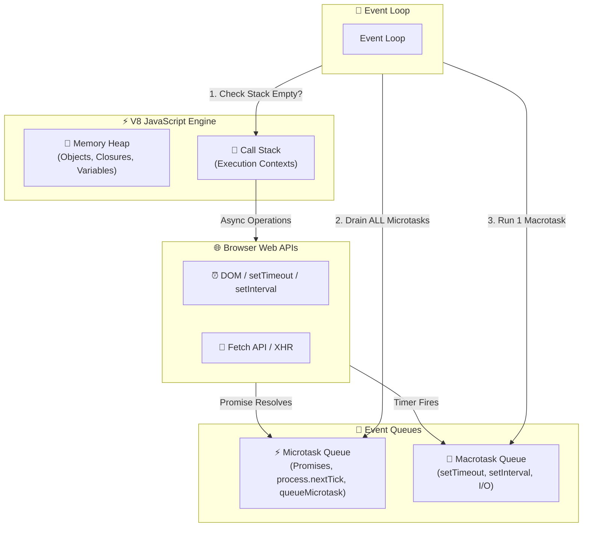
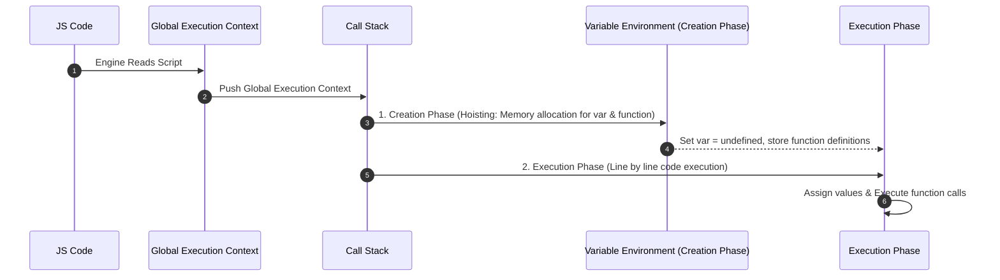

# 🟨 JavaScript Interview Preparation & Master Roadmap

## 🏛️ JavaScript Engine & Execution Architecture

### 🏗️ Event Loop & Memory Architecture


### 🔄 Execution Context & Scope Chain Creation


---

## 📑 Phase 1: Core JS Mechanics & Scope

### Module 1: Types, Scope & Hoisting
- [x] **Primitive vs Reference Types**
  - **Primitives**: `string`, `number`, `boolean`, `undefined`, `null`, `symbol`, `bigint`. Stored directly in Stack by value. Immutable.
  - **Reference Types**: `Object`, `Array`, `Function`, `Date`, etc. Stored in Heap; variables store memory address references.
- [x] **Type Coercion & Equality**
  - Loose equality (`==`): Performs type coercion before comparing (e.g., `'5' == 5` is `true`, `null == undefined` is `true`).
  - Strict equality (`===`): Compares both value and type without coercion (`'5' === 5` is `false`).
  - Truthy vs Falsy values: `0`, `""`, `null`, `undefined`, `NaN`, `false` are the 6 falsy values in JS.
- [x] **Hoisting & Temporal Dead Zone (TDZ)**
  - **Hoisting**: JS engine moves variable and function declarations to the top of their containing scope during compilation.
  - `var`: Hoisted and initialized with `undefined`.
  - `let` & `const`: Hoisted but **NOT initialized**. Placed in the **Temporal Dead Zone (TDZ)** from block start until declaration line. Accessing them before declaration throws `ReferenceError`.
  - Function declarations: Fully hoisted (can be called before definition). Function expressions (`var foo = () => {}`): Only variable is hoisted.

### Module 1.1: Advanced ES6+ Features
- [x] **Symbol & BigInt**
  - `Symbol`: Primitive data type producing guaranteed unique identifiers (`Symbol('id') !== Symbol('id')`). Useful for private object property keys.
  - Well-Known Symbols: `Symbol.iterator` (makes objects iterable via `for...of`), `Symbol.toPrimitive`.
  - `BigInt`: Represents integers larger than $2^{53} - 1$ (`123n`).
- [x] **Map vs Object & Set vs Array**
  - **Map**: Keys can be of ANY type (objects, functions, primitives). Maintains insertion order. Built-in `.size` property. Highly optimized for frequent additions/deletions.
  - **Object**: Keys restricted to Strings/Symbols. Unordered keys.
  - **Set**: Collection of unique values. Prevents duplicate values automatically.

### Module 2: Scope Chain & Closures
- [x] **Lexical Scope & Scope Chain**
  - Inner functions have access to variables defined in their outer lexical scope.
  - Scope chain is determined at compile-time (where code is written, not called).
- [x] **Closures (Deep Dive for Interviews)**
  - A closure is a function bundled together with references to its surrounding state (lexical environment).
  - Enables a function to access outer variables even after the outer function has returned and popped off the Call Stack.
  - **Use cases**: Data privacy/encapsulation (private variables), Function Currying, Memoization, Module Pattern.
  - *Memory leak pitfall:* Unused closures holding references to large objects in memory.

### Module 2.1: Functional Programming Patterns
- [x] **Currying & Partial Application**
  - **Currying**: Transforming a function `f(a, b, c)` into a sequence of unary functions `f(a)(b)(c)`.
  - Enables function reusability and partial application of arguments.
- [x] **Pure Functions & Immutability**
  - Pure function produces identical output for identical inputs and has zero side effects (no DOM modification, external state mutation, or API calls).

---

## ⚙️ Phase 2: Objects, Prototypes & `this` Keyword

### Module 3: `this` Binding Rules
- [x] **Default Binding**: Standalone function call in non-strict mode points to `window`/`global`; in `'use strict'`, `this` is `undefined`.
- [x] **Implicit Binding**: Function called as an object method (`obj.fn()`); `this` points to `obj`.
- [x] **Explicit Binding**: Using `call()`, `apply()`, or `bind()`.
  - `fn.call(thisArg, arg1, arg2)`: Executes immediately with arguments passed individually.
  - `fn.apply(thisArg, [arg1, arg2])`: Executes immediately with arguments passed as an array.
  - `fn.bind(thisArg, arg1)`: Returns a **new function** with `this` permanently bound.
- [x] **`new` Binding**: When invoking constructor with `new Fn()`, a new object is created and bound to `this`.
- [x] **Arrow Functions `this`**: Arrow functions do **NOT** have their own `this`. They inherit `this` lexically from their enclosing scope at creation. `call`/`apply`/`bind` cannot change an arrow function's `this`.

### Module 3.1: Object Manipulation & Property Descriptors
- [x] **Property Descriptors (`Object.defineProperty`)**
  - Attributes: `value`, `writable` (can value change?), `enumerable` (shows up in `for...in` & `Object.keys`), `configurable` (can descriptor be deleted/changed?).
- [x] **Shallow vs Deep Copy**
  - **Shallow Copy**: `Object.assign({}, obj)` or `{ ...obj }` copies primitive values but copies references for nested objects.
  - **Deep Copy**: `structuredClone(obj)` (native modern solution), `JSON.parse(JSON.stringify(obj))` (fails on functions, undefined, Symbols, Circular refs), or custom recursive clone.
- [x] **`Object.freeze()` vs `Object.seal()`**
  - `Object.freeze()`: Prevents adding, deleting, or modifying existing property values (makes object completely immutable at top level).
  - `Object.seal()`: Prevents adding or deleting properties, but allows modifying existing writable property values.

### Module 4: Prototypes & Prototypal Inheritance
- [x] **Prototype Chain**
  - Every JS object has an internal `[[Prototype]]` link (accessible via `Object.getPrototypeOf(obj)` or `__proto__`).
  - When accessing a property, JS searches the object first; if not found, it traverses up the prototype chain until `null`.
- [x] **Prototypal Inheritance vs Class Syntax**
  - Objects inherit directly from other objects (prototypal delegation).
  - ES6 `class` syntax is syntactical sugar over prototypes (`class Child extends Parent`).

### Module 4.1: Meta-programming (Proxy & Reflect)
- [x] **Proxy API**: Wraps an object to intercept and redefine fundamental operations (getters, setters, function invocation).
  - Traps: `get(target, prop, receiver)`, `set(target, prop, value)`, `has`, `deleteProperty`.
  - Powers reactivity engines in modern frameworks (Vue 3).
- [x] **Reflect API**: Built-in object providing default methods for interceptable JS operations (`Reflect.get`, `Reflect.set`).

---

## ⚡ Phase 3: Asynchronous JavaScript & Memory Management

### Module 5: Promises & Async/Await
- [x] **Promise States**: `pending`, `fulfilled`, `rejected`. Immutable state transition once settled.
- [x] **Microtask Queue vs Macrotask Queue**
  - **Microtasks** (Highest Priority): `Promise.then/catch/finally`, `queueMicrotask()`, `MutationObserver`.
  - **Macrotasks**: `setTimeout`, `setInterval`, `setImmediate` (Node.js), I/O events.
  - *Rule:* Event loop drains the **entire Microtask Queue** before processing the next Macrotask.
- [x] **Promise Combinators**:
  - `Promise.all([p1, p2])`: Resolves when ALL promises resolve; rejects immediately if ANY promise rejects (fail-fast).
  - `Promise.allSettled([p1, p2])`: Waits for ALL promises to complete regardless of resolution/rejection. Returns array of `{ status, value/reason }`.
  - `Promise.race([p1, p2])`: Resolves/rejects as soon as the FIRST promise settles.
  - `Promise.any([p1, p2])`: Resolves as soon as the FIRST promise fulfills; rejects only if ALL promises reject (`AggregateError`).

### Module 5.1: Memory Management & Garbage Collection
- [x] **V8 Garbage Collection (Mark-and-Sweep)**
  - Starts at root objects (`window`, global context) and marks all reachable objects. Unreachable objects are swept and freed.
- [x] **Common Memory Leak Causes in JS**:
  1. Accidental global variables (`window.userData = ...`).
  2. Uncleared timers (`setInterval`) holding references to unmounted component state.
  3. Detached DOM nodes retained in JS variables.
  4. Closures retaining outer scope variables unexpectedly.

---

## 🛠️ Phase 4: Machine Coding Polyfills & Patterns

### 1. Custom `Array.prototype.myMap` Polyfill
```javascript
Array.prototype.myMap = function (callback) {
  if (typeof callback !== 'function') throw new TypeError('Callback must be a function');
  const result = [];
  for (let i = 0; i < this.length; i++) {
    if (Object.prototype.hasOwnProperty.call(this, i)) {
      result.push(callback(this[i], i, this));
    }
  }
  return result;
};
```

### 2. Custom `Array.prototype.myReduce` Polyfill
```javascript
Array.prototype.myReduce = function (callback, initialValue) {
  if (typeof callback !== 'function') throw new TypeError('Callback must be a function');
  let accumulator = initialValue !== undefined ? initialValue : this[0];
  let startIndex = initialValue !== undefined ? 0 : 1;

  for (let i = startIndex; i < this.length; i++) {
    if (Object.prototype.hasOwnProperty.call(this, i)) {
      accumulator = callback(accumulator, this[i], i, this);
    }
  }
  return accumulator;
};
```

### 3. Debounce Function Implementation
```javascript
function debounce(fn, delay) {
  let timerId;
  return function (...args) {
    const context = this;
    clearTimeout(timerId);
    timerId = setTimeout(() => {
      fn.apply(context, args);
    }, delay);
  };
}
```

### 4. Throttle Function Implementation
```javascript
function throttle(fn, limit) {
  let inThrottle = false;
  return function (...args) {
    const context = this;
    if (!inThrottle) {
      fn.apply(context, args);
      inThrottle = true;
      setTimeout(() => (inThrottle = false), limit);
    }
  };
}
```

### 5. Custom `Promise.all` Polyfill
```javascript
function myPromiseAll(promises) {
  return new Promise((resolve, reject) => {
    if (!Array.isArray(promises)) {
      return reject(new TypeError('Argument must be an array'));
    }
    const results = [];
    let completedCount = 0;

    if (promises.length === 0) return resolve([]);

    promises.forEach((promise, index) => {
      Promise.resolve(promise)
        .then((value) => {
          results[index] = value;
          completedCount++;
          if (completedCount === promises.length) {
            resolve(results);
          }
        })
        .catch(reject);
    });
  });
}
```

### 6. Deep Clone (handling Circular References)
```javascript
function deepClone(obj, hash = new WeakMap()) {
  if (Object(obj) !== obj) return obj; // Primitives
  if (obj instanceof Date) return new Date(obj);
  if (obj instanceof RegExp) return new RegExp(obj);
  if (hash.has(obj)) return hash.get(obj); // Circular ref fix

  const result = Array.isArray(obj) ? [] : Object.create(Object.getPrototypeOf(obj));
  hash.set(obj, result);

  Reflect.ownKeys(obj).forEach((key) => {
    result[key] = deepClone(obj[key], hash);
  });

  return result;
}
```

---

## 🎯 Top JavaScript Interview Q&A Cheatsheet (Expanded)

### Q1: What is the output of `console.log(1); setTimeout(() => console.log(2), 0); Promise.resolve().then(() => console.log(3)); console.log(4);`?
**Output:** `1`, `4`, `3`, `2`.
**Explanation:** `1` and `4` are synchronous (Call Stack). `3` is placed in Microtask Queue (Promise). `2` is placed in Macrotask Queue (`setTimeout`). Microtasks execute before Macrotasks.

### Q2: What is the difference between `Map`/`Set` vs `WeakMap`/`WeakSet`?
- `Map`/`Set` hold strong references to keys/elements, preventing garbage collection.
- `WeakMap`/`WeakSet` hold **weak references** to object keys. If no other reference to an object key exists, it can be garbage collected. `WeakMap` keys must be objects and are not iterable.

### Q3: What is Event Delegation?
A pattern of attaching a single event listener to a parent element to handle events on its descendants by leveraging event bubbling (`e.target`). Saves memory and handles dynamically added child elements.

### Q4: What is Function Currying and why is it useful?
Currying transforms a function taking multiple arguments `fn(a, b, c)` into nested single-argument functions `fn(a)(b)(c)`. Useful for partial evaluation, creating specialized re-usable helper functions, and composing functional pipelines.

### Q5: What is the difference between `Object.freeze()` and `Object.seal()`?
- `Object.freeze()`: Prevents adding, deleting, OR modifying existing property values (makes object completely immutable at top level).
- `Object.seal()`: Prevents adding or deleting properties, but allows modifying existing writable values.

### Q6: How does Garbage Collection work in V8 JavaScript Engine?
V8 uses **Mark-and-Sweep**. Starting from root objects (`window`, global execution context), it recursively marks all referenced reachable objects. Unreachable objects are swept and freed from memory heap.

### Q7: What are `Proxy` and `Reflect` used for in JavaScript?
`Proxy` creates a wrapper object to intercept and redefine fundamental operations (like property reads `get`, writes `set`, deletion). `Reflect` provides standard default methods to perform native JS operations inside proxy traps. Used heavily by modern reactive frameworks like Vue 3.

### Q8: What is a Generator Function (`function*`)?
A special function that can be paused and resumed using the `yield` keyword. Returns a Generator Object adhering to the Iterator protocol (`.next()` returning `{ value, done }`).

### Q9: What is the difference between `__proto__` and `prototype`?
- `prototype`: A property on **constructor functions** used to assign properties/methods to instances created via `new`.
- `__proto__`: An internal accessor property on **object instances** pointing to the prototype object from which they inherited.

### Q10: How do you detect and fix Memory Leaks in JavaScript?
Use Chrome DevTools Memory Profiler to record heap snapshots and allocation timelines. Look for detached DOM trees, uncleared `setInterval` handles, and excessive closures retaining outer references.
