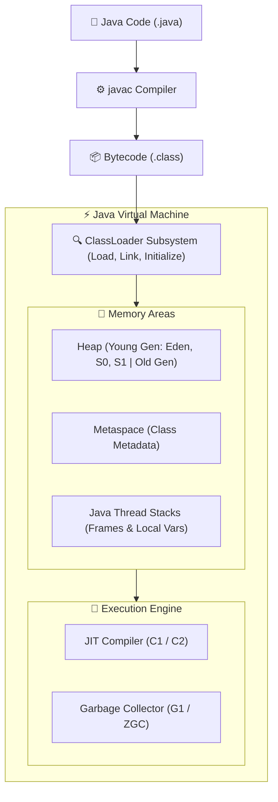

# ☕ Java Core & JVM Architecture Master Roadmap & Progress Tracker

## 🏛️ JVM Architecture & Memory Model

### 🏗️ JVM Architecture Pipeline


---

## 📑 Phase 1: JVM Architecture & Core Mechanics

### Module 1: JVM Architecture & Execution Pipeline
- [x] **What is JVM?**
  - Abstract computing machine enabling Java programs to run on any OS (`Write Once, Run Anywhere`).
- [x] **ClassLoader Subsystem**
  - Responsible for Loading, Linking (Verify, Prepare, Resolve), and Initializing `.class` bytecode files.
- [x] **Execution Engine & JIT Compiler**
  - Combines Bytecode Interpreter with Just-In-Time (JIT C1/C2) Compilers translating hot code into native machine code.

### Module 2: JVM Memory Model
- [x] **Java Heap Memory**
  - Stores all instantiated objects. Divided into Young Generation (Eden, Survivor S0, Survivor S1) and Old Generation.
- [x] **Metaspace**
  - Off-heap native memory area storing class metadata, method structures, and static variables (replaced PermGen in Java 8).
- [x] **Java Thread Stacks**
  - Per-thread stack allocation storing stack frames, local variables, method call parameters, and return addresses.

### Module 3: Garbage Collection Algorithms
- [x] **Generational Garbage Collection**
  - Minor GC cleans Young Gen (Eden/S0/S1); Major/Full GC cleans Old Generation.
- [x] **Garbage Collectors**
  - Serial GC, Parallel GC, **G1GC** (Garbage-First region-based), **ZGC** (Ultra-low latency $< 1\text{ms}$ pause time).

### Module 4: String Mechanics & String Constant Pool
- [x] **String Immutability**
  - `String` objects are immutable in Java for thread-safety, security, hashing stability, and pool caching.
- [x] **String Constant Pool & `String.intern()`**
  - Special heap memory area storing distinct string literals. `.intern()` manually places string into pool.
- [x] **`StringBuilder` vs `StringBuffer`**
  - `StringBuilder`: Mutable character sequence; non-thread-safe (fast).
  - `StringBuffer`: Mutable character sequence; thread-safe with synchronized methods.

---

## ⚡ Phase 2: OOP & Core Java Features

### Module 5: OOP Principles in Java
- [x] **Encapsulation, Inheritance, Polymorphism, Abstraction**
  - Object-oriented core; Method Overloading (compile-time polymorphism) vs Method Overriding (runtime polymorphism).
- [x] **Interfaces vs Abstract Classes**
  - Abstract class supports instance state and constructors; Interface defines default/static methods and contracts.

### Module 6: Exception Handling
- [x] **Checked vs Unchecked Exceptions**
  - Checked (`Exception`): Mandatory compile-time handling (`IOException`, `SQLException`).
  - Unchecked (`RuntimeException`): Runtime errors (`NullPointerException`, `IllegalArgumentException`).
- [x] **Try-With-Resources (`AutoCloseable`)**
  - Automatic resource management closing streams/sockets at block end without explicit `finally` blocks.

### Module 7: Java Generics & Type Erasure
- [x] **Generics (`<T>`)**
  - Type-safe compile-time parameters eliminating runtime `ClassCastException`.
- [x] **The PECS Rule**
  - **P**roducer **E**xtends (`? extends T` read-only), **C**onsumer **S**uper (`? super T` write-only).
- [x] **Type Erasure**
  - Compiler replaces generic types with `Object` or bounds at compile time for backward compatibility.

### Module 8: Java Reflection & Annotations
- [x] **Reflection API**
  - Inspecting and invoking classes, constructors, methods, and private fields dynamically at runtime.
- [x] **Custom Annotations**
  - Declaring metadata markers using `@Retention(RetentionPolicy.RUNTIME)` and `@Target`.

---

## 🛠️ Phase 3: Java Collections Framework & Internals

### Module 9: List & Set Collections
- [x] **`ArrayList` vs `LinkedList`**
  - `ArrayList`: Dynamic array with fast $O(1)$ random index access.
  - `LinkedList`: Doubly linked list with fast $O(1)$ element insertion/deletion.
- [x] **`HashSet` vs `TreeSet`**
  - `HashSet`: Backed by HashMap enforcing unique elements.
  - `TreeSet`: Backed by Red-Black Tree maintaining sorted order ($O(\log N)$).

### Module 10: HashMap Internal Architecture (Java 8+)
- [x] **Array Bucket Table**
  - Array of Node buckets (`Node<K,V>[] table`) indexed by key `hashCode()`.
- [x] **Treeification**
  - Converts bucket Linked List into Red-Black Tree when items $> 8$ and table capacity $\ge 64$ ($O(N) \rightarrow O(\log N)$).

### Module 11: Concurrent Collections
- [x] **`ConcurrentHashMap`**
  - Thread-safe map using **CAS (Compare-And-Swap)** and bucket-level locking instead of locking whole table.
- [x] **`CopyOnWriteArrayList` & `BlockingQueue`**
  - Thread-safe collections for read-heavy operations and producer-consumer queues.

---

## ⚙️ Phase 4: Concurrency & Multithreading

### Module 12: Multithreading Fundamentals
- [x] **Thread Creation (`Thread` vs `Runnable` vs `Callable`)**
  - `Runnable` returns no value; `Callable<V>` returns result and throws checked exceptions via `Future<V>`.

### Module 13: Memory Visibility & Synchronization
- [x] **`volatile` Keyword**
  - Guarantees **visibility** of changes across threads by reading directly from Main Memory (bypassing CPU caches).
- [x] **`synchronized` Keyword**
  - Guarantees both **visibility** AND **atomicity** using intrinsic locks (monitors).

### Module 14: Advanced Concurrency & Locks
- [x] **Explicit Locks & Synchronizers**
  - `ReentrantLock`, `ReadWriteLock`, `Semaphore`, `CountDownLatch`, `CyclicBarrier`.

### Module 15: Thread Pools & Executor Framework
- [x] **`ExecutorService` & `ThreadPoolExecutor`**
  - Reusing worker threads to prevent thread creation overhead (`FixedThreadPool`, `CachedThreadPool`).

### Module 16: `CompletableFuture` Asynchronous Pipelines
- [x] **Non-blocking Asynchronous Pipeline**
  - Chaining async callbacks (`thenApply`, `thenCompose`, `exceptionally`, `allOf`) without blocking threads.

---

## 🚀 Phase 5: Java 8+ Features, Design Patterns & Tuning

### Module 17: Functional Programming & Lambdas
- [x] **Lambda Expressions & `@FunctionalInterface`**
  - Concise syntax for single-method interfaces (`Function`, `Predicate`, `Consumer`, `Supplier`, `Optional<T>`).

### Module 18: Java Streams API
- [x] **Stream Pipelines**
  - Declarative data processing: Intermediate (`filter`, `map`, `sorted`) and Terminal (`collect`, `reduce`, `forEach`) operations.

### Module 19: Design Patterns in Java
- [x] **Core Patterns**
  - Singleton (Double-Checked Locking), Factory, Builder, Strategy, Observer.

### Module 20: JVM Performance Tuning & Diagnostics
- [x] **Tuning Flags & Monitoring Tools**
  - Flags (`-Xms`, `-Xmx`, `-XX:+UseG1GC`, `-XX:+HeapDumpOnOutOfMemoryError`), JConsole, VisualVM diagnostics.

---

## 🛠️ Phase 6: Practical Java Code Patterns

### 1. Double-Checked Locking Singleton Pattern
```java
public class Singleton {
    private static volatile Singleton instance;

    private Singleton() {}

    public static Singleton getInstance() {
        if (instance == null) {
            synchronized (Singleton.class) {
                if (instance == null) {
                    instance = new Singleton();
                }
            }
        }
        return instance;
    }
}
```

### 2. `CompletableFuture` Non-Blocking Async Pipeline
```java
import java.util.concurrent.CompletableFuture;

public class AsyncPipeline {
    public static void main(String[] args) {
        CompletableFuture.supplyAsync(() -> "User_123")
            .thenApply(userId -> "Fetch Order for: " + userId)
            .thenAccept(order -> System.out.println("Result: " + order))
            .exceptionally(ex -> {
                System.err.println("Error: " + ex.getMessage());
                return null;
            });
    }
}
```

---

## 🎯 Top Java Senior Interview Q&A Cheatsheet (Master List)

### Q1: How does `HashMap` work internally in Java 8+?
`HashMap` uses an array of buckets. When key is inserted, `hashCode()` determines bucket index. Collisions store key-value pairs in a Linked List. When list length exceeds 8 and table capacity $\ge 64$, Java 8 converts the list into a Red-Black Tree to optimize search performance from $O(N)$ to $O(\log N)$.

### Q2: Explain the PECS rule in Java Generics.
PECS stands for **Producer Extends, Consumer Super**. Use `? extends T` when you only read data from a collection (Producer). Use `? super T` when you only write data to a collection (Consumer).

### Q3: How does `CompletableFuture` differ from traditional `Future`?
Traditional `Future.get()` is a blocking call. `CompletableFuture` provides non-blocking asynchronous callbacks (`thenApply`, `thenCompose`, `exceptionally`), allowing chaining of complex async pipelines without thread blocking.

### Q4: Why is `volatile` used in Double-Checked Locking Singleton implementation?
Without `volatile`, instruction reordering by the CPU/compiler could assign a memory address to `instance` before the constructor finishes execution, allowing another thread to receive a partially initialized instance!
