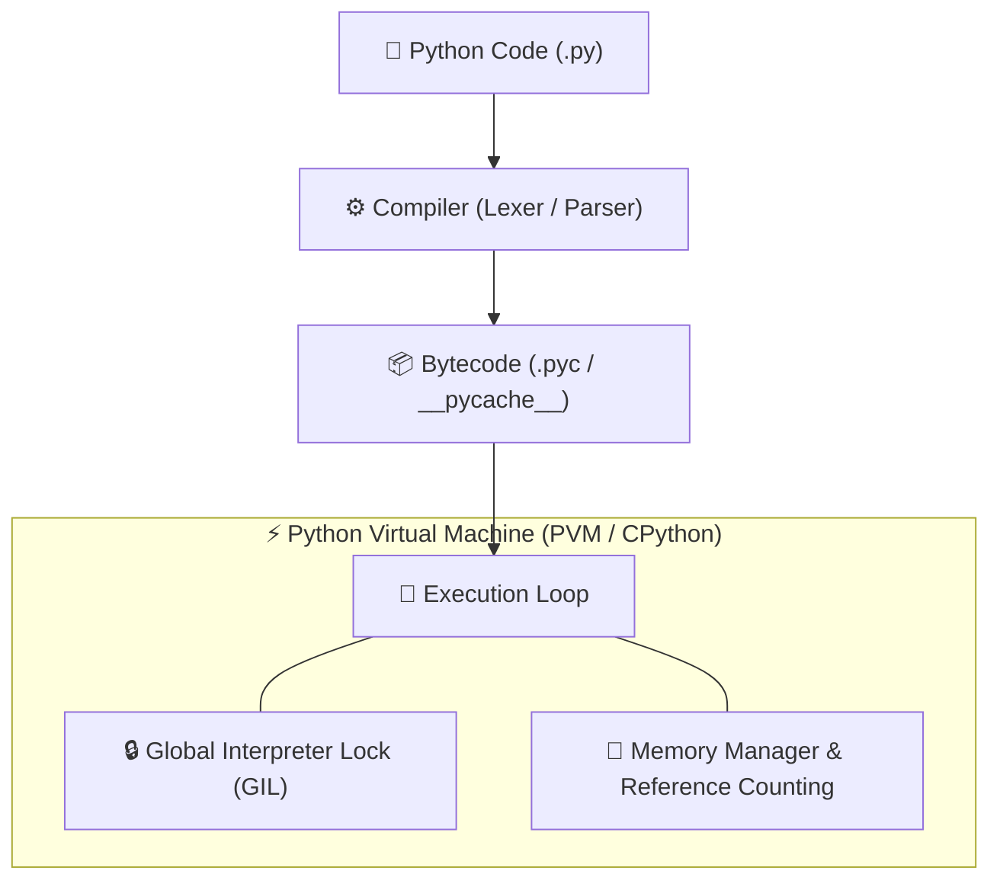

# 🐍 Python Master Roadmap & Learning Progress Tracker

## 🏛️ Python Execution & Memory Architecture

### 🏗️ CPython Execution Pipeline


---

## 📑 Phase 1: Core Fundamentals & Execution Architecture

### Module 1: Introduction to Python & CPython Architecture
- [x] **What is Python?**
  - High-level, interpreted, dynamically-typed programming language emphasizing code readability.
- [x] **CPython Execution Model**
  - CPython compiles `.py` source code into intermediate bytecode (`.pyc`) executed by the Python Virtual Machine (PVM).
- [x] **Interpreted vs Compiled Characteristics**
  - Source code is compiled to bytecode first, then interpreted line-by-line by the PVM execution loop.

### Module 2: Memory Management & Garbage Collection
- [x] **Reference Counting**
  - Primary memory manager incrementing/decrementing reference counts. Objects are deallocated immediately when count reaches 0.
- [x] **Generational Garbage Collector**
  - Detects cyclic reference memory leaks (`A -> B -> A`) across 3 generations (Gen 0, Gen 1, Gen 2).
- [x] **`sys.getrefcount()`**
  - Inspecting object reference counts for memory debugging.

### Module 3: Memory Optimization & `__slots__`
- [x] **`__slots__` Attribute**
  - Restricts dynamic attribute creation by eliminating the instance `__dict__` dictionary overhead.
  - Reduces object memory footprint by **40%–50%** in high-instance classes.

### Module 4: Global Interpreter Lock (GIL)
- [x] **GIL Mechanics**
  - Mutex lock in CPython preventing multiple native threads from executing Python bytecode simultaneously.
- [x] **I/O-Bound vs CPU-Bound Multi-Threading**
  - **I/O-Bound Tasks**: Multithreading works well (GIL released during I/O socket/file calls).
  - **CPU-Bound Tasks**: Use `multiprocessing` (separate PVM processes per CPU core) to bypass GIL.

---

## ⚡ Phase 2: Data Structures, Types & Scope Rules

### Module 5: Data Types & Mutability
- [x] **Mutable vs Immutable Types**
  - Mutable (`list`, `dict`, `set`, `bytearray`): Modified in-place.
  - Immutable (`int`, `float`, `str`, `tuple`, `frozenset`, `bool`): Modifications create new objects.
- [x] **Shallow vs Deep Copy**
  - `copy.copy()` duplicates container object references; `copy.deepcopy()` recursively copies all nested objects.

### Module 6: Mutable Default Arguments Trap
- [x] **Function Default Parameter Evaluation**
  - Default arguments are evaluated **once when function is defined**, not on each call.
  - *Pitfall:* `def add(item, target=[])` reuses the same list instance. Fix: set default to `None`.

### Module 7: LEGB Scope Rule & Variable Resolution
- [x] **LEGB Rule**
  - Variable lookup order: **L**ocal $\rightarrow$ **E**nclosing $\rightarrow$ **G**lobal $\rightarrow$ **B**uilt-in.
- [x] **`global` vs `nonlocal` Keywords**
  - `global`: Modifies module-level global variables inside functions.
  - `nonlocal`: Modifies variables in the nearest enclosing non-global scope.

### Module 8: Advanced Data Structures (`collections` module)
- [x] **`collections` Utilities**
  - `defaultdict` (auto-initializes missing keys), `Counter` (frequency hashing), `OrderedDict`, `namedtuple`, `deque` (fast $O(1)$ double-ended queue).

---

## 🛠️ Phase 3: Functional Programming & Advanced Features

### Module 9: Higher-Order Functions & Lambdas
- [x] **First-Class Functions**
  - Functions can be passed as arguments, returned from functions, and assigned to variables.
- [x] **`lambda`, `map()`, `filter()`, `reduce()`**
  - Anonymous single-expression functions used with functional processing tools.

### Module 10: Decorators & Function Wrappers
- [x] **Decorators (`@decorator`)**
  - Higher-order functions wrapping target functions to extend behavior dynamically.
- [x] **`@functools.wraps`**
  - Preserves target function metadata (`__name__`, `__doc__`, signatures) inside decorators.

### Module 11: Generators & Iterators
- [x] **Iterator Protocol (`__iter__`, `__next__`)**
  - Objects implementing `__iter__()` and `__next__()` for sequential data iteration.
- [x] **Generators & `yield`**
  - Functions using `yield` to stream values lazily on demand, saving massive memory over large lists.

### Module 12: Context Managers
- [x] **`with` Statement Protocol**
  - Guarantees resource setup and teardown via `__enter__()` and `__exit__()` (or `@contextmanager`).

---

## ⚙️ Phase 4: Object-Oriented Programming & Meta-Programming

### Module 13: OOP Principles & Methods
- [x] **Encapsulation, Inheritance, Polymorphism**
  - Object-oriented architecture; private attributes designated via `_single` or `__double` name mangling.
- [x] **`@classmethod` vs `@staticmethod`**
  - `@classmethod` receives `cls` parameter (factory constructors); `@staticmethod` receives no class/instance reference.

### Module 14: Dunder / Magic Methods
- [x] **Core Dunder Methods**
  - `__init__` (initializer), `__str__` (user readable), `__repr__` (developer explicit), `__call__` (callable instance), `__len__`, `__getitem__`.

### Module 15: Method Resolution Order (MRO)
- [x] **MRO & `super()`**
  - C3 Linearization algorithm resolving method lookup order in multiple inheritance (`ClassName.mro()`).

### Module 16: Descriptors & Property Protocol
- [x] **Descriptor Protocol (`__get__`, `__set__`, `__delete__`)**
  - Low-level attribute access customization powering `@property`, `classmethod`, and ORMs.

### Module 17: Metaclasses
- [x] **Metaclasses (`type`)**
  - "Classes of classes" (`class MyMeta(type)`). Intercepts class creation (`__new__`) to validate or alter class structures dynamically.

---

## 🚀 Phase 5: Concurrency, Testing & Ecosystem

### Module 18: Asynchronous Programming (`asyncio`)
- [x] **`asyncio` Event Loop**
  - Non-blocking asynchronous I/O execution loop using coroutines (`async`/`await`), `asyncio.gather()`, and `asyncio.create_task()`.

### Module 19: Testing & Package Management
- [x] **`pytest` & Mocks**
  - Unit testing framework with fixtures and parameterization; mocking dependencies via `unittest.mock`.

### Module 20: Type Hinting (`typing` module)
- [x] **Type Annotations & Static Analysis**
  - Adding type hints (`Union`, `Optional`, `Callable`, `Generic`) validated via static analyzers like `mypy`.

---

## 🛠️ Phase 6: Machine Coding Decorator Snippets

### 1. Retry Decorator with Exponential Backoff
```python
import time
from functools import wraps

def retry(max_attempts=3, delay=1, backoff=2):
    def decorator(func):
        @wraps(func)
        def wrapper(*args, **kwargs):
            current_delay = delay
            for attempt in range(1, max_attempts + 1):
                try:
                    return func(*args, **kwargs)
                except Exception as e:
                    if attempt == max_attempts:
                        raise e
                    print(f"Attempt {attempt} failed: {e}. Retrying in {current_delay}s...")
                    time.sleep(current_delay)
                    current_delay *= backoff
        return wrapper
    return decorator
```

### 2. Custom Context Manager Class
```python
class DatabaseConnection:
    def __init__(self, db_url):
        self.db_url = db_url
        self.conn = None

    def __enter__(self):
        print(f"Connecting to {self.db_url}...")
        self.conn = "CONNECTED_DB_HANDLE"
        return self.conn

    def __exit__(self, exc_type, exc_val, exc_tb):
        print("Closing database connection...")
        self.conn = None
        if exc_type:
            print(f"Exception handled: {exc_val}")
        return False # Propagate exceptions
```

---

## 🎯 Top Python Senior Interview Q&A Cheatsheet (Master List)

### Q1: What is the Python GIL and how do you handle CPU-bound vs I/O-bound tasks?
The GIL (Global Interpreter Lock) ensures only one thread executes Python bytecode at a time in CPython. For I/O-bound tasks (network/file operations), use `threading` or `asyncio` as the GIL is released during I/O. For CPU-bound tasks, use `multiprocessing` to spawn separate processes with their own GIL and PVM instances.

### Q2: How do Python Context Managers (`with` statement) work?
Context managers manage setup and teardown resources. When entering a `with` block, `__enter__()` executes and returns the target object. When exiting, `__exit__()` is guaranteed to run even if exceptions occur, automatically handling resource cleanup (file descriptors, locks, DB sockets).

### Q3: What is the purpose of `__slots__` in Python classes?
`__slots__` replaces the dynamic `__dict__` dictionary used by Python objects to store attributes with a fixed-size array. It saves significant memory (40-50% reduction) when instantiating millions of small objects.

### Q4: How does `asyncio.gather()` differ from `asyncio.create_task()`?
`asyncio.create_task()` schedules a single coroutine to run on the event loop concurrently in the background. `asyncio.gather()` takes multiple awaitable tasks, runs them concurrently, and waits for all of them to complete, returning an ordered list of results.
