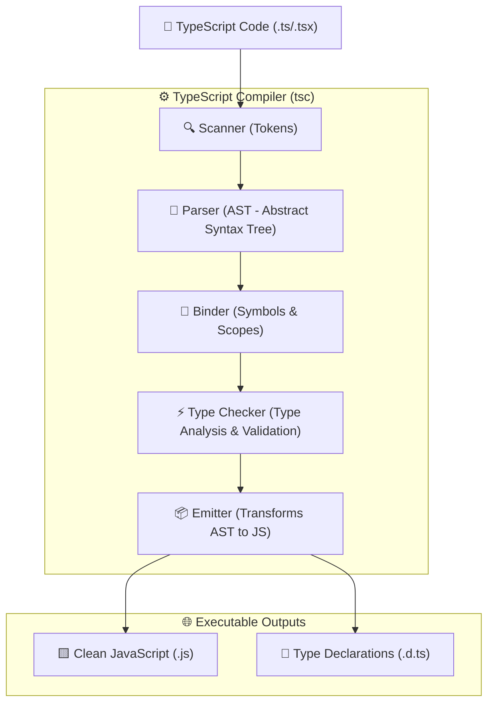

# 🔷 TypeScript Interview Preparation & Master Roadmap

## 🏛️ TypeScript Architecture & Compiler Pipeline

### 🏗️ TS Compiler Pipeline Architecture


---

## 📑 Phase 1: Type System & Core Mechanics

### Module 1: Fundamental & Special Types
- [x] **`any` vs `unknown` vs `never` vs `void`**
  - **`any`**: Opts out of type checking. Disables type safety (unsafe).
  - **`unknown`**: Type-safe counterpart of `any`. Must be narrowed using type guards before performing operations on it.
  - **`never`**: Represents values that *never occur* (e.g., functions that throw errors or enter infinite loops, or impossible union branches).
  - **`void`**: Indicates that a function returns no value (`undefined`).
- [x] **Union (`|`) vs Intersection (`&`) Types**
  - **Union (`A | B`)**: Value can be of type `A` OR type `B`.
  - **Intersection (`A & B`)**: Combines multiple types into one containing all properties of `A` AND `B`.
- [x] **Enums vs `const enum` vs Union Types**
  - Numeric & String Enums create real runtime JS objects.
  - `const enum`: Inlined directly at call sites during compilation; generates no runtime object.
  - *Best practice:* Prefer String Literal Unions (`type Role = 'ADMIN' | 'USER'`) for zero runtime overhead.
- [x] **Tuples & Labeled Tuples**
  - Arrays with fixed number of elements and specific types per index: `type Point = [number, number];`.
  - Labeled tuples (TS 4.0+): `type Response = [code: number, message: string];`.
  - Rest elements in tuples: `type StringAndNumbers = [string, ...number[]];`.

### Module 1.1: Type Assertions, `as const` & `satisfies`
- [x] **`as const` Assertions (Const Context)**
  - Signals to TypeScript that an expression should be assigned its narrowest literal type (turns array literals into `readonly` tuples, and object properties into `readonly` literal values).
  ```typescript
  const config = { endpoint: '/api', timeout: 5000 } as const;
  // Type: { readonly endpoint: '/api'; readonly timeout: 5000; }
  ```
- [x] **The `satisfies` Operator (TS 4.9+)**
  - Validates that an expression matches a target type **WITHOUT widening or modifying the expression's inferred type**.
  - Unlike `as`, `satisfies` catches typo errors while preserving exact literal property types and method autocomplete.
  ```typescript
  type Colors = 'red' | 'green' | 'blue';
  const palette = {
    red: '#ff0000',
    green: [0, 255, 0],
    blue: '#0000ff'
  } satisfies Record<Colors, string | number[]>;
  // palette.green retains array methods (.map) because it wasn't widened to string | number[]!
  ```
- [x] **Non-Null Assertion Operator (`!`) & Definite Assignment**
  - `user!.name`: Asserts value is not null/undefined.
  - `class Comp { name!: string; }`: Definite assignment assertion telling TS property will be initialized before use.

### Module 1.2: Function Overloads & Excess Property Checking
- [x] **Function Overloads**
  - Multiple overload headers defining different call signatures above a single implementation function.
- [x] **Excess Property Checks**
  - Triggered when passing **fresh object literals** directly to functions or variables typed with interface. Extra un-declared properties throw errors unless assigned via intermediate variable reference.

### Module 2: Interfaces vs Type Aliases
- [x] **`interface` vs `type`**
  | Feature | `interface` | `type` |
  | :--- | :--- | :--- |
  | Extension | `interface B extends A` | `type B = A & { ... }` |
  | Declaration Merging | ✅ Yes (Multiple interfaces with same name merge) | ❌ No (Duplicate type name throws error) |
  | Unions / Primitives | ❌ Cannot represent primitive/union aliases | ✅ `type ID = string \| number` |
  | Tuples / Mapped Types | ❌ No | ✅ Supported |
  *Rule of thumb:* Use `interface` for OOP / library public API contracts; use `type` for Unions, Intersections, and Mapped Types.

---

## ⚙️ Phase 2: Classes, Access Modifiers & OOP in TypeScript

### Module 2.1: Classes & Parameter Properties
- [x] **Access Modifiers**: `public` (default), `private` (compile-time privacy), `protected` (accessible in subclasses).
- [x] **TS `private` vs JS `#private` Fields**
  - `private prop`: Compile-time check only. Erased in compiled JS (can still be accessed via JS `obj['prop']`).
  - `#prop`: ES2022 native JavaScript private field. Enforced strictly at runtime by JS engine.
- [x] **Constructor Parameter Properties**
  - Shorthand syntax declaring and assigning class properties inside constructor arguments:
  ```typescript
  class User {
    constructor(public readonly id: number, private name: string) {}
  }
  ```
- [x] **Abstract Classes & Methods**
  - Cannot be instantiated directly (`new AbstractClass()` fails). Serves as base class enforcing derived classes to implement `abstract` methods.

---

## ⚡ Phase 3: Generics, Utility Types & Type Manipulation

### Module 3: Generics (`<T>`) & Operators
- [x] **Generics (`<T>`)**: Parameterized types enabling reusable code with compile-time type safety.
- [x] **Generic Constraints**: `function logLength<T extends { length: number }>(arg: T)` limits generic parameters.
- [x] **`keyof` & `typeof` Operators**
  - `keyof T`: Yields a union of property names of `T` (`keyof Person` $\rightarrow$ `'name' | 'age'`).
  - `typeof val`: Extracts the TypeScript type of a runtime variable.
- [x] **Indexed Access Types**: `User['address']['city']` extracts property types dynamically.

### Module 4: Built-in & Custom Utility Types
- [x] **Standard Utility Types**
  - `Partial<T>`: All properties optional.
  - `Required<T>`: All properties required.
  - `Readonly<T>`: All properties read-only.
  - `Record<K, T>`: Object with keys `K` and values `T`.
  - `Pick<T, K>`: Pick subset of keys `K` from `T`.
  - `Omit<T, K>`: Omit keys `K` from `T`.
  - `Extract<T, U>`: Extract types assignable to `U`.
  - `Exclude<T, U>`: Exclude types assignable to `U`.
  - `NonNullable<T>`: Exclude `null` and `undefined`.
  - `Parameters<T>`: Tuple of function parameter types.
  - `ReturnType<T>`: Return type of function.
  - `Awaited<T>`: Unwraps nested Promise types (`Awaited<Promise<string>>` $\rightarrow$ `string`).
- [x] **Custom Utility Implementations**
  - `DeepReadonly<T>`:
    ```typescript
    type DeepReadonly<T> = {
      readonly [P in keyof T]: T[P] extends object ? DeepReadonly<T[P]> : T[P];
    };
    ```

### Module 4.1: Conditional Types, `infer` & Key Remapping
- [x] **Conditional Types**: `T extends U ? X : Y`.
- [x] **`infer` Keyword**: Infers type variable dynamically within conditional types.
- [x] **Key Remapping via `as` in Mapped Types**
  - Generates getters automatically:
  ```typescript
  type Getters<T> = {
    [K in keyof T as `get${Capitalize<string & K>}`]: () => T[K];
  };
  ```

---

## 🛡️ Phase 4: Structural Typing, Branding & Type Guards

### Module 5: Structural Typing vs Branded Types
- [x] **Structural Typing (Duck Typing)**
  - TypeScript checks compatibility based on the *shape/structure* of objects, not their explicit name/class declaration.
- [x] **Branded Types (Nominal Typing Pattern)**
  - Prevents accidentally mixing primitive types (e.g., passing `UserId` where `PostId` is expected).
  ```typescript
  type Brand<K, T> = K & { readonly __brand: T };
  type UserId = Brand<string, 'UserId'>;
  type PostId = Brand<string, 'PostId'>;
  ```

### Module 5.1: Type Narrowing & Ambient Declarations
- [x] **Type Guards**: `typeof val === 'string'`, `val instanceof Date`, `'key' in obj`, and user-defined `val is Type`.
- [x] **Discriminated Unions**: Tagged union types with literal `kind` property for safe `switch` branching.
- [x] **`declare module` & `declare global`**: Creating `.d.ts` type definition files and augmenting global namespaces (`Window`, `NodeJS.ProcessEnv`).

---

## ⚛️ Phase 5: React + TypeScript Best Practices

### Module 6: React Typing Patterns
- [x] **Component Props Typing**: Prefer standard function parameters over `React.FC`:
  ```typescript
  interface ButtonProps {
    label: string;
    onClick: (e: React.MouseEvent<HTMLButtonElement>) => void;
    children?: React.ReactNode;
  }
  export function Button({ label, onClick }: ButtonProps) { ... }
  ```
- [x] **Typing Hooks**:
  - `useState<User | null>(null)`
  - `useRef<HTMLInputElement>(null)` (DOM ref - read-only `.current`)
  - `useRef<number>(0)` (Mutable ref - writable `.current`)
  - `useReducer` typed with Discriminated Action Unions.

---

## ⚙️ Phase 6: TSConfig & Project Architecture

### Module 7: Compiler Options (`tsconfig.json`)
- [x] **Strict Flags**: `strict: true`, `noImplicitAny`, `strictNullChecks`, `strictFunctionTypes`, `strictPropertyInitialization`.
- [x] **Module Resolution & Path Aliasing**: `baseUrl: "."`, `paths: { "@components/*": ["src/components/*"] }`.
- [x] **Project References**: `composite: true` for monorepo build acceleration.

---

## 🎯 Top TypeScript Interview Q&A Cheatsheet (Master List)

### Q1: What is the difference between `any` and `unknown`?
Both hold any value, but `any` disables all type-checking (unsafe). `unknown` requires explicit type narrowing (type guards) before performing operations.

### Q2: What is Declaration Merging in TypeScript?
Multiple `interface` declarations with the exact same name in the same scope automatically merge their field definitions into a single interface. `type` aliases do not support merging.

### Q3: How do you enforce Exhaustive Checking in a `switch` statement?
Assign the default branch to a `never` variable. If a new union member is added without a handling case, TypeScript throws a compile-time error.

### Q4: What is the `satisfies` operator in TypeScript 4.9+ and how does it differ from `as` type assertion?
`satisfies` checks that an object matches a target type *without changing or widening the object's inferred type*. `as` overrides the type checker and forces a type (which can hide errors), whereas `satisfies` ensures type safety while preserving exact literal types and autocompletion.

### Q5: What is Structural Typing (Duck Typing) vs Nominal Typing?
TypeScript uses Structural Typing: if two objects have the same shape/properties, they are considered type-compatible regardless of their class/name. Nominal typing requires explicit type identity. In TS, nominal typing is simulated using **Branded Types** (`type UserId = string & { __brand: 'UserId' }`).

### Q6: What is the difference between TS `private` modifier and JS `#private` fields?
- `private`: A TypeScript compile-time annotation. Erased in compiled JS; does not prevent runtime access via `obj['prop']`.
- `#private`: Native ES2022 JavaScript private field enforced strictly by browser JS engines at runtime.

### Q7: How does the `infer` keyword work in conditional types?
`infer` introduces a type variable inside a conditional type check to extract types dynamically. Example: `type ReturnType<T> = T extends (...args: any[]) => infer R ? R : any;`.

### Q8: What is the difference between `React.FC<Props>` and normal function typing?
`React.FC` historically automatically included implicit `children` (removed in React 18) and handles defaultProps awkwardly. Standard parameter typing `function Comp(props: Props)` is cleaner, supports generics seamlessly, and is recommended by the React TypeScript guidelines.

### Q9: How do you type `useRef` for a DOM node versus a mutable value in React?
- DOM Node Ref: `useRef<HTMLInputElement>(null)` returns `RefObject<HTMLInputElement>` where `.current` is read-only (managed by React).
- Mutable Variable Ref: `useRef<number>(0)` returns `MutableRefObject<number>` where `.current` is writable.

### Q10: How do `Awaited<T>` and `Parameters<T>` utility types work?
- `Awaited<T>` recursively unwraps Promises (`Awaited<Promise<Promise<number>>>` $\rightarrow$ `number`).
- `Parameters<T>` extracts function parameter types as a tuple type (`Parameters<(a: string, b: number) => void>` $\rightarrow$ `[string, number]`).
