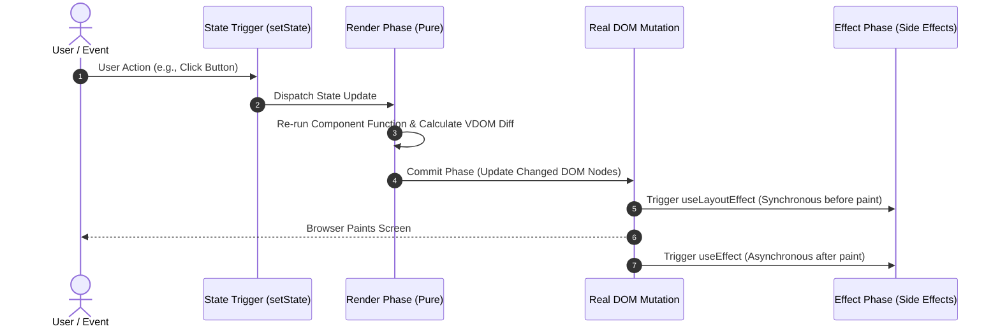

# ⚛️ React JS Interview Preparation & Roadmap Guide

## 🏛️ React Architecture & Virtual DOM Lifecycle

### 🏗️ Virtual DOM & Reconciliation Architecture
```mermaid
graph TD
    JSX["📝 JSX Code / Component State Change"]

    subgraph ReactEngine ["⚛️ React Engine (Fiber Reconciler)"]
        VDOM_Old["🌳 Previous Virtual DOM Tree"]
        VDOM_New["🌳 New Virtual DOM Tree"]
        Diffing["⚡ Diffing Algorithm (O(n) Heuristic)"]
        Fiber["🧵 Fiber Tree / Work Units"]
    end

    subgraph DOM_Layer ["🌐 Real Browser DOM"]
        RealDOM["🖥️ Actual DOM Tree"]
    end

    JSX -->|Triggers Re-render| VDOM_New
    VDOM_Old --> Diffing
    VDOM_New --> Diffing
    Diffing -->|Generates Mutations| Fiber
    Fiber -->|Commit Phase (Batched Updates)| RealDOM
```

### 🔄 React Hook & Component Execution Lifecycle


---

## 📑 Phase 1: Core React Fundamentals

### Module 1: Virtual DOM & Rendering
- [x] **Virtual DOM (VDOM)**
  - In-memory JS representation of the real DOM elements.
  - Minimizes expensive direct real DOM operations by batching and updating only changed nodes.
  - *Interview Q:* Why is VDOM faster? Direct DOM manipulation causes recalculation of layout and repaints for every change; VDOM batches changes and computes minimum required mutations.
- [x] **Diffing Algorithm & Heuristics**
  - Reconciliation algorithm operates in $O(n)$ time using key assumptions:
    1. Elements of different types produce different trees (destroys old tree and builds new one).
    2. The developer can hint at which child elements are stable across renders using the `key` prop.
- [x] **React Fiber Architecture**
  - Re-implementation of React's core algorithm (introduced in React 16).
  - Breaks rendering work into small units of work called "Fibers" that can be paused, aborted, or prioritized.
  - Enables concurrent features like time-slicing and priority-based rendering (`useTransition`).
- [x] **JSX (JavaScript XML)**
  - Syntax extension for JS that compiles down to `React.createElement()` calls via Babel.
  - Prevents XSS attacks by escaping values embedded in JSX before rendering.

### Module 2: Component Architecture & Props
- [x] **Functional vs Class Components**
  - **Functional**: Plain JS functions returning JSX, lightweight, uses Hooks for state/effects (Modern standard).
  - **Class**: Extends `React.Component`, uses `this.state` and lifecycle methods (`componentDidMount`, etc.).
- [x] **Props (Properties)**
  - Read-only data passed from parent to child component (unidirectional data flow).
  - Immutable within the receiving child component.
- [x] **State vs Props**
  - **State**: Internal data managed and owned by the component; mutable via state updater function (`setState`).
  - **Props**: External data passed down from a parent component; immutable by the receiving child.
- [x] **Lifting State Up**
  - Sharing state between siblings by moving state to their closest common ancestor.
  - Parent passes state as props down to children along with callback functions to update state.
- [x] **Keys in Lists**
  - Unique string attribute required when rendering lists (`map`).
  - Helps React identify which items have changed, been added, or removed during reconciliation.
  - *Pitfall:* Avoid using array index as `key` if the list can be reordered, filtered, or mutated.

### Module 2.1: Class Components & Lifecycle Methods (Deep Dive)
- [x] **Class Component Structure & `this.state`**
  - Extends `React.Component` class. Requires constructor calling `super(props)`.
  - State modified via `this.setState({ key: value }, callback)` (asynchronous and merged shallowly).
- [x] **Method Binding (`this` keyword)**
  - Event handlers in class components lose `this` context unless bound in constructor (`this.handleClick = this.handleClick.bind(this)`) or defined as class arrow functions (`handleClick = () => {}`).
- [x] **Class Component Lifecycle Phases**
  1. **Mounting**:
     - `constructor()`: Initialize state and bind methods.
     - `static getDerivedStateFromProps(props, state)`: Syncs state with incoming props before render.
     - `render()`: Pure function returning JSX.
     - `componentDidMount()`: Executed once after component is rendered to DOM. Ideal for initial API calls, DOM measurements, and event subscriptions.
  2. **Updating**:
     - `shouldComponentUpdate(nextProps, nextState)`: Returns boolean (`true`/`false`). Used for performance optimization.
     - `getSnapshotBeforeUpdate(prevProps, prevState)`: Captures scroll position/DOM info right before DOM updates.
     - `componentDidUpdate(prevProps, prevState, snapshot)`: Runs after component updates in DOM. *Pitfall: Always wrap `this.setState` inside an `if` condition to prevent infinite re-render loops!*
  3. **Unmounting**:
     - `componentWillUnmount()`: Executed right before component is removed from DOM. Used to cancel timers, network requests, and unsubscribe event listeners.
  4. **Error Handling**:
     - `static getDerivedStateFromError(error)`: Updates state to render fallback UI.
     - `componentDidCatch(error, info)`: Logs error details and stack trace to analytics service.
- [x] **`React.PureComponent` vs `React.Component`**
  - `React.PureComponent` automatically implements `shouldComponentUpdate` with a **shallow comparison** of props and state. Prevents unnecessary re-renders if props/state reference didn't change.
- [x] **Mapping Class Lifecycles to React Hooks**
  | Class Component Lifecycle Method | Functional Component Hook Equivalent |
  | :--- | :--- |
  | `componentDidMount` | `useEffect(() => { ... }, [])` |
  | `componentDidUpdate` | `useEffect(() => { ... }, [dep1, dep2])` |
  | `componentWillUnmount` | `useEffect(() => { return () => { ... } }, [])` |
  | `shouldComponentUpdate` | `React.memo(Component, (prevProps, nextProps) => ...)` |
  | `this.setState` callback | `useEffect` listening to state change or state setter functional updates |

---

## 🎣 Phase 2: React Hooks (Deep Dive for Interviews)

### Module 3: Essential Hooks
- [x] **`useState`**
  - Adds local state to functional components. Returns `[currentState, setStateFunction]`.
  - State updates are asynchronous and batched in React 18+.
  - *Functional update syntax:* `setCount(prev => prev + 1)` — crucial when new state depends on previous state or inside async callbacks/closures.
- [x] **`useEffect`**
  - Handles side-effects (data fetching, DOM subscriptions, timers).
  - **Dependencies array rules:**
    - `[]` (empty): Runs once after initial render (like `componentDidMount`).
    - `[dep1, dep2]`: Runs on mount and whenever dependencies change.
    - No array: Runs after every single render (rarely intended).
  - **Cleanup function:** Return function inside `useEffect` runs before component unmounts or before re-running effect. Prevents memory leaks.
- [x] **`useContext`**
  - Consumes context values directly without using `<Context.Consumer>` wrappers.
  - Resolves **Prop Drilling** (passing props through intermediate components that don't need them).
  - *Pitfall:* Every component calling `useContext` re-renders whenever the context value changes.
- [x] **`useRef`**
  - Returns a mutable ref object `{ current: initialValue }` that persists across renders.
  - Changing `.current` does **NOT** trigger a component re-render.
  - Primary use cases: Direct access to real DOM nodes (`inputRef.current.focus()`), storing timer IDs, or storing previous state/prop values.

### Module 4: Performance & Optimization Hooks
- [x] **`useMemo`**
  - Memoizes the **result of a calculation** between renders: `const memoizedValue = useMemo(() => computeValue(a, b), [a, b])`.
  - Used for expensive computations to avoid recalculating on un-related re-renders.
- [x] **`useCallback`**
  - Memoizes a **function instance** between renders: `const memoizedFn = useCallback(() => handleClick(id), [id])`.
  - Crucial when passing callback functions to child components optimized with `React.memo` to prevent broken reference equality.
- [x] **`useReducer`**
  - Alternative to `useState` for complex state logic involving multiple sub-values or next-state dependencies.
  - Follows Redux pattern: `const [state, dispatch] = useReducer(reducer, initialState)`.
- [x] **`useLayoutEffect` vs `useEffect`**
  - `useLayoutEffect`: Runs **synchronously** after DOM mutations but **before** the browser paints screen. Blocks painting. Used for DOM measurements/animations to prevent visual flickering.
  - `useEffect`: Runs **asynchronously** after browser paint. Non-blocking. Standard for 95% of side effects.
- [x] **`useTransition` & `useDeferredValue` (React 18)**
  - `useTransition`: Marks state updates as non-urgent (interruptible), keeping UI responsive during heavy UI updates.
  - `useDeferredValue`: Defers updating a non-critical part of the UI (similar to debouncing without timer overhead).
- [x] **`useImperativeHandle`**
  - Customizes the instance value exposed to parent components when using `ref` with `React.forwardRef`.
  - Allows parent components to call specific imperative methods on child components (e.g., `childRef.current.focusInput()`) without exposing raw DOM.

---

## ⚡ Phase 3: Advanced Concepts & Architectural Patterns

### Module 5: Component Patterns & Higher-Order Components (HOC)
- [x] **Controlled vs Uncontrolled Components**
  - **Controlled**: Form input value is driven by React state (`value={state}` + `onChange`). Single source of truth.
  - **Uncontrolled**: Form input stores its own state in DOM (`ref` used to read values on submit).
- [x] **Higher-Order Components (HOC) Deep Dive**
  - **Definition**: A pure function that takes a component as an argument and returns a new enhanced component. `const EnhancedComp = withFeature(WrappedComp)`.
  - **Formula**: `(Component) => NewComponent`.
  - **Use Cases**: Auth protection (`withAuth`), Logging (`withLogging`), Theme injection (`withTheme`), Redux `connect(mapStateToProps)(Component)`.
  - **Code Pattern (`withAuth` Example)**:
    ```javascript
    function withAuth(WrappedComponent) {
      return function EnhancedComponent(props) {
        const token = localStorage.getItem('token');
        if (!token) return <Navigate to="/login" />;
        return <WrappedComponent {...props} userToken={token} />;
      };
    }
    // Usage: export default withAuth(UserProfile);
    ```
  - **3 Golden Rules of HOCs**:
    1. **Don't mutate the original component** (use composition instead).
    2. **Pass unrelated props through** (`<WrappedComponent {...props} />`).
    3. **Wrap the display name** for debugging (`EnhancedComponent.displayName = `WithAuth(${getDisplayName(WrappedComponent)})``).
  - **Critical Interview Pitfalls**:
    - **NEVER create HOCs inside a component's render method!** Re-creates the component definition on every render, wiping out component state and unmounting children.
    - **Refs are not passed through automatically**: Native `ref` targets the HOC wrapper, not the inner component. Must use `React.forwardRef`.
    - **Static methods are lost**: Must explicitly copy static methods or use `hoist-non-react-statics`.
  - **HOCs vs Custom Hooks**:
    - **HOCs**: Share UI wrapper structure, conditional rendering, or class-based logic. (Can cause "wrapper hell" if deeply nested).
    - **Custom Hooks**: Share stateful logic directly inside functional components without creating additional DOM/component nodes. Modern preferred approach.
- [x] **Render Props Pattern**
  - Component takes a function that returns a React element as a prop (`render={data => <Child data={data}/>}`).
- [x] **Error Boundaries**
  - Class components implementing `static getDerivedStateFromError()` or `componentDidCatch()`.
  - Catches JS errors in child component tree, logs errors, and displays fallback UI instead of crashing whole app.
  - *Note:* Functional components cannot currently be Error Boundaries (must use class or `react-error-boundary` library).
- [x] **React Synthetic Events**
  - Cross-browser wrapper around native browser events (`e.preventDefault()`, `e.stopPropagation()`).
  - Delegates events at the root container element for high memory efficiency.

### Module 6: State Management & Routing
- [x] **Prop Drilling vs Context API vs Redux**
  - **Prop Drilling**: Passing data through deep component hierarchy (hard to maintain).
  - **Context API**: Native solution for global/shared state (best for low-frequency changes like Theme, User Auth).
  - **Redux / Redux Toolkit (RTK)**: Centralized state store with strict unidirectional data flow (Action → Reducer → Store). Ideal for large-scale enterprise applications with complex async state workflows.
- [x] **Redux Core Terminology**
  - **Store**: Single source of truth holding state tree.
  - **Actions**: Plain JS objects describing *what happened* (`{ type: 'counter/increment', payload: 1 }`).
  - **Reducers**: Pure functions `(state, action) => newState` computing next state immutably.
  - **Selectors**: Functions extracting specific data slices from store (`useSelector`).
  - **Thunk / RTK Query**: Middleware handling async actions (fetching data from REST API).
- [x] **React Router (v6+)**
  - Declarative client-side routing (`<BrowserRouter>`, `<Routes>`, `<Route>`).
  - Key hooks: `useNavigate()`, `useParams()`, `useLocation()`, `useSearchParams()`.
  - Supports nested routes (`<Outlet />`) and dynamic code splitting.

### Module 7: Performance Optimization & Best Practices
- [x] **`React.memo`**
  - Higher-order component that memoizes functional component render output.
  - Skips re-rendering if props have not changed (shallow equality check by default).
- [x] **Code Splitting & Lazy Loading**
  - Dynamic imports `const HeavyComp = React.lazy(() => import('./HeavyComp'))`.
  - Paired with `<Suspense fallback={<Spinner />}>` to load bundles on-demand.
- [x] **Avoiding Re-render Pitfalls**
  - Avoid inline object/array creation in JSX props (`style={{ color: 'red' }}` creates new object reference every render).
  - Keep state as local as possible.
  - Split large Context providers into separate State and Dispatch contexts to prevent un-necessary re-renders.

---

## 🚀 Phase 4: Modern React 18/19 & Advanced Ecosystem Topics

### Module 8: React 19 & Server Components (RSC)
- [x] **React Server Components (RSC) vs Client Components**
  - **Server Components (Default in Next.js App Router)**: Execute only on the server, zero JS shipped to the client bundle, direct DB access without API endpoints. Cannot use state or hooks (`useState`, `useEffect`).
  - **Client Components (`"use client"`)**: Hydrated on the browser; used for interactive elements, event listeners, and local state.
- [x] **React 19 Actions & New Hooks**
  - `useActionState`: Simplifies form submission handling with async action state (`[state, formAction, isPending]`).
  - `useFormStatus`: Child component hook accessing parent `<form>` status (pending state).
  - `useOptimistic`: Enables optimistic UI updates before server confirmation.
  - `use()` hook: Unwraps promises or context directly inside render (can be used inside loops/conditionals).
- [x] **React Portals (`ReactDOM.createPortal`)**
  - Renders child elements into a different DOM subtree (e.g., `document.body`) outside parent hierarchy.
  - Resolves CSS `z-index`, `overflow: hidden`, or stacking context issues for Modals, Tooltips, and Popovers.
- [x] **Ref Forwarding (`React.forwardRef`)**
  - Component wrapper passing a `ref` received from a parent down to a child DOM node or component.
  - In React 19, `ref` can be passed directly as a standard prop without `forwardRef`.
- [x] **React Strict Mode**
  - Development tool (`<React.StrictMode>`) triggering intentional double-invocations of component renders, state updaters, and effect setups.
  - Helps catch side-effects in pure render functions and missing cleanup logic in `useEffect`.

### Module 9: Security, Build Tools & Micro-Frontends
- [x] **Security in React (XSS & CSRF)**
  - **XSS Protection**: JSX automatically escapes variables embedded in expressions. *Danger:* `dangerouslySetInnerHTML={{ __html: cleanHTML }}` must be sanitized using libraries like `DOMPurify` before rendering user input.
  - **Environment Variables**: Variables must start with `REACT_APP_` (Create React App) or `VITE_` (Vite). *Warning:* Never store API private keys or DB credentials in client env files—they are bundled into client JS!
- [x] **Build Tools: Webpack vs Vite**
  - **Webpack**: Bundles whole app upfront; uses Babel to transpile JSX/ES6+ to ES5. Slower HMR in large apps.
  - **Vite**: Native ES Modules (ESM) in development powered by `esbuild`. Instant cold server start and lightning-fast HMR.
- [x] **Micro-Frontends & Module Federation**
  - Webpack 5 feature allowing multiple independent React applications to share components and dependencies dynamically at runtime without monolithic builds.

---

## 🛠️ Phase 5: Essential Custom Hooks & Machine Coding Snippets

### 1. Custom `useFetch` Hook (with AbortController)
```javascript
import { useState, useEffect } from 'react';

export function useFetch(url) {
  const [data, setData] = useState(null);
  const [loading, setLoading] = useState(true);
  const [error, setError] = useState(null);

  useEffect(() => {
    const controller = new AbortController();
    setLoading(true);

    fetch(url, { signal: controller.signal })
      .then((res) => {
        if (!res.ok) throw new Error('Network response was not ok');
        return res.json();
      })
      .then((data) => {
        setData(data);
        setError(null);
      })
      .catch((err) => {
        if (err.name !== 'AbortError') {
          setError(err.message);
        }
      })
      .finally(() => setLoading(false));

    return () => controller.abort(); // Cleanup & cancel pending request
  }, [url]);

  return { data, loading, error };
}
```

### 2. Custom `useDebounce` Hook
```javascript
import { useState, useEffect } from 'react';

export function useDebounce(value, delay = 500) {
  const [debouncedValue, setDebouncedValue] = useState(value);

  useEffect(() => {
    const timer = setTimeout(() => setDebouncedValue(value), delay);
    return () => clearTimeout(timer); // Reset timer if value changes before delay
  }, [value, delay]);

  return debouncedValue;
}
```

### 3. Custom `useLocalStorage` Hook
```javascript
import { useState, useEffect } from 'react';

export function useLocalStorage(key, initialValue) {
  const [value, setValue] = useState(() => {
    try {
      const item = window.localStorage.getItem(key);
      return item ? JSON.parse(item) : initialValue;
    } catch {
      return initialValue;
    }
  });

  useEffect(() => {
    try {
      window.localStorage.setItem(key, JSON.stringify(value));
    } catch (err) {
      console.error(err);
    }
  }, [key, value]);

  return [value, setValue];
}
```

### 4. Custom `useOnClickOutside` Hook
```javascript
import { useEffect } from 'react';

export function useOnClickOutside(ref, handler) {
  useEffect(() => {
    const listener = (event) => {
      if (!ref.current || ref.current.contains(event.target)) return;
      handler(event);
    };

    document.addEventListener('mousedown', listener);
    document.addEventListener('touchstart', listener);
    return () => {
      document.removeEventListener('mousedown', listener);
      document.removeEventListener('touchstart', listener);
    };
  }, [ref, handler]);
}
```

---

## 🎯 Top Interview Q&A Cheatsheet (Master List)

### Q1: What triggers a re-render in a React component?
1. Change in **State** (`setState`).
2. Change in **Props** passed from parent.
3. Re-render of the **Parent Component** (unless child is wrapped in `React.memo`).
4. Change in **Context** consumed via `useContext`.

### Q2: What is the difference between `React.memo`, `useMemo`, and `useCallback`?
| Tool | Target | Purpose |
| :--- | :--- | :--- |
| `React.memo` | **Component** | Prevents re-render of component if props haven't changed. |
| `useMemo` | **Value / Computation** | Caches result of expensive calculation between renders. |
| `useCallback` | **Function Instance** | Caches function reference to maintain reference equality across renders. |

### Q3: Why shouldn't you update state directly (`state.count = 5`)?
React relies on immutability and reference checks (`Object.is`) to detect state changes. Direct mutation does not change object reference and will not trigger a re-render or schedule reconciliation.

### Q4: Explain the difference between Server-Side Rendering (SSR) and Client-Side Rendering (CSR).
- **CSR**: Browser downloads minimal HTML + JS bundle; JS executes and builds DOM dynamically in browser. Fast initial routing, but slower initial page load (blank screen) & poorer SEO.
- **SSR**: Server executes React code, generates full HTML string per request, and sends ready-to-display HTML to browser. Browser displays instantly and then **hydrates** event listeners. Excellent SEO and fast First Contentful Paint (FCP).

### Q5: What is Hydration in React?
The process where client-side React attaches event listeners and state management to static HTML server-rendered markup sent from the server, making the static page interactive.

### Q6: What is a "Stale Closure" in React Hooks and how do you resolve it?
- **Cause**: Occurs when an inner function (like inside `useEffect`, `setTimeout`, or callback) captures state or props from an initial render, but updates occur without updating the callback's dependencies.
- **Fix**: Add missing state/props to dependency array, or use functional state updates (`setCount(prev => prev + 1)`), or use `useRef` to store mutable values.

### Q7: How does Automatic Batching work in React 18 vs React 17?
- **React 17**: Only batched state updates inside React event handlers (e.g., button clicks). State updates inside `fetch`, `setTimeout`, or native DOM listeners caused multiple separate renders.
- **React 18**: **Automatic Batching** batches all state updates across promises, timeouts, native event handlers, and micro-tasks into a single render pass. Use `flushSync()` if immediate DOM update is strictly required.

### Q8: How would you optimize rendering a list with 10,000 items in React?
1. **Windowing / Virtualization**: Render only the items currently visible in the viewport using `react-window` or `react-virtualized`.
2. **Pagination / Infinite Scroll**: Load items in chunks upon scrolling using `IntersectionObserver`.
3. **`React.memo` & keys**: Ensure individual list item components use stable `key` props and `React.memo`.

### Q9: How do you prevent Memory Leaks in React components?
1. Clean up event listeners (`window.removeEventListener`) in `useEffect` cleanup.
2. Clear timers (`clearTimeout`, `clearInterval`).
3. Cancel pending HTTP fetch requests using `AbortController.abort()`.
4. Avoid updating state on unmounted components.

### Q10: How do React Testing Library (RTL) and Jest work together?
- **Jest**: Test runner providing test suites (`describe`, `it`), assertions (`expect`), and mocks (`jest.fn()`).
- **React Testing Library (RTL)**: Provides DOM querying utilities focused on user behavior (`screen.getByRole('button')`, `userEvent.click()`) rather than implementation details (state/internal methods).

### Q11: What is the difference between `componentDidMount` and `useEffect` with an empty dependency array `[]`?
- **`componentDidMount`**: Runs synchronously after the DOM is rendered in class components.
- **`useEffect(() => {}, [])`**: Runs asynchronously after the DOM paint in functional components. (If synchronous execution before paint is needed, `useLayoutEffect` is used).

### Q12: Why shouldn't you define an HOC inside another component's render method?
Defining an HOC inside render creates a new function definition and new component type on **every single render pass**. React's diffing algorithm sees a different component type, so it destroys (unmounts) the old component tree and mounts a completely new one, losing all internal state and causing severe performance degradation.

### Q13: What is the difference between Shadow DOM and Virtual DOM?
- **Shadow DOM**: Native browser technology for scoping CSS styles and DOM subtrees inside Web Components so they don't clash with global page CSS.
- **Virtual DOM**: JavaScript memory tree abstraction created by React to calculate minimum DOM diffs and batch updates efficiently.

### Q14: How do `useImperativeHandle` and `React.forwardRef` work together?
- `forwardRef` allows a parent component to pass a ref to a child component.
- `useImperativeHandle(ref, createHandle, [deps])` customizes the exposed `.current` value, allowing the child component to expose specific custom imperative methods (e.g., `focusInput()`, `resetForm()`) to the parent instead of giving full access to the raw underlying DOM node.

### Q15: What is Tree Shaking and how does React benefit from it?
Tree shaking is a dead-code elimination process performed by modern bundlers (Webpack, Vite, Rollup) during production builds. It statically analyzes ES6 `import`/`export` statements to remove unused code exports from final JS bundles, minimizing payload size.
